# DeOCR

DeOCR (de-cor), A reverse OCR tool that renders huggingface-compatible datasets to configurable images (e.g., custom size `512x512`, black background, paddings, margins, etc.). This tool can be considered as a text-to-image data pre-processing component in pipelines such as [DeepSeek-OCR](https://github.com/deepseek-ai/DeepSeek-OCR).

```mermaid
---
title: DeOCR Usage in LLM Pipeline
---
flowchart LR
  TEXTDATA[/"context as pure text"/]
  MMDATA[/"Does this particular car <br/> &lt;image&gt; present in here &lt;image&gt; ?"/]
  HFDATASET[("huggingface dataset")] 
  subgraph DeOCR
    CSS1["cli --style red-text,bold"]
    CSS2["cli --style default"]
    CSS3["cli --style default"]
    MAPPER["DeOCR Dataset Mapper"]
  end
  TEXTDATA --> CSS1 --> IMG1[["🖼️🖼️🖼️🖼️🖼️🖼️🖼️🖼️<br/>🖼️ context as img 🖼️<br/>🖼️🖼️🖼️🖼️🖼️🖼️🖼️🖼️<br/>"]]:::redText
  TEXTDATA --> CSS2 --> IMG2[["🖼️🖼️🖼️🖼️🖼️🖼️🖼️🖼️<br/>🖼️ context as img 🖼️<br/>🖼️🖼️🖼️🖼️🖼️🖼️🖼️🖼️<br/>"]]
  MMDATA --> CSS3 --> IMG3[["Does this particular car <br/> 🖼️🖼️🖼️🖼️🖼️🖼️🖼️<br/>🖼️🖼️🖼️🚗🖼️🖼️🖼️<br/>🖼️🖼️🖼️🖼️🖼️🖼️🖼️<br/> present in here <br/> 🖼️🖼️🖼️🖼️🖼️🖼️🖼️<br/>🖼️🖼️🖼️🖼️🖼️🖼️🖼️<br/>🖼️🖼️🖼️🖼️🖼️🖼️🖼️<br/>?"]]
  HFDATASET --> MAPPER --> DEOCRDATASET[("🖼️ imagified dataset")]
  DEOCRDATASET & IMG1 & IMG2 & IMG3 -.-> MODEL["LLMs or VLMs<br/> Evaluation"]
  classDef redText color:#ff0000,font-weight:bold;
  IMG1 ~~~|"fa:fa-mobile-screen A screenshot of text <br/>w. special formatting"| IMG1
  IMG2 ~~~|"fa:fa-mobile-screen A plain screenshot of text"| IMG2
  IMG3 ~~~|"fa:fa-mobile-screen A screenshot of both text and images"| IMG3
```



<details><summary>Here is an output example, sized `512x512`, with random string as context</summary>


</details>

## Quick Start

```sh
pip install deocr[playwright,pymupdf]
# activate your python environment, then install playwright deps
playwright install chromium
```

<details><summary>Alternatively, install from source</summary>

```sh
# uv
uv add "deocr[playwright,pymupdf] @ git+https://github.com/Moenupa/DeOCR.git"
# activate your python environment, then install playwright deps
playwright install chromium
```

</details>

<details><summary>For development</summary>

Please use uv to manage the environment:

```sh
git clone https://github.com/Moenupa/DeOCR.git
cd DeOCR
uv venv
uv sync --all-extras --all-groups
source .venv/bin/activate
playwright install chromium
pre-commit install
```

</details>

<details><summary>Known Issues</summary>

- async function timeout: increase threshold 0.05 at [datasets/utils/py_utils.py:612-626](./.venv/lib/python3.12/site-packages/datasets/utils/py_utils.py)

</details>

## Performance

DeOCR is mainly optimized by asynchronous rendering and multiprocessing dataset mapping. The rendering speed may vary depending on the machine configuration and the complexity of the text to be rendered. On a standard machine with 32 cores, DeOCR can render more than 1k images per second.

GSM8K dataset (one `512x512` image per sample) rendering speed with Intel Xeon Gold 6430:

```sh
# increase MAX_ASYNC_PAGES for more cores
$ MAX_ASYNC_PAGES=1 python tests/dataset/manual_load.py
Map (num_proc=1): 100%|██████████████| 7473/7473 [02:48<00:00, 44.33 examples/s]
Map (num_proc=1): 100%|██████████████| 1319/1319 [00:27<00:00, 47.28 examples/s]
```
