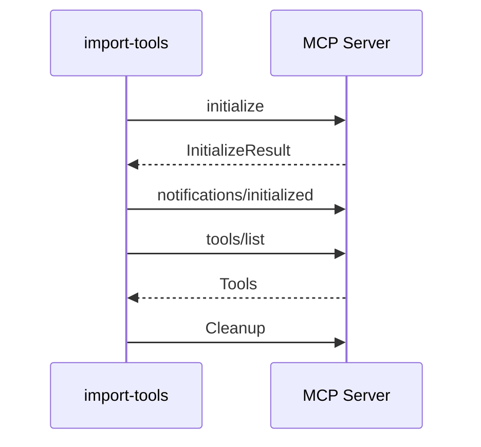

# import-tools

The `import-tools` command fetches tool definitions from MCP (Model Context Protocol) servers and either saves them to a file, pushes them to a Spin server for mock execution, or both.

!!! info "MCP Integration"
    This enables using any MCP-compatible tool server as a source for tool definitions in synthetic dataset generation.

The command supports both MCP transport types:

- :material-console: **stdio** - Subprocess for local servers
- :material-web: **HTTP** - Streamable HTTP for remote servers

## Basic Usage

=== "Push to Spin"

    ```bash title="Import and push to Spin"
    deepfabric import-tools --transport stdio \
      --command "npx -y @modelcontextprotocol/server-filesystem /tmp" \
      --spin http://localhost:3000
    ```

=== "Save to File"

    ```bash title="Import and save"
    deepfabric import-tools --transport stdio \
      --command "npx -y @modelcontextprotocol/server-filesystem /tmp" \
      --output tools.json
    ```

=== "Both"

    ```bash title="Save and push"
    deepfabric import-tools --transport stdio \
      --command "npx -y figma-developer-mcp --stdio" \
      --env "FIGMA_API_KEY=your-key" \
      --output figma-tools.json \
      --spin http://localhost:3000
    ```

## Spin Integration

The `--spin` option pushes tools directly to a running Spin server's mock component.

```bash title="Push to Spin"
deepfabric import-tools --transport stdio \
  --command "npx -y figma-developer-mcp --stdio" \
  --env "FIGMA_API_KEY=your-key" \
  --spin http://localhost:3000
```

When pushing to Spin:

- Tools are sent to the `/mock/load-schema` endpoint
- The raw MCP format (with `inputSchema`) is preserved
- Tools are stored in Spin's KV store for later execution
- Mock responses can be customized via `/mock/update-response` or `/mock/add-fixture`

### Verifying Loaded Tools

After pushing tools to Spin, verify they're loaded:

```bash title="Verify tools"
curl http://localhost:3000/mock/list-tools | jq
```

### Executing Mock Tools

Execute a loaded tool via Spin:

```bash title="Execute tool"
curl -X POST http://localhost:3000/mock/execute \
  -H "Content-Type: application/json" \
  -d '{"name": "get_figma_data", "arguments": {"fileKey": "abc123"}}'
```

## Transport Types

=== "Stdio Transport"

    The stdio transport launches the MCP server as a subprocess and communicates via stdin/stdout:

    ```bash
    deepfabric import-tools --transport stdio \
      --command "npx -y figma-developer-mcp --stdio" \
      --spin http://localhost:3000
    ```

    **Requirements:**

    - The command must be a valid shell command that starts an MCP server
    - The server must support stdio transport (read from stdin, write to stdout)
    - Messages are newline-delimited JSON-RPC 2.0

=== "HTTP Transport"

    The HTTP transport connects to a running MCP server via Streamable HTTP:

    ```bash
    deepfabric import-tools --transport http \
      --endpoint "http://localhost:8080/mcp" \
      --spin http://localhost:3000
    ```

    **Requirements:**

    - The endpoint must be a valid HTTP URL
    - The server must support MCP's Streamable HTTP transport
    - Supports both JSON and SSE (Server-Sent Events) responses

## Environment Variables

Pass environment variables to stdio subprocess for API keys:

```bash title="Single env var"
deepfabric import-tools --transport stdio \
  --command "npx -y figma-developer-mcp --stdio" \
  --env "FIGMA_API_KEY=your-api-key" \
  --spin http://localhost:3000
```

Multiple environment variables can be specified:

```bash title="Multiple env vars"
deepfabric import-tools --transport stdio \
  --command "my-mcp-server" \
  --env "API_KEY=secret" \
  --env "DEBUG=true" \
  --spin http://localhost:3000
```

## HTTP Headers

Add authentication headers for HTTP transport:

```bash title="With auth header"
deepfabric import-tools --transport http \
  --endpoint "https://api.example.com/mcp" \
  --header "Authorization=Bearer your-token" \
  --spin http://localhost:3000
```

## Output Formats

When saving to a file with `--output`, you can choose the format:

=== "DeepFabric Format"

    ```bash
    deepfabric import-tools --transport stdio \
      --command "your-mcp-server" \
      --output tools.json \
      --format deepfabric
    ```

    ??? example "Output structure"

        ```json
        {
          "tools": [
            {
              "name": "get_figma_data",
              "description": "Get comprehensive Figma file data",
              "parameters": [
                {
                  "name": "fileKey",
                  "type": "str",
                  "description": "The key of the Figma file to fetch",
                  "required": true,
                  "default": null
                }
              ],
              "returns": "",
              "category": "general",
              "component": null
            }
          ]
        }
        ```

=== "OpenAI Format"

    Compatible with TRL and other training frameworks:

    ```bash
    deepfabric import-tools --transport stdio \
      --command "your-mcp-server" \
      --output tools.json \
      --format openai
    ```

    ??? example "Output structure"

        ```json
        {
          "tools": [
            {
              "type": "function",
              "function": {
                "name": "get_figma_data",
                "description": "Get comprehensive Figma file data",
                "parameters": {
                  "type": "object",
                  "properties": {
                    "fileKey": {
                      "type": "string",
                      "description": "The key of the Figma file to fetch"
                    }
                  },
                  "required": ["fileKey"]
                }
              }
            }
          ]
        }
        ```

## Timeout Configuration

Adjust the timeout for slow-starting servers:

```bash title="Custom timeout"
deepfabric import-tools --transport stdio \
  --command "slow-starting-server" \
  --timeout 60.0 \
  --spin http://localhost:3000
```

!!! info "Default Timeout"
    The default timeout is 30 seconds.

## MCP Protocol Details

The import process follows the MCP specification (2025-11-25):



## Error Handling

The command provides detailed error messages for common issues:

!!! failure "Spin Connection Failed"
    ```
    Error: Cannot connect to Spin server at http://localhost:3000. Is it running?
    ```

!!! failure "MCP Server Not Found"
    ```
    Error: MCP server command not found: nonexistent-server
    ```

!!! failure "Timeout"
    ```
    Error: Timeout waiting for MCP server response after 30.0s
    ```

!!! failure "No Output Specified"
    ```
    Error: At least one of --output or --spin is required
    ```

## Complete Examples

??? example "Figma MCP Server to Spin"

    ```bash
    deepfabric import-tools --transport stdio \
      --command "npx -y figma-developer-mcp --stdio" \
      --env "FIGMA_API_KEY=$FIGMA_API_KEY" \
      --spin http://localhost:3000
    ```

??? example "Filesystem MCP Server with File Output"

    ```bash
    deepfabric import-tools --transport stdio \
      --command "npx -y @modelcontextprotocol/server-filesystem /home/user/projects" \
      --output fs-tools.json
    ```

??? example "Remote HTTP Server to Spin with Authentication"

    ```bash
    deepfabric import-tools --transport http \
      --endpoint "https://mcp.example.com/api" \
      --header "Authorization=Bearer $API_TOKEN" \
      --timeout 60.0 \
      --spin http://localhost:3000
    ```

??? example "Full Pipeline: Import, Save, and Push"

    ```bash
    deepfabric import-tools --transport stdio \
      --command "npx -y figma-developer-mcp --stdio" \
      --env "FIGMA_API_KEY=$FIGMA_API_KEY" \
      --output figma-tools.yaml \
      --spin http://localhost:3000 \
      --format deepfabric
    ```

## Command Reference

```
Usage: deepfabric import-tools [OPTIONS]

Options:
  --transport [stdio|http]      MCP transport type  [required]
  -c, --command TEXT            Shell command to launch MCP server
                                (required for stdio transport)
  -e, --endpoint TEXT           HTTP endpoint URL for MCP server
                                (required for http transport)
  -o, --output PATH             Output file path (.json or .yaml)
  -s, --spin TEXT               Spin server URL to push tools to
                                (e.g., http://localhost:3000)
  --format [deepfabric|openai]  Output format  [default: deepfabric]
  --env TEXT                    Environment variables (KEY=VALUE, repeatable)
  --header TEXT                 HTTP headers (KEY=VALUE, repeatable)
  --timeout FLOAT               Request timeout in seconds  [default: 30.0]
  --help                        Show this message and exit.
```

!!! warning "Required Output"
    At least one of `--output` or `--spin` is required.

## Next Steps: Populating Mock Data

After importing tools to Spin, they return default echo responses. To customize:

1. **Set default responses** with `/mock/update-response`
2. **Add fixtures** for argument-specific responses with `/mock/add-fixture`

See [Mock Component - Building Mock Data Files](../tools/mock.md#building-mock-data-files) for examples.

!!! info "Why Two Steps?"
    MCP servers define **tool schemas** (what arguments tools accept).
    You define **mock responses** (what they return) separately.
