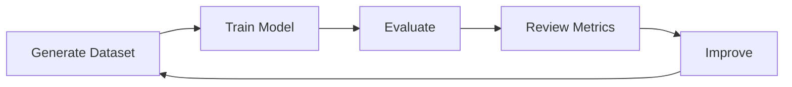

# Evaluation

DeepFabric includes an evaluation system for testing fine-tuned models on tool-calling tasks.

## Prerequisites

The examples in this section require DeepFabric to be installed with the `training` extra, which includes optional dependencies such as PyTorch and PEFT.

=== "pip"

    ```bash
    pip install "deepfabric[training]"
    ```

=== "uv"

    ```bash
    uv add "deepfabric[training]"
    ```


## Workflow



1. Generate dataset with train/eval split
2. Train model on training split
3. Evaluate on held-out eval split
4. Review metrics and improve

## Quick Example

```python title="evaluation_example.py"
from deepfabric.evaluation import Evaluator, EvaluatorConfig, InferenceConfig

config = EvaluatorConfig(
    inference_config=InferenceConfig(
        model="./output/checkpoint-final",
        backend="transformers",
    ),
)

evaluator = Evaluator(config)
results = evaluator.evaluate(dataset=eval_dataset)

print(f"Tool Selection: {results.metrics.tool_selection_accuracy:.2%}")
print(f"Parameter Accuracy: {results.metrics.parameter_accuracy:.2%}")
print(f"Overall Score: {results.metrics.overall_score:.2%}")
```

## Using In-Memory Models

!!! tip "Avoid OOM Errors"
    After training, pass the model directly without reloading from disk:

    ```python
    # After training with SFTTrainer...
    FastLanguageModel.for_inference(model)

    config = EvaluatorConfig(
        inference_config=InferenceConfig(
            model=model,          # Pass model object directly
            tokenizer=tokenizer,  # Required with in-memory model
        ),
    )
    results = evaluator.evaluate(dataset=eval_dataset)
    ```

    This avoids OOM errors and speeds up the train-evaluate workflow.

See [Running Evaluation](running.md#using-in-memory-models) for details.

## What Gets Evaluated

For each sample in the evaluation dataset:

1. **Extract ground truth** from the sample's expected tool calls
2. **Run inference** with the user message and available tools
3. **Compare** predicted tool selection and parameters against ground truth
4. **Score** the result

## Key Metrics

| Metric | Description | Weight |
|--------|-------------|--------|
| Tool Selection Accuracy | Did the model pick the right tool? | 40% |
| Parameter Accuracy | Are the parameter types correct? | 35% |
| Execution Success Rate | Would the call execute successfully? | 25% |

## Next Steps

<div class="grid cards" markdown>

-   :material-play-circle: **Running Evaluation**

    ---

    Configuration and usage for model evaluation

    [:octicons-arrow-right-24: Run evaluation](running.md)

-   :material-chart-bar: **Metrics**

    ---

    Understanding evaluation metrics in depth

    [:octicons-arrow-right-24: Understand metrics](metrics.md)

</div>
