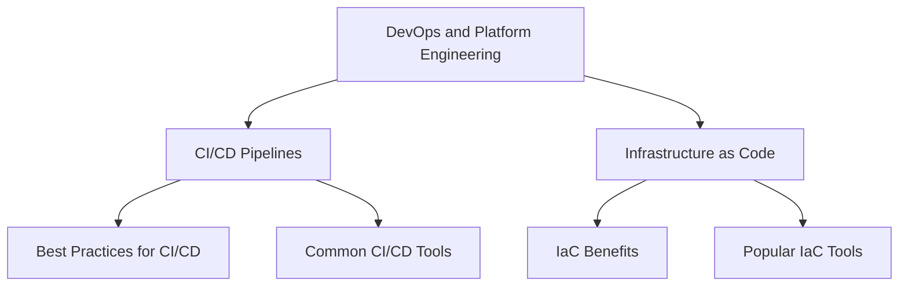

---
hide:
  - navigation
  - toc
---

<style>
  .md-typeset h1,
  .md-content__button {
    display: none;
  }
</style>
<div align="center">
    <p align="center">
        
    </p>
  <h3>Focused Training for more Grounded and Efficient Models</h3>

  <p>
    <a href="https://github.com/always-further/deepfabric/issues?q=is%3Aissue+is%3Aopen+label%3A%22good+first+issue%22">
      
    </a>
    &nbsp;
    <a href="https://discord.gg/pPcjYzGvbS">
      
    </a>
  </p>

  <p>
    <a href="https://pypi.org/project/deepfabric/">
      
    </a>
    <a href="https://discord.gg/pPcjYzGvbS">
      
    </a>
      <a href="https://www.reddit.com/r/deepfabric/">
      
    </a>
  </p>
</div>

<div class="grid cards" markdown>

-   :material-graph-outline: **Diverse Data**

    Topic graph algorithms ensure coverage without redundancy - no overfit from repetitive samples.

-   :material-play-box-outline: **Real Execution**

    Tools run in sandboxed environments, not simulated. Training data reflects actual behavior.

-   :material-check-decagram-outline: **Validated Output**

    Constrained decoding and strict validation ensure correct syntax and structure every time.

</div>

## Quick Start

For basic dataset generation, install DeepFabric with the default dependencies using the commands below.

If you plan to use the training or evaluation utilities described in the [Training](training/) or [Evaluation](evaluation/) sections, install the `training` extra instead (e.g., `pip install "deepfabric[training]"`).

=== "pip"

    ```bash
    pip install deepfabric
    ```

=== "uv"

    ```bash
    uv add deepfabric
    ```

=== "Development"

    ```bash
    git clone https://github.com/always-further/deepfabric.git
    cd deepfabric
    uv sync --all-extras
    ```

## Provider Setup

Set your API key for your chosen provider:

=== "OpenAI"

    ```bash
    export OPENAI_API_KEY="sk-..."
    ```

=== "Anthropic"

    ```bash
    export ANTHROPIC_API_KEY="sk-ant-..."
    ```

=== "Google Gemini"

    ```bash
    export GEMINI_API_KEY="..."
    ```

=== "Ollama (Local)"

    ```bash
    curl -fsSL https://ollama.com/install.sh | sh
    ollama pull mistral
    ollama serve
    ```

    !!! info "No API Key Required"
        Ollama runs locally, so no API key is needed.

## Verify Installation

```bash
deepfabric --help
deepfabric info
```

Now generate your first dataset:

```bash title="Generate a dataset"
export OPENAI_API_KEY="your-key"

deepfabric generate \
  --topic-prompt "DevOps and Platform Engineering" \
  --generation-system-prompt "You are an expert in DevOps and Platform Engineering generate examples of issue resolution and best practices" \
  --mode graph \
  --depth 2 \
  --degree 2 \
  --provider openai \
  --model gpt-4o \
  --num-samples 2 \
  --batch-size 1 \
  --conversation-type cot \
  --reasoning-style freetext \
  --output-save-as dataset.jsonl
```

## What Just Happened?

The key steps in this example were as follows:

1. **Topic Graph Generation**: A topic hierarchy was created starting from "DevOps and Platform Engineering". Topic graphs take a root prompt and recursively expand subtopics to form a DAG (Direct Acyclic Graph) structure. Here, we used a depth of 2 and degree of 2 to ensure coverage of subtopics.
2. **Dataset Generation**: For each node topic in the graph, a synthetic dataset sample was generated using a chain-of-thought conversation style. Each example includes reasoning traces to illustrate the thought process behind the answers. With the above example, 2 total samples were generated as specified by `--num-samples 2`. You can also use `--num-samples auto` to generate one sample per topic path.
3. **Conversation and Reasoning Style**: The `cot` conversation type with `freetext` reasoning style. This encourages the model to provide detailed explanations along with answers, enhancing the quality of the training data.

So lets' break down this down visually:



So as you can see we have a depth of 2 (root + 2 levels) and a degree of 2 (2 subtopics per topic). 

Each of these topics would then be used to generate a corresponding dataset samples.

??? example "Best Practices for CI/CD - Sample Output"

    ```json title="dataset.jsonl"
    {
      "question": "What are some best practices for implementing CI/CD pipelines?",
      "answer": "Some best practices include automating testing, using version control, and ensuring fast feedback loops.",
      "reasoning_trace": [
        "The user is asking about best practices for CI/CD pipelines.",
        "I know that automation is key in CI/CD to ensure consistency and reliability.",
        "Version control allows tracking changes and collaboration among team members.",
        "Fast feedback loops help catch issues early in the development process."
      ]
    }
    ```

## Using Config Files

For more control over dataset generation, create a configuration file:

```yaml title="config.yaml"
topics:
  prompt: "Machine learning fundamentals"
  mode: tree
  depth: 2
  degree: 3

generation:
  system_prompt: "Generate educational Q&A pairs."
  conversation:
    type: basic
  llm:
    provider: openai
    model: gpt-4o

output:
  system_prompt: "You are a helpful ML tutor."
  num_samples: 5
  batch_size: 1
  save_as: "ml-dataset.jsonl"
```

Then run:

```bash
deepfabric generate config.yaml
```

!!! tip "Config vs CLI"
    Use configuration files for reproducible dataset generation. CLI flags are great for quick experiments.

## Dataset Types

DeepFabric supports multiple dataset types to suit different training needs:

<div class="grid cards" markdown>

-   :material-chat-question-outline: **Basic Datasets**

    ---

    Simple Q&A pairs for instruction following tasks

    [:octicons-arrow-right-24: Learn more](dataset-generation/basic.md)

-   :material-head-cog-outline: **Reasoning Datasets**

    ---

    Chain-of-thought traces for step-by-step problem solving

    [:octicons-arrow-right-24: Learn more](dataset-generation/reasoning.md)

-   :material-robot-outline: **Agent Datasets**

    ---

    Tool-calling with real execution for building agents

    [:octicons-arrow-right-24: Learn more](dataset-generation/agent.md)

</div>


