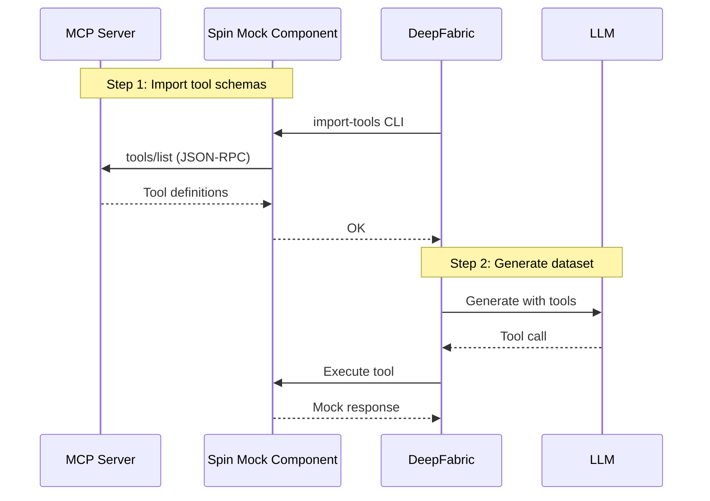

# MCP & Mock Tools

The Mock component lets you generate training data for  services like GitHub, Slack, or any MCP server / Tool interface, without requiring real API access. You import tool definitions from [MCP (Model Context Protocol)](https://modelcontextprotocol.io/) servers, then configure mock responses that simulate what those tools would return.

**Why use this?** Training agents to use external APIs requires realistic tool interactions, but you can't make thousands of real API calls during dataset generation. The Mock component gives you control over responses while maintaining realistic tool schemas.

## Overview



The workflow has two phases:

1. **Import** - Load tool schemas from an MCP server into the Mock component
2. **Generate** - DeepFabric calls the Mock component, which returns configured responses

## Quick Start

### 1. Start Spin

```bash
docker run -d -p 3000:3000 ghcr.io/always-further/deepfabric/tools-sdk:latest
```

### 2. Import Tools from MCP Server

```bash
deepfabric import-tools --transport stdio \
  --command "npx -y @modelcontextprotocol/server-github" \
  --env "GITHUB_PERSONAL_ACCESS_TOKEN=$GITHUB_TOKEN" \
  --spin http://localhost:3000
```

### 3. Configure and Generate

```yaml title="config.yaml"
generation:
  conversation:
    type: chain_of_thought
    reasoning_style: agent

  tools:
    spin_endpoint: "http://localhost:3000"
    tools_endpoint: "http://localhost:3000/mock/list-tools"
    tool_execute_path: "/mock/execute"
```

```bash
deepfabric start config.yaml
```

## Importing Tool Schemas

=== "import-tools CLI (Recommended)"

    Best for stdio-based MCP servers (most common):

    ```bash
    deepfabric import-tools --transport stdio \
      --command "npx -y @modelcontextprotocol/server-github" \
      --env "GITHUB_PERSONAL_ACCESS_TOKEN=$GITHUB_TOKEN" \
      --spin http://localhost:3000
    ```

    See [import-tools CLI](../cli/import-tools.md) for all options.

=== "From HTTP MCP Server"

    For MCP servers with HTTP transport:

    ```bash
    curl -X POST http://localhost:3000/mock/pull \
      -H "Content-Type: application/json" \
      -d '{"url": "http://your-mcp-server:8000"}'
    ```

=== "From JSON File"

    Load tool definitions directly:

    ```bash
    curl -X POST http://localhost:3000/mock/load-schema \
      -H "Content-Type: application/json" \
      -d @tools.json
    ```

    Example schema file:

    ```json title="tools.json"
    [
      {
        "name": "get_weather",
        "description": "Get weather for a location",
        "inputSchema": {
          "type": "object",
          "properties": {
            "location": {"type": "string", "description": "City name"}
          },
          "required": ["location"]
        }
      }
    ]
    ```

## Mock Responses

After importing, tools return default echo responses. Customize them for realistic training data.

### Default Behavior

Without configuration, the Mock component echoes the tool call:

```json title="Default echo response"
{
  "tool": "get_weather",
  "arguments": {"location": "Seattle"},
  "mock": true
}
```

### Setting Default Responses

```bash
curl -X POST http://localhost:3000/mock/update-response \
  -H "Content-Type: application/json" \
  -d '{
    "name": "get_weather",
    "mockResponse": {"temperature": 72, "condition": "sunny"}
  }'
```

### Template Interpolation

Use `{{argument_name}}` to include call arguments in responses:

```bash
curl -X POST http://localhost:3000/mock/update-response \
  -H "Content-Type: application/json" \
  -d '{
    "name": "get_weather",
    "mockResponse": {
      "location": "{{location}}",
      "temperature": 72
    }
  }'
```

Now `get_weather(location="Seattle")` returns `{"location": "Seattle", "temperature": 72}`.

### Fixtures for Specific Arguments

Return different responses based on argument values:

```bash
# Rainy Seattle
curl -X POST http://localhost:3000/mock/add-fixture \
  -H "Content-Type: application/json" \
  -d '{
    "name": "get_weather",
    "match": {"location": "Seattle"},
    "response": {"temperature": 55, "condition": "rainy"}
  }'

# Sunny Phoenix
curl -X POST http://localhost:3000/mock/add-fixture \
  -H "Content-Type: application/json" \
  -d '{
    "name": "get_weather",
    "match": {"location": "Phoenix"},
    "response": {"temperature": 105, "condition": "sunny"}
  }'
```

More specific fixtures (more match fields) take precedence over less specific ones.

## Configuration Reference

```yaml title="config.yaml"
generation:
  # Agent mode is implicit when tools are configured
  conversation:
    type: cot
    reasoning_style: agent

  tools:
    spin_endpoint: "http://localhost:3000"
    tools_endpoint: "http://localhost:3000/mock/list-tools"
    tool_execute_path: "/mock/execute"

    # Optional: filter to specific tools
    components:
      mock:
        - get_weather
        - search_code

    max_per_query: 3       # Max tools per example
    max_agent_steps: 5     # Max ReAct iterations
```

!!! info "Agent Mode Required"
    Tools require `conversation.reasoning_style: agent` to be enabled.

## MCP Tool Format

MCP servers provide tool definitions in this format:

```json title="MCP tool schema"
{
  "name": "search_code",
  "description": "Search code in a repository",
  "inputSchema": {
    "type": "object",
    "properties": {
      "repository": {
        "type": "string",
        "description": "Repository name"
      },
      "query": {
        "type": "string",
        "description": "Search query"
      }
    },
    "required": ["repository", "query"]
  }
}
```

DeepFabric extracts `name`, `description`, and `inputSchema`. Other MCP fields (like `annotations`) are ignored.

## Output Format

Generated datasets include OpenAI-format tool definitions:

```json title="Dataset tool format"
{
  "tools": [
    {
      "type": "function",
      "function": {
        "name": "search_code",
        "description": "Search code in a repository",
        "parameters": {
          "type": "object",
          "properties": {
            "repository": {"type": "string"},
            "query": {"type": "string"}
          },
          "required": ["repository", "query"]
        }
      }
    }
  ]
}
```

!!! success "Framework Compatibility"
    This format is compatible with OpenAI, TRL, and most training frameworks.

## Building Mock Data Files

For comprehensive setups, organize mock data in a JSON file:

```json title="mock-data.json"
{
  "description": "Mock data for GitHub tools",
  "version": "1.0.0",
  "mockResponses": {
    "get_file_contents": {
      "defaultResponse": {
        "path": "{{path}}",
        "content": "Default content for {{path}}",
        "sha": "abc123"
      }
    },
    "list_issues": {
      "defaultResponse": {
        "totalCount": 0,
        "nodes": []
      }
    }
  },
  "fixtures": {
    "get_file_contents": [
      {
        "match": {"path": "README.md"},
        "response": {
          "path": "README.md",
          "content": "# Project\n\nWelcome to the project.",
          "sha": "readme123"
        }
      }
    ],
    "list_issues": [
      {
        "match": {"owner": "acme-corp", "repo": "web-platform"},
        "response": {
          "totalCount": 3,
          "nodes": [
            {"number": 342, "title": "Auth bug", "state": "OPEN"},
            {"number": 341, "title": "Dark mode", "state": "OPEN"}
          ]
        }
      }
    ]
  }
}
```

Load with a script:

```bash title="load-mock-data.sh"
#!/bin/bash
BASE_URL="${1:-http://localhost:3000}"
DATA_FILE="mock-data.json"

# Load default responses
for tool in $(jq -r '.mockResponses | keys[]' "$DATA_FILE"); do
    response=$(jq -c ".mockResponses.\"$tool\".defaultResponse" "$DATA_FILE")
    if [ "$response" != "null" ]; then
        curl -s -X POST "$BASE_URL/mock/update-response" \
            -H "Content-Type: application/json" \
            -d "{\"name\": \"$tool\", \"mockResponse\": $response}"
    fi
done

# Load fixtures
for tool in $(jq -r '.fixtures | keys[]' "$DATA_FILE"); do
    fixture_count=$(jq -r ".fixtures.\"$tool\" | length" "$DATA_FILE")
    for i in $(seq 0 $((fixture_count - 1))); do
        match=$(jq -c ".fixtures.\"$tool\"[$i].match" "$DATA_FILE")
        response=$(jq -c ".fixtures.\"$tool\"[$i].response" "$DATA_FILE")
        curl -s -X POST "$BASE_URL/mock/add-fixture" \
            -H "Content-Type: application/json" \
            -d "{\"name\": \"$tool\", \"match\": $match, \"response\": $response}"
    done
done
```

!!! example "Complete Examples"
    See working examples in the repository:

    - [`examples/tools-sdk-examples/github/`](https://github.com/always-further/deepfabric/tree/main/examples/tools-sdk-examples/github) - GitHub tools with mock data
    - [`examples/tools-sdk-examples/kubernetes/`](https://github.com/always-further/deepfabric/tree/main/examples/tools-sdk-examples/kubernetes) - Kubernetes tools with fixtures

## API Reference

| Endpoint | Method | Description |
|----------|--------|-------------|
| `/mock/load-schema` | POST | Load tool definitions from JSON |
| `/mock/pull` | POST | Pull tools from MCP server |
| `/mock/execute` | POST | Execute a tool |
| `/mock/update-response` | POST | Set default mock response |
| `/mock/add-fixture` | POST | Add argument-specific fixture |
| `/mock/list-tools` | GET | List loaded tools |
| `/mock/clear` | POST | Clear all tools |

### Execute Request Format

```json
{
  "name": "tool_name",
  "arguments": {"arg1": "value1"}
}
```

!!! warning "Different from VFS"
    Mock uses `name` and `arguments`. VFS uses `tool` and `args`.
