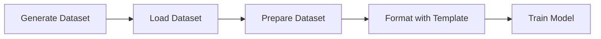

# Training

DeepFabric datasets integrate directly with popular training frameworks. This section covers loading datasets, preparing them for efficient training, formatting with chat templates, and integrating with TRL and Unsloth.

## Prerequisites

The examples in this section require DeepFabric to be installed with the `training` extra, which includes optional dependencies such as PyTorch and TRL.

=== "pip"

    ```bash
    pip install "deepfabric[training]"
    ```

=== "uv"

    ```bash
    uv add "deepfabric[training]"
    ```

## Workflow



1. **Generate dataset** - `deepfabric generate config.yaml`
2. **Load dataset** - `load_dataset("namespace/dataset")` or from local file
3. **Prepare dataset** - `prepare_dataset_for_training()` (optional but recommended)
4. **Format with template** - `tokenizer.apply_chat_template()`
5. **Train** - SFTTrainer, Unsloth etc.

## Quick Example

```python title="training_example.py"
from deepfabric import load_dataset
from deepfabric.training import prepare_dataset_for_training
from transformers import AutoTokenizer
from trl import SFTTrainer, SFTConfig

# Load dataset from DeepFabric Cloud or local file
dataset = load_dataset("your-username/my-dataset")

# Split into train/eval
splits = dataset.split(test_size=0.1, seed=42)
train_ds = splits["train"]

# Prepare dataset (reduces tool overhead for tool-calling datasets)
prepared = prepare_dataset_for_training(train_ds, tool_strategy="used_only")

# Format with tokenizer
tokenizer = AutoTokenizer.from_pretrained("Qwen/Qwen2.5-7B-Instruct")

def format_sample(example):
    text = tokenizer.apply_chat_template(
        example["messages"],
        tools=example.get("tools"),
        tokenize=False,
        add_generation_prompt=False
    )
    return {"text": text}

formatted = prepared.map(format_sample)

# Convert to HuggingFace Dataset for TRL
train_hf = formatted.to_hf()

# Train
trainer = SFTTrainer(
    model=model,
    tokenizer=tokenizer,
    train_dataset=train_hf,
    args=SFTConfig(output_dir="./output"),
)
trainer.train()
```

## Key Concepts

!!! info "Native Dataset Loading"
    DeepFabric provides its own `load_dataset` function that works with local files and DeepFabric Cloud. No HuggingFace datasets dependency required.

!!! info "Chat Templates"
    Chat templates convert message arrays into model-specific formats. Each model family (Qwen, Llama, Mistral) has its own template.

!!! info "Tool Formatting"
    Tool formatting differs by model. Some models expect tools in the system message, others in a separate parameter.

!!! info "Reasoning Traces"
    Reasoning traces can be included in training or used as auxiliary data.

!!! info "Training Callbacks"
    Training callbacks integrate with the training loop for logging, early stopping, and custom behavior.

## Next Steps

<div class="grid cards" markdown>

-   :material-download: **Loading Datasets**

    ---

    DeepFabric Cloud, local files, and HuggingFace integration

    [:octicons-arrow-right-24: Learn more](loading.md)

-   :material-tune: **Dataset Preparation**

    ---

    Optimizing datasets for efficient training

    [:octicons-arrow-right-24: Optimize](dataset-preparation.md)

-   :material-format-text: **Chat Templates**

    ---

    Formatting for different model architectures

    [:octicons-arrow-right-24: Configure](chat-templates.md)

-   :material-school: **Training Frameworks**

    ---

    TRL, Unsloth, SFTConfig, and callbacks

    [:octicons-arrow-right-24: Train](frameworks.md)

</div>
