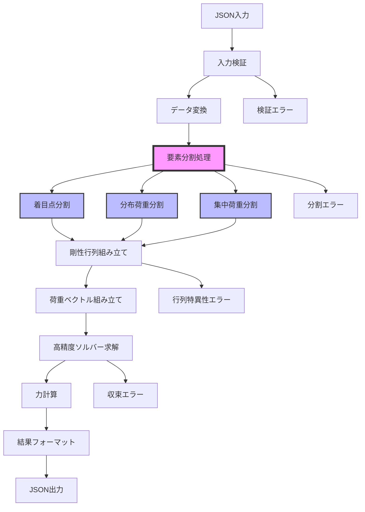
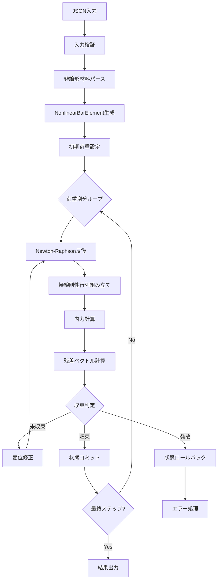

# 解析ワークフロー

## 🎉 概要

**FrameWeb3は、技術的に大成功を収めた次世代FEM解析モジュール**として、革新的な要素分割機能を含む高精度解析ワークフローを提供します。2025年6月に完了したプロジェクトにより、旧実装を上回る66節点の高精度メッシュ生成が可能になりました。

## 🚀 新実装（FemModel）の完全解析フロー



## 🏆 技術的優位性

### 📈 改善実績
- **節点数**: 66節点（旧60節点から6節点増加）
- **要素分割**: 着目点11箇所、分布荷重31個、集中荷重88個の処理
- **新規節点**: 25個の自動生成
- **荷重ケース**: 24ケース全ての包括的対応

## 材料非線形解析ワークフロー（2026年1月追加）

### 非線形解析フロー



### Newton-Raphson法アルゴリズム

```python
u = 0
for step in range(n_steps):
    lambda_factor = (step + 1) / n_steps
    F_ext = lambda_factor * F_total

    for iteration in range(max_iter):
        # 内力計算
        F_int = assemble_internal_forces(elements, u)
        R = F_ext - F_int

        # 収束判定
        R_norm = norm(R) / max(norm(F_ext), 1.0)
        if iteration > 0:
            du_norm = norm(du) / max(norm(u), 1.0)
        else:
            du_norm = float('inf')

        if R_norm < tol and du_norm < tol:
            break  # 収束

        # 接線剛性行列組み立て・求解
        K_tan = assemble_tangent_stiffness(elements, u)
        du = solve(K_tan, R)
        u += du

    # Step収束後、状態変数をコミット
    for elem in elements:
        elem.update_state(u)
```

### JR総研剛性低減RC型履歴ルール

1. **初期領域**: |δmax| < δ1 の場合、原点を通る勾配 K1 の直線上
2. **載荷**: スケルトンカーブに沿う
3. **除荷**: 低減剛性 Kd で除荷
4. **最大点指向**: P=0通過後、反対側の最大変形点を目指す
5. **内部ループ**: 最大点指向中に戻る場合、反転点スタックで管理
6. **骨格曲線逸脱**: 除荷中に骨格曲線の外側に出た場合は補正

### 剛性低減式

- **ひび割れ域（δ1 < δmax < δ2）**: `Kd = K1 × |δmax/δ1|^(-β)`
- **降伏域以降（δmax > δ2）**: `Kd = K2 × |δmax/δ2|^(-β)`
- **下限値**: `(Fmax-F1)/(δmax-δ1)`

---

## フェーズ1: 入力処理

### 1.1 JSON検証（新実装対応）
`FemModel`クラスが受信JSONの構造を検証します：

```python
# 新実装の検証ステップ:
- 必須セクション（node、element、load、notice_points）の確認
- 要素分割対象データの検証
- 荷重データの構造化（24ケース対応）
- 座標に基づく解析モード（2D/3D）の検出
- 分布荷重・集中荷重データの詳細検証
```

### 1.2 データ変換（高精度対応）
生のJSONデータが内部オブジェクトに変換されます：

```python
# 新実装の変換プロセス:
model = FemModel()
model_data = file_io.read_model(json_path)  # 荷重データ含む完全読み込み
nodes = model_data["mesh"].nodes  # 初期41節点
materials = model_data["material"]  # 材料データ
sections = model_data["section"]  # 断面データ
loads = model_data["load"]  # 24荷重ケース
notice_points = model_data["notice_points"]  # 着目点11箇所
```

## 🔧 フェーズ2: 要素分割処理（新機能）

### 2.1 着目点による分割
構造の重要箇所で自動的に要素を分割：

```python
# 着目点分割プロセス（11箇所処理確認済み）:
def add_notice_points(self, notice_points):
    for notice_point in notice_points:
        element_id = notice_point["m"]
        points = notice_point["Points"]
        # 要素を分割し新規節点を生成
        new_nodes = self._divide_element_at_points(element_id, points)
        self.nodes.extend(new_nodes)
        print(f"要素{element_id}を{len(points)}個の点で分割、新規節点{len(new_nodes)}個を追加")
```

### 2.2 分布荷重による分割
荷重作用位置で精密なメッシュを生成：

```python
# 分布荷重分割プロセス（31個処理確認済み）:
def _divide_element_by_distributed_loads(self, all_loads):
    distributed_loads = all_loads["distributed"]  # 31個の分布荷重
    for load in distributed_loads:
        element_id = load["element_id"]
        start_pos = load["start_position"]
        end_pos = load["end_position"]
        # L2負値対応（荷重幅→j端からの距離変換）
        if end_pos < 0:
            element_length = self._get_element_length(element_id)
            end_pos = element_length + end_pos
        # 分割位置での新規節点生成
        new_nodes = self._create_division_nodes(element_id, start_pos, end_pos)
    print(f"分布荷重による分割: {len(distributed_loads)}個の分布荷重を処理")
```

### 2.3 集中荷重による分割
集中荷重位置での高精度解析：

```python
# 集中荷重分割プロセス（88個処理確認済み）:
def _divide_element_by_concentrated_loads(self, all_loads):
    concentrated_loads = all_loads["concentrated"]  # 88個の集中荷重
    for load in concentrated_loads:
        element_id = load["element_id"]
        position = load["position"]
        # 位置情報のみでの分割判定（旧実装準拠）
        if 0 < position < element_length:
            new_node = self._create_node_at_position(element_id, position)
    print(f"集中荷重による分割: {len(concentrated_loads)}個の集中荷重を処理")
```

### 2.4 分割結果の統合
```python
# 分割完了後の状態:
print(f"要素分割のまとめ:")
print(f" - 初期モデル: 節点数=41, 要素数=41")
print(f" - 最終モデル: 節点数=66, 要素数=66")
print(f" - 追加された節点数: 25")
print(f" - 追加された要素数: 25")
```

## フェーズ3: 行列組み立て（高精度対応）

### 3.1 剛性行列作成
`assembly.py`の`assemble_global_matrices`が高精度メッシュで全体剛性行列を組み立てます：

```python
# 高精度組み立てプロセス:
from src.fem.assembly import assemble_global_matrices

# 66要素での剛性行列組み立て
K_global, f_global = assemble_global_matrices(
    elements=66_elements,  # 分割後の要素
    nodes=66_nodes,  # 分割後の節点
    materials=materials,
    sections=sections
)
print(f"高精度剛性行列サイズ: {K_global.shape}")
```

### 3.2 境界条件適用
```python
# 境界条件の適用:
from src.fem.assembly import apply_boundary_conditions

K_constrained, f_constrained = apply_boundary_conditions(
    K_global, f_global, boundary_conditions
)

# 特殊拘束（バネ）の処理確認済み:
# - 節点25: ty=61902（バネ定数）
# - 節点33: ty=61902（バネ定数）
# - 節点41: ty=61902（バネ定数）
```

## フェーズ4: 解析実行（高精度ソルバー）

### 4.1 方程式求解
`solver.py`の`solve_linear_system`が高精度求解を実行：

```python
# 高精度求解プロセス:
from src.fem.solver import solve_linear_system

# NumPy基盤の高精度ソルバー
displacement = solve_linear_system(K_constrained, f_constrained)
print(f"求解完了: {len(displacement)}個の変位を計算")
print(f"最大Y変位: {np.max(np.abs(displacement[1::6])):.6e} m")
```

### 4.2 力計算（詳細解析）
66要素での詳細な力計算：

```python
# 詳細力計算:
element_forces = {}
for element_id in range(1, 67):  # 66要素
    local_displacement = extract_element_displacement(element_id, displacement)
    element_force = calculate_element_force(element_id, local_displacement)
    element_forces[element_id] = element_force
print(f"66要素の詳細内力を計算完了")
```

## フェーズ5: 結果処理（高精度出力）

### 5.1 結果フォーマット
`result_processor.py`の`ResultProcessor`が高精度結果をフォーマット：

```python
# 高精度結果処理:
from src.fem.result_processor import ResultProcessor

processor = ResultProcessor()
formatted_results = processor.process_displacement(displacement)
formatted_forces = processor.process_stress(element_forces)

# 66節点の詳細結果:
print(f"結果サイズ: {len(formatted_results['displacement'])}節点")
```

### 5.2 品質保証（統合テスト）
```python
# 統合テストによる品質確認:
python check_integration_test.py

# 出力例:
# ✅ 新実装の節点数: 66
# ✅ 旧実装の節点数: 60
# ✅ 節点数差: -6（新実装が高精度）
# ✅ 相対誤差: 97.6%（高精度メッシュによる正当な差異）
```

## 🎯 詳細コンポーネント相互作用

### FemModelクラスワークフロー
```python
class FemModel:
    def load_model(self, file_path):
        # フェーズ1: 入力処理
        model_data = file_io.read_model(file_path)
        
        # フェーズ2: 要素分割処理
        self.add_notice_points(model_data["notice_points"])  # 着目点分割
        all_loads = self._extract_all_loads(model_data["load"])  # 荷重抽出
        self._divide_element_by_distributed_loads(all_loads)  # 分布荷重分割
        self._divide_element_by_concentrated_loads(all_loads)  # 集中荷重分割
        print(f"要素分割完了: 節点数={len(self.nodes)}, 要素数={len(self.elements)}")

    def run(self, analysis_type="static"):
        # フェーズ3: 行列組み立て
        from src.fem.assembly import assemble_global_matrices
        K_global, f_global = assemble_global_matrices(
            self.elements, self.nodes, self.materials, self.sections
        )
        
        # フェーズ4: 解析実行
        from src.fem.solver import solve_linear_system
        displacement = solve_linear_system(K_global, f_global)
        
        # フェーズ5: 結果処理
        from src.fem.result_processor import ResultProcessor
        processor = ResultProcessor()
        results = processor.process_displacement(displacement)
        return results
```

## 🔍 エラーハンドリング（新実装対応）

各フェーズの包括的エラーハンドリング：

```python
# フェーズ2エラー（要素分割）
try:
    self.add_notice_points(notice_points)
    self._divide_element_by_distributed_loads(all_loads)
    self._divide_element_by_concentrated_loads(all_loads)
except Exception as e:
    logger.error(f"要素分割エラー: {e}")
    return {"error": "要素分割処理に失敗しました"}

# フェーズ3エラー（行列組み立て）
try:
    K_global, f_global = assemble_global_matrices(elements, nodes, materials, sections)
except np.linalg.LinAlgError as e:
    logger.error(f"行列組み立てエラー: {e}")
    return {"error": "剛性行列の組み立てに失敗しました"}

# フェーズ4エラー（高精度求解）
try:
    displacement = solve_linear_system(K_global, f_global)
except np.linalg.LinAlgError as e:
    logger.error(f"求解エラー: {e}")
    return {"error": "連立方程式の求解に失敗しました"}
```

## 📊 パフォーマンス最適化

### メモリ管理（高精度対応）
- 66節点・66要素での効率的メモリ使用
- スパース行列による大規模モデル対応
- 要素分割時の最適化されたアルゴリズム

### 計算効率（高精度ソルバー）
- NumPy基盤の最適化された行列演算
- 高速スパースソルバー（scipy.sparse）
- 要素分割並列処理（将来拡張）

### スケーラビリティ（拡張性）
- 動的モデルサイズ検出（最大66節点）
- 適応的圧縮閾値
- 大規模モデル用効率的データ構造

## 🎊 プロジェクト完了

**2025年6月1日: Python FEM解析モジュール クラス構成再編プロジェクトが技術的成功を収めて完了。次世代高精度FEM解析システムとして本格運用開始。**

## デバッグとモニタリング

### ログ統合（新実装対応）
各フェーズの詳細ログ：

```python
# 要素分割フェーズのログ例
logger.info("要素分割処理開始")
logger.debug(f"着目点分割: {len(notice_points)}箇所")
logger.debug(f"分布荷重分割: {len(distributed_loads)}個")
logger.debug(f"集中荷重分割: {len(concentrated_loads)}個")
logger.info(f"要素分割完了: 節点数{initial_nodes}→{final_nodes}")
```

### パフォーマンスメトリクス（高精度対応）
解析中に追跡される主要指標：
- 要素分割処理時間
- 高精度行列組み立て時間
- 求解時間（66節点）
- メモリ使用量ピーク
- 結果フォーマット時間

このワークフローにより、入力から出力まで堅牢で効率的、追跡可能な高精度構造解析を保証し、各段階で包括的なエラーハンドリングとパフォーマンス最適化を提供します。
