#  KekikStream

[](#)
[](#)
<a href="https://KekikAkademi.org/Kahve" target="_blank"></a>

[](https://pypi.org/project/KekikStream)
[](https://pypi.org/project/KekikStream)
[](https://pypi.org/project/KekikStream)

[](#)
[](#)
[](#)

[](https://github.com/keyiflerolsun/KekikStream/actions/workflows/pypiYukle.yml)

**Modüler ve genişletilebilir medya streaming kütüphanesi**  
Terminal üzerinden içerik arayın, VLC/MPV ile doğrudan izleyin veya kendi API’nizi kurun. 🚀

[](https://github.com/user-attachments/assets/63d31bb0-0b69-40b4-84aa-66623f2a253f)

[](https://www.python.org/)
[](https://GitHub.com/keyiflerolsun/)

---

## 🚦 Ne Sunar?

KekikStream, Türkçe medya kaynaklarını tek CLI arayüzünde toplayarak hızlı arama ve oynatma sunar. Plugin mimarisi sayesinde yeni kaynaklar eklemek ve [KekikStreamAPI](https://github.com/keyiflerolsun/KekikStreamAPI) ile web/API üzerinden yayın yapmak kolaydır.

- 🎥 Çoklu kaynak desteği: Onlarca Türkçe medya sitesi  
- 🔌 Plugin mimarisi: Yeni kaynak eklemek dakikalar sürer  
- 🎬 Çoklu oynatıcı: VLC, MPV, MX Player  
- 🖥️ CLI & kütüphane: Terminalde veya kod içinde kullanın  
- 🌐 API/Web UI: KekikStreamAPI üzerinden uzak erişim

---

## 🚀 Hızlı Başlangıç

> Gereksinimler: Python 3.11+, sistemde VLC veya MPV kurulu olmalı (Android için MX Player + ADB).

```bash
# Kurulum
pip install KekikStream

# Güncelleme
pip install -U KekikStream
```

### Temel Kullanım

**CLI:**  
```bash
KekikStream
```

---

## ✨ Özellikler

### 🔌 Plugin Sistemi

KekikStream modüler bir plugin mimarisi kullanır; her medya kaynağı bağımsız bir plugin'dir.

**Mevcut Pluginler (örnek):** Dizilla, HDFilmCehennemi, Dizipal, Dizifon, RoketDizi, Sinefy, Moviesseed, FullHDFilmizlesene, HDBestMovies, SuperFilmGeldi, Sinezy ve daha fazlası.

**Plugin Geliştirme:**
```python
from KekikStream.Core import PluginBase, MainPageResult, SearchResult, MovieInfo, SeriesInfo, ExtractResult

class MyPlugin(PluginBase):
    name        = "MyPlugin"
    language    = "en"
    main_url    = "https://example.com"
    favicon     = f"https://www.google.com/s2/favicons?domain={main_url}&sz=64"
    description = "MyPlugin description"

    main_page   = {
      f"{main_url}/category/" : "Category Name"
    }

    async def get_main_page(self, page: int, url: str, category: str) -> list[MainPageResult]:
        return results

    async def search(self, query: str) -> list[SearchResult]:
        return results

    async def load_item(self, url: str) -> MovieInfo | SeriesInfo:
        return details

    async def load_links(self, url: str) -> list[ExtractResult]:
        return links
```

### 🎬 Oynatıcı Desteği

| Oynatıcı      | Platform | Özellikler                |
|---------------|----------|---------------------------|
| **MPV**       | Desktop  | Custom headers, subtitles |
| **VLC**       | Desktop  | Custom headers, subtitles |
| **MX Player** | Android  | ADB üzerinden             |

> Özel durumlar için (Google Drive vb.) arka planda otomatik olarak yt-dlp devreye girer.

### 🔗 Extractor Sistemi

Vidmoly, Filemoon, Sibnet, Sendvid, Voe, Doodstream, Streamtape, Upstream, Dailymotion, JWPlayer ve birçok kaynaktan direkt streaming linki çıkarır.

---

## 🏗️ Mimari

```mermaid
graph TB
    subgraph KekikStream[🎬 KekikStream]
        CLI[🖥️ CLI Interface]
        Manager[🔌 Plugin Manager]

        subgraph Plugins
            P1[📺 Dizilla]
            P2[🎬 HDFilmCehennemi]
            P3[🍿 Dizipal]
            PN[... 20+ Plugin]
        end

        subgraph Extractors
            E1[🔗 Vidmoly]
            E2[🔗 Filemoon]
            E3[🔗 Sibnet]
            EN[... Extractors]
        end

        subgraph Players
            MPV[🎥 MPV]
            VLC[🎥 VLC]
            MX[🎥 MX Player]
        end
    end

    CLI --> Manager
    Manager --> P1
    Manager --> P2
    Manager --> P3
    Manager --> PN

    %% Her plugin otomatik olarak ihtiyaç duyduğu extractor'ı kullanır
    P1 -.-> E1
    P1 -.-> E2
    P1 -.-> E3

    P2 -.-> E1
    P2 -.-> E2
    P2 -.-> E3

    P3 -.-> E1
    P3 -.-> E2
    P3 -.-> E3

    PN -.-> EN

    E1 --> VLC
    E2 --> VLC
    E3 --> VLC
    EN --> VLC

    E1 --> MPV
    E2 --> MPV
    E3 --> MPV
    EN --> MPV

    E1 --> MX
    E2 --> MX
    E3 --> MX
    EN --> MX

    style KekikStream fill:#2b2a29,stroke:#ef7f1a,stroke-width:2px
    style Plugins fill:#242322,stroke:#0087a3,stroke-width:2px
    style Extractors fill:#242322,stroke:#5a7c8c,stroke-width:2px
    style Players fill:#242322,stroke:#0087a3,stroke-width:2px
```



---

## 🛠️ Geliştirme

### Proje Yapısı

```
KekikStream/
├── KekikStream/
│   ├── Core/              # Temel sınıflar
│   ├── Libs/              # Yardımcı kütüphaneler
│   ├── Plugins/           # Medya kaynak pluginleri
│   ├── Extractors/        # Video extractorları
│   └── __init__.py        # CLI entry point
├── Tests/                 # Örnek kullanım
└── requirements.txt
```

### Yeni Plugin Ekleme

1. `KekikStream/Plugins/` altına yeni dosya oluşturun.  
2. `PluginBase` sınıfından türetin.  
3. `get_main_page`, `search`, `load_item`, `load_links` metodlarını implemente edin.  
4. Plugin'i test edin (örnek: `Tests/Single.py`).  

### 🔧 Geliştirme Modu

KekikStream, eklenti geliştiricileri için otomatik bir **geliştirme modu** sunar:

**Plugin Geliştirme:**
- Çalışma dizininde `Plugins/` klasörü oluşturup içine plugin dosyası eklerseniz, **sadece bu local plugin'ler** yüklenir
- Global plugin'ler (sisteme kurulu olanlar) otomatik olarak atlanır
- Bu sayede test sırasında diğer plugin'lerle karışma olmaz

**Extractor Geliştirme:**
- Çalışma dizininde `Extractors/` klasörü oluşturup içine extractor dosyası eklerseniz, **sadece bu local extractor'lar** yüklenir
- Global extractor'lar otomatik olarak atlanır
- Kendi extractor'ınızı izole bir ortamda test edebilirsiniz

**Örnek:**
```bash
# Çalışma dizininizde
mkdir Plugins
touch Plugins/MyTestPlugin.py  # Plugin'inizi yazın

# KekikStream'i çalıştırın - sadece MyTestPlugin yüklenecek
KekikStream
```

> 💡 **Not:** Yerel dizinde herhangi bir Plugin/Extractor dosyası bulunmazsa, sistem normal şekilde global olanları yükler.

---

## 📊 Performans

| Metrik               | Değer            |
|----------------------|------------------|
| Plugin Sayısı        | 20+              |
| Extractor Sayısı     | 40+              |
| Desteklenen Platform | Desktop, Android |
| Async Arama          | ✅               |
| Cache Desteği        | ✅               |

---

## 🤝 Katkıda Bulunma

Projeyi geliştirmek için katkılarınızı bekliyoruz!

1. Yeni plugin ekleyin  
2. Bug raporu açın  
3. Feature request gönderin  
4. Dokümantasyon iyileştirin

### 🎁 Teşekkürler

- [DeoDorqnt387/aniwatch-tr](https://github.com/DeoDorqnt387/aniwatch-tr)

### 💻 Genişletme Referansları

- [keyiflerolsun/Kekik-cloudstream](https://github.com/keyiflerolsun/Kekik-cloudstream)  
- [keyiflerolsun/seyirTurk-Parser](https://github.com/keyiflerolsun/seyirTurk-Parser)
- [feroxx/Kekik-cloudstream](https://github.com/feroxx/Kekik-cloudstream)
- [kerimmkirac/cs-kerim](https://github.com/kerimmkirac/cs-kerim)
- [Phisher98/Extractors](https://github.com/phisher98/cloudstream-extensions-phisher/blob/master/StreamPlay/src/main/kotlin/com/Phisher98/Extractors.kt)

## 🌐 Telif Hakkı ve Lisans

*Copyright (C) 2024 by* [keyiflerolsun](https://github.com/keyiflerolsun) ❤️️  
[GNU GENERAL PUBLIC LICENSE Version 3, 29 June 2007](https://github.com/keyiflerolsun/KekikStream/blob/master/LICENSE) *Koşullarına göre lisanslanmıştır..*

---

<p align="center">
  Bu proje <a href="https://github.com/keyiflerolsun">@keyiflerolsun</a> tarafından <a href="https://t.me/KekikAkademi">@KekikAkademi</a> için geliştirilmiştir.
</p>

<p align="center">
  <sub>⭐ Beğendiyseniz yıldız vermeyi unutmayın!</sub>
</p>
