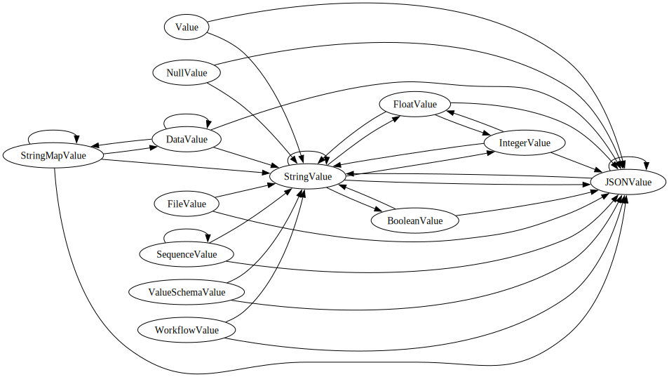

# Aceteam Workflow Engine

A powerful, modular workflow orchestration system designed for composing complex computational tasks from smaller, configurable steps. This engine powers the workflow functionality in [Aceteam.ai](https://aceteam.ai/workflow-engine) and is now available as an open-source package.

## Overview

The Workflow Engine enables you to:

- Define workflows as directed acyclic graphs (DAGs)
- Chain node-based tasks with type-safe data passing
- Persist and retrieve node outputs using various storage backends
- Execute workflows programmatically or via API

## Installation

```bash
pip install aceteam-workflow-engine
```

## Example

```python
import asyncio

from workflow_engine import IntegerValue, Workflow
import workflow_engine.nodes
from workflow_engine.contexts import LocalContext
from workflow_engine.execution import TopologicalExecutionAlgorithm

context = LocalContext()
algorithm = TopologicalExecutionAlgorithm()

# Load and run a workflow
with open("examples/addition.json") as f:
    workflow = Workflow.model_validate_json(f.read())

result = asyncio.run(algorithm.execute(
    context=context,
    workflow=workflow,
    input={"c": IntegerValue(-256)},
)) # {'sum': 1811}
```

Check the `examples` directory for more sample workflows in JSON form:

- [`addition.json`](./examples/addition.json): basic arithmetic operations
- [`append.json`](./examples/append.json): text file manipulation
- [`error.json`](./examples/error.json): graceful error handling

## Key Features

### Core Functionality

- **Graph-Based Execution**: Workflows are executed as DAGs with automatic dependency resolution
- **Type-Safe Data Flow**: Data passing between nodes is validated using MIME types
- **Flexible Storage**: Supports multiple storage backends (Supabase, Local, In-Memory)
- **Error Handling**: Robust error propagation and logging system
- **Versioning**: Built-in support for workflow versioning

### Node Types

- **Input Nodes**: Accept workflow inputs with type constraints
- **Processing Nodes**: Execute computational tasks with configurable parameters
- **Output Nodes**: Format and return workflow results

### Storage Backends

- **Supabase**: Primary storage backend for production use
- **Local**: File-system based storage for development
- **In-Memory**: Lightweight storage for testing

### Value Type Casting

The workflow engine supports automatic type casting between Value types. The graph below shows all available casting paths:



## Architecture

```
src/workflow_engine/
├── contexts/          # Storage backend implementations
│   ├── in_memory.py   # In-memory storage
│   └── local.py       # Local file system storage
├── core/              # Core workflow components
│   ├── context.py     # Execution context
│   ├── data.py        # Data handling
│   ├── edge.py        # Edge definitions
│   ├── execution.py   # Execution logic
│   ├── file.py        # File handling
│   ├── node.py        # Node base classes
│   └── workflow.py    # Workflow definitions
├── execution/         # Execution strategies
│   └── topological.py # DAG-based execution
├── nodes/             # Node implementations
│   ├── arithmetic.py  # Math operations
│   ├── constant.py    # Constant values
│   ├── json.py        # JSON operations
│   └── text.py        # Text operations
└── utils/             # Helper utilities
```

## Development

### Setup

```bash
# Using uv (recommended)
uv sync

# Using pip
pip install -e .
```

### Testing

```bash
uv run pytest  # Runs both unit and integration tests
```

## Documentation

- [Aceteam Workflow Documentation](https://aceteam.ai/workflow-engine)
- [API Reference](https://aceteam.ai/docs/api) (TODO)
- [Examples](./examples)

Available test suites:

- `test_type_checking.py`: Type system validation
- `test_workflow_validation.py`: Workflow validation tests

## Future Enhancements

- [ ] Support for iterative workflows and sub-workflows
- [ ] Enhanced parallel execution capabilities
- [ ] Additional storage backend implementations
- [ ] Improved error recovery and retry mechanisms
- [ ] Real-time workflow monitoring

## Contributing

We welcome contributions! Please see our [Contributing Guide](CONTRIBUTING.md) for details.

## License

[MIT License](LICENSE)

## About

This workflow engine is developed and maintained by [Adanomad Consulting](https://adanomad.com) and powers the workflow functionality in [Aceteam.ai](https://aceteam.ai). For commercial support or consulting, please contact us at [contact@adanomad.com](mailto:contact@adanomad.com).
