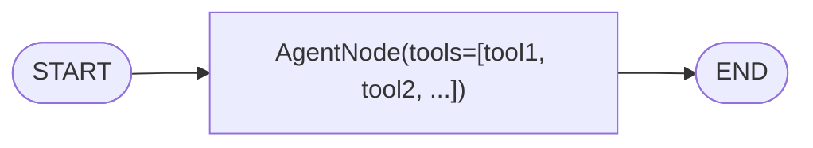
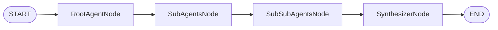

# Agentic Design Patterns

Guide for Step 1a: Determine if AI Agent is needed, and select appropriate Agentic Pattern.

## When to Consider Agentic Patterns

**First, assess if the workflow requires AI agent capabilities:**

| Indicator | Example | → Agentic Pattern |
|-----------|---------|-------------------|
| Autonomous decision-making | Route queries to appropriate handler | Coordinator |
| Tool/API access | Query databases, call external APIs | Single-Agent |
| Iterative reasoning | Refine output until quality threshold | Iterative Refinement |
| Self-correction | Detect and fix errors autonomously | ReAct, Loop |
| Human oversight needed | High-stakes decisions, compliance | Human-in-the-Loop |
| Multiple specialized roles | Generator + Critic, Researcher + Writer | Multi-Agent |

**Skip Agentic Patterns when:**
- Simple data transformation (CSV→JSON)
- Fixed, deterministic workflows
- No external interactions needed
- All logic expressible as explicit rules

---

## Pattern Catalog

### 1. Single-Agent System

**Structure:** One AI model + tools + system prompt



**Use when:**
- Moderate complexity tasks
- Early-stage development
- Tool count < 10

**Trade-offs:**
- ✅ Simple to implement and debug
- ❌ Performance degrades with many tools
- ❌ Complex tasks may need decomposition

**Example:** Customer support agent with order lookup, FAQ retrieval tools

---

### 2. Multi-Agent Systems

#### 2a. Sequential Pattern

**Structure:** Agent1 → Agent2 → Agent3 → END


**Use when:**
- Rigid, ordered pipeline
- Each step depends on previous output
- No dynamic routing needed

**Trade-offs:**
- ✅ Predictable, low orchestration cost
- ❌ Inflexible, cannot skip steps
- ❌ Poor for dynamic conditions

---

#### 2b. Parallel Pattern

**Structure:** [Agent1, Agent2, Agent3] execute simultaneously → Synthesize


**Use when:**
- Independent tasks executable concurrently
- Gathering diverse perspectives
- Reducing overall latency

**Trade-offs:**
- ✅ Reduced latency through concurrency
- ❌ Higher resource/cost utilization
- ❌ Complex synthesis for conflicting results

---

#### 2c. Loop Pattern

**Structure:** Process → Evaluate → (Refine ↺ | Complete)


**Use when:**
- Iterative refinement tasks
- Quality threshold must be met
- Self-correction workflows

**Design notes:**
- Set max iterations (3-10)
- Define clear exit conditions
- Track progress per iteration

**Trade-offs:**
- ✅ Enables iterative improvement
- ❌ Risk of infinite loops
- ❌ Unpredictable latency

---

#### 2d. Review and Critique Pattern

**Structure:** Generator → Critic → (Revise ↺ | Approve)


**Use when:**
- High accuracy requirements
- Strict formatting/constraint compliance
- Code generation with security review
- Sensitive document validation

**Trade-offs:**
- ✅ Improved output quality
- ✅ Dedicated verification step
- ❌ Additional latency from review
- ❌ Revision loops accumulate costs

---

#### 2e. Iterative Refinement Pattern

**Structure:** Cycle with session state across multiple iterations


**Use when:**
- Complex generation difficult in single step
- Code writing and debugging
- Multi-part planning
- Long-form document drafting

**Key difference from Loop:** Maintains rich session state across cycles, stores improvement history

**Trade-offs:**
- ✅ Produces highly polished outputs
- ❌ Direct cost/latency increase per cycle
- ❌ Requires sophisticated exit conditions

---

#### 2f. Coordinator Pattern

**Structure:** Central AI analyzes → dispatches to specialists


**Use when:**
- Varied input types needing flexible routing
- Structured business process automation
- Adaptive routing requirements

**Trade-offs:**
- ✅ Flexible, handles diverse inputs
- ✅ Runtime adaptation capability
- ❌ Multiple model calls increase costs
- ❌ Higher latency than direct routing

---

#### 2g. Hierarchical Task Decomposition Pattern

**Structure:** Root agent decomposes → delegates to sub-agents



**Use when:**
- Complex, ambiguous, open-ended problems
- Multi-step research and planning
- Problems requiring extensive decomposition
- Quality more important than speed

**Trade-offs:**
- ✅ Handles highly complex problems
- ✅ Comprehensive, high-quality results
- ❌ High architectural complexity
- ❌ Difficult to debug and maintain
- ❌ Significantly increased latency/costs

---

#### 2h. Swarm Pattern

**Structure:** All-to-all collaboration, iterative debate


**Use when:**
- Highly complex, ambiguous problems
- Solutions benefit from debate/refinement
- Consensus-building requirements
- Creative problem-solving

**Trade-offs:**
- ✅ Simulates collaborative expert team
- ✅ Exceptionally creative solutions
- ❌ Most complex and costly pattern
- ❌ Risk of unproductive loops
- ❌ May fail to converge

---

### 3. ReAct (Reason and Act) Pattern

**Structure:** Thought → Action → Observation loop


**Use when:**
- Complex, dynamic tasks requiring continuous planning
- Adaptive approach based on new observations
- Robotics, pathfinding, navigation
- Real-time environmental constraints

**Trade-offs:**
- ✅ Transparent reasoning (aids debugging)
- ✅ Dynamic adaptation to new information
- ❌ Higher latency from multi-step iteration
- ❌ Effectiveness depends on model quality
- ❌ Errors propagate through observations

---

### 4. Human-in-the-Loop Pattern

**Structure:** Agent workflow with predefined human checkpoints


**Use when:**
- High-stakes decisions
- Safety-critical operations
- Subjective judgment requirements
- Compliance and validation needs
- Escalation after agent failure

**Implementation:**
- Define clear checkpoint criteria
- Build approval/rejection UI
- Handle timeout scenarios
- Log human decisions

**Trade-offs:**
- ✅ Improves safety and reliability
- ✅ Adds human judgment at critical points
- ❌ Requires external interaction system
- ❌ Adds latency from human waiting
- ❌ Scaling challenges with multiple approvals

---

### 5. Custom Logic Pattern

**Structure:** Code-based orchestration with complex branching


**Use when:**
- Complex branching beyond linear sequences
- Mixing predefined rules with model reasoning
- Fine-grained process control
- Workflows not fitting standard templates

**Trade-offs:**
- ✅ Maximum control over execution
- ✅ Accommodates unique business logic
- ❌ Increases development complexity
- ❌ More error-prone than patterns
- ❌ Requires extensive testing

---

## Combining Patterns

**Common pattern combinations:**

| Primary Pattern | + Secondary Pattern | Use Case |
|-----------------|---------------------|----------|
| Coordinator | + Human-in-the-Loop | Routing with escalation checkpoints |
| Iterative Refinement | + Human-in-the-Loop | Quality cycles with human fallback |
| Sequential | + Human-in-the-Loop | Pipeline with approval gates |
| Coordinator | + Review & Critique | Routing with output validation |

**Design approach for combinations:**
1. Identify primary workflow pattern
2. Overlay secondary pattern at specific checkpoints
3. Define clear transition criteria between patterns

---

## Single-Agent vs Multi-Agent Decision

| Criterion | Single-Agent | Multi-Agent |
|-----------|--------------|-------------|
| Tool count | < 10 tools | > 10 tools or specialized domains |
| Task complexity | One domain, moderate complexity | Multiple domains, high complexity |
| Routing needs | Static, predictable | Dynamic, input-dependent |
| Development stage | Early/prototyping | Production, proven requirements |

**Start with Single-Agent** unless clear indicators for Multi-Agent exist.

---

## Pattern Selection Decision Matrix

### By Workload Characteristics

| Workload Type | Primary Pattern | Alternative |
|---------------|-----------------|-------------|
| Deterministic pipeline | Sequential | - |
| Classification + routing | Coordinator | Branching |
| Quality-critical generation | Review & Critique | Iterative Refinement |
| Time-sensitive | Single-Agent | Parallel |
| Cost-constrained | Single-Agent | Sequential |
| High-stakes decisions | Human-in-the-Loop | - |
| Complex branching | Custom Logic | Coordinator |
| Creative/ambiguous problems | Swarm | Hierarchical |
| Continuous reasoning | ReAct | Loop |

### By Performance Requirements

| Priority | Recommended | Avoid |
|----------|-------------|-------|
| Low Latency | Sequential, Parallel, Single-Agent | Hierarchical, Swarm |
| Low Cost | Single-Agent, Sequential | Swarm, Hierarchical |
| High Quality | Review & Critique, Iterative Refinement | Single-pass patterns |
| High Flexibility | Coordinator, Custom Logic | Sequential |
| Easy Debugging | Single-Agent, ReAct | Swarm |

---

## Quick Reference: Pattern Selection Flowchart

```mermaid
flowchart TD
    A{IsAIAgentNeeded}
    A -->|YES| B{HowManyAgents}
    A -->|NO| C[BasicPatternsNode<br/>(Sequential/Branching/<br/>Cyclic/Multi-agent)]

    B -->|ONE| D[SingleAgentNode]
    B -->|2-3| E{WhichCollaboration}
    B -->|4+| F{ComplexOrchestration}

    E --> G[SequentialNode]
    E --> H[ParallelNode]

    F --> I[HierarchicalNode]
    F --> J[SwarmNode]

    C --> K{NeedHumanOversight}
    D --> K
    G --> K
    H --> K
    I --> K
    J --> K

    K -->|YES| L[HumanInTheLoopNode]
    K -->|NO| M[ContinuePatternNode]
```