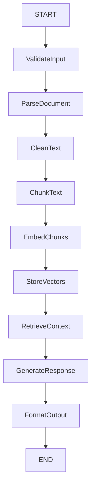
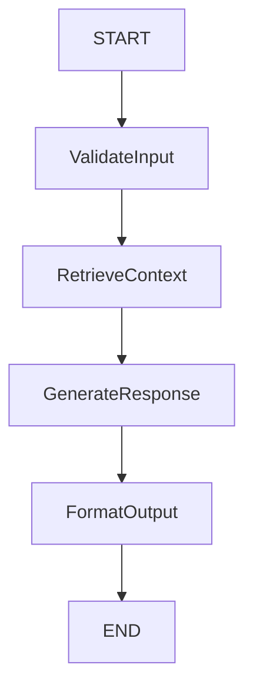
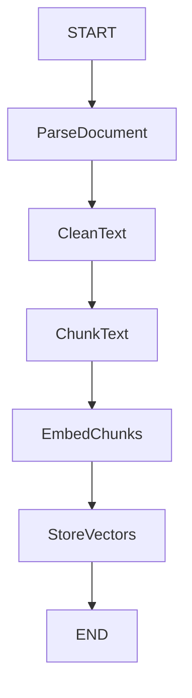

# Cast Complexity Analysis Guide

Guide for analyzing Cast complexity and determining when to extract Sub-Casts.

## When to Analyze

Analyze Cast complexity when:
- User mentions cast is "too complex" or "hard to understand"
- You notice a cast has many nodes during design
- User wants to add similar logic to another cast
- During review of existing CLAUDE.md files (root + cast-specific)

## Complexity Indicators

### High Complexity Signals

**Node Count**: More than 7 nodes suggests high complexity

**Deep Nesting**: Conditional branches >3 levels deep

**Repeated Patterns**: Same node sequence appears in multiple casts

**Long Cycles**: Loop contains >4 nodes

**Mixed Concerns**: Single cast handles multiple distinct workflows

## Analysis Process

### Step 1: Count Nodes

Read the Cast's Architecture Diagram and count nodes (excluding START/END).

```
Low: 3-5 nodes
Medium: 6-7 nodes
High: 8+ nodes
```

### Step 2: Identify Patterns

Look for:
- **Repeated Sequences**: Same 2-3 nodes appearing together
- **Isolated Sections**: Nodes that don't interact with rest of graph
- **Reusable Logic**: Validation, formatting, common transformations

### Step 3: Check for Shared Logic

Compare with other Casts (check root CLAUDE.md's Casts table and their respective cast CLAUDE.md files):
- Do multiple casts have similar node sequences?
- Is there common preprocessing/postprocessing?
- Are there shared validation steps?

## Extraction Criteria

### Extract as Sub-Cast When:

✅ **Reusable**: Used by 2+ casts
✅ **Self-contained**: Has clear input/output, minimal dependencies
✅ **Cohesive**: Nodes work together toward single purpose
✅ **Stable**: Logic unlikely to change frequently

### Keep in Main Cast When:

❌ **One-off**: Only used in this cast
❌ **Tightly coupled**: Heavily depends on parent cast's state
❌ **Simple**: Only 1-2 nodes
❌ **Unstable**: Logic changes frequently

## Extraction Proposal Template

When suggesting extraction, present:

```
"I notice [Pattern/Section] in Cast: [CastName].

**Complexity**: [X] nodes, [specific issue]

**Suggestion**: Extract as Sub-Cast: [ProposedName]

**Benefits**:
- Reduces main cast from X to Y nodes
- Reusable in [OtherCast1, OtherCast2]
- Clearer separation of concerns

**Extracted Nodes**:
- NodeA
- NodeB
- NodeC

Should we proceed with this extraction?"
```

## Sub-Cast Naming

Sub-Casts should be named with clear purpose:

✅ Good: `InputValidation`, `DocumentParser`, `ResponseFormatter`
❌ Bad: `Helper`, `Utils`, `Common`

## Example Analysis

### Before (Complex Cast)



**Analysis**: 10 nodes, contains two distinct workflows (indexing + retrieval)

### After (Extracted Sub-Casts)

**Main Cast (Retrieval)**:


**Sub-Cast (DocumentIndexing)**:


**Benefits**: Main cast reduced from 10 to 5 nodes, indexing logic reusable, clearer responsibilities

## Checklist

- [ ] Node count exceeds 10
- [ ] Repeated patterns identified
- [ ] Shared logic across casts found
- [ ] Clear extraction boundary exists
- [ ] Sub-Cast would be reusable
- [ ] Extraction maintains graph correctness
