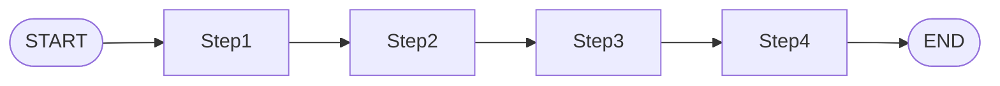
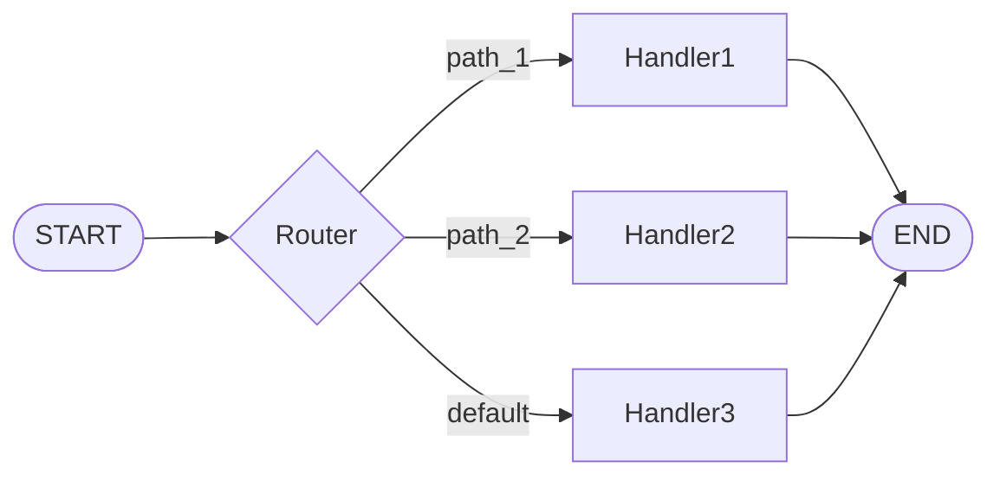
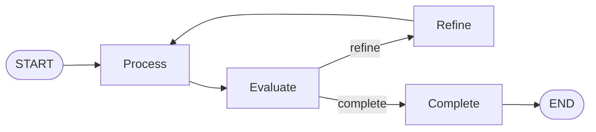

# Pattern Decision Matrix

Guide for Step 1b: Basic Pattern Selection for non-agentic workflows.

> **Note:** If the workflow requires AI agent capabilities (tool access, autonomous decision-making, iterative reasoning, human oversight), use [agentic-design-patterns.md](agentic-design-patterns.md) instead.

## Decision Matrix

| If Requirements Suggest... | Recommend Pattern | Why |
|---------------------------|-------------------|-----|
| Linear transformation, no branching, fixed steps | **Sequential** | Simple, predictable flow |
| Multiple handlers based on input type/classification | **Branching** | Route to specialized processors |
| Refinement until quality threshold met | **Cyclic** | Iterate and improve |

## Detailed Pattern Characteristics

### Sequential
**Structure:** START → Step1 → Step2 → ... → END

**Use when:**
- Each step depends on previous output
- Order cannot change
- No decision points needed

**Example:** Document parsing → Cleaning → Entity extraction → Summary generation

**Design notes:**
- 3-7 nodes typical
- Each step has single responsibility
- Fail fast on bad input

---

### Branching
**Structure:** START → Router → [Handler1 | Handler2 | Handler3] → END

**Use when:**
- Different input types need different processing
- Classification determines next step
- Multiple specialized paths exist

**Example:** Customer query → Classify → [Billing | Technical | Sales] → Response

**Design notes:**
- Always include default/fallback path
- Make conditions mutually exclusive
- <5 branches recommended

---

### Cyclic
**Structure:** START → Process → Evaluate → [Refine → Process | Complete → END]

**Use when:**
- Output quality needs improvement
- Iterative refinement required
- Feedback loop necessary

**Example:** Generate draft → Review quality → [Refine draft | Finalize]

**Design notes:**
- Set max iterations (3-10)
- Track progress per iteration
- Use numeric thresholds for exit

---

## Hybrid Patterns

**Can combine patterns:**
- Branching + Sequential: Route, then process linearly
- Sequential + Branching: Linear flow with conditional exits

**Recommend starting simple** - add complexity only if needed.