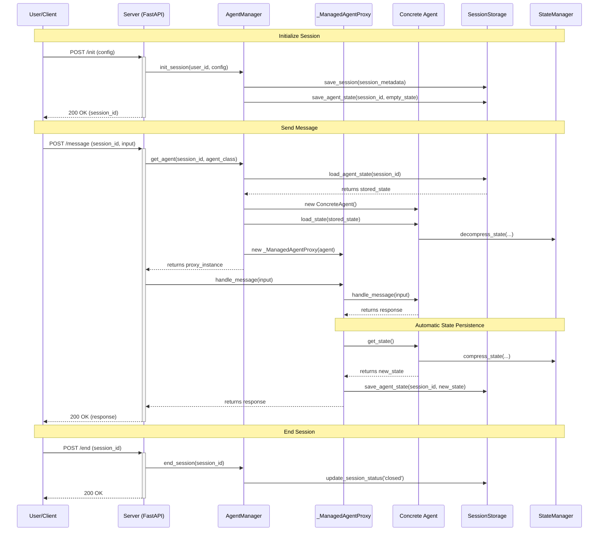
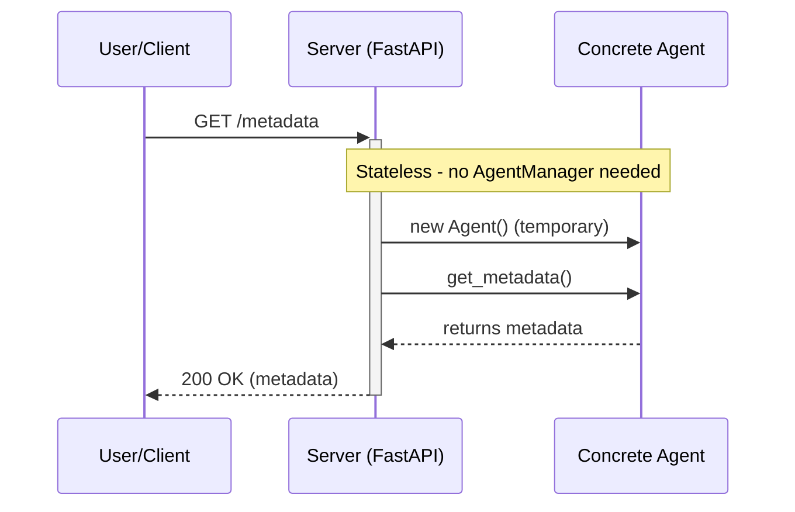

# Agent Framework Architecture

## 1. Overview

This document outlines the architecture of the Agent Framework, designed to provide a robust, scalable, and extensible platform for serving conversational agents across multiple AI frameworks.

The primary architectural goal is **Framework-Agnostic Design with Separation of Concerns**. The framework completely decouples the web server layer from the implementation details of any specific agent framework (e.g., LlamaIndex, Microsoft Agent Framework). The server doesn't know how an agent manages its internal memory or state; its only job is to handle web requests and interact with a generic `AgentInterface`.

This design allows for easy extension to support other agent frameworks in the future without modifying the core server logic.

### Key Architectural Improvements

**🎯 Framework-Agnostic Core**: The framework now provides a clean separation between framework-agnostic concerns (session management, state persistence, streaming, web server) and framework-specific implementations (LlamaIndex, Microsoft).

**🔄 Modular Architecture**: Clear folder structure organizing code by responsibility (core, session, storage, processing, tools, monitoring, web, implementations).

**🔌 Extensible Design**: Adding new agent frameworks requires only implementing the `AgentInterface` without touching core code.

## 2. Folder Structure

The architecture is organized into logical modules, each with a single, well-defined responsibility:

```
agent_framework/
├── core/                          # Framework-agnostic core components
│   ├── __init__.py
│   ├── agent_interface.py         # Abstract agent interface
│   ├── base_agent.py              # Generic base agent
│   ├── agent_provider.py          # Agent lifecycle management (AgentManager)
│   ├── state_manager.py           # State management & compression
│   ├── model_config.py            # Multi-provider configuration
│   └── model_clients.py           # LLM client factory
│
├── session/                       # Session management
│   ├── __init__.py
│   └── session_storage.py         # Session persistence (Memory, MongoDB)
│
├── storage/                       # File storage
│   ├── __init__.py
│   ├── file_storages.py           # Storage backends (Local, S3, MinIO)
│   ├── file_system_management.py  # FileStorageManager
│   └── storage_optimizer.py       # Storage optimization
│
├── processing/                    # Content processing
│   ├── __init__.py
│   ├── markdown_converter.py      # File to markdown conversion
│   ├── multimodal_integration.py  # Multimodal processing
│   └── ai_content_management.py   # AI content management
│
├── tools/                         # Reusable tools
│   ├── __init__.py
│   └── multimodal_tools.py        # Multimodal processing tools
│
├── monitoring/                    # Performance & monitoring
│   ├── __init__.py
│   ├── performance_monitor.py     # Performance monitoring
│   ├── progress_tracker.py        # Progress tracking
│   ├── resource_manager.py        # Resource management
│   ├── error_handling.py          # Error handling
│   └── error_logging.py           # Logging configuration
│
├── web/                           # Web server & UI
│   ├── __init__.py
│   ├── server.py                  # FastAPI server
│   ├── modern_ui.html             # Modern UI
│   └── test_app.html              # Test application
│
├── implementations/               # Framework-specific agents
│   ├── __init__.py
│   ├── llamaindex_agent.py        # LlamaIndex implementation
│   └── microsoft_agent.py         # Microsoft Agent Framework
│
├── utils/                         # Utilities
│   ├── __init__.py
│   └── special_blocks.py          # Special block parsing
│
└── chart_generation/              # Chart generation
    └── llm_refinement_loop.py     # LLM refinement for charts
```

### Module Responsibilities

| Module | Responsibility |
|--------|---------------|
| **core/** | Framework-agnostic components: interfaces, base classes, state management, model configuration |
| **session/** | Session lifecycle and persistence (memory, MongoDB) |
| **storage/** | File storage backends and management (Local, S3, MinIO) |
| **processing/** | Content processing: markdown conversion, multimodal integration, AI content |
| **tools/** | Reusable tools for various processing tasks |
| **monitoring/** | Performance monitoring, progress tracking, error handling, logging |
| **web/** | FastAPI server, HTTP endpoints, web UI |
| **implementations/** | Framework-specific agent implementations (LlamaIndex, Microsoft) |
| **utils/** | General utilities and helpers |

## 3. Core Components

### a. AgentInterface (core/agent_interface.py)

The core contract that all agents must implement. Defines the standard methods for:

- `handle_message()` - Process a user message
- `handle_message_stream()` - Process with streaming response
- `get_state()` - Retrieve agent state for persistence
- `load_state()` - Load persisted state
- `configure_session()` - Configure session parameters
- `get_metadata()` - Return agent metadata

**Key Principle**: Any agent framework can be integrated by implementing this interface.

### b. BaseAgent (core/base_agent.py)

A generic base class that provides common functionality for all agents:

- Session management
- State serialization/deserialization
- Configuration handling
- Metadata management

Concrete agents can inherit from `BaseAgent` to get these features automatically.

### c. AgentManager (core/agent_provider.py)

The "wrapper" or provider that manages the lifecycle of agents:

- **Creation**: Instantiates agents on demand
- **State Loading**: Loads persisted state from SessionStorage
- **Proxy Wrapping**: Wraps agents in `_ManagedAgentProxy` for automatic state saving
- **Validation**: Validates state compatibility using StateManager

**Key Principle**: The server never creates agents directly; it always goes through AgentManager.

### d. _ManagedAgentProxy (core/agent_provider.py)

An internal proxy that implements `AgentInterface` and wraps the real agent:

- **Transparent**: Looks and behaves exactly like the real agent
- **Automatic State Saving**: After each message, automatically calls `get_state()` and persists to SessionStorage
- **Proxy Pattern**: Enables state persistence without server involvement

**Key Principle**: State saving is an invisible, automatic side-effect of handling a message.

### e. StateManager (core/state_manager.py)

Handles framework-agnostic state management:

- **Compression**: Compresses large state objects for efficient storage
- **Decompression**: Decompresses state when loading
- **Identity Management**: Creates and validates agent identities
- **Compatibility**: Validates state compatibility between sessions

**Key Principle**: State is treated as opaque data; StateManager doesn't need to understand framework-specific formats.

### f. ModelClientFactory (core/model_clients.py)

Creates LLM clients for different providers:

- **OpenAI**: Creates AsyncOpenAI clients
- **Anthropic**: Creates AsyncAnthropic clients
- **Gemini**: Creates Google Generative AI clients
- **LlamaIndex**: Creates LlamaIndex LLM instances with proper imports
- **Parameter Handling**: Filters provider-specific parameters
- **Error Recovery**: Retries without unsupported parameters

**Key Principle**: Centralizes all LLM client creation logic, making it easy to add new providers.

### g. SessionStorage (session/session_storage.py)

The persistence layer with two distinct responsibilities:

1. **Session Metadata**: Lightweight session information (user_id, timestamps, correlation_id)
2. **Agent State**: Potentially large agent state blobs

**Implementations**:
- **MemorySessionStorage**: In-memory storage for development
- **MongoDBSessionStorage**: MongoDB storage for production

**Key Principle**: Session metadata and agent state are separate concerns with separate storage.

### h. Server (web/server.py)

The FastAPI web server that:

- **Handles HTTP Requests**: Processes incoming API calls
- **Delegates to AgentManager**: Never creates or manages agents directly
- **Returns Responses**: Formats and returns responses to clients
- **Framework-Agnostic**: No knowledge of specific agent frameworks

**Key Principle**: The server is a thin layer that orchestrates high-level workflows.

## 4. Key Architectural Decisions & Principles

### a. True Decoupling via AgentManager

The server does not create agent instances or load their state directly. Instead, it delegates this entire responsibility to the `AgentManager`. This manager is the only component that understands how to assemble a fully functional agent, abstracting away all complexity from the server.

### b. The Proxy Pattern for Transparent State Management

A critical requirement was that state should be persisted automatically after an agent responds, without the server needing to explicitly trigger a "save" operation. We achieve this using the **Proxy Pattern**.

- The `AgentManager` does not return the `RealAgent` to the server. It returns a `_ManagedAgentProxy` instead.
- This proxy *looks and feels* exactly like a real agent because it implements the same `AgentInterface`.
- When the server calls `handle_message()` on the proxy, the proxy first passes the call to the `RealAgent`.
- Once the `RealAgent` returns a response, the proxy automatically calls the agent's `get_state()` method and instructs the `SessionStorage` to persist the new state.

This makes state saving an invisible, automatic side-effect of handling a message, dramatically simplifying the server logic.

### c. Separation of Agent State from Session Metadata

An agent's internal state (its memory, configuration, etc.) is a fundamentally different concern from the session's metadata (user ID, timestamps, correlation ID).

This architecture formalizes that separation. The `SessionStorage` interface has distinct methods for:

1. `save_session()` / `load_session()`: For lightweight session metadata
2. `save_agent_state()` / `load_agent_state()`: For potentially large agent state blobs

This ensures the system is more organized, scalable, and easier to debug.

### d. Interface-Driven Design for Extensibility

The `AgentInterface` is the core contract that enables the entire system's flexibility. Any future agent, regardless of its underlying framework, can be integrated into the system by simply:

1. Implementing the `AgentInterface`
2. Providing the logic for its own state management within the `get_state()` and `load_state()` methods

The server, `AgentManager`, and `SessionStorage` layers will require no changes.

### e. Framework-Specific Implementations

The `implementations/` folder contains framework-specific agent classes:

**LlamaIndexAgent** (implementations/llamaindex_agent.py):
- Integrates with LlamaIndex framework
- Handles LlamaIndex-specific agent creation and configuration
- Manages LlamaIndex state serialization
- Provides simple interface: implement `get_agent_prompt()` and `get_agent_tools()`

**MicrosoftAgent** (implementations/microsoft_agent.py):
- Integrates with Microsoft Agent Framework
- Handles Microsoft-specific agent creation and configuration
- Manages Microsoft state serialization

**Key Principle**: Framework-specific code is isolated in implementations/, keeping the core framework clean.

## 5. Workflows & Sequence Diagrams

### Workflow 1: Full Session Lifecycle



### Workflow 2: Stateless Endpoints



## 6. Data Models

### AgentIdentity

```python
@dataclass
class AgentIdentity:
    agent_id: str          # UUID
    agent_type: str        # Class name
    agent_class: str       # Full class path
    config_hash: str       # Configuration hash
    created_at: datetime
    metadata: Dict[str, Any]
```

### SessionData

```python
@dataclass
class SessionData:
    session_id: str
    user_id: str
    agent_instance_config: Dict[str, Any]
    correlation_id: Optional[str] = None
    created_at: Optional[str] = None
    updated_at: Optional[str] = None
    metadata: Optional[Dict[str, Any]] = None
    agent_id: Optional[str] = None
    agent_type: Optional[str] = None
    session_configuration: Optional[Dict[str, Any]] = None
    session_label: Optional[str] = None
```

### MessageData

```python
@dataclass
class MessageData:
    message_id: str
    session_id: str
    user_id: str
    interaction_id: str
    sequence_number: int
    message_type: str  # "user_input" or "agent_response"
    role: str
    text_content: Optional[str] = None
    parts: Optional[List[Dict[str, Any]]] = None
    response_text_main: Optional[str] = None
    # ... timestamps, metadata, etc.
```

## 7. Component Details

### Core Components

#### agent_interface.py
- **Purpose**: Defines the contract all agents must implement
- **Key Methods**: handle_message, handle_message_stream, get_state, load_state
- **Design**: Abstract base class ensuring consistent agent behavior

#### base_agent.py
- **Purpose**: Provides common functionality for all agents
- **Features**: Session management, state serialization, configuration handling
- **Usage**: Concrete agents inherit from BaseAgent

#### agent_provider.py (AgentManager)
- **Purpose**: Manages agent lifecycle
- **Responsibilities**: Creation, state loading, proxy wrapping, validation
- **Pattern**: Factory + Proxy pattern

#### state_manager.py
- **Purpose**: Framework-agnostic state management
- **Features**: Compression, decompression, identity management, compatibility validation
- **Design**: Treats state as opaque data

#### model_config.py
- **Purpose**: Multi-provider model configuration
- **Providers**: OpenAI, Anthropic, Gemini
- **Features**: Provider detection, parameter validation, configuration merging

#### model_clients.py
- **Purpose**: LLM client factory
- **Methods**: create_openai_client, create_anthropic_client, create_gemini_client, create_llamaindex_llm
- **Features**: Parameter filtering, error recovery, provider-specific handling

### Session Components

#### session_storage.py
- **Purpose**: Session and state persistence
- **Implementations**: MemorySessionStorage, MongoDBSessionStorage
- **Design**: Separates session metadata from agent state

### Storage Components

#### file_storages.py
- **Purpose**: File storage backends
- **Backends**: Local, S3, MinIO
- **Features**: Multi-backend support, intelligent routing

#### file_system_management.py
- **Purpose**: File storage orchestration
- **Features**: Upload, download, metadata management, backend selection

#### storage_optimizer.py
- **Purpose**: Storage optimization
- **Features**: Compression, deduplication, cleanup

### Web Components

#### server.py
- **Purpose**: FastAPI web server
- **Endpoints**: /message, /stream, /init, /end, /sessions, /config, /files
- **Design**: Framework-agnostic, delegates to AgentManager
- **Features**: Authentication, CORS, error handling, streaming

## 8. Extension Points

### Adding a New Agent Framework

To add support for a new agent framework:

1. **Create Implementation**: Add a new file in `implementations/` (e.g., `langchain_agent.py`)
2. **Implement AgentInterface**: Implement all required methods
3. **Handle State**: Implement `get_state()` and `load_state()` for your framework
4. **Export**: Add to `implementations/__init__.py`
5. **Document**: Add usage examples and documentation

**No changes needed to**:
- Core framework
- Server
- SessionStorage
- AgentManager

### Adding a New Storage Backend

To add a new storage backend:

1. **Implement Interface**: Implement the storage backend interface in `storage/file_storages.py`
2. **Add Configuration**: Add configuration options in `model_config.py`
3. **Register**: Register the backend in FileStorageManager
4. **Test**: Add tests in `tests/test_storage/`

### Adding a New LLM Provider

To add a new LLM provider:

1. **Add to ModelConfig**: Add provider enum and configuration in `model_config.py`
2. **Add Client Factory**: Add creation method in `model_clients.py`
3. **Handle Parameters**: Add provider-specific parameter handling
4. **Test**: Add tests for the new provider

## 9. Design Patterns Used

| Pattern | Where Used | Purpose |
|---------|-----------|---------|
| **Proxy** | _ManagedAgentProxy | Automatic state persistence |
| **Factory** | ModelClientFactory | LLM client creation |
| **Strategy** | AgentInterface | Pluggable agent implementations |
| **Template Method** | BaseAgent | Common agent functionality |
| **Singleton** | AgentManager | Single agent lifecycle manager |
| **Repository** | SessionStorage | Data persistence abstraction |

## 10. Performance Considerations

### State Compression

- **Problem**: Agent state can be large (conversation history, embeddings)
- **Solution**: StateManager compresses state before persistence
- **Benefit**: Reduced storage costs and faster I/O

### Lazy Loading

- **Problem**: Loading all agent state upfront is expensive
- **Solution**: Agents load state on-demand
- **Benefit**: Faster startup and lower memory usage

### Connection Pooling

- **Problem**: Creating new database connections is slow
- **Solution**: MongoDB connection pooling
- **Benefit**: Better performance under load

### Caching

- **Problem**: Repeated model configuration lookups
- **Solution**: Cache model configurations
- **Benefit**: Reduced latency

## 11. Security Considerations

### Authentication

- **Basic Auth**: Username/password authentication
- **API Keys**: Bearer token authentication
- **Configurable**: Can be enabled/disabled via environment variables

### Input Validation

- **Pydantic Models**: All inputs validated with Pydantic
- **Type Safety**: Strong typing throughout
- **Sanitization**: User inputs sanitized before processing

### State Isolation

- **Session Isolation**: Each session has isolated state
- **User Isolation**: Users cannot access other users' sessions
- **Agent Identity**: Agents validate state compatibility

## 12. Monitoring & Observability

### Logging

- **Structured Logging**: JSON-formatted logs
- **Log Levels**: DEBUG, INFO, WARNING, ERROR
- **Context**: All logs include session_id, user_id, correlation_id

### Performance Monitoring

- **Metrics**: Request latency, throughput, error rates
- **Resource Tracking**: Memory, CPU, storage usage
- **Progress Tracking**: Long-running operation progress

### Error Handling

- **Structured Errors**: Consistent error format
- **Error Logging**: All errors logged with context
- **Graceful Degradation**: System continues operating on non-critical errors

## 13. Testing Strategy

### Unit Tests

- **Core Components**: Test each component in isolation
- **Mocking**: Mock external dependencies
- **Coverage**: >80% code coverage target

### Integration Tests

- **End-to-End**: Test complete workflows
- **Multiple Frameworks**: Test with LlamaIndex and Microsoft agents
- **Storage Backends**: Test with Memory and MongoDB storage

### Performance Tests

- **Load Testing**: Test under high load
- **Stress Testing**: Test system limits
- **Benchmarking**: Compare performance across versions

## 14. Future Enhancements

### Planned Features

- **Multi-Agent Orchestration**: Built-in support for agent teams
- **Streaming Improvements**: Enhanced streaming with backpressure
- **Advanced Caching**: Semantic caching for LLM responses
- **Observability**: OpenTelemetry integration
- **Horizontal Scaling**: Distributed agent management

### Extension Points

- **Custom Middleware**: Plugin system for custom middleware
- **Custom Storage**: Easy addition of new storage backends
- **Custom Providers**: Easy addition of new LLM providers
- **Custom Tools**: Plugin system for agent tools

---

This architecture provides a solid foundation for building scalable, maintainable, and extensible AI agent applications across multiple frameworks.
