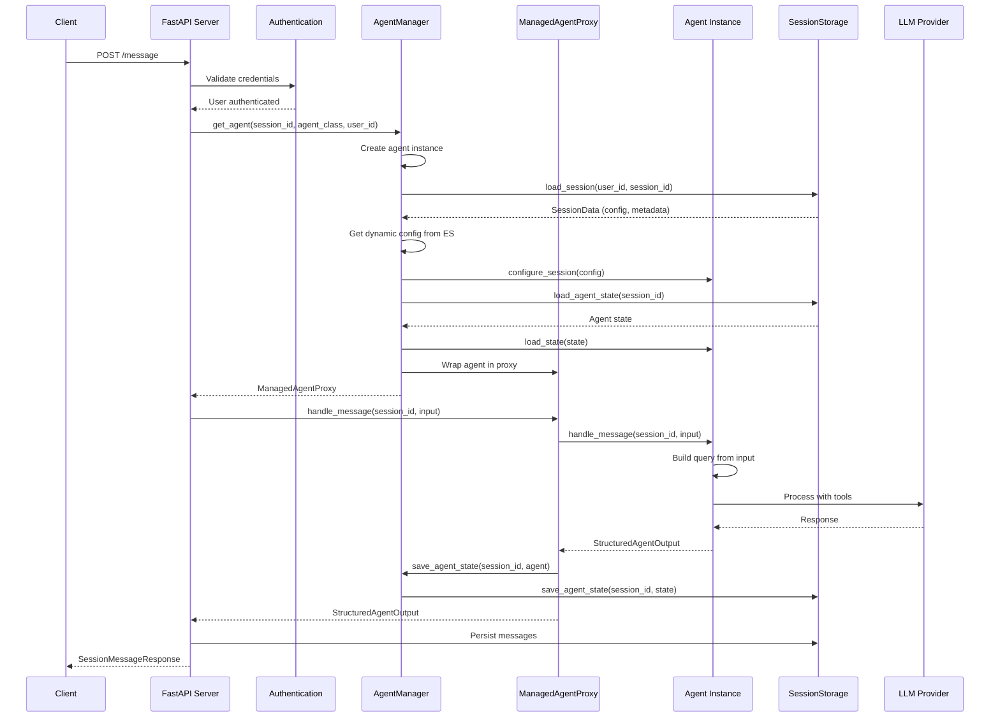
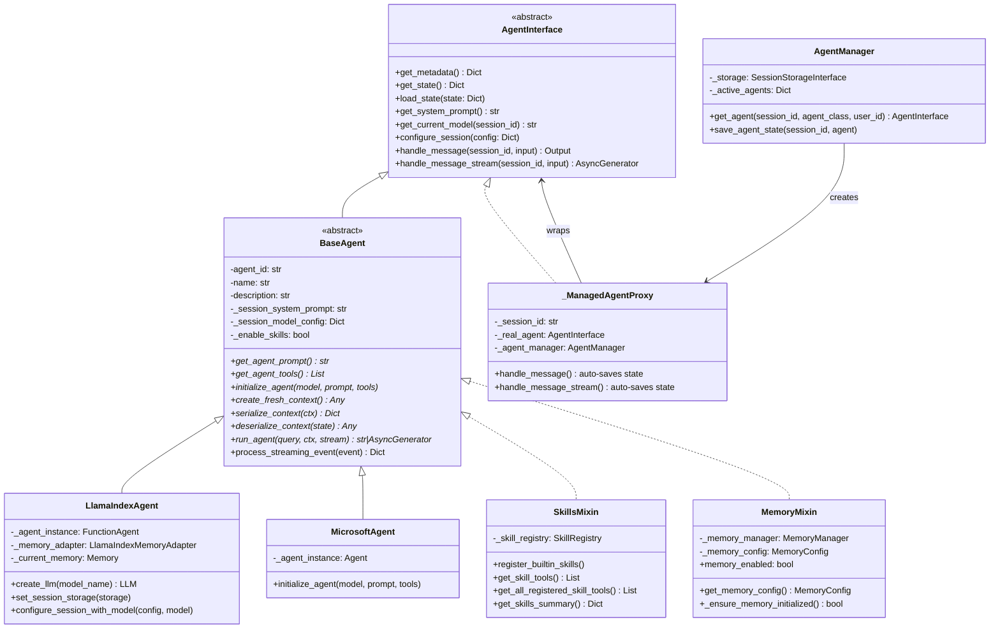
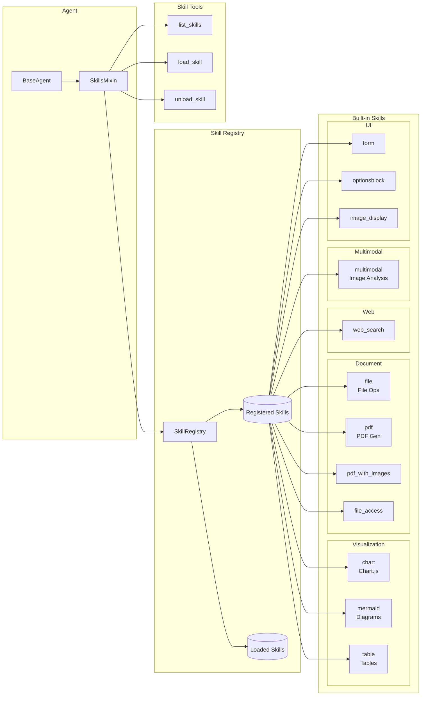
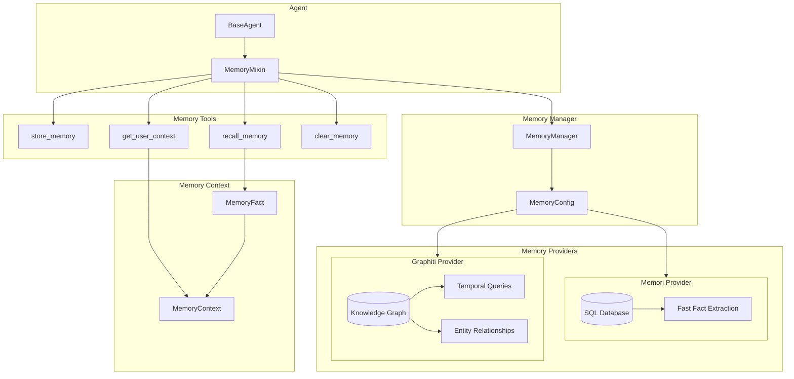
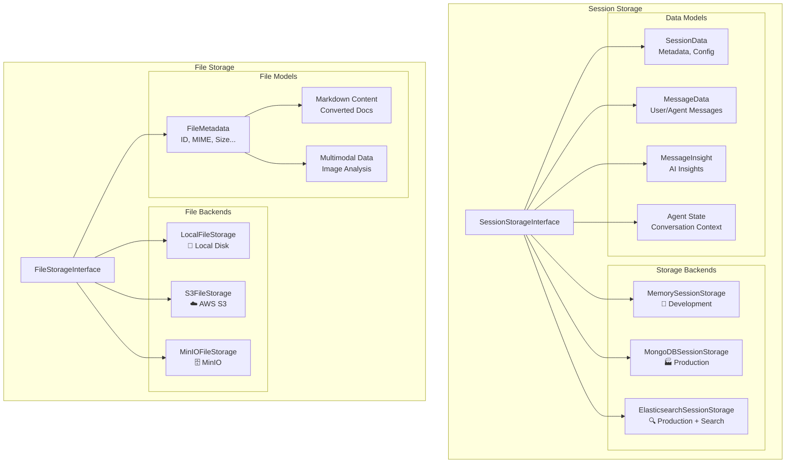
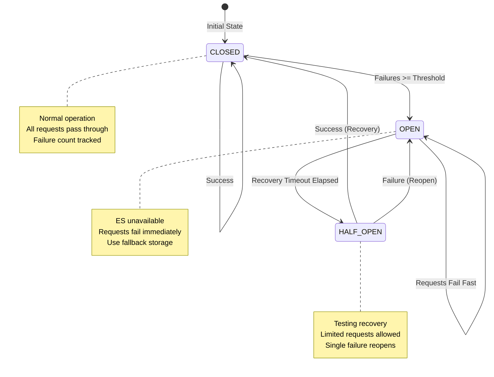
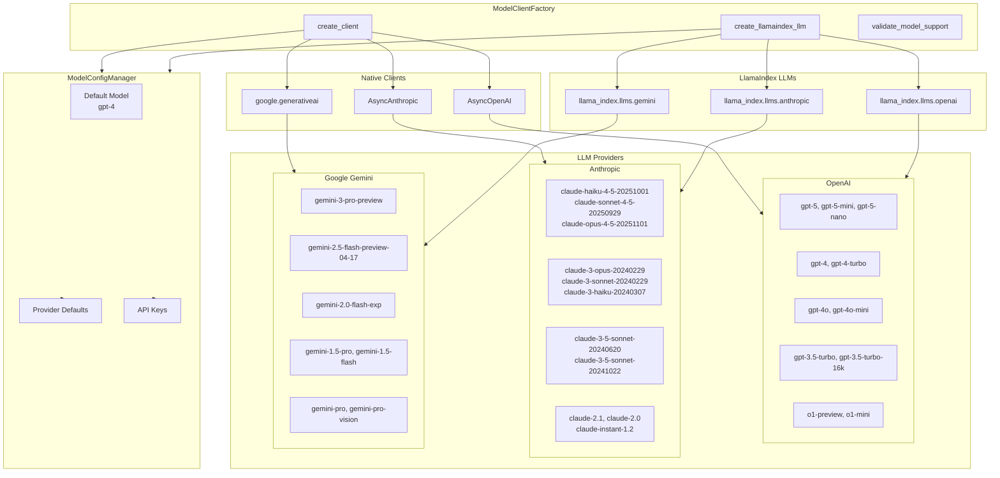

# Agent Framework - Architecture Diagram

Ce document présente l'architecture complète de l'Agent Framework sous forme de diagrammes Mermaid.

## 1. Vue d'ensemble de l'Architecture

```mermaid
flowchart TB
    subgraph Client["🖥️ Client Layer"]
        UI[Modern UI / Chat Interface]
        API_Client[API Client]
    end

    subgraph Web["🌐 Web Layer (FastAPI)"]
        Server[server.py<br/>FastAPI Application]
        AdminRouter[Admin Router<br/>User/Session Management]
        Auth[Authentication<br/>Basic Auth / API Key]
    end

    subgraph Core["⚙️ Core Layer (Framework-Agnostic)"]
        AgentInterface[AgentInterface<br/>Abstract Contract]
        BaseAgent[BaseAgent<br/>Abstract Base Class]
        AgentProvider[AgentManager<br/>+ ManagedAgentProxy]
        StateManager[StateManager<br/>State Persistence]
        ModelClients[ModelClientFactory<br/>Multi-Provider LLM]
        ModelConfig[ModelConfigManager<br/>Configuration]
        ESConfigProvider[ElasticsearchConfigProvider<br/>Dynamic Config]
    end

    subgraph Implementations["🔧 Implementations"]
        LlamaIndex[LlamaIndexAgent<br/>LlamaIndex Framework]
        Microsoft[MicrosoftAgent<br/>Microsoft Agent Framework]
        Custom[Custom Agents<br/>Your Implementation]
    end

    subgraph Session["💾 Session Layer"]
        SessionStorage[SessionStorageInterface]
        MemoryStorage[MemorySessionStorage<br/>Development]
        MongoStorage[MongoDBSessionStorage<br/>Production]
        ESStorage[ElasticsearchSessionStorage<br/>Production + Search]
    end

    subgraph Storage["📁 File Storage"]
        FileManager[FileStorageManager]
        LocalStorage[LocalFileStorage]
        S3Storage[S3FileStorage]
        MinIOStorage[MinIOFileStorage]
    end

    subgraph Skills["🎯 Skills System"]
        SkillRegistry[SkillRegistry]
        SkillsMixin[SkillsMixin]
        BuiltinSkills[Built-in Skills<br/>Chart, PDF, Mermaid...]
    end

    subgraph Memory["🧠 Memory System"]
        MemoryManager[MemoryManager]
        MemoryMixin[MemoryMixin]
        MemoriProvider[MemoriProvider<br/>SQL-based]
        GraphitiProvider[GraphitiProvider<br/>Knowledge Graph]
    end

    subgraph Monitoring["📊 Monitoring"]
        CircuitBreaker[ElasticsearchCircuitBreaker]
        ErrorHandler[ErrorHandler]
        PerformanceMonitor[PerformanceMonitor]
        ESLogging[ElasticsearchLoggingHandler]
    end

    subgraph LLM["🤖 LLM Providers"]
        OpenAI[OpenAI<br/>GPT-4, GPT-4o]
        Anthropic[Anthropic<br/>Claude 3]
        Gemini[Google Gemini]
    end

    %% Client to Web
    UI --> Server
    API_Client --> Server

    %% Web Layer
    Server --> Auth
    Server --> AdminRouter
    Server --> AgentProvider

    %% Core connections
    AgentProvider --> AgentInterface
    AgentProvider --> StateManager
    AgentProvider --> SessionStorage
    AgentInterface --> BaseAgent
    BaseAgent --> ModelClients
    BaseAgent --> SkillsMixin
    BaseAgent --> MemoryMixin
    ModelClients --> ModelConfig
    ModelConfig --> ESConfigProvider

    %% Implementations
    BaseAgent --> LlamaIndex
    BaseAgent --> Microsoft
    BaseAgent --> Custom

    %% Session Storage
    SessionStorage --> MemoryStorage
    SessionStorage --> MongoStorage
    SessionStorage --> ESStorage

    %% File Storage
    Server --> FileManager
    FileManager --> LocalStorage
    FileManager --> S3Storage
    FileManager --> MinIOStorage

    %% Skills
    SkillsMixin --> SkillRegistry
    SkillRegistry --> BuiltinSkills

    %% Memory
    MemoryMixin --> MemoryManager
    MemoryManager --> MemoriProvider
    MemoryManager --> GraphitiProvider

    %% Monitoring
    ESStorage --> CircuitBreaker
    ESConfigProvider --> CircuitBreaker
    Server --> ErrorHandler
    Server --> PerformanceMonitor
    ErrorHandler --> ESLogging

    %% LLM Providers
    ModelClients --> OpenAI
    ModelClients --> Anthropic
    ModelClients --> Gemini

    classDef core fill:#e1f5fe,stroke:#01579b
    classDef impl fill:#f3e5f5,stroke:#4a148c
    classDef storage fill:#e8f5e9,stroke:#1b5e20
    classDef monitoring fill:#fff3e0,stroke:#e65100
    classDef llm fill:#fce4ec,stroke:#880e4f

    class AgentInterface,BaseAgent,AgentProvider,StateManager,ModelClients,ModelConfig,ESConfigProvider core
    class LlamaIndex,Microsoft,Custom impl
    class SessionStorage,MemoryStorage,MongoStorage,ESStorage,FileManager,LocalStorage,S3Storage,MinIOStorage storage
    class CircuitBreaker,ErrorHandler,PerformanceMonitor,ESLogging monitoring
    class OpenAI,Anthropic,Gemini llm
```

## 2. Flux de Traitement d'un Message

## 3. Architecture des Agents

## 4. Système de Skills

## 5. Système de Mémoire

## 6. Architecture de Stockage

## 7. Circuit Breaker Pattern (Elasticsearch)

## 8. Multi-Provider LLM Architecture

## 9. Structure des Modules

```mermaid
flowchart TB
    subgraph Package["agent_framework"]
        subgraph Core["core/"]
            agent_interface[agent_interface.py<br/>AgentInterface, Models]
            base_agent[base_agent.py<br/>BaseAgent]
            agent_provider[agent_provider.py<br/>AgentManager, Proxy]
            state_manager[state_manager.py<br/>StateManager]
            model_clients[model_clients.py<br/>ModelClientFactory]
            model_config[model_config.py<br/>ModelConfigManager]
            es_config[elasticsearch_config_provider.py]
        end

        subgraph Impl["implementations/"]
            llamaindex[llamaindex_agent.py]
            microsoft[microsoft_agent.py]
            memory_adapter[llamaindex_memory_adapter.py]
        end

        subgraph Session["session/"]
            session_storage[session_storage.py<br/>Interface + Memory/MongoDB]
            es_session[elasticsearch_session_storage.py]
        end

        subgraph Storage["storage/"]
            file_storages[file_storages.py<br/>Local/S3/MinIO]
            file_management[file_system_management.py]
            storage_optimizer[storage_optimizer.py]
        end

        subgraph Skills["skills/"]
            skills_base[base.py<br/>Skill, Registry]
            skills_mixin[agent_mixin.py<br/>SkillsMixin]
            skills_builtin[builtin/<br/>Chart, PDF, Mermaid...]
            skills_tools[tools.py]
        end

        subgraph Memory["memory/"]
            memory_base[base.py<br/>Interface, Models]
            memory_mixin[agent_mixin.py<br/>MemoryMixin]
            memory_manager[manager.py]
            memory_providers[providers/<br/>Memori, Graphiti]
        end

        subgraph Monitoring["monitoring/"]
            circuit_breaker[elasticsearch_circuit_breaker.py]
            error_handling[error_handling.py]
            error_logging[error_logging.py]
            performance[performance_monitor.py]
        end

        subgraph Web["web/"]
            server[server.py<br/>FastAPI App]
            admin_router[admin_router.py]
            admin_services[admin_services.py]
        end

        subgraph Tools["tools/"]
            chart_tools[chart_tools.py]
            pdf_tools[pdf_tools.py]
            mermaid_tools[mermaid_tools.py]
            file_tools[file_tools.py]
            web_search[web_search_tools.py]
        end

        subgraph Processing["processing/"]
            markdown[markdown_converter.py]
            multimodal[multimodal_integration.py]
            ai_content[ai_content_management.py]
        end
    end

    Core --> Impl
    Core --> Session
    Core --> Storage
    Impl --> Skills
    Impl --> Memory
    Web --> Core
    Web --> Session
    Web --> Storage
    Monitoring --> Session
    Tools --> Processing
```

*Généré automatiquement pour Agent Framework v0.6.0*
