# Agent Framework - Architecture Diagram

Ce document présente l'architecture complète de l'Agent Framework sous forme de diagrammes Mermaid.

## 1. Vue d'ensemble de l'Architecture

## 2. Flux de Traitement d'un Message

## 3. Architecture des Agents

## 4. Système de Skills

## 5. Système de Mémoire

## 6. Architecture de Stockage

```mermaid
flowchart TB
    subgraph Session["Session Storage"]
        SessionInterface[SessionStorageInterface]
        
        subgraph Backends["Storage Backends"]
            Memory[MemorySessionStorage<br/>🔧 Development]
            MongoDB[MongoDBSessionStorage<br/>🏭 Production]
            ES[ElasticsearchSessionStorage<br/>🔍 Production + Search]
        end

        subgraph Data["Data Models"]
            SessionData[SessionData<br/>Metadata, Config]
            MessageData[MessageData<br/>User/Agent Messages]
            MessageInsight[MessageInsight<br/>AI Insights]
            AgentState[Agent State<br/>Conversation Context]
        end
    end

    subgraph File["File Storage"]
        FileInterface[FileStorageInterface]
        
        subgraph FileBackends["File Backends"]
            Local[LocalFileStorage<br/>📁 Local Disk]
            S3[S3FileStorage<br/>☁️ AWS S3]
            MinIO[MinIOFileStorage<br/>🗄️ MinIO]
        end

        subgraph FileData["File Models"]
            FileMetadata[FileMetadata<br/>ID, MIME, Size...]
            MarkdownContent[Markdown Content<br/>Converted Docs]
            MultimodalData[Multimodal Data<br/>Image Analysis]
        end
    end

    SessionInterface --> Memory
    SessionInterface --> MongoDB
    SessionInterface --> ES

    SessionInterface --> SessionData
    SessionInterface --> MessageData
    SessionInterface --> MessageInsight
    SessionInterface --> AgentState

    FileInterface --> Local
    FileInterface --> S3
    FileInterface --> MinIO

    FileInterface --> FileMetadata
    FileMetadata --> MarkdownContent
    FileMetadata --> MultimodalData
```

## 7. Circuit Breaker Pattern (Elasticsearch)

## 8. Multi-Provider LLM Architecture

## 9. Structure des Modules

*Généré automatiquement pour Agent Framework v0.6.0*
