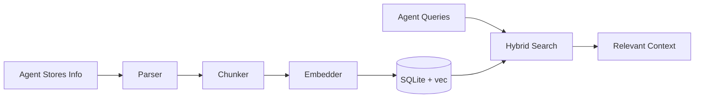

# Librarian

A personal knowledge library for AI agents, built on [Arcade](https://arcade.dev) for the Model Context Protocol (MCP).

## Overview

Librarian provides AI agents with persistent storage for text, documents, and knowledge. Agents can store information and retrieve it later through semantic and keyword search, maintaining context across conversations.



## Features

- Persistent knowledge storage for AI agents
- SQLite storage with `sqlite-vec` for vector search
- Full-text search using FTS5 with BM25 ranking
- Hybrid search combining semantic and keyword matching
- Max Marginal Relevance (MMR) for diverse results
- Configurable embedding models (local or OpenAI-compatible API)
- Header-aware text chunking with overlap
- Time-bounded search filters
- CLI and MCP server interfaces

## Installation

```bash
git clone https://github.com/ArcadeAI/librarian.git
cd librarian
./setup.sh
```

Or install manually:

```bash
uv pip install -e ".[dev]"
```

## CLI Usage

```bash
# Add files to the library
libr add ~/notes

# Search the library
libr search "machine learning concepts"

# List sources
libr list

# View library statistics
libr index

# Rebuild the index
libr index build
```

## MCP Server

Start the server for AI assistant integration:

```bash
# stdio transport (Claude Desktop, CLI)
libr serve stdio

# HTTP transport (Cursor, VS Code)
libr serve http --port 8000
```

See the [Arcade MCP documentation](https://docs.arcade.dev) for integration details.

### Available Tools

| Tool | Description |
|------|-------------|
| `Librarian_SearchLibrary` | Search the library with hybrid vector + keyword search |
| `Librarian_SemanticSearchLibrary` | Find content by meaning (semantic similarity) |
| `Librarian_KeywordSearchLibrary` | Find content by exact keywords |
| `Librarian_SearchLibraryByDates` | Search within a date range |
| `Librarian_AddToLibrary` | Store new content in the library |
| `Librarian_UpdateLibraryDoc` | Update existing content |
| `Librarian_ReadFromLibrary` | Read full document content |
| `Librarian_RemoveFromLibrary` | Remove content from the library |
| `Librarian_ListLibraryContents` | List all stored content |
| `Librarian_IndexDirectoryToLibrary` | Bulk import files |
| `Librarian_GetLibrarySources` | List sources with document/chunk counts |
| `Librarian_GetLibraryStats` | Overall library statistics |

## Configuration

Set via environment variables:

| Variable | Default | Description |
|----------|---------|-------------|
| `DOCUMENTS_PATH` | `./documents` | Root directory for files |
| `DATABASE_PATH` | `~/.librarian/index.db` | SQLite database location |
| `EMBEDDING_PROVIDER` | `openai` | `local` or `openai` |
| `EMBEDDING_MODEL` | `all-MiniLM-L6-v2` | Local model name |
| `OPENAI_API_BASE` | `http://localhost:7171/v1` | OpenAI-compatible API URL |
| `OPENAI_EMBEDDING_MODEL` | `qwen3-embedding-06b` | API model name |
| `CHUNK_SIZE` | `512` | Max characters per chunk |
| `CHUNK_OVERLAP` | `50` | Overlap between chunks |
| `SEARCH_LIMIT` | `10` | Default results limit |
| `MMR_LAMBDA` | `0.5` | MMR diversity (0=diverse, 1=relevant) |
| `HYBRID_ALPHA` | `0.7` | Vector vs keyword weight (1=vector only) |

## Project Structure

```
librarian/
├── cli.py           # Command-line interface
├── server.py        # MCP server and tool definitions
├── config.py        # Configuration management
├── indexing.py      # Document indexing service
├── types.py         # Shared type definitions
├── storage/
│   ├── database.py  # SQLite operations
│   ├── vector_store.py  # sqlite-vec search
│   └── fts_store.py     # FTS5 search
├── processing/
│   ├── embed/       # Embedding providers
│   ├── parsers/     # Document parsers
│   └── transform/   # Text chunking
├── retrieval/
│   └── search.py    # Hybrid search + MMR
└── utils/
    └── timeframe.py # Time filter utilities
```

## Development

```bash
make install    # Install dependencies
make test       # Run tests
make lint       # Run linter
make format     # Format code
make typecheck  # Type checking
make check      # All checks
make evals      # Run evaluations
```

## Resources

- [Arcade.dev](https://arcade.dev) - Build AI-native applications
- [Arcade Documentation](https://docs.arcade.dev) - Integration guides and API reference

## License

MIT License - see [LICENSE](LICENSE) for details.

## Contact

- Email: <contact@arcade.dev>
- Website: [arcade.dev](https://arcade.dev)

## Current Limitations & Roadmap

### Image Search Limitations

Images are currently indexed by **metadata only** (filename, format, dimensions, EXIF data). The system does not yet understand visual content.

**What works now**:
- Search by filename: `search("diagram.png")`
- Search by format: `search("PNG")`
- Filter results by asset type

**What doesn't work yet**:
- Visual content search: `search("architecture diagram")` won't understand what's IN the image
- Text within images: Can't find text that appears inside screenshots or diagrams
- Image-to-image similarity: Can't find visually similar images

### Multi-Modal Roadmap

| Phase | Feature | Status | Impact | Effort | ETA |
|-------|---------|--------|--------|--------|-----|
| **1** | **Documentation & Config** | **In Progress** | Set expectations | Low | v0.6.0 |
| | Document current limitations | Complete | Users understand metadata-only indexing | - | - |
| | Add configuration structure | Planned | Prepare for future embedding models | - | - |
| **2** | **OCR for Images** | **Planned** | Extract text FROM images | High | v0.6.0 |
| | Add pytesseract integration | Planned | Search text in screenshots | Low | 2-3 days |
| | Enable text extraction from diagrams | Planned | Find labels, annotations in images | - | - |
| | Search scanned documents | Planned | Index PDF images and photos | - | - |
| **3** | **CLIP Visual Embeddings** | Planned | True visual understanding | Very High | v0.7.0 |
| | Add CLIP model integration | Planned | Text-to-image semantic search | Medium | 5-7 days |
| | Create vision vector table | Planned | Separate 512-dim embeddings | - | - |
| | Implement search_images tool | Planned | Find images by visual content | - | - |
| **4** | **CodeBERT for Code** | Planned | Better code search | Medium | v0.8.0 |
| | Add CodeBERT embeddings | Planned | Improved semantic code search | Medium | 4-5 days |
| | Cross-language similarity | Planned | Find similar algorithms across languages | - | - |
| **5** | **Cross-Modal Search** | Planned | Unified search experience | High | v1.0.0 |
| | Merge results across modalities | Planned | Single query finds all asset types | High | 3-4 days |
| | Score normalization | Planned | Fair ranking across embedding spaces | - | - |

### Next Steps

**Immediate** (v0.6.0 - This Month):
1. Add OCR support with pytesseract
2. Enable text extraction from images
3. Document installation and configuration
4. Test with screenshots and diagrams

**Short-term** (v0.7.0 - Next Month):
1. Evaluate OCR adoption and usage patterns
2. Decide on CLIP investment based on image search demand
3. If validated: Implement CLIP visual embeddings
4. Add text-to-image semantic search

**Long-term** (v0.8.0+):
1. CodeBERT for improved code search (if needed)
2. Cross-modal unified search
3. Audio transcription (Whisper)
4. Video frame extraction

**Decision Points**:
- **After OCR**: Measure adoption before investing in CLIP
- **After CLIP**: Assess if CodeBERT adds value over text embeddings
- **After individual modalities**: Evaluate need for unified cross-modal search

### Installing Optional Features

```bash
# OCR support (v0.6.0+)
# Enabled by default - requires Tesseract
uv pip install -e ".[ocr]"
brew install tesseract  # macOS
# To disable: export ENABLE_OCR=false

# Vision support with CLIP (v0.7.0+)
uv pip install -e ".[vision]"
export ENABLE_VISION_EMBEDDINGS=true

# Code embeddings with CodeBERT (v0.8.0+)
uv pip install -e ".[code]"
export ENABLE_CODE_EMBEDDINGS=true

# All features
uv pip install -e ".[all]"
```

Vision and code embeddings are **opt-in** and disabled by default. OCR is **enabled by default** (v0.6.0+).
