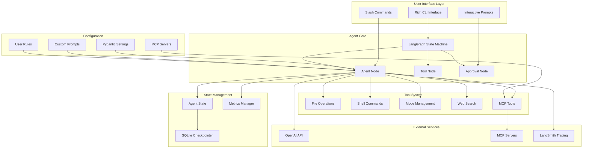

<div align="center">

# 🚀 Nexus

### **Elite Autonomous AI Coding Agent Powered by LangGraph & MCP**

<!-- Project Status -->
[](https://github.com/DataRohit/nexus)
[](https://github.com/DataRohit/Nexus/blob/master/license)
[](#)

<!-- Core Technologies -->
[](https://www.python.org/downloads/)
[](https://www.langchain.com/)
[](https://langchain-ai.github.io/langgraph/)
[](https://openai.com/)
[](https://modelcontextprotocol.io/)

<!-- Development Tools -->
[](https://rich.readthedocs.io/)
[](https://docs.pydantic.dev/)
[](https://github.com/astral-sh/ruff)
[](https://www.sqlalchemy.org/)

**An intelligent, autonomous CLI coding agent with multi-modal operational modes, persistent context management, and seamless MCP server integration for production workflows.**

[Features](#-key-features) • [Architecture](#-architecture) • [Installation](#-installation) • [Usage](#-usage) • [Documentation](#-documentation)

</div>

---

## 📋 Overview

**Nexus** is a cutting-edge autonomous AI coding agent built on top of LangChain and LangGraph, designed to revolutionize how developers interact with code. It combines the power of large language models with a sophisticated state machine architecture, enabling it to plan, execute, and iterate on complex coding tasks with minimal human intervention.

Unlike traditional AI assistants, Nexus features:
- **Multi-Modal Operations** - Switch between CODE, ARCHITECT, and ASK modes for different workflows
- **Persistent Context** - SQLite-based checkpoint system maintains conversation history across sessions
- **MCP Integration** - Dynamically loads and manages Model Context Protocol servers for extended capabilities
- **Human-in-the-Loop Safety** - Optional approval workflow for critical operations
- **Real-Time Metrics** - Track token usage, latency, and performance across conversations
- **Intelligent Tool Execution** - Validates and restricts tool usage based on operational mode

---

<div align="center">
  <h3>⚡ Project Showcase ⚡</h3>
  
  <br><br>
  <table>
    <tr>
      <td align="center"></td>
      <td align="center"></td>
    </tr>
    <tr>
      <td align="center"></td>
      <td align="center"></td>
    </tr>
     <tr>
      <td align="center"></td>
      <td align="center"></td>
    </tr>
  </table>
</div>

---

## ✨ Key Features

### 🧠 **Intelligent Agent System**
- **LangGraph State Machine** - Sophisticated workflow management with conditional edges
- **Dynamic Tool Loading** - Automatic discovery and integration of MCP server tools
- **Context-Aware Reasoning** - Maintains conversation history with intelligent truncation
- **Iterative Planning** - Multi-step task execution with configurable iteration limits
- **Mode-Based Restrictions** - Tool validation and filtering based on current operational mode

### 🎯 **Multi-Modal Operations**

#### **CODE Mode** *(Full Access)*
- Complete file system operations (read, write, list)
- Shell command execution with safety checks
- Unrestricted access to all tools and MCP servers
- Ideal for implementation, debugging, and system tasks

#### **ARCHITECT Mode** *(Planning-Focused)*
- File operations restricted to `.nexus/plans/` directory
- Enforces architectural planning separation
- Prevents accidental modification of implementation code
- Perfect for design documents, technical specs, and planning

#### **ASK Mode** *(Research & Conversation)*
- Read-only access to information
- No file modifications or shell execution
- MCP tools only for research and analysis
- Optimal for learning, documentation, and Q&A

### 🛠️ **Built-In Tools**

#### **File Operations**
- `read_file` - Read file contents with optional line range selection
- `write_file` - Create or overwrite files with automatic directory creation
- `list_directory` - List directory contents respecting `.gitignore` patterns

#### **Shell Integration**
- `execute_shell_command` - Safe shell command execution with output capture
- Dangerous pattern detection (prevents destructive operations)
- Configurable timeout and output truncation
- Automatic blocking of redirections and pipes

#### **Mode Management**
- `switch_mode` - Dynamic mode switching between CODE, ARCHITECT, ASK
- Automatic validation and approval workflows
- Context-aware mode suggestions

#### **Web Search**
- `web_search` - DuckDuckGo integration for real-time information
- Configurable result limits
- Formatted output with titles, URLs, and descriptions

### 🔌 **Model Context Protocol (MCP) Support**
- **Dynamic Server Loading** - Automatically discovers and connects to MCP servers
- **Multi-Server Management** - Supports multiple concurrent MCP connections
- **Tool Auto-Discovery** - Dynamically loads tools from connected servers
- **Context Injection** - Automatically adds MCP tool descriptions to agent prompts
- **Flexible Configuration** - JSON-based server configuration in `.nexus/mcp_config.json`

### 📊 **Performance & Monitoring**
- **Real-Time Metrics Tracking** - Request latency, TTFT (Time to First Token), token usage
- **SQLite Metrics Storage** - Persistent performance data across sessions
- **Session Summaries** - Aggregated statistics per thread
- **Detailed Breakdowns** - Input/output tokens, cached tokens, total usage
- **Rich Visualizations** - Beautiful terminal tables and panels via Rich library

### 🎨 **Premium CLI Experience**
- **Rich Terminal UI** - Beautiful, responsive interface with Rich library
- **Streaming Responses** - Real-time token streaming with live updates
- **Markdown Rendering** - Full markdown support in agent responses
- **Syntax Highlighting** - Code blocks with syntax highlighting
- **Interactive Prompts** - User-friendly approval workflows
- **Progress Indicators** - Spinners and status messages for long operations

### 🔒 **Safety & Validation**
- **Human-in-the-Loop** - Optional approval for all tool executions
- **Mode Validation** - Tools validated against current operational mode
- **Path Restrictions** - Enforced directory boundaries in ARCHITECT mode
- **Dangerous Pattern Detection** - Blocks potentially harmful shell commands
- **Gitignore Compliance** - Respects `.gitignore` patterns in file operations

### 💾 **Persistence & Configuration**
- **Checkpoint System** - SQLite-based conversation state persistence
- **Thread Management** - Multiple concurrent conversation threads
- **Custom Prompts** - Load custom system prompts from `.nexus/prompts/`
- **Rule Enforcement** - User-defined rules from `.nexus/rules/`
- **Environment-Based Config** - Pydantic settings with `.env` support

---

## 🏛️ Architecture



### **Agent Workflow**

1. **User Input** - Message entered via Rich CLI interface
2. **State Initialization** - Current state loaded from SQLite checkpoint
3. **Agent Reasoning** - LLM processes input with system prompt and context
4. **Tool Selection** - Agent decides which tools to use based on mode
5. **Approval (Optional)** - Human approval requested for tool execution
6. **Tool Execution** - Selected tools execute with validated parameters
7. **State Update** - New state persisted to checkpoint database
8. **Response Streaming** - Real-time token streaming back to user
9. **Metrics Logging** - Performance data saved to metrics database

---

## 🔧 Tech Stack

### **Core Framework**
| Technology | Version | Purpose |
|------------|---------|----------|
| Python | 3.14.2 | Programming Language |
| LangChain | 1.2.7 | LLM Framework |
| LangChain Core | 1.2.7 | Core Abstractions |
| LangChain Community | 0.4.1 | Community Components |
| LangChain OpenAI | 1.1.7 | OpenAI Integration |
| LangGraph | 1.0.7 | State Machine Framework |
| LangGraph Checkpoint | 4.0.0 | Checkpointing System |
| LangGraph Checkpoint SQLite | 3.0.3 | SQLite Checkpointer |
| LangGraph Prebuilt | 1.0.7 | Pre-built Nodes |

### **AI & ML**
| Technology | Version | Purpose |
|------------|---------|----------|
| OpenAI | 2.15.0 | LLM Provider |
| Tiktoken | 0.12.0 | Token Counting |
| LangSmith | 0.6.4 | Tracing & Debugging |

### **Data & Storage**
| Technology | Version | Purpose |
|------------|---------|----------|
| SQLAlchemy | 2.0.46 | ORM & Database Toolkit |
| aiosqlite | 0.22.1 | Async SQLite Driver |
| Pydantic | 2.12.5 | Data Validation |
| Pydantic Core | 2.41.5 | Core Validation Logic |
| Pydantic Settings | 2.12.0 | Settings Management |

### **CLI & UI**
| Technology | Version | Purpose |
|------------|---------|----------|
| Rich | 14.2.0 | Terminal UI Framework |
| Rich Click | 1.9.6 | Click Integration for Rich |
| Structlog | 25.5.0 | Structured Logging |

### **MCP & Tools**
| Technology | Version | Purpose |
|------------|---------|----------|
| MCP | 1.25.0 | Model Context Protocol |
| LangChain MCP Adapters | 0.2.1 | MCP-LangChain Bridge |
| DDGS | 9.10.0 | DuckDuckGo Search |
| Pathspec | 1.0.3 | Gitignore Pattern Matching |

### **Utilities**
| Technology | Version | Purpose |
|------------|---------|----------|
| HTTPX | 0.28.1 | HTTP Client |
| Requests | 2.32.5 | HTTP Requests |
| Python-dotenv | 1.2.1 | Environment Variables |
| PyYAML | 6.0.3 | YAML Parser |
| Tenacity | 9.1.2 | Retry Logic |
| Orjson | 3.11.5 | Fast JSON |

### **Development Tools**
| Technology | Version | Purpose |
|------------|---------|----------|
| Ruff | 0.14.14 | Linting & Formatting |
| isort | 7.0.0 | Import Sorting |
| Setuptools | 80.10.1+ | Package Building |
| Wheel | 0.46.3+ | Package Distribution |

---

## 📁 Project Structure

```
nexus/
├── .agent/                       # Agent configuration (legacy)│   
│   └── rules/                    # Coding standards
├── .github/                      # GitHub workflows
│   └── workflows/               # CI/CD pipelines
│       ├── ci.yml              # Continuous integration
│       ├── publish.yml         # PyPI publishing
│       └── release.yml         # Release automation
├── .nexus/                       # Nexus configuration directory
│   ├── db/                      # SQLite databases
│   │   ├── checkpoints.db      # Conversation checkpoints
│   │   └── metrics.db          # Performance metrics
│   ├── plans/                   # Architectural plans (ARCHITECT mode)
│   ├── prompts/                 # Custom system prompts
│   │   ├── system_prompt.md    # Main system prompt
│   │   ├── code_review_prompt.md
│   │   └── code_generation_prompt.md
│   ├── rules/                   # User-defined rules
│   │   └── python-code-documentation.md
│   └── mcp_config.json         # MCP server configuration
├── nexus/                        # Main package directory
│   ├── agent/                   # Agent core components
│   │   ├── approval.py         # Human approval workflow
│   │   ├── graph.py            # LangGraph state machine
│   │   ├── metrics.py          # Performance tracking
│   │   ├── modes.py            # Operational mode definitions
│   │   ├── nodes.py            # Graph node implementations
│   │   ├── restrictions.py     # Mode-based validation
│   │   ├── state.py            # Agent state definition
│   │   └── __init__.py
│   ├── commands/                # Slash command system
│   │   ├── base.py             # Command protocol
│   │   ├── core.py             # Core command implementations
│   │   ├── registry.py         # Command registry
│   │   └── __init__.py
│   ├── config/                  # Configuration management
│   │   ├── prompts.py          # Prompt loading & management
│   │   ├── settings.py         # Pydantic settings
│   │   └── __init__.py
│   ├── tools/                   # LangChain tool implementations
│   │   ├── file_ops.py         # File operation tools
│   │   ├── mcp.py              # MCP server management
│   │   ├── mode.py             # Mode switching tool
│   │   ├── shell.py            # Shell command tool
│   │   ├── web_search.py       # Web search tool
│   │   └── __init__.py
│   ├── ui/                      # User interface
│   │   ├── cli.py              # Rich-Click CLI
│   │   ├── console.py          # Rich console instance
│   │   └── __init__.py
│   ├── main.py                  # Application entry point
│   └── __init__.py
├── .editorconfig                # Editor configuration
├── .env.example                 # Example environment file
├── .gitattributes               # Git attributes
├── .gitignore                   # Git ignore patterns
├── .python-version              # Python version file
├── contributors.txt             # Project contributors
├── license                      # MIT License
├── pyproject.toml              # Project configuration & dependencies
└── readme.md                    # This file
```

---

## 🚀 Installation

### **Prerequisites**

- **Python 3.14.2+** - Latest Python release
- **Git** - Version control system
- **OpenAI API Key** - For LLM access
- **pip** or **uv** - Package manager

### **Quick Install**

```bash
# Clone the repository
git clone https://github.com/DataRohit/nexus.git
cd nexus

# Create virtual environment
python -m venv .venv

# Activate virtual environment
# On Windows (Git Bash)
source .venv/Scripts/activate

# On Windows (PowerShell)
.venv\Scripts\Activate.ps1

# On Linux/macOS
source .venv/bin/activate

# Install dependencies
pip install -e .

# Or with uv (faster)
uv pip install -e .
```

### **Configuration**

1. **Create Environment File**
```bash
cp .env.example .env
```

2. **Edit `.env` with your settings**
```bash
# OpenAI Configuration
OPENAI_API_KEY=sk-your-api-key-here
OPENAI_BASE_URL=https://api.openai.com/v1

# Model Settings
MODEL_NAME=gpt-4o
TEMPERATURE=0.7
MAX_TOKENS=4096

# LangSmith (Optional)
LANGSMITH_API_KEY=ls__your-api-key-here
LANGSMITH_PROJECT=nexus
LANGSMITH_TRACING=true

# Agent Settings
MAX_ITERATIONS=50
APPROVAL_REQUIRED=true

# Logging
LOG_LEVEL=INFO
DEBUG=false
```

3. **Configure MCP Servers (Optional)**

Create `.nexus/mcp_config.json`:
```json
{
  "mcpServers": {
    "context7": {
      "command": "npx",
      "args": ["-y", "@upstash/context7-mcp"]
    },
    "filesystem": {
      "command": "npx",
      "args": ["-y", "@modelcontextprotocol/server-filesystem", "/path/to/allowed/directory"]
    }
  }
}
```

### **Verify Installation**

```bash
# Check installation
nexus --version

# Run help
nexus --help

# Start interactive chat
nexus chat
```

---

## 💻 Usage

### **Basic Commands**

```bash
# Start interactive chat session
nexus chat

# Chat with specific thread ID
nexus chat --thread-id my-project

# Disable streaming (static responses)
nexus chat --no-stream

# Send single message
nexus chat "Explain async/await in Python"

# View conversation history
nexus history --thread-id default --limit 10

# Show configuration
nexus config
```

### **Interactive Chat**

```bash
$ nexus chat

╭──────────────────────────────────────────────────╮
│ NEXUS - AI Coding Agent                          │
│ Powered by LangChain & LangGraph                 │
╰──────────────────────────────────────────────────╯

╭───────────── Session ──────────────╮
│ Model      : gpt-4o                │
│ Mode       : CODE                  │
│ Thread     : default               │
│ Working Dir: /path/to/project      │
│ Streaming  : Enabled               │
╰────────────────────────────────────╯

> How do I create a FastAPI endpoint?

[Agent responds with streaming output...]

> exit
```

### **Slash Commands**

Available in interactive chat:

```bash
/help       # Show all available commands
/about      # Application information
/config     # Show current configuration
/mcps       # Display active MCP servers and tools
/mode       # Switch operational mode
/metrics    # Show session performance metrics
```

### **Mode Switching**

```bash
# Switch to ARCHITECT mode for planning
/mode architect

# Switch to CODE mode for implementation
/mode code

# Switch to ASK mode for conversation
/mode ask

# Check current mode
/mode
```

### **Example Workflows**

#### **Planning & Implementation**
```bash
# Start in ARCHITECT mode
/mode architect

> Create a design document for a REST API with authentication

[Agent creates planning documents in .nexus/plans/]

# Switch to CODE mode
/mode code

> Implement the authentication system we designed

[Agent creates implementation files]
```

#### **Code Review**
```bash
> Review this Python code for security issues:
> [paste code]

[Agent provides detailed code review]
```

#### **Web Research**
```bash
/mode ask

> What are the latest best practices for React Server Components?

[Agent searches web and provides summary]
```

---

## 📖 Documentation

### **Agent Modes**

#### **CODE Mode**
- **Purpose**: Full development and implementation
- **Permissions**: All tools enabled
- **Use Cases**: 
  - Writing and modifying code
  - Running shell commands
  - File system operations
  - Debugging and testing

#### **ARCHITECT Mode**
- **Purpose**: High-level planning and design
- **Permissions**: File writes restricted to `.nexus/plans/`
- **Use Cases**:
  - Creating design documents
  - Writing technical specifications
  - Planning system architecture
  - Documenting requirements

#### **ASK Mode**
- **Purpose**: Research and conversation
- **Permissions**: No file modifications or shell execution
- **Use Cases**:
  - Learning and Q&A
  - Code explanation
  - Best practice discussions
  - Web research via MCP tools

### **Configuration Files**

#### **`.env` - Environment Variables**
```bash
# Required
OPENAI_API_KEY=sk-...              # OpenAI API key

# Optional
OPENAI_BASE_URL=...                # Custom API endpoint
MODEL_NAME=gpt-4o                  # LLM model to use
TEMPERATURE=0.7                    # Response randomness (0-2)
MAX_TOKENS=4096                    # Max response length
MAX_ITERATIONS=50                  # Max agent iterations
APPROVAL_REQUIRED=true             # Require approval for tools
LOG_LEVEL=INFO                     # Logging verbosity
DEBUG=false                        # Debug mode
```

#### **`.nexus/mcp_config.json` - MCP Servers**
```json
{
  "mcpServers": {
    "server-name": {
      "command": "command-to-run",
      "args": ["arg1", "arg2"],
      "env": {
        "ENV_VAR": "value"
      }
    }
  }
}
```

#### **Custom Prompts**
Place markdown files in `.nexus/prompts/`:
- `system_prompt.md` - Main system instructions
- `code_review_prompt.md` - Code review guidelines
- `code_generation_prompt.md` - Code generation rules

#### **User Rules**
Place markdown files in `.nexus/rules/`:
- Rules are automatically loaded and enforced
- Example: `python-code-documentation.md`

### **Tool Documentation**

#### **File Operations**

```python
# Read file
read_file(path="example.py")
read_file(path="example.py", start_line=10, end_line=20)

# Write file
write_file(path="new_file.py", content="print('Hello')")
write_file(path="nested/file.py", content="...", create_dirs=True)

# List directory
list_directory(path="src")
list_directory(path=".", recursive=True)
list_directory(path=".", include_gitignored=True)
```

#### **Shell Commands**

```python
# Execute command
execute_shell_command(command="ls -la")
execute_shell_command(command="python script.py", timeout=60)

# Safety features
# - Blocks dangerous patterns (rm -rf /, etc.)
# - No support for redirections or pipes
# - Output truncation for large outputs
```

#### **Web Search**

```python
# Search web
web_search(query="Python async best practices")
web_search(query="FastAPI tutorial", max_results=10)
```

### **MCP Integration**

#### **Supported MCP Servers**

Nexus works with any MCP-compliant server:
- `@upstash/context7-mcp` - Documentation retrieval
- `@modelcontextprotocol/server-filesystem` - File system access
- `@modelcontextprotocol/server-postgres` - PostgreSQL integration
- `@modelcontextprotocol/server-brave-search` - Web search
- `@modelcontextprotocol/server-github` - GitHub integration
- Any custom MCP server

#### **Adding MCP Servers**

1. Install MCP server globally or locally
2. Add to `.nexus/mcp_config.json`
3. Restart Nexus
4. Tools automatically available

Example:
```json
{
  "mcpServers": {
    "github": {
      "command": "npx",
      "args": ["-y", "@modelcontextprotocol/server-github"],
      "env": {
        "GITHUB_TOKEN": "ghp_your_token_here"
      }
    }
  }
}
```

### **Performance Metrics**

Metrics are automatically tracked and stored in `.nexus/db/metrics.db`:

- **Request Latency** - Total time for request
- **Time to First Token (TTFT)** - Time until streaming starts
- **Token Usage** - Input, output, and cached tokens
- **Session Summaries** - Aggregated statistics per thread

View metrics:


```bash
/metrics
```

Sample output:
```
┌──────────────────────────────────────────┐
│         Session Metrics Summary          │
├──────────────────────┬───────────────────┤
│ Metric               │ Value             │
├──────────────────────┼───────────────────┤
│ Total Requests       │ 15                │
│ Total Latency        │ 45.32s            │
│ Avg Latency          │ 3.02s             │
│ Avg TTFT             │ 0.85s             │
├──────────────────────┼───────────────────┤
│ Total Input Tokens   │ 12,450            │
│ Total Output Tokens  │ 8,320             │
│ Total Tokens         │ 20,770            │
│ Total Cached Tokens  │ 3,200             │
└──────────────────────┴───────────────────┘
```

---

## 🛡️ Safety & Security

### **Built-in Safety Features**

1. **Human Approval** - Optional approval for all tool executions
2. **Dangerous Pattern Detection** - Blocks harmful shell commands
3. **Path Restrictions** - Enforces directory boundaries in ARCHITECT mode
4. **Gitignore Compliance** - Respects `.gitignore` in file operations
5. **Output Truncation** - Prevents context overflow from large outputs
6. **Mode Validation** - Tools validated against current operational mode

### **Dangerous Patterns Blocked**

```bash
rm -rf /                    # Recursive deletion from root
:(){ :|:& };:               # Fork bomb
mkfs                        # Filesystem creation
```

### **Approval Workflow**

When `APPROVAL_REQUIRED=true`:

```
Tool Execution Pending Approval

  Tool: write_file
  Action: Write content to file
  Parameters: path, content, ... (use 'd' to view details)

Approve? [y/n/d] (y):
```

Options:
- `y` - Approve and execute
- `n` - Deny and cancel
- `d` - View detailed parameters

### **Mode Restrictions**

| Tool | CODE | ARCHITECT | ASK |
|------|------|-----------|-----|
| read_file | ✅ | ✅ | ✅ |
| write_file | ✅ | ⚠️ (plans only) | ❌ |
| list_directory | ✅ | ✅ | ✅ |
| execute_shell_command | ✅ | ✅ | ❌ |
| web_search | ✅ | ✅ | ✅ |
| switch_mode | ✅ | ✅ | ✅ |
| MCP Tools | ✅ | ✅ | ✅ |

---

## 🔧 Advanced Configuration

### **Custom System Prompts**

Create `.nexus/prompts/system_prompt.md`:

```markdown
# Custom System Identity

You are a specialized Python expert...

## Core Capabilities
- Expert in async/await patterns
- Django and FastAPI specialist
...
```

### **Coding Standards**

Create `.nexus/rules/coding-standards.md`:

```markdown
# Coding Standards

## Python
- Use type hints everywhere
- Maximum line length: 120 characters
- Follow PEP 8 with Ruff
...
```

### **Environment Variables**

Full list of supported environment variables:

```bash
# OpenAI
OPENAI_API_KEY              # Required: OpenAI API key
OPENAI_BASE_URL             # Optional: Custom API endpoint

# Model
MODEL_NAME                  # Default: gpt-4o
TEMPERATURE                 # Default: 0.7 (range: 0-2)
MAX_TOKENS                  # Default: 4096

# LangSmith
LANGSMITH_API_KEY           # Optional: LangSmith API key
LANGSMITH_PROJECT           # Default: nexus
LANGSMITH_TRACING           # Default: true

# Agent
MAX_ITERATIONS              # Default: 50
APPROVAL_REQUIRED           # Default: true

# Logging
LOG_LEVEL                   # Default: INFO
DEBUG                       # Default: false
```

### **SQLite Databases**

Nexus uses two SQLite databases:

1. **`.nexus/db/checkpoints.db`**
   - Stores conversation checkpoints
   - Enables resuming conversations
   - Thread-based organization

2. **`.nexus/db/metrics.db`**
   - Performance metrics
   - Token usage tracking
   - Request latency data

---

## 📊 Performance Optimization

### **Token Management**

- **Context Truncation** - Messages automatically truncated to prevent overflow
- **Message History Limit** - Only last 15 messages sent to LLM
- **Output Limits** - Shell and file outputs capped to 2048 characters
- **Cached Tokens** - Automatic prompt caching for repeated contexts

### **Streaming Performance**

- **Time to First Token (TTFT)** - Optimized for quick initial response
- **Progressive Rendering** - Real-time token display with Rich
- **Live Updates** - 10 refreshes per second for smooth streaming

### **Database Optimization**

- **Async SQLite** - Non-blocking database operations
- **Connection Pooling** - Efficient connection management
- **Index Optimization** - Fast checkpoint and metrics queries

---

## 🐛 Troubleshooting

### **Common Issues**

#### **MCP Server Not Loading**

```bash
# Check if command exists
which npx  # or npm, uv, python

# Test MCP server manually
npx -y @upstash/context7-mcp

# Check logs
DEBUG=true nexus chat
```

#### **OpenAI API Errors**

```bash
# Verify API key
echo $OPENAI_API_KEY

# Test with different model
MODEL_NAME=gpt-3.5-turbo nexus chat

# Check base URL
OPENAI_BASE_URL=https://api.openai.com/v1 nexus chat
```

#### **Permission Issues**

```bash
# ARCHITECT mode file write failure
# Solution: Ensure path is in .nexus/plans/

# ASK mode tool restriction
# Solution: Switch to CODE mode (/mode code)
```

#### **Database Locked**

```bash
# Multiple instances running
# Solution: Close other Nexus instances

# Corrupted database
rm .nexus/db/checkpoints.db
# Restart Nexus (creates new database)
```

### **Debug Mode**

Enable detailed logging:

```bash
DEBUG=true LOG_LEVEL=DEBUG nexus chat
```

### **Reset Configuration**

```bash
# Delete all configuration
rm -rf .nexus/

# Restart to regenerate defaults
nexus chat
```

---

## 🧪 Development

### **Setup Development Environment**

```bash
# Clone repository
git clone https://github.com/DataRohit/nexus.git
cd nexus

# Install with dev dependencies
pip install -e ".[dev]"

# Or with uv
uv pip install -e ".[dev]"
```

### **Development Tools**

```bash
# Lint code
ruff check .

# Format code
ruff format .

# Fix auto-fixable issues
ruff check --fix .

# Sort imports
isort .
```

### **Code Quality Standards**

- **Linting**: Ruff with strict ruleset
- **Formatting**: Ruff formatter (120 char line length)
- **Type Hints**: Required for all functions
- **Docstrings**: Google-style docstrings mandatory
- **Import Sorting**: isort with profile "black"

### **Project Guidelines**

1. **Type Everything** - Use type hints everywhere
2. **Document Everything** - Docstrings for all public APIs
3. **No Bare Exceptions** - Always specify exception types
4. **Use Protocol** - For interfaces and abstract classes
5. **Async First** - Prefer async/await for I/O operations

---

## 🤝 Contributing

Contributions are welcome! Please follow these guidelines:

### **How to Contribute**

1. **Fork the Repository**
```bash
git fork https://github.com/DataRohit/nexus.git
```

2. **Create Feature Branch**
```bash
git checkout -b feature/amazing-feature
```

3. **Follow Code Standards**
- Run Ruff linting
- Add type hints
- Write docstrings
- Update documentation

4. **Commit Changes**
```bash
git commit -m "Add amazing feature"
```

5. **Push to Branch**
```bash
git push origin feature/amazing-feature
```

6. **Open Pull Request**
- Describe changes clearly
- Link related issues
- Add screenshots if UI changes

### **Development Workflow**

```bash
# 1. Setup development environment
pip install -e ".[dev]"

# 2. Make changes
# ... edit files ...

# 3. Run linting
ruff check .
ruff format .

# 4. Test changes
nexus chat

# 5. Commit
git add .
git commit -m "Description of changes"

# 6. Push and create PR
git push origin feature-branch
```

### **Code Review Process**

All contributions will be reviewed for:
- Code quality and style
- Type safety
- Documentation completeness
- Performance impact
- Security considerations

---

## 📝 License

This project is licensed under the **MIT License**.

```
The MIT License

Copyright 2026 Rohit Vilas Ingole <rohit.vilas.ingole@gmail.com>

Permission is hereby granted, free of charge, to any person obtaining a copy
of this software and associated documentation files (the "Software"), to deal
in the Software without restriction, including without limitation the rights
to use, copy, modify, merge, publish, distribute, sublicense, and/or sell
copies of the Software, and to permit persons to whom the Software is
furnished to do so, subject to the following conditions:

The above copyright notice and this permission notice shall be included in all
copies or substantial portions of the Software.

THE SOFTWARE IS PROVIDED "AS IS", WITHOUT WARRANTY OF ANY KIND, EXPRESS OR
IMPLIED, INCLUDING BUT NOT LIMITED TO THE WARRANTIES OF MERCHANTABILITY,
FITNESS FOR A PARTICULAR PURPOSE AND NONINFRINGEMENT. IN NO EVENT SHALL THE
AUTHORS OR COPYRIGHT HOLDERS BE LIABLE FOR ANY CLAIM, DAMAGES OR OTHER
LIABILITY, WHETHER IN AN ACTION OF CONTRACT, TORT OR OTHERWISE, ARISING FROM,
OUT OF OR IN CONNECTION WITH THE SOFTWARE OR THE USE OR OTHER DEALINGS IN THE
SOFTWARE.
```

See the [LICENSE](https://github.com/DataRohit/Nexus/blob/master/license) file for full details.

---

## 👤 Author

**Rohit Vilas Ingole**

- 📧 Email: [rohit.vilas.ingole@gmail.com](mailto:rohit.vilas.ingole@gmail.com)
- 🐙 GitHub: [@DataRohit](https://github.com/DataRohit)
- 💼 LinkedIn: [Rohit Ingole](https://www.linkedin.com/in/rohit-vilas-ingole)

---

## 🙏 Acknowledgments

This project leverages amazing open-source technologies:

- **[LangChain](https://www.langchain.com/)** - LLM application framework
- **[LangGraph](https://langchain-ai.github.io/langgraph/)** - State machine framework for agents
- **[OpenAI](https://openai.com/)** - GPT models and API
- **[Model Context Protocol](https://modelcontextprotocol.io/)** - Universal tool integration standard
- **[Rich](https://rich.readthedocs.io/)** - Beautiful terminal formatting
- **[Pydantic](https://docs.pydantic.dev/)** - Data validation and settings
- **[SQLAlchemy](https://www.sqlalchemy.org/)** - Database toolkit
- **[Ruff](https://github.com/astral-sh/ruff)** - Fast Python linter

---

<div align="center">

**⭐ If you find Nexus helpful, please consider giving it a star! ⭐**

**Built with ❤️ by [Rohit Vilas Ingole](https://github.com/DataRohit)**

**Powered by LangChain, LangGraph & MCP**

---

*Nexus: Where AI meets autonomous coding*

</div>
