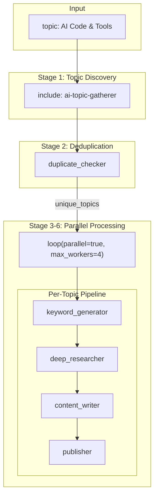

# AI Code WordPress Generator (Parallel)

> **Version**: 1.0.0  
> **Author**: praison  
> **License**: Apache-2.0

Research AI coding tools, programming methods, and code techniques for AI engineers — and publish multiple posts to WordPress **in parallel**.

## Architecture



## Quick Start

```bash
# Run the recipe
praisonai recipe run ai-code-wordpress-generator-parallel

# Dry run (no actual publishing)
praisonai recipe run ai-code-wordpress-generator-parallel --dry-run
```

## Customization

Override any variable when running:

```bash
# Custom topic
praisonai recipe run ai-code-wordpress-generator-parallel \
  --var topic="Python AI Libraries"

# Custom parallelism and WordPress settings
praisonai recipe run ai-code-wordpress-generator-parallel \
  --var max_workers=8 \
  --var wp_category="Tutorials" \
  --var wp_author="admin"
```

### Available Variables

| Variable | Default | Description |
|----------|---------|-------------|
| `topic` | `"AI Code & Tools {{today}}"` | Main search topic |
| `today` | `"January 2026"` | Current date |
| `max_workers` | `4` | Parallel workers |
| `wp_category` | `"News"` | WordPress category |
| `wp_author` | `"praison"` | WordPress author |
| `keyword_count` | `3` | Keywords per topic |
| `content_focus` | `"code-focused"` | Writing style |

## Use in Other Recipes

Include this recipe in your workflow:

```yaml
steps:
  # Custom variables override defaults
  - include:
      recipe: ai-code-wordpress-generator-parallel
      variables:
        topic: "Machine Learning Tools"
        max_workers: 6
        wp_category: "ML"
```

## Requirements

### Environment Variables

```bash
export OPENAI_API_KEY="your-key"
export TAVILY_API_KEY="your-key"
```

### Packages

```bash
pip install praisonai praisonai-tools praisonaiwp tavily-python
```

## How It Works

1. **Topic Gathering** (modular): Uses `ai-topic-gatherer` to find 5-10 AI coding topics
2. **Deduplication**: Checks each topic against existing WordPress posts
3. **Parallel Pipeline**: For each unique topic (up to `max_workers` in parallel):
   - Generates research keywords
   - Performs deep research with Tavily
   - Writes code-focused Gutenberg article
   - Publishes to WordPress

## Troubleshooting

### Empty Output
If no posts are published, check:
- All topics may already exist (duplicate detection)
- WordPress credentials may be invalid
- Tavily API rate limits

### Slow Execution
Increase `max_workers` for faster parallel processing:
```bash
praisonai recipe run ai-code-wordpress-generator-parallel --var max_workers=8
```

### Token Overflow
The recipe includes context management (`max_tool_output_tokens: 5000`) to prevent token overflow. If issues persist, reduce this value.
