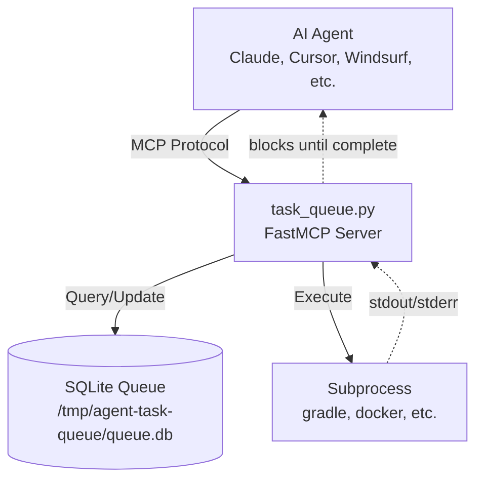
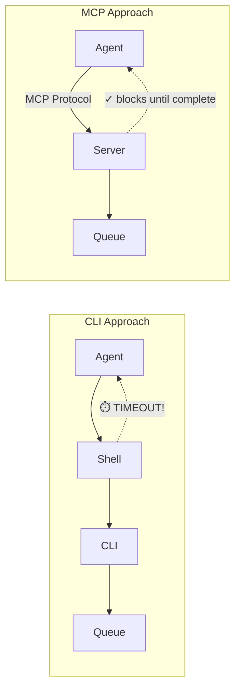

# Agent Task Queue

[](https://github.com/block/agent-task-queue/actions/workflows/ci.yml)
[](https://pypi.org/project/agent-task-queue/)
[](https://github.com/block/agent-task-queue/releases)

**Local task queuing for AI agents.** Prevents multiple agents from running expensive operations concurrently and thrashing your machine.

## The Problem

When multiple AI agents work on the same machine, they independently trigger expensive operations. Running these concurrently causes:

- 5-minute builds stretching to 30+ minutes
- Memory thrashing and disk I/O saturation
- Machine unresponsiveness
- Agents unable to coordinate with each other

## How It Works

**Default: Global queue** - All `run_task` calls share one queue.

```
# Agent A runs:
run_task("./gradlew test", working_directory="/project")

# Agent B runs (waits for A to finish, then executes):
run_task("./gradlew build", working_directory="/project")
```

**Custom queues** - Use `queue_name` to isolate workloads:

```
# These run in separate queues (can run in parallel):
run_task("./gradlew build", queue_name="android", ...)
run_task("npm run build", queue_name="web", ...)
```

Both agents block until their respective builds complete. The server handles sequencing automatically.

## Demo: Two Agents, One Build Queue

**Terminal A** - First agent requests an Android build:
```
> Build the Android app

⏺ agent-task-queue - run_task (MCP)
  command: "./gradlew assembleDebug"
  working_directory: "/path/to/android-project"

  ⎿  "SUCCESS exit=0 192.6s output=/tmp/agent-task-queue/output/task_1.log"

⏺ Build completed successfully in 192.6s.
```

**Terminal B** - Second agent requests the same build (started 2 seconds after A):
```
> Build the Android app

⏺ agent-task-queue - run_task (MCP)
  command: "./gradlew assembleDebug"
  working_directory: "/path/to/android-project"

  ⎿  "SUCCESS exit=0 32.6s output=/tmp/agent-task-queue/output/task_2.log"

⏺ Build completed successfully in 32.6s.
```

**What happened behind the scenes:**

| Time | Agent A | Agent B |
|------|---------|---------|
| 0:00 | Started build | |
| 0:02 | Building... | Entered queue, waiting |
| 3:12 | **Completed** (192.6s) | Started build |
| 3:45 | | **Completed** (32.6s) |

**Why this matters:**

Without the queue, both builds would run simultaneously—fighting for CPU, memory, and disk I/O. Each build might take 5+ minutes, and your machine would be unresponsive.

With the queue:
- **Agent B automatically waited** for Agent A to finish
- **Agent B's build was 6x faster** (32s vs 193s) because Gradle reused cached artifacts
- **Total time: 3:45** instead of 10+ minutes of thrashing
- **Your machine stayed responsive** throughout

## Key Features

- **FIFO Queuing**: Strict first-in-first-out ordering
- **No Queue Timeouts**: MCP keeps connection alive while waiting in queue. The `timeout_seconds` parameter only applies to execution time—tasks can wait in queue indefinitely without timing out. (see [Why MCP?](#why-mcp-instead-of-a-cli-tool))
- **Environment Variables**: Pass `env_vars="ANDROID_SERIAL=emulator-5560"`
- **Multiple Queues**: Isolate different workloads with `queue_name`
- **Zombie Protection**: Detects dead processes, kills orphans, clears stale locks
- **Auto-Kill**: Tasks running > 120 minutes are terminated

## Installation

```bash
uvx agent-task-queue@latest
```

That's it. [uvx](https://docs.astral.sh/uv/guides/tools/) runs the package directly from PyPI—no clone, no install, no virtual environment.

## Agent Configuration

Agent Task Queue works with any AI coding tool that supports MCP. Add this config to your MCP client:

```json
{
  "mcpServers": {
    "agent-task-queue": {
      "command": "uvx",
      "args": ["agent-task-queue@latest"]
    }
  }
}
```

### MCP Client Configuration

<details>
<summary>Amp</summary>

Install via CLI:

```bash
amp mcp add agent-task-queue -- uvx agent-task-queue@latest
```

Or add to `.amp/settings.json` (workspace) or global settings. See [Amp Manual](https://ampcode.com/manual) for details.

</details>

<details>
<summary>Claude Code</summary>

Install via CLI (<a href="https://docs.anthropic.com/en/docs/claude-code/mcp">guide</a>):

```bash
claude mcp add agent-task-queue -- uvx agent-task-queue@latest
```

</details>

<details>
<summary>Claude Desktop</summary>

Config file locations:
- **macOS**: `~/Library/Application Support/Claude/claude_desktop_config.json`
- **Linux**: `~/.config/Claude/claude_desktop_config.json`

Use the standard config above.

</details>

<details>
<summary>Cline</summary>

Open the MCP Servers panel > Configure > "Configure MCP Servers" to edit `cline_mcp_settings.json`. Use the standard config above.

See [Cline MCP docs](https://docs.cline.bot/mcp/configuring-mcp-servers) for details.

</details>

<details>
<summary>Copilot / VS Code</summary>

Requires VS Code 1.102+ with GitHub Copilot Chat extension.

Config file locations:
- **Workspace**: `.vscode/mcp.json`
- **Global**: Via Command Palette > "MCP: Open User Configuration"

```json
{
  "servers": {
    "agent-task-queue": {
      "type": "stdio",
      "command": "uvx",
      "args": ["agent-task-queue@latest"]
    }
  }
}
```

See [VS Code MCP docs](https://code.visualstudio.com/docs/copilot/chat/mcp-servers) for details.

</details>

<details>
<summary>Cursor</summary>

Go to `Cursor Settings` > `MCP` > `+ Add new global MCP server`. Use the standard config above.

Config file locations:
- **Global**: `~/.cursor/mcp.json`
- **Project**: `.cursor/mcp.json`

See [Cursor MCP docs](https://docs.cursor.com/context/model-context-protocol) for details.

</details>

<details>
<summary>Firebender</summary>

Add to `firebender.json` in project root, or use Plugin Settings > MCP section. Use the standard config above.

See [Firebender MCP docs](https://docs.firebender.com/context/mcp) for details.

</details>

<details>
<summary>Windsurf</summary>

Config file location: `~/.codeium/windsurf/mcp_config.json`

Or use Windsurf Settings > Cascade > Manage MCPs. Use the standard config above.

See [Windsurf MCP docs](https://docs.windsurf.com/windsurf/cascade/mcp) for details.

</details>

## Usage

Agents use the `run_task` MCP tool for expensive operations:

**Build Tools:** gradle, bazel, make, cmake, mvn, cargo build, go build, npm/yarn/pnpm build

**Container Operations:** docker build, docker-compose, podman, kubectl, helm

**Test Suites:** pytest, jest, mocha, rspec

> **Note:** Some agents automatically prefer MCP tools (Amp, Copilot, Windsurf). Others may need [configuration](#agent-configuration-notes) to prefer `run_task` over built-in shell commands.

### Tool Parameters

| Parameter | Required | Description |
|-----------|----------|-------------|
| `command` | Yes | Shell command to execute |
| `working_directory` | Yes | Absolute path to run from |
| `queue_name` | No | Queue identifier (default: "global") |
| `timeout_seconds` | No | Max **execution** time before kill (default: 1200). Queue wait time doesn't count. |
| `env_vars` | No | Environment variables: `"KEY=val,KEY2=val2"` |

### Example

```
run_task(
    command="./gradlew connectedAndroidTest",
    working_directory="/project",
    queue_name="android",
    env_vars="ANDROID_SERIAL=emulator-5560"
)
```

### Agent Configuration Notes

Some agents need additional configuration to use the queue instead of built-in shell commands.

| Agent | Extra Setup | Notes |
|-------|-------------|-------|
| Amp, Copilot, Windsurf | ❌ None | Works out of the box |
| **Claude Code, Cursor** | ✅ Required | Must remove Bash allowed rules |
| Cline, Firebender | ⚠️ Maybe | Check agent docs |

> [!IMPORTANT]
> **Claude Code users:** If you have allowed rules like `Bash(gradle:*)` or `Bash(./gradlew:*)`, the agent will use Bash directly and **bypass the queue entirely**. You must remove these rules for the queue to work.
>
> Check both `settings.json` and `settings.local.json` (project and global) for rules like:
> - `Bash(gradle:*)`, `Bash(./gradlew:*)`, `Bash(ANDROID_SERIAL=* ./gradlew:*)`
> - `Bash(docker build:*)`, `Bash(pytest:*)`, etc.
>
> See [Claude Code setup guide](examples/claude-code/SETUP.md) for the full fix.

#### Quick Agent Setup

After installing the MCP server, tell your agent:

```
"Configure agent-task-queue - use examples/<agent-name>/SETUP.md if available"
```

**Available setup guides:**
- [Claude Code setup](examples/claude-code/SETUP.md) - 3-step configuration
- [Other agents](examples/) - Contributions welcome!

## Configuration

The server supports the following command-line options:

| Option | Default | Description |
|--------|---------|-------------|
| `--data-dir` | `/tmp/agent-task-queue` | Directory for database and logs |
| `--max-log-size` | `5` | Max metrics log size in MB before rotation |
| `--max-output-files` | `50` | Number of task output files to retain |
| `--tail-lines` | `50` | Lines of output to include on failure |
| `--lock-timeout` | `120` | Minutes before stale locks are cleared |

Pass options via the `args` property in your MCP config:

```json
{
  "mcpServers": {
    "agent-task-queue": {
      "command": "uvx",
      "args": [
        "agent-task-queue@latest",
        "--max-output-files=100",
        "--lock-timeout=60"
      ]
    }
  }
}
```

Run `uvx agent-task-queue@latest --help` to see all options.

## Architecture



### Data Directory

All data is stored in `/tmp/agent-task-queue/` by default:
- `queue.db` - SQLite database for queue state
- `agent-task-queue-logs.json` - JSON metrics log (NDJSON format)

To use a different location, pass `--data-dir=/path/to/data` or set the `TASK_QUEUE_DATA_DIR` environment variable.

### Database Schema

The queue state is stored in SQLite at `/tmp/agent-task-queue/queue.db`:

| Column | Type | Description |
|--------|------|-------------|
| `id` | INTEGER | Auto-incrementing primary key |
| `queue_name` | TEXT | Queue identifier (e.g., "global", "android") |
| `status` | TEXT | Task state: "waiting" or "running" |
| `pid` | INTEGER | MCP server process ID (for liveness check) |
| `child_pid` | INTEGER | Subprocess ID (for orphan cleanup) |
| `created_at` | TIMESTAMP | When task was queued |
| `updated_at` | TIMESTAMP | Last status change |

### Zombie Protection

If an agent crashes while a task is running:
1. The next task detects the dead parent process (via PID check)
2. It kills any orphaned child process (the actual build)
3. It clears the stale lock
4. Execution continues normally

### Metrics Logging

All queue events are logged to `agent-task-queue-logs.json` in NDJSON format (one JSON object per line):

```json
{"event":"task_queued","timestamp":"2025-12-12T16:01:34","task_id":8,"queue_name":"global","pid":23819}
{"event":"task_started","timestamp":"2025-12-12T16:01:34","task_id":8,"queue_name":"global","wait_time_seconds":0.0}
{"event":"task_completed","timestamp":"2025-12-12T16:02:05","task_id":8,"queue_name":"global","command":"./gradlew build","exit_code":0,"duration_seconds":31.2,"stdout_lines":45,"stderr_lines":2}
```

**Events logged:**
- `task_queued` - Task entered the queue
- `task_started` - Task acquired lock and began execution
- `task_completed` - Task finished (includes exit code and duration)
- `task_timeout` - Task killed after timeout
- `task_error` - Task failed with exception
- `zombie_cleared` - Stale lock was cleaned up

The log file rotates when it exceeds 5MB (keeps one backup as `.json.1`).

### Task Output Logs

To reduce token usage, full command output is written to files instead of returned directly:

```
/tmp/agent-task-queue/output/
├── task_1.log
├── task_2.log
└── ...
```

**On success**, the tool returns a single line:
```
SUCCESS exit=0 31.2s output=/tmp/agent-task-queue/output/task_8.log
```

**On failure**, the last 50 lines of output are included:
```
FAILED exit=1 12.5s output=/tmp/agent-task-queue/output/task_9.log
[error output here]
```

**Automatic cleanup**: Old files are deleted when count exceeds 50 (configurable via `MAX_OUTPUT_FILES`).

**Manual cleanup**: Use the `clear_task_logs` tool to delete all output files.

## CLI Tool

The `tq` command lets you run commands through the queue and inspect queue status.

### Install CLI

```bash
uv tool install agent-task-queue
```

This installs both the MCP server and the `tq` CLI persistently.

### Running Commands

Run commands through the same queue that agents use:

```bash
tq ./gradlew assembleDebug          # Run a build through the queue
tq npm run build                    # Any command works
tq -q android ./gradlew test        # Use a specific queue
tq -t 600 npm test                  # Custom timeout (seconds)
tq -C /path/to/project make         # Set working directory
```

This prevents resource contention between you and AI agents - when you run a build via `tq`, any agent-initiated builds will wait in the same queue.

### Inspecting the Queue

```bash
tq list              # Show current queue
tq logs              # Show recent activity
tq logs -n 50        # Show last 50 entries
tq clear             # Clear stuck tasks
tq --data-dir PATH   # Use custom data directory
```

Respects `TASK_QUEUE_DATA_DIR` environment variable.

> **Note:** Without installing, you can run one-off commands with:
> ```bash
> uvx --from agent-task-queue tq list
> ```

## Troubleshooting

### Tasks stuck in queue

```bash
tq list    # Check queue status
tq clear   # Clear all tasks
```

### "Database is locked" errors

```bash
ps aux | grep task_queue                  # Check for zombie processes
rm -rf /tmp/agent-task-queue/             # Delete and restart
```

### Server not connecting

1. Ensure `uvx` is in your PATH (install [uv](https://github.com/astral-sh/uv) if needed)
2. Test manually: `uvx agent-task-queue@latest`

## Development

For contributors:

```bash
git clone https://github.com/block/agent-task-queue.git
cd agent-task-queue
uv sync                      # Install dependencies
uv run pytest -v             # Run tests
uv run python task_queue.py  # Run server locally
```

## Platform Support

- macOS
- Linux

## Why MCP Instead of a CLI Tool?

The first attempt at solving this problem was a file-based queue CLI that wrapped commands:

```bash
queue-cli ./gradlew build
```

**The fatal flaw:** AI tools have built-in shell timeouts (30s-120s). If a job waited in queue longer than the timeout, the agent gave up—even though the job would eventually run.



**Why MCP solves this:**
- The MCP server keeps the connection alive indefinitely
- The agent's tool call blocks until the task completes
- No timeout configuration needed—it "just works"
- The server manages the queue; the agent just waits

| Aspect | CLI Wrapper | Agent Task Queue |
|--------|-------------|----------------|
| Timeout handling | External workarounds | Solved by design |
| Queue storage | Filesystem | SQLite (WAL mode) |
| Integration | Wrap every command | Automatic tool selection |
| Agent compatibility | Varies by tool | Universal |

## License

Apache 2.0
