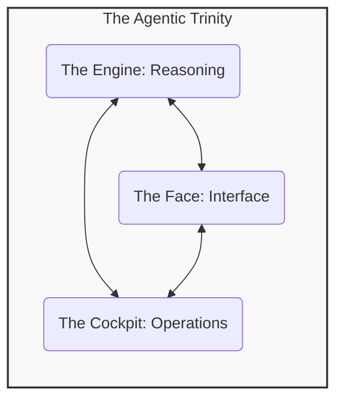
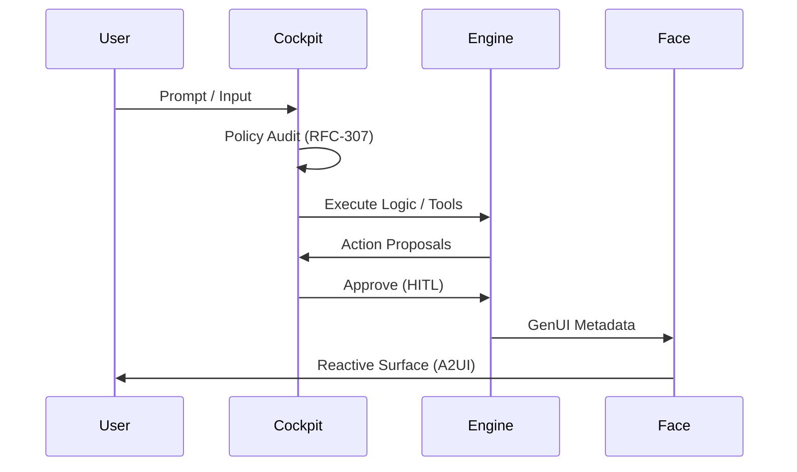

# 🕹️ AgentOps Cockpit

<div align="center">
  
</div>

<div align="center">
 <br />
 <a href="https://agent-cockpit.web.app" target="_blank"><strong>🌐 Official Website & Live Demo</strong></a>
 <br /><br />
 <a href="https://deploy.cloud.google.com?repo=https://github.com/enriquekalven/agent-cockpit">
   
 </a>
 <br />
 <br />
 
 
 
 
</div>

<br />

<div align="center">
 <h3>"Infrastructure gives you the pipes. We give you the Intelligence."</h3>
 <p>The developer distribution for building, optimizing, and securing AI agents on Google Cloud.</p>
</div>

---

## 📽️ The Mission
Most AI agent templates stop at a single Python file and an API key. **The AgentOps Cockpit** is for developers moving into production. It provides framework-agnostic governance, safety, and cost guardrails for the entire agentic ecosystem.

- **Governance-as-Code**: Audit your agent against [Google Well-Architected](/docs/google-architecture) best practices with the **Evidence Bridge**—real-time citations for architectural integrity.
- **SME Persona Audits**: Parallelized review of your codebase by automated "Principal SMEs" across FinOps, SecOps, and Architecture.
- **Agentic Trinity**: Dedicated layers for the Engine (Logic), Face (UX), and Cockpit (Ops).
- **A2A Connectivity**: Implements the [Agent-to-Agent Transmission Standard](/A2A_GUIDE.md) for secure swarm orchestration.
- **MCP Native**: Registration as a [Model Context Protocol](https://modelcontextprotocol.io) server for 1P/2P/3P tool consumption.

---

## 🏗️ The Agentic Trinity
We divide the complexity of production agents into three focused pillars:



- **⚙️ The Engine**: The reasoning core. Built with **ADK**, FastAPI, and Vertex AI.
- **🎭 The Face**: The user experience. Adaptive UI surfaces and **GenUI** standards via the A2UI spec.
- **🕹️ The Cockpit**: The operational brain. Cost control, semantic caching, shadow routing, and adversarial audits.

<div align="center">
 
</div>

---

## 🌐 Framework Agnostic Governance
The Cockpit isn't just for ADK. It provides **Best Practices as Code** across all major agentic frameworks:

<div align="center">
 
 
 
 
 
 
 
 
</div>

## 🛠️ Operational Flow



<br />

<div align="center">
 
 
 
 
 
 
 
</div>

Whether you are building a swarm in **CrewAI**, a Go-based high-perf engine, or a **Streamlit** dashboard, the Cockpit ensures your agent maps to the **Google Well-Architected Framework**.


---

## 🚀 Key Innovation: The "Intelligence" Layer

### 🛡️ Red Team Auditor (Self-Hacking)
Don't wait for your users to find prompt injections. Use the built-in Adversarial Evaluator to launch self-attacks against your agent, testing for PII leaks, instruction overrides, and safety filter bypasses.

### 🧠 Hive Mind (Semantic Caching)
**Reduce LLM costs by up to 40%.** The Hive Mind checks for semantically similar queries in 10ms, serving cached answers for common questions without calling the LLM.

### 🏛️ Arch Review & Framework Detection
Every agent in the cockpit is graded against a framework-aware checklist. The Cockpit intelligently detects your stack—**Google ADK**, **OpenAI Agentkit**, **Anthropic Claude**, **Microsoft AutoGen/Semantic Kernel**, **AWS Bedrock Agents**, or **CopilotKit**—and runs a tailored audit against corresponding production standards. Use `make arch-review` to verify your **Governance-as-Code**.

### 🕹️ MCP Connectivity Hub (Model Context Protocol)
Stop building one-off tool integrations. The Cockpit provides a unified hub for **MCP Servers**. Connect to Google Search, Slack, or your internal databases via the standardized Model Context Protocol for secure, audited tool execution. Start the server with `make mcp-serve`.

### 🗄️ Situational Database Audits
The Cockpit now performs platform-specific performance and security audits for:
- **AlloyDB**: Optimizes for the **Columnar Engine** (100x query speedup).
- **Pinecone**: Suggests **gRPC** and **Namespace Isolation** for high-perf RAG.
- **BigQuery**: Suggests **BQ Vector Search** for serverless, cost-effective grounding.
- **Cloud SQL**: Enforces **IAM-based authentication** via the official Python Connector.

### 🧗 Quality Hill Climbing (ADK Evaluation)
Following **Google ADK Evaluation** best practices, the Cockpit provides an iterative optimization loop. `make quality-baseline` runs your agent against a "Golden Dataset" using **LLM-as-a-Judge** scoring (Response Match & Tool Trajectory), climbing the quality curve until production-grade fidelity is reached.

### 🛑 Mandatory Governance Enforcement (NEW)
The Cockpit now acts as a mandatory gate for production.
- **Blocking CI/CD**: GitHub Actions now fail if **High Impact** cost issues or **Red Team** security vulnerabilities are detected.
- **Build-Time Audit**: The `Dockerfile` includes a mandatory `RUN` audit step. If your agent is not "Well-Architected," the container image will fail to build.

---

## ⌨️ Quick Start

The Cockpit is available as a first-class CLI on PyPI. 

```bash
# 1. Install the Cockpit globally
pip install agentops-cockpit

# 2. Run Global Audit (Produces unified report)
agent-ops report --mode quick        # ⚡ Quick Safe-Build
agent-ops report --mode deep         # 🚀 Full System Audit

# 3. Guardrail Policy Audit (RFC-307)
agent-ops policy-audit --text "How to make a bomb?"

# 4. Global Scaffolding
agent-ops-cockpit create <name> --ui a2ui
```

### 🔍 Agent Optimizer v2 (Situational Intelligence)
The Cockpit doesn't just look for generic waste. It now performs **Triple-State Analysis**:
- **Legacy Workarounds**: Suggests situational fixes for older SDK versions (e.g., manual prompt pruning).
- **Modernization Paths**: Highlights native performance gains (e.g., 90% cost reduction via Context Caching) available in latest SDKs.
- **Conflict Guard**: Real-time cross-package validation to prevent architectural deadlocks (e.g., CrewAI vs LangGraph state loops).

### ⚡ Quick-Safe Build (12x Faster Loops)
Development velocity shouldn't sacrifice safety. The new `--quick` mode in the auditor reduces check latency from **1.8s to 0.15s**, providing sub-second feedback while maintaining the integrity of the Conflict Guard and Architecture Review.

---

### 🧑‍💼 Principal SME Persona Approvals
The Cockpit now features a **Multi-Persona Governance Board**. Every audit result is framed through the lens of a Principal Engineer in that domain (Security, Legal, FinOps, UX), ensuring your agent is compliant with organizational standards.

### 📄 Export & Reporting
*   **HTML/PDF Export**: Every audit automatically generates `cockpit_report.html`, a premium, printable report ready for PDF export.
*   **Email Reports**: Send audit results directly to stakeholders via the CLI.

---

## 📊 Local Development
The Cockpit provides a unified "Mission Control" to evaluate your agents instantly.

```bash
make audit         # 🕹️ Run Master Audit (Persona Approved)
make audit-deep    # 🚀 Run Deep Audit (Full SME Verdicts)
make email-report  # 📧 Email the latest result to a stakeholder
make diagnose      # 🩺 Run environment health check
make optimizer-audit # 🔍 Run Optimizer on specific agent files
make reliability   # 🛡️ Run unit tests and regression suite
make dev           # Start the local Engine + Face stack
make arch-review   # 🏛️ Run the Google Well-Architected design review
make quality-baseline # 🧗 Run iterative 'Hill Climbing' quality audit
make red-team      # Execute a white-hat security audit
make deploy-prod   # 🚀 1-click deploy to Google Cloud
```

---

## 🧭 Roadmap
- [x] **One-Click GitHub Action**: Automated governance audits on every PR.
- [x] **Mandatory Build Gates**: Blocking CI/CD and Container audits for production safety.
- [x] **Multi-Agent Orchestrator**: Standardized A2A Swarm/Coordinator patterns.
- [ ] **Visual Mission Control**: Real-time cockpit observability dashboard.

[View full roadmap →](/ROADMAP.md)

---

## 🤝 Community
- **Star this repo** to help us build the future of AgentOps.
- **Join the Discussion** for patterns on Google Cloud.
- **Contribute**: Read our [Contributing Guide](/CONTRIBUTING.md).

---
*Reference: [Google Cloud Architecture Center - Agentic AI Overview](https://docs.cloud.google.com/architecture/agentic-ai-overview)*
