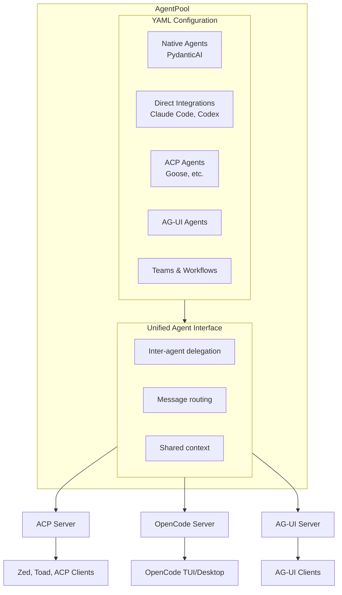

# AgentPool

[](https://pypi.org/project/agentpool/)
[](https://pypi.org/project/agentpool/)
[](https://pypi.org/project/agentpool/)
[](https://pypi.org/project/agentpool/)
[](https://github.com/phil65/agentpool/stars)

**A unified agent orchestration hub that lets you configure and manage heterogeneous AI agents via YAML and expose them through standardized protocols.**

[Documentation](https://phil65.github.io/agentpool/)

## The Problem

You want to use multiple AI agents together - Claude Code for refactoring, Codex for code editing with advanced reasoning, a custom analysis agent, maybe Goose for specific tasks. But each has different APIs, protocols, and integration patterns. Coordinating them means writing glue code for each combination.

## The Solution

AgentPool acts as a protocol bridge. Define all your agents in one YAML file - whether they're native (PydanticAI-based), direct integrations (Claude Code, Codex), external ACP agents (Goose), or AG-UI agents. Then expose them all through ACP or AG-UI protocols, letting them cooperate, delegate, and communicate through a unified interface. 



## Quick Start

```bash
uv tool install agentpool

```

### Minimal Configuration

```yaml
# agents.yml
agents:
  assistant:
    type: native
    model: openai:gpt-4o
    system_prompt: "You are a helpful assistant."
```

```bash
# Run via CLI
agentpool run assistant "Hello!"

# Or start as ACP server (for Zed, Toad, etc.)
agentpool serve-acp agents.yml
```

### Integrating External Agents

The real power comes from mixing agent types:

```yaml
agents:
  # Native PydanticAI-based agent
  coordinator:
    type: native
    model: openai:gpt-4o
    tools:
      - type: subagent  # Can delegate to all other agents
    system_prompt: "Coordinate tasks between available agents."

  # Claude Code agent (direct integration)
  claude:
    type: claude_code
    description: "Claude Code for complex refactoring"

  # Codex agent (direct integration)
  codex:
    type: codex
    model: gpt-5.1-codex-max
    reasoning_effort: medium
    description: "Codex for code editing with advanced reasoning"

  # ACP protocol agents
  goose:
    type: acp
    provider: goose
    description: "Goose for file operations"

  # AG-UI protocol agent
  agui_agent:
    type: agui
    url: "http://localhost:8000"
    description: "Custom AG-UI agent"
```

Now `coordinator` can delegate work to any of these agents, and all are accessible through the same interface.

## Key Features

### Multi-Agent Coordination

Agents can form teams (parallel) or chains (sequential):

```yaml
teams:
  review_pipeline:
    mode: sequential
    members: [analyzer, reviewer, formatter]

  parallel_coders:
    mode: parallel
    members: [claude, goose]
```

```python
async with AgentPool("agents.yml") as pool:
    # Parallel execution
    team = pool.get_agent("analyzer") & pool.get_agent("reviewer")
    results = await team.run("Review this code")

    # Sequential pipeline
    chain = analyzer | reviewer | formatter
    result = await chain.run("Process this")
```

### Rich YAML Configuration

Everything is configurable - models, tools, connections, triggers, storage:

```yaml
agents:
  analyzer:
    type: native
    model:
      type: fallback
      models: [openai:gpt-4o, anthropic:claude-sonnet-4-0]
    tools:
      - type: subagent
      - type: resource_access
    mcp_servers:
      - "uvx mcp-server-filesystem"
    knowledge:
      paths: ["docs/**/*.md"]
    connections:
      - type: node
        name: reporter
        filter_condition:
          type: word_match
          words: [error, warning]
```

### Server Protocols

AgentPool can expose your agents through multiple server protocols:

| Server | Command | Use Case |
|--------|---------|----------|
| **ACP** | `agentpool serve-acp` | IDE integration (Zed, Toad) - bidirectional communication with tool confirmations |
| **OpenCode** | `agentpool serve-opencode` | OpenCode TUI/Desktop - supports remote filesystems via fsspec |
| **MCP** | `agentpool serve-mcp` | Expose tools to other agents |
| AG-UI | `agentpool serve-agui` | AG-UI compatible frontends |
| OpenAI API | `agentpool serve-api` | Drop-in OpenAI API replacement |

The **ACP server** is ideal for IDE integration - it provides real-time tool confirmations and session management. The **OpenCode server** enables the OpenCode TUI to control AgentPool agents, including agents operating on remote environments (Docker, SSH, cloud sandboxes).

### Additional Capabilities

- **Structured Output**: Define response schemas inline or import Python types
- **Storage & Analytics**: Track all interactions with configurable providers
- **File Abstraction**: UPath-backed operations work on local and remote sources
- **Triggers**: React to file changes, webhooks, or custom events
- **Streaming TTS**: Voice output support for all agents

## Usage Patterns

### CLI

```bash
agentpool run agent_name "prompt"           # Single run
agentpool serve-acp config.yml              # ACP server for IDEs
agentpool serve-opencode config.yml         # OpenCode TUI server
agentpool serve-mcp config.yml              # MCP server
agentpool watch --config agents.yml         # React to triggers
agentpool history stats --group-by model    # View analytics
```

### Programmatic

```python
from agentpool import AgentPool

async with AgentPool("agents.yml") as pool:
    agent = pool.get_agent("assistant")

    # Simple run
    result = await agent.run("Hello")

    # Streaming
    async for event in agent.run_stream("Tell me a story"):
        print(event)

    # Multi-modal
    result = await agent.run("Describe this", Path("image.jpg"))
```

## Documentation

For complete documentation including advanced configuration, connection patterns, and API reference, visit [phil65.github.io/agentpool](https://phil65.github.io/agentpool/).
