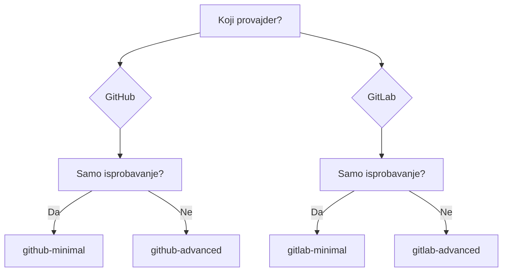

# Primjeri

Gotove konfiguracije za copy-paste.

---

## GitHub Actions

| Primjer | Opis | Složenost |
|---------|-------------|------------|
| [Minimalni](github-minimal.md) | Osnovna konfiguracija | :star: |
| [Napredni](github-advanced.md) | Filteri, konkurentnost, jezik | :star::star: |

## GitLab CI

| Primjer | Opis | Složenost |
|---------|-------------|------------|
| [Minimalni](gitlab-minimal.md) | Osnovna konfiguracija | :star: |
| [Napredni](gitlab-advanced.md) | Faze, PAT, self-hosted | :star::star: |

---

## Brzi izbor

---

## Šta izabrati?

### Minimalni

- :white_check_mark: Brzi početak
- :white_check_mark: Radi sa podrazumijevanim podešavanjima
- :white_check_mark: Minimalna konfiguracija

**Koristite za:** prvi pokretanje, testiranje.

### Napredni

- :white_check_mark: Konkurentnost (otkazivanje duplikata)
- :white_check_mark: Filtriranje fork PR-ova
- :white_check_mark: Prilagođeni jezik
- :white_check_mark: Zaštita timeout-om

**Koristite za:** produkciju.

---

## Savjet

1. Počnite sa **minimalnim** primjerom
2. Provjerite da funkcioniše
3. Dodajte potrebne opcije iz **naprednog** primjera
