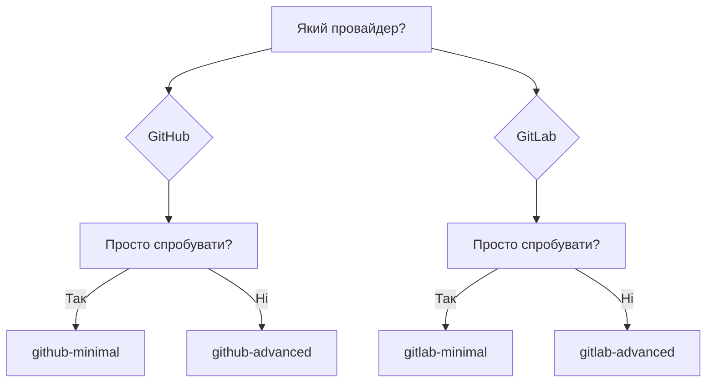

# Приклади

Готові конфігурації для копіювання.

---

## GitHub Actions

| Приклад | Опис | Складність |
|---------|------|------------|
| [Мінімальний](github-minimal.md) | Базова конфігурація | :star: |
| [Розширений](github-advanced.md) | Фільтри, concurrency, українська | :star::star: |

## GitLab CI

| Приклад | Опис | Складність |
|---------|------|------------|
| [Мінімальний](gitlab-minimal.md) | Базова конфігурація | :star: |
| [Розширений](gitlab-advanced.md) | Stages, PAT, self-hosted | :star::star: |

---

## Швидкий вибір

---

## Що вибрати?

### Мінімальний

- :white_check_mark: Швидкий старт
- :white_check_mark: Працює з дефолтами
- :white_check_mark: Мінімум конфігурації

**Використовуйте для:** перший запуск, тестування.

### Розширений

- :white_check_mark: Concurrency (скасування дублікатів)
- :white_check_mark: Фільтрація fork PRs
- :white_check_mark: Українська мова
- :white_check_mark: Timeout захист

**Використовуйте для:** production.

---

## Порада

1. Почніть з **мінімального** прикладу
2. Переконайтесь що працює
3. Додайте потрібні опції з **розширеного**
