# AI Code Review Agent — Unified Cognitive Architecture

**Версія:** 1.0
**Дата:** 2026-01-19
**Статус:** Базова архітектура для реалізації

## Загальна концепція

Система організована як ієрархічний граф дій з чіткими сутностями та потоками даних. Кожен крок може бути реалізований незалежно та розширений без порушення цілісності архітектури.

**Принципи:**
- Верхній рівень (1-10) — послідовні етапи процесу
- Вкладені рівні (1.1, 1.2) — деталізація конкретного етапу
- Кожна дія має: вхід → процес → вихід
- Сутності описані як OOP об'єкти з атрибутами та методами

---

## Загальна схема потоку

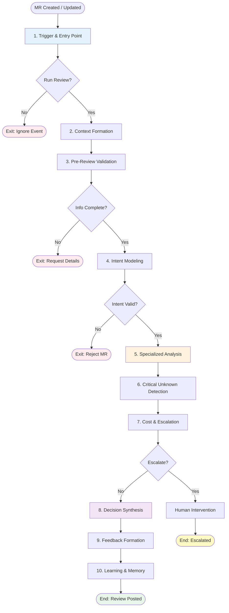

---

## 1. Trigger & Entry Point

**Мета:** Визначити, чи потрібно запускати цикл review та встановити параметри аналізу.

### Вхідні дані
- `Event`: подія, що активувала систему (webhook, API call)

### Процес

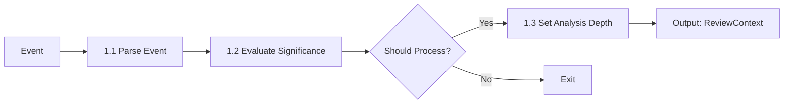

### 1.1. Парсинг події

**Дія:** Визначити тип події та екстрагувати метадані.

#### Вхід
- `Event` (raw webhook payload)

#### Вихід
- `ParsedEvent`

#### Сутність: ParsedEvent

```python
class ParsedEvent:
    """Розпарсена подія з MR системи"""

    # Атрибути
    event_type: EventType  # MR_CREATED | MR_UPDATED | COMMENT_ADDED | FORCE_PUSH
    mr_id: str
    author: str
    timestamp: datetime
    diff_size: int  # кількість змінених рядків
    files_changed: List[str]
    branch_name: str

    # Методи
    def is_substantial_change(self) -> bool:
        """Чи є зміна достатньо великою для ревʼю"""
        return self.diff_size > 10 or len(self.files_changed) > 0

    def get_affected_modules(self) -> Set[str]:
        """Визначити торкнуті модулі за шляхами файлів"""
        pass
```

---

### 1.2. Оцінка значущості події

**Дія:** Визначити, чи потребує подія запуску повного циклу review.

#### Вхід
- `ParsedEvent`

#### Вихід
- `should_process: bool`
- `skip_reason: Optional[str]`

#### Логіка рішення
```
IF event_type == COMMENT_ADDED AND comment.author == bot:
    RETURN (False, "Own comment")

IF event_type == MR_UPDATED AND diff_size == 0:
    RETURN (False, "No code changes")

IF event_type == FORCE_PUSH AND previous_review_exists:
    RETURN (True, None)  # Перевірити, чи не зламав попереднє рішення

RETURN (True, None)
```

---

### 1.3. Встановлення глибини аналізу

**Дія:** Визначити, наскільки глибоко система має аналізувати зміни.

#### Вхід
- `ParsedEvent`
- `ProjectSettings` (налаштування проєкту)

#### Вихід
- `AnalysisDepth`
- `UnknownPolicy`
- `CostBudget`

#### Сутність: AnalysisDepth

```python
class AnalysisDepth(Enum):
    """Глибина аналізу коду"""
    SHALLOW = "shallow"      # Тільки критичні проблеми
    NORMAL = "normal"        # Стандартний review
    DEEP = "deep"            # З історією та dependency graph
    EXHAUSTIVE = "exhaustive" # Повний аналіз + simulation

class AnalysisConfig:
    """Конфігурація циклу аналізу"""

    depth: AnalysisDepth
    unknown_policy: UnknownPolicy
    cost_budget: CostBudget
    enabled_agents: Set[AgentRole]  # Які агенти активні

    @classmethod
    def from_event(cls, event: ParsedEvent, settings: ProjectSettings):
        """Фабрика конфігурації на основі події"""
        if event.diff_size < 50:
            return cls(depth=AnalysisDepth.SHALLOW, ...)
        elif event.diff_size < 500:
            return cls(depth=AnalysisDepth.NORMAL, ...)
        else:
            return cls(depth=AnalysisDepth.DEEP, ...)
```

#### Сутність: UnknownPolicy

```python
class UnknownPolicy(Enum):
    """Політика обробки невизначеностей"""
    CONSERVATIVE = "conservative"  # Блокувати при будь-якій невизначеності
    BALANCED = "balanced"          # Ескалація середніх та високих ризиків
    PERMISSIVE = "permissive"      # Попереджати, але не блокувати
```

#### Сутність: CostBudget

```python
class CostBudget:
    """Бюджет вартості для розширеного аналізу"""

    max_api_calls: int
    max_tokens: int
    max_time_seconds: int
    allow_expensive_operations: bool  # git history, full graph traversal

    def can_afford(self, operation: Operation) -> bool:
        """Чи можна виконати операцію в межах бюджету"""
        pass
```

---

### Вихідні дані етапу 1
- `ReviewContext` (початковий контейнер для всього циклу)

#### Сутність: ReviewContext

```python
class ReviewContext:
    """Головний контейнер контексту для всього циклу review"""

    # Метадані
    review_id: str
    event: ParsedEvent
    config: AnalysisConfig
    created_at: datetime

    # Контекст (наповнюється поступово)
    context_package: Optional[ContextPackage] = None
    intent_model: Optional[IntentModel] = None
    change_profile: Optional[ChangeProfile] = None

    # Результати аналізу
    findings: List[Finding] = []
    critical_unknowns: List[CriticalUnknown] = []

    # Фінальне рішення
    decision: Optional[ReviewDecision] = None
    feedback: Optional[Feedback] = None

    # Методи
    def add_finding(self, finding: Finding):
        """Додати знахідку з валідацією"""
        pass

    def is_blocked(self) -> bool:
        """Чи заблокований MR через критичні проблеми"""
        pass
```

---

## 2. Context Formation

**Мета:** Зібрати достатній контекст для прийняття рішень про код.

### Вхідні дані
- `ReviewContext` (з етапу 1)

### Процес

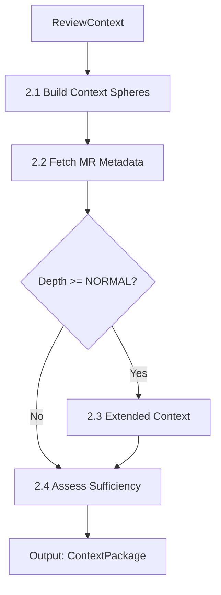

---

### 2.1. Побудова контекстних сфер

**Дія:** Організувати контекст у три концентричні сфери.

#### Концепція: Context Spheres

```
┌─────────────────────────────────────────┐
│  Historical & Business Sphere           │  ← Чому код такий
│  ┌───────────────────────────────────┐  │
│  │  Structural Sphere                │  │  ← Що залежить від коду
│  │  ┌─────────────────────────────┐  │  │
│  │  │  Local Sphere               │  │  │  ← Що змінилось
│  │  │  (Git Diff)                 │  │  │
│  │  └─────────────────────────────┘  │  │
│  └───────────────────────────────────┘  │
└─────────────────────────────────────────┘
```

#### Вхід
- `ReviewContext.event.files_changed`

#### Вихід
- `ContextSpheres`

#### Сутність: ContextSpheres

```python
class LocalSphere:
    """Локальна сфера: безпосередньо змінений код"""

    diff: GitDiff
    changed_functions: List[FunctionSignature]
    changed_classes: List[ClassDefinition]
    added_imports: Set[str]
    removed_imports: Set[str]

    def get_changed_symbols(self) -> Set[str]:
        """Отримати всі змінені символи (функції, класи, змінні)"""
        pass

class StructuralSphere:
    """Структурна сфера: що залежить від змін"""

    dependency_graph: DependencyGraph
    direct_dependents: Set[ModulePath]  # Хто імпортує змінений код
    transitive_dependents: Set[ModulePath]  # Хто залежить опосередковано
    test_coverage: CoverageReport

    def get_blast_radius(self) -> int:
        """Скільки модулів може бути торкнуто"""
        return len(self.direct_dependents) + len(self.transitive_dependents)

    def find_missing_tests(self, local: LocalSphere) -> List[str]:
        """Знайти нові символи без тестів"""
        pass

class HistoricalSphere:
    """Історична та бізнес сфера: чому код такий"""

    git_history: List[Commit]
    related_tickets: List[Ticket]
    previous_incidents: List[Incident]
    design_docs: List[Document]

    def get_change_frequency(self, file_path: str) -> int:
        """Як часто файл змінювався останні 6 місяців"""
        pass

    def find_hotspots(self) -> List[str]:
        """Файли з високою частотою змін (ймовірно складні)"""
        pass

class ContextSpheres:
    """Агрегатор всіх сфер контексту"""

    local: LocalSphere
    structural: Optional[StructuralSphere] = None
    historical: Optional[HistoricalSphere] = None

    def is_complete(self, required_depth: AnalysisDepth) -> bool:
        """Чи зібрано достатньо сфер для заданої глибини"""
        if required_depth == AnalysisDepth.SHALLOW:
            return self.local is not None
        elif required_depth == AnalysisDepth.NORMAL:
            return self.local and self.structural
        else:
            return all([self.local, self.structural, self.historical])
```

---

### 2.2. Збір метаданих MR

**Дія:** Отримати опис, тікети, коментарі.

#### Вхід
- `ReviewContext.event.mr_id`

#### Вихід
- `MRMetadata`

#### Сутність: MRMetadata

```python
class MRMetadata:
    """Метадані Merge Request"""

    mr_id: str
    title: str
    description: str
    author: str
    target_branch: str
    source_branch: str

    # Зв'язки
    linked_tickets: List[str]  # JIRA-123, LIN-456
    labels: Set[str]
    reviewers: List[str]

    # Стан
    draft: bool
    wip: bool  # Work in Progress
    has_conflicts: bool
    ci_status: CIStatus

    # Методи
    def has_ticket_link(self) -> bool:
        """Чи є посилання на задачу"""
        return len(self.linked_tickets) > 0

    def has_meaningful_description(self) -> bool:
        """Чи є адекватний опис (не порожній, не 'fix')"""
        return len(self.description.strip()) > 20

    def is_ready_for_review(self) -> bool:
        """Базові чеки готовності"""
        return not self.draft and not self.has_conflicts
```

---

### 2.3. Розширений контекст (умовно)

**Дія:** Зібрати додаткові дані для глибокого аналізу.

#### Умова
- `AnalysisConfig.depth >= AnalysisDepth.NORMAL`

#### Операції
1. Побудувати Structural Sphere (dependency graph)
2. Якщо `depth >= DEEP`: побудувати Historical Sphere

#### Обмеження
- Перевірка `CostBudget.can_afford()` перед кожною операцією

---

### 2.4. Оцінка достатності контексту

**Дія:** Визначити, чи можна перейти до аналізу.

#### Вхід
- `ContextSpheres`
- `MRMetadata`

#### Вихід
- `context_sufficient: bool`
- `missing_context: List[str]`

#### Логіка
```
IF spheres.is_complete(config.depth):
    IF metadata.has_ticket_link() OR config.depth == SHALLOW:
        RETURN (True, [])
    ELSE:
        RETURN (False, ["ticket link"])
ELSE:
    RETURN (False, ["dependency graph", "git history"])
```

---

### Вихідні дані етапу 2
- `ContextPackage` (додається до `ReviewContext`)

#### Сутність: ContextPackage

```python
class ContextPackage:
    """Повний пакет контексту для review"""

    spheres: ContextSpheres
    metadata: MRMetadata
    sufficient: bool
    missing_context: List[str]

    # Додаткові дані
    project_config: ProjectConfig  # Стандарти проєкту, ignored files
    team_knowledge: TeamKnowledge  # Хто експерт в якому модулі

    def get_context_for_file(self, file_path: str) -> FileContext:
        """Отримати весь релевантний контекст для конкретного файлу"""
        pass
```

---

## 3. Pre-Review Validation (PM Check)

**Мета:** Перевірити "Definition of Ready" перед витратою ресурсів на review.

### Вхідні дані
- `ReviewContext.context_package`

### Процес

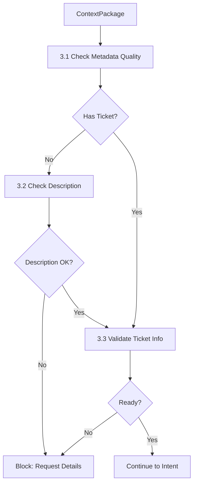

---

### 3.1. Перевірка якості метаданих

**Дія:** Оцінити повноту опису MR.

#### Сутність: ValidationRule

```python
class ValidationRule:
    """Абстрактне правило валідації"""

    name: str
    severity: Severity  # BLOCKER | WARNING | INFO

    def check(self, context: ContextPackage) -> ValidationResult:
        """Виконати перевірку"""
        raise NotImplementedError

class HasTicketLinkRule(ValidationRule):
    """Перевірка наявності посилання на задачу"""

    name = "ticket_link"
    severity = Severity.BLOCKER

    def check(self, context: ContextPackage) -> ValidationResult:
        if context.metadata.has_ticket_link():
            return ValidationResult(passed=True)
        return ValidationResult(
            passed=False,
            message="Відсутнє посилання на Jira/Linear задачу"
        )

class MeaningfulDescriptionRule(ValidationRule):
    """Перевірка адекватності опису"""

    name = "description_quality"
    severity = Severity.BLOCKER

    def check(self, context: ContextPackage) -> ValidationResult:
        if context.metadata.has_meaningful_description():
            return ValidationResult(passed=True)
        return ValidationResult(
            passed=False,
            message="Опис MR занадто короткий або неінформативний"
        )
```

---

### 3.2. Виконання валідації

**Дія:** Запустити всі PM rules.

#### Вхід
- `ContextPackage`
- `List[ValidationRule]` (з конфігурації проєкту)

#### Вихід
- `ValidationReport`

#### Сутність: ValidationReport

```python
class ValidationResult:
    """Результат одного правила"""
    passed: bool
    message: Optional[str]

class ValidationReport:
    """Звіт про валідацію готовності"""

    passed: bool
    blockers: List[ValidationResult]
    warnings: List[ValidationResult]

    def should_block(self) -> bool:
        """Чи є блокуючі проблеми"""
        return len(self.blockers) > 0

    def get_block_message(self) -> str:
        """Сформувати повідомлення для автора"""
        if not self.should_block():
            return ""

        messages = [r.message for r in self.blockers]
        return "Не вдалося розпочати review:\n" + "\n".join(f"- {m}" for m in messages)
```

---

### Вихідні дані етапу 3
- `ValidationReport` (додається до `ReviewContext`)
- **Side Effect:** Якщо `should_block() == True` → коментар у MR та вихід

---

## 4. Intent Modeling

**Мета:** Побудувати явну модель того, що хотів зробити автор.

### Вхідні дані
- `ReviewContext.context_package`

### Процес

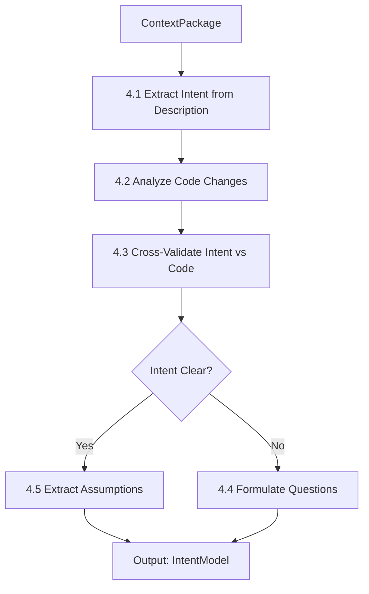

---

### 4.1. Екстракція наміру з опису

**Дія:** Парсинг тексту опису MR та задачі.

#### Вхід
- `MRMetadata.description`
- `Ticket` (з linked_tickets, якщо є)

#### Вихід
- `DeclaredIntent` (що каже автор)

#### Сутність: DeclaredIntent

```python
class DeclaredIntent:
    """Намір, заявлений автором у тексті"""

    what_changed: str  # Що змінилось
    why_changed: str   # Чому змінилось
    expected_behavior: str  # Очікувана поведінка після змін

    # Класифікація типу змін
    change_type: ChangeType  # FEATURE | BUGFIX | REFACTOR | HOTFIX

    # Scope
    affected_modules: Set[str]
    user_facing: bool

    @classmethod
    def extract_from_text(cls, description: str, ticket: Optional[Ticket]):
        """Екстракція структури з тексту"""
        # NLP / LLM parsing
        pass
```

---

### 4.2. Аналіз фактичних змін у коді

**Дія:** Класифікувати зміни на основі diff.

#### Вхід
- `ContextSpheres.local`

#### Вихід
- `ActualChanges`

#### Сутність: ActualChanges

```python
class ActualChanges:
    """Фактичні зміни в коді"""

    added_functions: List[FunctionSignature]
    removed_functions: List[FunctionSignature]
    modified_functions: List[FunctionSignature]

    added_classes: List[str]
    removed_classes: List[str]

    api_changes: List[APIChange]  # Змінені public API
    database_changes: List[MigrationChange]
    config_changes: List[ConfigChange]

    def get_breaking_changes(self) -> List[str]:
        """Знайти потенційно breaking changes"""
        breaking = []
        for change in self.api_changes:
            if change.is_breaking():
                breaking.append(change.description)
        return breaking

    def involves_data_migration(self) -> bool:
        """Чи є зміни в схемі БД"""
        return len(self.database_changes) > 0
```

---

### 4.3. Крос-валідація наміру та коду

**Дія:** Перевірити узгодженість заявленого наміру з реальними змінами.

#### Вхід
- `DeclaredIntent`
- `ActualChanges`

#### Вихід
- `IntentAlignment`

#### Сутність: IntentAlignment

```python
class IntentMismatch:
    """Невідповідність між заявленим наміром і кодом"""

    category: MismatchCategory  # MISSING_CHANGES | UNEXPECTED_CHANGES | SCOPE_DRIFT
    description: str
    severity: Severity

    # Для MISSING_CHANGES
    declared_but_not_in_code: Optional[str] = None

    # Для UNEXPECTED_CHANGES
    in_code_but_not_declared: Optional[str] = None

class IntentAlignment:
    """Оцінка узгодженості наміру та коду"""

    aligned: bool
    confidence: float  # 0.0 - 1.0
    mismatches: List[IntentMismatch]

    def is_valid(self) -> bool:
        """Чи можна продовжувати review з поточним розумінням наміру"""
        critical_mismatches = [m for m in self.mismatches if m.severity == Severity.BLOCKER]
        return len(critical_mismatches) == 0
```

#### Логіка крос-валідації

```
# Перевірка 1: Чи заявлений scope відповідає фактичному
IF declared_intent.affected_modules != actual_changes.touched_modules:
    ADD IntentMismatch(SCOPE_DRIFT)

# Перевірка 2: Чи всі заявлені зміни є в коді
IF declared_intent.mentions("add authentication") AND "auth" not in actual_changes:
    ADD IntentMismatch(MISSING_CHANGES)

# Перевірка 3: Чи немає незадекларованих значних змін
IF actual_changes.has_breaking_changes() AND not declared_intent.mentions("breaking"):
    ADD IntentMismatch(UNEXPECTED_CHANGES, severity=BLOCKER)
```

---

### 4.4. Формулювання питань (за потреби)

**Дія:** Якщо намір неясний, підготувати питання до автора.

#### Вхід
- `IntentAlignment` (де `aligned == False`)

#### Вихід
- `List[Question]`

#### Сутність: Question

```python
class Question:
    """Питання до автора MR"""

    text: str
    category: QuestionCategory  # CLARIFICATION | MISSING_INFO | INCONSISTENCY
    blocking: bool  # Чи потрібна відповідь для продовження review

    # Контекст для питання
    related_code: Optional[CodeSnippet] = None
    related_mismatch: Optional[IntentMismatch] = None
```

**Приклад:**
```
Question(
    text="У описі згадується додавання валідації email, але в коді я бачу зміни лише в auth_controller.py. Чи відбувається валідація в іншому місці?",
    category=QuestionCategory.MISSING_INFO,
    blocking=True
)
```

---

### 4.5. Екстракція припущень

**Дія:** Виявити неявні assumption'и, на яких базується Intent.

#### Вхід
- `DeclaredIntent`
- `ActualChanges`
- `ContextPackage.spheres.historical`

#### Вихід
- `List[Assumption]`

#### Сутність: Assumption

```python
class Assumption:
    """Неявне припущення, закладене в зміни"""

    description: str
    confidence: float  # Наскільки впевнені, що це припущення є
    risk_if_wrong: RiskLevel  # Що буде, якщо припущення хибне

    # Як можна перевірити
    verification_method: Optional[str] = None

    # Приклади
    examples: List[str] = []

# Приклад припущень
assumptions = [
    Assumption(
        description="Функція get_user() завжди повертає валідний обʼєкт User (ніколи None)",
        confidence=0.8,
        risk_if_wrong=RiskLevel.HIGH,
        verification_method="Перевірити тести на edge case, коли user не знайдений"
    ),
    Assumption(
        description="API endpoint /api/users викликається лише з фронтенду нашого додатку",
        confidence=0.6,
        risk_if_wrong=RiskLevel.MEDIUM,
        verification_method="Перевірити auth middleware та API документацію"
    )
]
```

---

### Вихідні дані етапу 4
- `IntentModel` (додається до `ReviewContext`)

#### Сутність: IntentModel

```python
class IntentModel:
    """Повна модель наміру змін"""

    declared: DeclaredIntent
    actual: ActualChanges
    alignment: IntentAlignment

    questions: List[Question]
    assumptions: List[Assumption]

    # Синтетичні поля
    change_profile: ChangeProfile  # Узагальнена характеристика

    def is_coherent(self) -> bool:
        """Чи є модель внутрішньо узгодженою"""
        return self.alignment.is_valid() and len([q for q in self.questions if q.blocking]) == 0

    def get_risk_score(self) -> float:
        """Оцінка ризику змін (0-1)"""
        score = 0.0

        # Фактор 1: Невідповідність наміру
        if not self.alignment.aligned:
            score += 0.3

        # Фактор 2: Високоризикові припущення
        high_risk_assumptions = [a for a in self.assumptions if a.risk_if_wrong == RiskLevel.HIGH]
        score += len(high_risk_assumptions) * 0.15

        # Фактор 3: Breaking changes
        if self.actual.get_breaking_changes():
            score += 0.25

        return min(score, 1.0)

class ChangeProfile:
    """Профіль змін для маршрутизації аналізу"""

    risk_level: RiskLevel  # LOW | MEDIUM | HIGH | CRITICAL
    scope: ChangeScope  # LOCAL | MODULE | SYSTEM | CROSS_SYSTEM
    novelty: NoveltyLevel  # ROUTINE | NEW_PATTERN | EXPERIMENTAL

    # Додаткові характеристики
    touches_critical_path: bool  # Чи торкається критичного шляху
    requires_data_migration: bool
    affects_public_api: bool
```

---

## 5. Specialized Analysis (Multi-Agent)

**Мета:** Паралельний аналіз коду різними "агентами" згідно їхніх ролей.

### Вхідні дані
- `ReviewContext` (з Intent Model)

### Процес

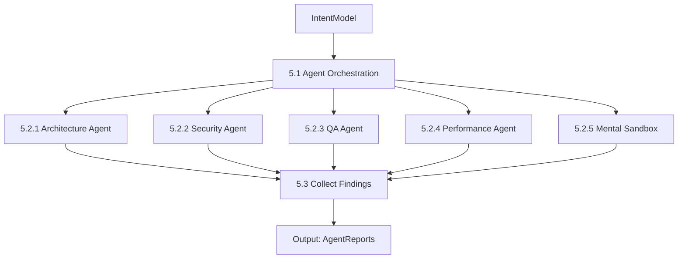

---

### 5.1. Orchestration: Вибір агентів

**Дія:** Визначити, які агенти повинні працювати на основі ChangeProfile.

#### Вхід
- `IntentModel.change_profile`
- `AnalysisConfig.enabled_agents`

#### Вихід
- `List[AgentRole]` (які агенти активовані)

#### Логіка вибору агентів

```python
class AgentOrchestrator:
    """Диспетчер агентів"""

    def select_agents(self, profile: ChangeProfile, config: AnalysisConfig) -> Set[AgentRole]:
        """Вибрати агентів для аналізу"""
        agents = {AgentRole.ARCHITECT}  # Завжди аналізуємо архітектуру

        if profile.affects_public_api:
            agents.add(AgentRole.QA)

        if profile.touches_critical_path or profile.risk_level >= RiskLevel.HIGH:
            agents.add(AgentRole.SECURITY)
            agents.add(AgentRole.MENTAL_SANDBOX)

        if profile.requires_data_migration:
            agents.add(AgentRole.DATA_INTEGRITY)

        # Фільтрація за конфігом
        return agents & config.enabled_agents
```

---

### 5.2. Виконання аналізу агентами

Кожен агент — це окремий модуль з визначеним інтерфейсом.

#### Базова сутність: ReviewAgent

```python
class ReviewAgent(ABC):
    """Абстрактний агент для review"""

    role: AgentRole
    focus: str  # Опис фокусу агента

    @abstractmethod
    def analyze(self, context: ReviewContext) -> AgentReport:
        """Виконати аналіз і повернути знахідки"""
        pass

    def should_run(self, profile: ChangeProfile) -> bool:
        """Чи потрібно запускати цього агента"""
        return True

class AgentReport:
    """Звіт агента"""

    agent: AgentRole
    findings: List[Finding]
    confidence: float  # Наскільки агент впевнений у своїх висновках
    execution_time: float

    def has_critical_issues(self) -> bool:
        return any(f.severity >= Severity.ERROR for f in self.findings)
```

#### Сутність: Finding

```python
class Finding:
    """Знахідка (problem або suggestion)"""

    id: str
    agent: AgentRole  # Хто знайшов
    severity: Severity  # INFO | WARNING | ERROR | CRITICAL
    category: FindingCategory  # BUG | SECURITY | STYLE | PERFORMANCE | ARCHITECTURE

    # Опис
    title: str
    description: str

    # Локація
    file_path: str
    line_start: int
    line_end: int
    code_snippet: str

    # Рекомендації
    suggestion: Optional[str] = None
    suggested_code: Optional[str] = None

    # Метадані
    confidence: float  # 0-1
    impact: ImpactLevel  # Наскільки критична проблема

    def to_comment(self) -> str:
        """Сформувати текст коментаря для MR"""
        pass
```

---

### 5.2.1. Architecture Agent

**Фокус:** Патерни проєктування, SOLID, технічний борг.

```python
class ArchitectureAgent(ReviewAgent):
    role = AgentRole.ARCHITECT
    focus = "Архітектурні патерни, SOLID, DRY, технічний борг"

    def analyze(self, context: ReviewContext) -> AgentReport:
        findings = []

        # Аналіз 1: SOLID порушення
        findings.extend(self._check_solid_principles(context))

        # Аналіз 2: Дублікація коду (DRY)
        findings.extend(self._check_code_duplication(context))

        # Аналіз 3: Патерни проєктування
        findings.extend(self._check_design_patterns(context))

        # Аналіз 4: Технічний борг
        findings.extend(self._assess_technical_debt(context))

        return AgentReport(agent=self.role, findings=findings, ...)

    def _check_solid_principles(self, context) -> List[Finding]:
        """Перевірити принципи SOLID"""
        findings = []

        # Single Responsibility
        for cls in context.intent_model.actual.added_classes:
            if cls.method_count > 10:
                findings.append(Finding(
                    severity=Severity.WARNING,
                    category=FindingCategory.ARCHITECTURE,
                    title=f"Клас {cls.name} має занадто багато відповідальностей",
                    description="Клас з 10+ методами зазвичай порушує SRP",
                    suggestion="Розбити клас на менші компоненти"
                ))

        return findings
```

---

### 5.2.2. Security Agent

**Фокус:** Вразливості, витік даних, небезпечні патерни.

```python
class SecurityAgent(ReviewAgent):
    role = AgentRole.SECURITY
    focus = "Безпека: SQL injection, XSS, витік credentials, OWASP Top 10"

    def analyze(self, context: ReviewContext) -> AgentReport:
        findings = []

        # Аналіз 1: SQL Injection
        findings.extend(self._check_sql_injection(context))

        # Аналіз 2: Витік credentials
        findings.extend(self._check_secrets(context))

        # Аналіз 3: XSS
        findings.extend(self._check_xss(context))

        # Аналіз 4: Аутентифікація та авторизація
        findings.extend(self._check_auth(context))

        return AgentReport(agent=self.role, findings=findings, ...)

    def _check_secrets(self, context) -> List[Finding]:
        """Пошук credentials у коді"""
        findings = []

        patterns = [
            r'password\s*=\s*["\'][^"\']+["\']',
            r'api[_-]?key\s*=\s*["\'][^"\']+["\']',
            r'secret\s*=\s*["\'][^"\']+["\']',
        ]

        for file_change in context.context_package.spheres.local.diff:
            for pattern in patterns:
                matches = re.findall(pattern, file_change.added_lines, re.IGNORECASE)
                if matches:
                    findings.append(Finding(
                        severity=Severity.CRITICAL,
                        category=FindingCategory.SECURITY,
                        title="Можливий витік credentials",
                        description=f"Знайдено hardcoded secret: {matches[0][:20]}...",
                        suggestion="Використовуй environment variables або secret manager"
                    ))

        return findings
```

---

### 5.2.3. QA Agent

**Фокус:** Покриття тестами, edge cases, регресії.

```python
class QAAgent(ReviewAgent):
    role = AgentRole.QA
    focus = "Тестування: покриття, edge cases, інтеграційні тести"

    def analyze(self, context: ReviewContext) -> AgentReport:
        findings = []

        # Аналіз 1: Покриття тестами
        findings.extend(self._check_test_coverage(context))

        # Аналіз 2: Edge cases
        findings.extend(self._identify_missing_edge_cases(context))

        # Аналіз 3: Ризик регресії
        findings.extend(self._assess_regression_risk(context))

        return AgentReport(agent=self.role, findings=findings, ...)

    def _check_test_coverage(self, context) -> List[Finding]:
        """Перевірити, чи є тести для нових функцій"""
        findings = []

        new_functions = context.intent_model.actual.added_functions
        test_coverage = context.context_package.spheres.structural.test_coverage

        for func in new_functions:
            if not test_coverage.is_tested(func.name):
                findings.append(Finding(
                    severity=Severity.WARNING,
                    category=FindingCategory.TESTING,
                    title=f"Відсутні тести для нової функції {func.name}",
                    description="Нові публічні функції повинні мати тести",
                    suggestion=f"Додай тест у test_{func.file_name}"
                ))

        return findings
```

---

### 5.2.4. Performance Agent (опціонально)

**Фокус:** Складність алгоритмів, N+1 queries, bottlenecks.

```python
class PerformanceAgent(ReviewAgent):
    role = AgentRole.PERFORMANCE
    focus = "Продуктивність: Big O, N+1 queries, memory leaks"

    def analyze(self, context: ReviewContext) -> AgentReport:
        findings = []

        # Аналіз 1: Складність алгоритмів
        findings.extend(self._analyze_complexity(context))

        # Аналіз 2: N+1 query problem
        findings.extend(self._check_n_plus_one(context))

        return AgentReport(agent=self.role, findings=findings, ...)
```

---

### 5.2.5. Mental Sandbox Agent

**Фокус:** Ментальна симуляція виконання коду.

**Концепція:** Агент "уявляє", як виконується код у різних сценаріях.

```python
class MentalSandboxAgent(ReviewAgent):
    role = AgentRole.MENTAL_SANDBOX
    focus = "Симуляція виконання: happy path, edge cases, failure scenarios"

    def analyze(self, context: ReviewContext) -> AgentReport:
        findings = []

        # Генерація сценаріїв
        scenarios = self._generate_scenarios(context)

        for scenario in scenarios:
            issues = self._simulate_execution(scenario, context)
            findings.extend(issues)

        return AgentReport(agent=self.role, findings=findings, ...)

    def _generate_scenarios(self, context) -> List[Scenario]:
        """Створити набір сценаріїв для симуляції"""
        scenarios = []

        # Happy path
        scenarios.append(Scenario(
            name="Happy Path",
            description="Типовий успішний випадок",
            input_conditions={"user": "valid", "data": "complete"}
        ))

        # Edge cases на основі Intent Assumptions
        for assumption in context.intent_model.assumptions:
            # Створити сценарій, де assumption порушується
            scenarios.append(Scenario(
                name=f"Violation of: {assumption.description[:50]}",
                description=f"Що станеться, якщо {assumption.description}",
                input_conditions={"assumption_violated": True}
            ))

        # Failure scenarios
        scenarios.append(Scenario(
            name="API Failure",
            description="Зовнішній API повертає 500",
            input_conditions={"api_status": 500}
        ))

        return scenarios

    def _simulate_execution(self, scenario: Scenario, context) -> List[Finding]:
        """Ментально симулювати виконання коду"""
        findings = []

        # Аналіз коду
        code_flow = self._trace_execution_path(context)

        for step in code_flow:
            # Чи може цей крок завалитись у сценарії?
            if self._can_fail_in_scenario(step, scenario):
                # Чи є обробка помилки?
                if not self._has_error_handling(step):
                    findings.append(Finding(
                        severity=Severity.ERROR,
                        category=FindingCategory.BUG,
                        title=f"Відсутня обробка помилки в сценарії '{scenario.name}'",
                        description=f"На кроці {step.description} може виникнути помилка, але обробки немає",
                        suggestion="Додай try-except блок або валідацію"
                    ))

        return findings
```

---

### 5.3. Збір і агрегація знахідок

**Дія:** Зібрати всі звіти агентів.

#### Вихід
- `List[AgentReport]`

---

### Вихідні дані етапу 5
- `List[AgentReport]` (додається до `ReviewContext.findings`)

---

## 6. Critical Unknown Detection

**Мета:** Виявити питання, на які система не може відповісти самостійно.

### Вхідні дані
- `ReviewContext` (з AgentReports)

### Процес

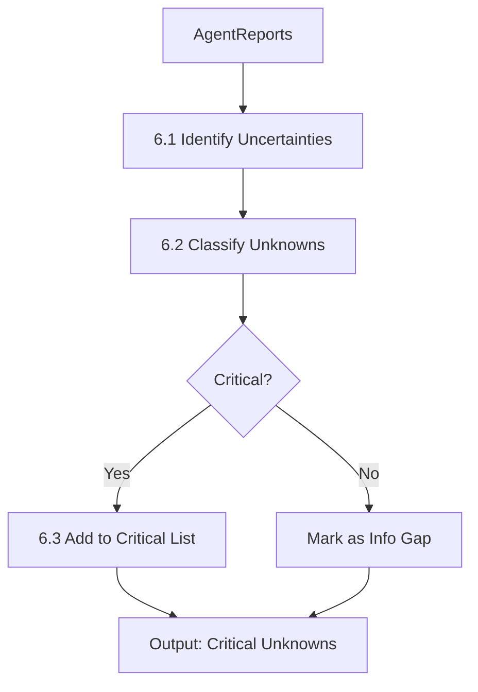

---

### 6.1. Ідентифікація невизначеностей

**Дія:** Знайти місця, де системі бракує інформації для висновку.

#### Джерела невизначеностей
1. **Intent Unknowns:** Припущення з низькою впевненістю
2. **Scope Unknowns:** Unclear blast radius
3. **Correctness Unknowns:** Неможливо довести правильність без тестів
4. **Historical Unknowns:** "Чому код був таким до цього?"
5. **Risk Acceptance Unknowns:** "Чи згодна команда з цим trade-off?"

---

### 6.2. Класифікація невизначеностей

#### Сутність: CriticalUnknown

```python
class UnknownCategory(Enum):
    INTENT = "intent"
    SCOPE = "scope"
    CORRECTNESS = "correctness"
    RISK_ACCEPTANCE = "risk_acceptance"
    HISTORICAL = "historical"
    OWNERSHIP = "ownership"

class CriticalUnknown:
    """Критична невизначеність"""

    category: UnknownCategory
    description: str
    impact: ImpactLevel  # Що буде, якщо не закрити

    # Метод закриття
    resolution_method: ResolutionMethod  # QUESTION | ESCALATION | ASSUMPTION
    cost_estimate: CostLevel  # CHEAP | MEDIUM | EXPENSIVE

    # Можливі відповіді (для питань)
    possible_answers: List[str] = []

    def to_question(self) -> Question:
        """Перетворити на питання до автора"""
        pass
```

---

### 6.3. Фільтрація за Unknown Policy

**Дія:** Вирішити, які unknowns блокують review.

#### Вхід
- `List[CriticalUnknown]`
- `UnknownPolicy` (з ReviewContext.config)

#### Вихід
- `blocking_unknowns: List[CriticalUnknown]`
- `info_gaps: List[CriticalUnknown]`

#### Логіка фільтрації

```python
def filter_unknowns(unknowns: List[CriticalUnknown], policy: UnknownPolicy):
    blocking = []
    info_gaps = []

    for unknown in unknowns:
        if policy == UnknownPolicy.CONSERVATIVE:
            # Блокуємо все, що не є LOW impact
            if unknown.impact >= ImpactLevel.MEDIUM:
                blocking.append(unknown)
            else:
                info_gaps.append(unknown)

        elif policy == UnknownPolicy.BALANCED:
            # Блокуємо HIGH і CRITICAL
            if unknown.impact >= ImpactLevel.HIGH:
                blocking.append(unknown)
            else:
                info_gaps.append(unknown)

        else:  # PERMISSIVE
            # Блокуємо лише CRITICAL
            if unknown.impact == ImpactLevel.CRITICAL:
                blocking.append(unknown)
            else:
                info_gaps.append(unknown)

    return blocking, info_gaps
```

---

### Вихідні дані етапу 6
- `blocking_unknowns: List[CriticalUnknown]`
- `info_gaps: List[CriticalUnknown]`

---

## 7. Cost & Escalation Model

**Мета:** Визначити, як поводитись з кожною Critical Unknown.

### Вхідні дані
- `blocking_unknowns` (з етапу 6)
- `CostBudget` (з ReviewContext.config)

### Процес

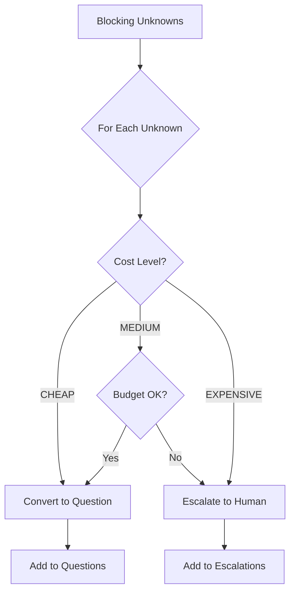

---

### 7.1. Оцінка вартості закриття unknown

**Дія:** Для кожної невизначеності визначити, скільки коштує її закрити.

#### Сутність: CostLevel

```python
class CostLevel(Enum):
    CHEAP = "cheap"        # < 1 хв, просте питання
    MEDIUM = "medium"      # 5-15 хв, потребує аналізу
    EXPENSIVE = "expensive" # > 30 хв, потребує дослідження

class ResolutionStrategy:
    """Стратегія закриття невизначеності"""

    unknown: CriticalUnknown
    cost: CostLevel
    method: ResolutionMethod

    # Для QUESTION
    question_text: Optional[str] = None

    # Для ESCALATION
    escalation_reason: Optional[str] = None
    suggested_reviewer: Optional[str] = None
```

---

### 7.2. Прийняття рішення про ескалацію

**Дія:** Вирішити, чи потрібна людина.

#### Логіка

```python
def decide_escalation(unknown: CriticalUnknown, budget: CostBudget) -> ResolutionStrategy:

    # CHEAP unknowns → завжди питання
    if unknown.cost_estimate == CostLevel.CHEAP:
        return ResolutionStrategy(
            unknown=unknown,
            cost=CostLevel.CHEAP,
            method=ResolutionMethod.QUESTION,
            question_text=unknown.to_question().text
        )

    # EXPENSIVE unknowns → завжди ескалація
    if unknown.cost_estimate == CostLevel.EXPENSIVE:
        return ResolutionStrategy(
            unknown=unknown,
            cost=CostLevel.EXPENSIVE,
            method=ResolutionMethod.ESCALATION,
            escalation_reason="Потребує експертного рішення"
        )

    # MEDIUM unknowns → залежить від бюджету
    if budget.can_afford_medium():
        return ResolutionStrategy(
            unknown=unknown,
            cost=CostLevel.MEDIUM,
            method=ResolutionMethod.QUESTION
        )
    else:
        return ResolutionStrategy(
            unknown=unknown,
            cost=CostLevel.MEDIUM,
            method=ResolutionMethod.ESCALATION,
            escalation_reason="Перевищено бюджет аналізу"
        )
```

---

### Вихідні дані етапу 7
- `List[ResolutionStrategy]`
- **Side Effect:** Якщо є ескалації → позначити MR для людини

---

## 8. Decision Synthesis (The Lead)

**Мета:** Об'єднати всі знахідки та прийняти фінальне рішення.

### Вхідні дані
- `ReviewContext` (з усіма AgentReports, Unknowns, тощо)

### Процес

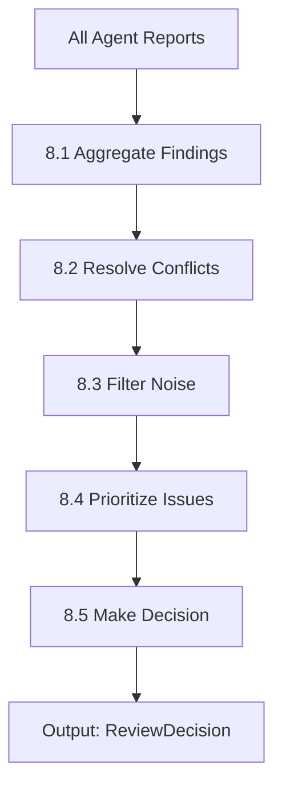

---

### 8.1. Агрегація знахідок

**Дія:** Зібрати всі findings з різних джерел.

#### Джерела
- AgentReports (з етапу 5)
- IntentModel.questions (з етапу 4)
- blocking_unknowns (з етапу 6)

#### Вихід
- `RawFindings` (неочищений список)

---

### 8.2. Розв'язання конфліктів

**Дія:** Знайти суперечливі рекомендації від різних агентів.

**Приклад конфлікту:**
- ArchitectAgent: "Розбий цей клас на 3 менших (SRP)"
- PerformanceAgent: "Не створюй додаткові класи, це уповільнить виконання"

#### Стратегія розв'язання
1. Пріоритет за severity (безпека > продуктивність)
2. Контекст проєкту (startup → продуктивність, enterprise → архітектура)
3. Явна нотатка в фідбеку про trade-off

---

### 8.3. Фільтрація шуму

**Дія:** Видалити неактуальні або низькоякісні findings.

#### Критерії фільтрації
- Дублікати (один issue від двох агентів)
- Стиль коду в legacy файлах (якщо не торкались)
- Low confidence findings (< 0.5) з категорії INFO
- Проблеми з вже існуючим кодом (не з diff)

#### Сутність: FilteredFindings

```python
class FilteredFindings:
    """Очищені знахідки"""

    critical: List[Finding]  # Блокуючі
    important: List[Finding]  # Варто виправити
    suggestions: List[Finding]  # Nice to have

    filtered_out: List[Finding]  # Що відфільтрували (для аудиту)
    filter_reasons: Dict[str, str]  # Чому відфільтрували
```

---

### 8.4. Пріоритезація issues

**Дія:** Відсортувати проблеми за важливістю.

#### Фактори пріоритизації
1. Severity (CRITICAL > ERROR > WARNING)
2. Impact (що буде в продакшені)
3. Ease of fix (складність виправлення)

---

### 8.5. Формування фінального рішення

**Дія:** Прийняти рішення: Approve | Request Changes | Reject.

#### Сутність: ReviewDecision

```python
class ReviewDecision(Enum):
    APPROVED = "approved"
    APPROVED_WITH_COMMENTS = "approved_with_comments"
    REQUEST_CHANGES = "request_changes"
    REJECTED = "rejected"

class ReviewVerdict:
    """Фінальний вердикт системи"""

    decision: ReviewDecision

    # Причини рішення
    blocking_issues_count: int
    critical_unknowns_count: int

    # Метрики
    overall_risk_score: float  # 0-1
    confidence: float  # Наскільки система впевнена

    # Рекомендації
    must_fix: List[Finding]  # Обов'язково виправити
    should_fix: List[Finding]  # Бажано виправити
    consider: List[Finding]  # Можна розглянути

    def get_decision_reasoning(self) -> str:
        """Пояснення рішення"""
        pass
```

#### Логіка рішення

```python
def make_decision(findings: FilteredFindings, unknowns: List[CriticalUnknown]) -> ReviewVerdict:

    # Блокуюча ситуація 1: Критичні issues
    if len(findings.critical) > 0:
        return ReviewVerdict(
            decision=ReviewDecision.REJECTED,
            must_fix=findings.critical
        )

    # Блокуюча ситуація 2: Непрояснені unknowns
    if len(unknowns) > 0:
        return ReviewVerdict(
            decision=ReviewDecision.REQUEST_CHANGES,
            blocking_issues_count=len(unknowns)
        )

    # Важливі проблеми, але не критичні
    if len(findings.important) > 0:
        return ReviewVerdict(
            decision=ReviewDecision.REQUEST_CHANGES,
            should_fix=findings.important
        )

    # Є лише suggestions
    if len(findings.suggestions) > 0:
        return ReviewVerdict(
            decision=ReviewDecision.APPROVED_WITH_COMMENTS,
            consider=findings.suggestions
        )

    # Все чисто
    return ReviewVerdict(
        decision=ReviewDecision.APPROVED
    )
```

---

### Вихідні дані етапу 8
- `ReviewVerdict` (додається до `ReviewContext.decision`)

---

## 9. Feedback Formation

**Мета:** Створити конструктивний, зрозумілий фідбек для автора.

### Вхідні дані
- `ReviewVerdict` (з етапу 8)
- `ReviewContext` (весь контекст)

### Процес

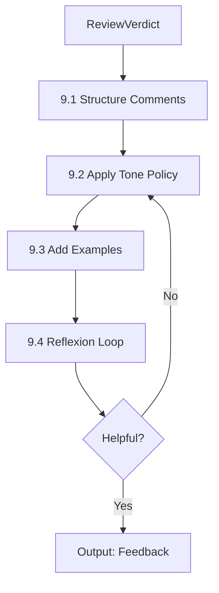

---

### 9.1. Структурування коментарів

**Дія:** Організувати findings у логічну структуру.

#### Структура фідбеку

```markdown
## 🎯 Загальна оцінка
[1-2 речення про загальний стан MR]

## 🚨 Критичні проблеми (Обов'язково виправити)
[Список must_fix з деталями]

## ⚠️ Важливі зауваження
[Список should_fix]

## 💡 Рекомендації
[Список consider]

## ❓ Питання до автора
[Questions та unknowns]

---
Оцінка ризику: [LOW/MEDIUM/HIGH]
Впевненість системи: [XX%]
```

---

### 9.2. Застосування політики тону

**Дія:** Адаптувати тон фідбеку під команду.

#### Сутність: TonePolicy

```python
class TonePolicy(Enum):
    DIRECT = "direct"          # Прямолінійно, без зайвих слів
    ENCOURAGING = "encouraging" # Підтримуюче, для джуніорів
    NEUTRAL = "neutral"         # Нейтральне, факти без емоцій

class FeedbackFormatter:
    """Форматувальник фідбеку"""

    tone: TonePolicy

    def format_finding(self, finding: Finding) -> str:
        """Сформувати коментар для finding"""

        if self.tone == TonePolicy.ENCOURAGING:
            return self._encouraging_format(finding)
        elif self.tone == TonePolicy.DIRECT:
            return self._direct_format(finding)
        else:
            return self._neutral_format(finding)

    def _encouraging_format(self, finding: Finding) -> str:
        """Підтримуючий формат"""
        templates = {
            Severity.ERROR: "Знайшов потенційну проблему: {description}. Рекомендую виправити, щоб уникнути помилок у продакшені. {suggestion}",
            Severity.WARNING: "Гарна робота! Одне зауваження: {description}. {suggestion}",
            Severity.INFO: "Цікаво реалізовано. Можливо, варто розглянути: {suggestion}"
        }
        return templates[finding.severity].format(
            description=finding.description,
            suggestion=finding.suggestion or ""
        )
```

---

### 9.3. Додавання прикладів коду

**Дія:** Для кожної проблеми додати suggested_code, якщо можливо.

**Приклад:**

```python
# ❌ Поточний код
def get_user(user_id):
    user = db.query(User).filter(User.id == user_id).first()
    return user.name  # Може впасти, якщо user == None

# ✅ Рекомендований варіант
def get_user(user_id):
    user = db.query(User).filter(User.id == user_id).first()
    if user is None:
        raise UserNotFoundError(f"User {user_id} not found")
    return user.name
```

---

### 9.4. Reflexion Loop (самоперевірка)

**Дія:** Система перечитує свій фідбек і оцінює його якість.

#### Питання для самоперевірки
- Чи зрозумілий коментар?
- Чи є конкретні приклади?
- Чи не занадто грубий тон?
- Чи не надто багато issues (overwhelm)?

#### Корекція
Якщо фідбек не проходить перевірку → переформулювати.

---

### Вихідні дані етапу 9
- `Feedback` (готовий до публікації)

#### Сутність: Feedback

```python
class Feedback:
    """Фінальний фідбек для автора"""

    summary: str  # Загальна оцінка

    critical_section: str
    important_section: str
    suggestions_section: str
    questions_section: str

    # Метадані
    tone_used: TonePolicy
    estimated_reading_time: int  # хвилини

    # Статистика
    total_comments: int
    critical_count: int

    def to_markdown(self) -> str:
        """Експорт у markdown для MR"""
        pass

    def to_inline_comments(self) -> List[InlineComment]:
        """Експорт у inline коментарі (прив'язані до рядків)"""
        pass
```

---

## 10. Learning & Memory Update

**Мета:** Зберегти корисні знання для майбутніх review.

### Вхідні дані
- `ReviewContext` (весь цикл)
- `Feedback` (що було відправлено)

### Процес

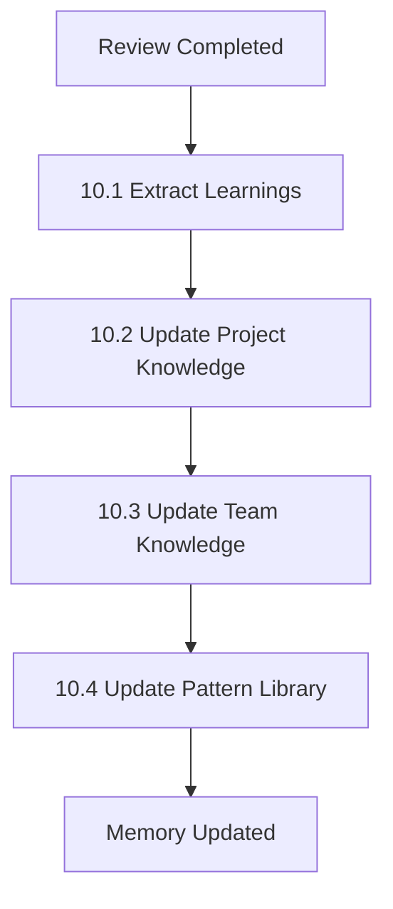

---

### 10.1. Екстракція знань

**Дія:** Визначити, що варто зберегти.

#### Типи знань
1. **Code Patterns:** Нові патерни проєктування (хороші та погані)
2. **Team Preferences:** Стиль команди (автор прийняв/відхилив suggestion)
3. **Module Knowledge:** Хто експерт у якому модулі
4. **Common Mistakes:** Типові помилки

---

### 10.2. Оновлення знань про проєкт

#### Сутність: ProjectKnowledge

```python
class ProjectKnowledge:
    """База знань про проєкт"""

    code_standards: Dict[str, str]  # Стандарти коду
    ignored_patterns: Set[str]  # Які патерни не вважаються проблемою
    critical_modules: Set[str]  # Модулі, що потребують особливої уваги
    hotspot_files: Dict[str, int]  # Файли з високою частотою змін

    def add_pattern(self, pattern: CodePattern):
        """Додати новий патерн"""
        pass

    def should_ignore_issue(self, finding: Finding) -> bool:
        """Чи потрібно ігнорувати цю проблему на основі історії"""
        pass
```

---

### 10.3. Оновлення знань про команду

#### Сутність: TeamKnowledge

```python
class TeamKnowledge:
    """База знань про команду"""

    expert_map: Dict[str, Set[str]]  # {author: {module1, module2}}
    review_history: List[ReviewContext]

    def get_expert_for_module(self, module: str) -> Optional[str]:
        """Знайти експерта для конкретного модуля"""
        pass

    def get_author_patterns(self, author: str) -> AuthorProfile:
        """Отримати типові патерни автора"""
        pass

class AuthorProfile:
    """Профіль автора"""

    common_mistakes: List[FindingCategory]
    preferred_style: Dict[str, str]
    expertise_areas: Set[str]
```

---

### 10.4. Оновлення бібліотеки патернів

**Дія:** Додати нові good/bad patterns.

#### Сутність: PatternLibrary

```python
class CodePattern:
    """Патерн коду (хороший або поганий)"""

    pattern_type: PatternType  # GOOD | BAD | NEUTRAL
    name: str
    description: str
    code_example: str

    # Контекст
    seen_in_files: List[str]
    frequency: int

    # Для bad patterns
    recommended_alternative: Optional[str] = None

class PatternLibrary:
    """Бібліотека патернів"""

    good_patterns: List[CodePattern]
    bad_patterns: List[CodePattern]

    def find_matching_pattern(self, code_snippet: str) -> Optional[CodePattern]:
        """Знайти схожий патерн у бібліотеці"""
        pass
```

---

### Вихідні дані етапу 10
- Оновлені: ProjectKnowledge, TeamKnowledge, PatternLibrary
- **Side Effect:** Збереження в БД/файл

---

## Додаткові сутності та утиліти

### Dependency Graph

```python
class DependencyGraph:
    """Граф залежностей модулів"""

    nodes: Set[ModulePath]
    edges: Set[Tuple[ModulePath, ModulePath]]  # (from, to)

    def get_dependents(self, module: ModulePath) -> Set[ModulePath]:
        """Хто залежить від цього модуля"""
        pass

    def get_dependencies(self, module: ModulePath) -> Set[ModulePath]:
        """Від кого залежить цей модуль"""
        pass

    def get_blast_radius(self, module: ModulePath, depth: int = 2) -> Set[ModulePath]:
        """Всі модулі, на які може вплинути зміна"""
        pass
```

---

### Orchestrator Classes

```python
class O1_TriggerOrchestrator:
    """Оркестратор вхідної точки"""

    def handle_event(self, event: Event) -> Optional[ReviewContext]:
        """Обробити подію та вирішити, чи запускати review"""
        pass

class O2_ContextOrchestrator:
    """Оркестратор контексту"""

    def build_context(self, review_ctx: ReviewContext) -> ContextPackage:
        """Побудувати контекстний пакет"""
        pass

class O3_ReviewOrchestrator:
    """Оркестратор review"""

    def orchestrate_agents(self, context: ReviewContext) -> List[AgentReport]:
        """Запустити агентів паралельно/послідовно"""
        pass

class O4_DecisionOrchestrator:
    """Оркестратор рішень"""

    def synthesize_decision(self, context: ReviewContext) -> ReviewVerdict:
        """Синтезувати фінальне рішення"""
        pass

class O5_LearningOrchestrator:
    """Оркестратор навчання"""

    def update_memory(self, context: ReviewContext):
        """Оновити базу знань"""
        pass
```

---

## Повний workflow (High-Level)

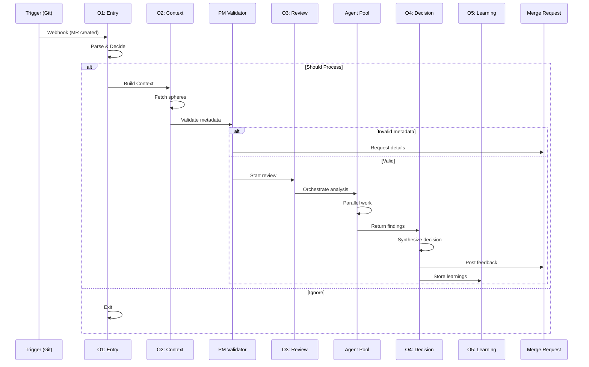

---

## Наступні кроки розвитку

1. **Metrics & Monitoring:**
   - Трекінг точності review (згода людини з рішенням бота)
   - Час роботи кожного агента
   - Частота ескалацій

2. **Adaptive Depth:**
   - Динамічна зміна глибини аналізу на основі риску
   - Навчання на історії: які файли часто мають баги

3. **Multi-Turn Dialogue:**
   - Можливість уточнювальних питань
   - Діалог з автором для закриття unknowns

4. **Integration Points:**
   - Jira/Linear API для отримання тікетів
   - CI/CD інтеграція (тести, покриття)
   - Slack notifications для ескалацій

---

**Кінець документа**
