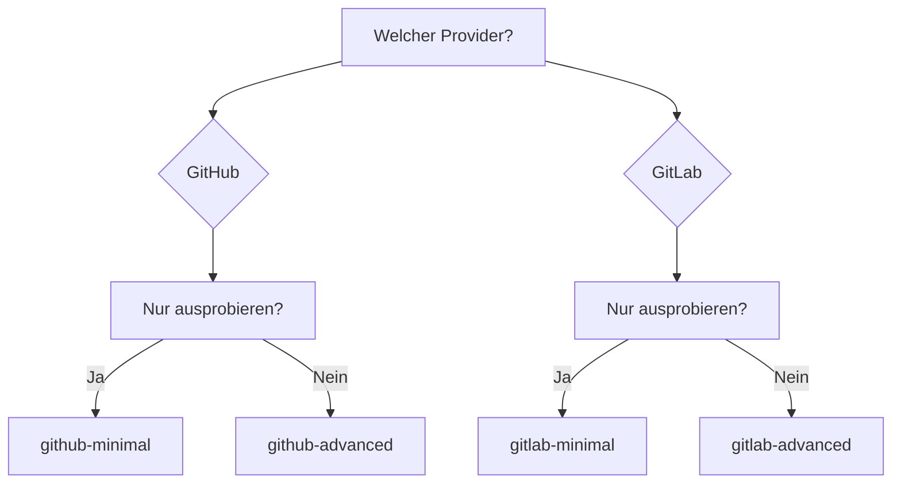

# Beispiele

Fertige Konfigurationen zum Kopieren und Einfügen.

---

## GitHub Actions

| Beispiel | Beschreibung | Komplexität |
|----------|--------------|-------------|
| [Minimal](github-minimal.md) | Grundkonfiguration | :star: |
| [Erweitert](github-advanced.md) | Filter, Concurrency, Sprache | :star::star: |

## GitLab CI

| Beispiel | Beschreibung | Komplexität |
|----------|--------------|-------------|
| [Minimal](gitlab-minimal.md) | Grundkonfiguration | :star: |
| [Erweitert](gitlab-advanced.md) | Stages, PAT, Self-hosted | :star::star: |

---

## Schnellauswahl

---

## Was wählen?

### Minimal

- :white_check_mark: Schnellstart
- :white_check_mark: Funktioniert mit Standardwerten
- :white_check_mark: Minimale Konfiguration

**Verwenden für:** erste Ausführung, Testen.

### Erweitert

- :white_check_mark: Concurrency (Duplikate abbrechen)
- :white_check_mark: Fork-PR-Filterung
- :white_check_mark: Benutzerdefinierte Sprache
- :white_check_mark: Timeout-Schutz

**Verwenden für:** Produktion.

---

## Tipp

1. Starten Sie mit dem **minimalen** Beispiel
2. Stellen Sie sicher, dass es funktioniert
3. Fügen Sie benötigte Optionen aus dem **erweiterten** Beispiel hinzu
