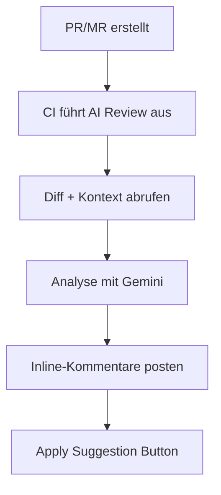

# AI ReviewBot

**KI-gestützter Assistent für automatisierte Code-Reviews in Ihrer CI/CD-Pipeline.**

---

## Was ist das?

AI Code Reviewer ist ein Tool, das automatisch Ihre Pull Requests (GitHub) und Merge Requests (GitLab) analysiert, Probleme findet und Korrekturen mit einem **"Apply Suggestion"**-Button vorschlägt.
Im Wesentlichen erhalten Sie die unvoreingenommene Perspektive eines Senior-Entwicklers auf Ihren Code zusammen mit Verbesserungsvorschlägen.

Die Integration mit einer Vielzahl bestehender LLM-Anbieter ist möglich (standardmäßig **Google Gemini**, Modell **gemini-2.5-flash** — zum Zeitpunkt der aktuellen Version sind die kostenlosen Limits für Anfragen pro Minute und pro Tag ausreichend für einen normalen Workflow eines Teams von 4-8 Vollzeit-Entwicklern).


---

## Was bekommen Sie?


- :white_check_mark: **Code-Kommentare** — Gesamtbewertung des Codes und Empfehlungen
- :white_check_mark: **Aufgabenausrichtung** — PR/MR-Ausrichtung mit Aufgabenkontext
- :white_check_mark: **Inline-Kommentare** — Kommentare direkt an Code-Zeilen
- :white_check_mark: **Apply Suggestion** — Ein-Klick-Button zum Anwenden von Korrekturen
- :white_check_mark: **Mentoring-Erklärungen** — warum es wichtig ist + Ressourcen-Links
- :white_check_mark: **Sprachadaptivität** — erkennt Sprache aus PR/MR-Kontext
- :white_check_mark: **Metriken** — Ausführungszeit, Tokens
- :white_check_mark: **Resilienz** — Retry-Logik für 429/5xx-Fehler

---

## Schnellstart

Wichtig: Um die folgenden Schritte durchzuführen, benötigen Sie Ihren persönlichen Google API-Schlüssel. Sie können ihn kostenlos entweder bei [Google AI Studio](https://aistudio.google.com/api-keys) oder [Google Cloud Console](https://console.cloud.google.com/) erhalten.

*AI Code Reviewer kann für die Verwendung verschiedener LLM-Anbieter und Modelle konfiguriert werden, sowohl kostenlos als auch kostenpflichtig. Die folgenden Beispiele verwenden das* **gemini-2.5-flash** *Modell. Andere Dokumentationsabschnitte erklären, wie Sie andere Anbieter verbinden und andere Modelle verwenden können. Wir sind an Ihrer Meinung zu den Unterschieden zwischen verschiedenen Modellen interessiert — wir würden gerne in den Kommentaren über Ihre Erfahrungen lesen.*


### GitHub


Erstellen Sie in Ihrem Repository:
- unter `Settings` → `Secrets and variables [Security]` → `Actions` → klicken Sie auf `New repository secret`:
    - erstellen Sie ein Secret namens `GOOGLE_API_KEY` mit Ihrem Google API-Schlüssel als Wert.
- im Stammverzeichnis Ihres Projekt-Repositorys:
    - erstellen Sie die Datei `.github/workflows/ai-review.yml` mit folgendem Inhalt:

```yaml
# .github/workflows/ai-review.yml
name: AI Code Review
on:
  pull_request:
    types: [opened, synchronize]

jobs:
  review:
    runs-on: ubuntu-latest
    permissions:
      contents: read
      pull-requests: write
    steps:
      - uses: KonstZiv/ai-code-reviewer@v1
        with:
          google_api_key: ${{ secrets.GOOGLE_API_KEY }}
```

### GitLab

Erstellen Sie in Ihrem Repository:

1. **Project Access Token erstellen:** `Settings` → `Access Tokens` → `Add new token`:
    - **Token name**: `ai-reviewer`
    - **Role**: `Developer`
    - **Scopes**: `api` ✓
    - Klicken Sie auf **Create project access token** und kopieren Sie den Token

2. **CI/CD-Variablen hinzufügen:** `Settings` → `CI/CD` → `Variables`:
    - `GOOGLE_API_KEY`: Ihr Google API-Schlüssel (Masked ✓)
    - `GITLAB_TOKEN`: Token aus Schritt 1 (Masked ✓)

3. **CI-Datei erstellen:** im Stammverzeichnis Ihres Projekt-Repositorys:
    - erstellen Sie die Datei `.gitlab-ci.yml` mit folgendem Inhalt:

```yaml
# .gitlab-ci.yml
ai-review:
  image: ghcr.io/konstziv/ai-code-reviewer:1
  script:
    - ai-review
  rules:
    - if: $CI_PIPELINE_SOURCE == "merge_request_event"
  variables:
    GOOGLE_API_KEY: $GOOGLE_API_KEY
    GITLAB_TOKEN: $GITLAB_TOKEN
```

:point_right: [Mehr erfahren →](quick-start.md)


Erstellen Sie einen neuen PR/MR — erhalten Sie ein Review.

**Die Review-Qualität hängt direkt vom Verständnis des AI Code Reviewers für Ihre Absichten ab** (genau wie bei einem echten menschlichen Reviewer). Daher ist es eine gute Idee, den Entwicklungsprozess mit Dokumentation zu begleiten:
- erstellen Sie ein Issue, das das Problem und die gewünschten Ergebnisse beschreibt
- erstellen Sie einen verknüpften Branch/verknüpften PR/MR im Issue, der das Problem detaillierter beschreibt, den Lösungsansatz, Einschränkungen, gewünschte Ergebnisse, Randfälle — alles, was das Kontextverständnis, Tools und Ergebnisse verbessert
- wenn Sie im Team arbeiten — kommunizieren Sie in Issues, kommentieren Sie PR/MRs — all das fügt Kontext hinzu und verbessert die Review-Qualität

---

## Unterstützte Plattformen

| Plattform | Status | Integration |
|-----------|--------|-------------|
| **GitHub** | :white_check_mark: | GitHub Actions / GitHub Action |
| **GitLab** | :white_check_mark: | GitLab CI / Docker-Image |
| **Self-hosted** | :white_check_mark: | Docker / PyPI |

---

## Wie funktioniert es?



**Schritt für Schritt:**

1. Sie erstellen einen PR/MR
2. CI-Pipeline führt AI Code Reviewer aus
3. Das Tool ruft Diff, PR-Beschreibung und verknüpfte Aufgabe ab
4. Gemini analysiert den Code und generiert Empfehlungen
5. Ergebnisse werden als Inline-Kommentare mit einem "Apply"-Button gepostet

---

## Review-Beispiel

!!! danger "🔴 KRITISCH: Hartcodiertes Secret"
    **Datei:** `config.py:15`

    Hartcodierter API-Schlüssel im Code gefunden.

    ```suggestion
    API_KEY = os.getenv("API_KEY")
    ```

    ??? info "Warum ist das wichtig?"
        Secrets im Code landen in der Git-History und können gestohlen werden.
        Verwenden Sie Umgebungsvariablen oder Secret-Manager.

        :link: [OWASP: Hardcoded Credentials](https://owasp.org/www-community/vulnerabilities/Use_of_hard-coded_password)

---

## Problemkategorien

| Kategorie | Beschreibung |
|-----------|--------------|
| :lock: **Sicherheit** | Schwachstellen, hartcodierte Secrets |
| :memo: **Code-Qualität** | Lesbarkeit, Benennung, DRY |
| :building_construction: **Architektur** | SOLID, Design Patterns |
| :zap: **Performance** | N+1, ineffiziente Algorithmen |
| :test_tube: **Testing** | Abdeckung, Randfälle |

---

## Installation

=== "Docker (empfohlen)"

    ```bash
    docker pull ghcr.io/konstziv/ai-code-reviewer:1
    ```

=== "PyPI"

    ```bash
    pip install ai-reviewbot
    ```

=== "Source"

    ```bash
    git clone https://github.com/KonstZiv/ai-code-reviewer.git
    cd ai-code-reviewer
    uv sync
    ```

:point_right: [Mehr erfahren →](installation.md)

---

## Konfiguration

Minimale Konfiguration — nur der API-Schlüssel:

```bash
export GOOGLE_API_KEY=your_api_key
```

Zusätzliche Optionen:

| Variable | Beschreibung | Standard |
|----------|--------------|----------|
| `LANGUAGE` | Antwortsprache (ISO 639) | `en` |
| `LANGUAGE_MODE` | `adaptive` / `fixed` | `adaptive` |
| `GEMINI_MODEL` | Gemini-Modell | `gemini-2.0-flash` |
| `LOG_LEVEL` | Logging-Level | `INFO` |

:point_right: [Alle Optionen →](configuration.md)

---

## Dokumentation

<div class="grid cards" markdown>

-   :rocket: **[Schnellstart](quick-start.md)**

    Copy-Paste-Anleitungen für GitHub und GitLab

-   :gear: **[Konfiguration](configuration.md)**

    Alle Umgebungsvariablen und Optionen

-   :octicons-mark-github-16: **[GitHub](github.md)**

    Berechtigungen, Secrets, Workflow-Tipps

-   :simple-gitlab: **[GitLab](gitlab.md)**

    Job-Tokens, MR-Trigger, Self-hosted

-   :material-console: **[CLI-Referenz](api.md)**

    Befehle und Parameter

-   :material-lifebuoy: **[Fehlerbehebung](troubleshooting.md)**

    FAQ und Problemlösung

</div>

---

## Kosten

AI Code Reviewer verwendet **Google Gemini 2.5 Flash** — im Free-Tier-Modus. Limits (zum Release-Datum) sind 500 RPD. Dies ist ausreichend für die Bearbeitung von PR/MRs für ein Team von 4-8 Vollzeit-Entwicklern, einschließlich Reviews und sinnvoller Kommentare (ohne Flood und Off-Topic).
Bei Verwendung des kostenpflichtigen Tiers (Pay-as-you-go), die Kosten eines typischen Reviews und unbegrenzter Konversationen:

| Metrik | Kosten |
|--------|--------|
| Input-Tokens | $0.30 / 1M |
| Output-Tokens | $2.5 / 1M |
| **Typisches Review** | **~$0.003 - $0.01** |

:bulb: ~1000 Reviews = ~$3 ... ~$10

---

## Lizenz

Apache 2.0 — frei zur Nutzung, Modifikation und Verteilung.

---

## Support

- :bug: [GitHub Issues](https://github.com/KonstZiv/ai-code-reviewer/issues) — Bugs und Vorschläge
- :speech_balloon: [GitHub Discussions](https://github.com/KonstZiv/ai-code-reviewer/discussions) — Fragen und Diskussionen

---

**Bereit, Ihre Code-Reviews zu verbessern?** :point_right: [Loslegen →](quick-start.md)
