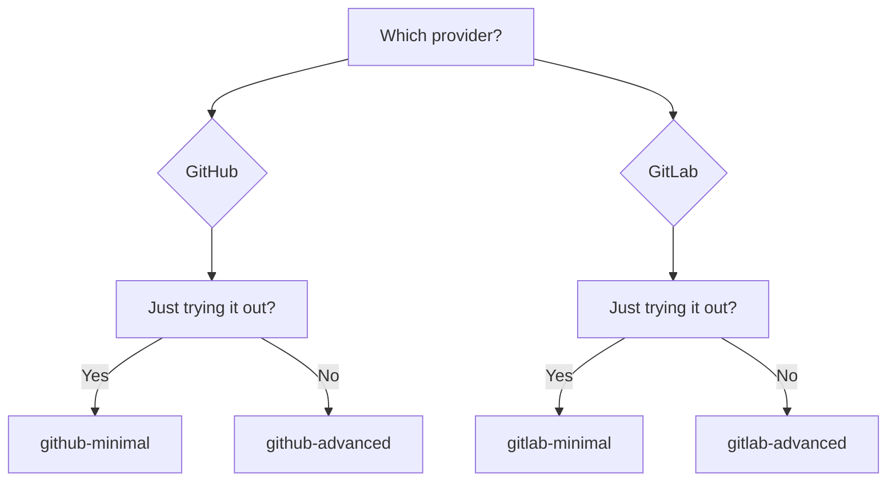

# Examples

Ready-to-use configurations for copy-paste.

---

## GitHub Actions

| Example | Description | Complexity |
|---------|-------------|------------|
| [Minimal](github-minimal.md) | Basic configuration | :star: |
| [Advanced](github-advanced.md) | Filters, concurrency, language | :star::star: |

## GitLab CI

| Example | Description | Complexity |
|---------|-------------|------------|
| [Minimal](gitlab-minimal.md) | Basic configuration | :star: |
| [Advanced](gitlab-advanced.md) | Stages, PAT, self-hosted | :star::star: |

---

## Quick Selection

---

## What to Choose?

### Minimal

- :white_check_mark: Quick start
- :white_check_mark: Works with defaults
- :white_check_mark: Minimal configuration

**Use for:** first run, testing.

### Advanced

- :white_check_mark: Concurrency (cancel duplicates)
- :white_check_mark: Fork PR filtering
- :white_check_mark: Custom language
- :white_check_mark: Timeout protection

**Use for:** production.

---

## Tip

1. Start with the **minimal** example
2. Make sure it works
3. Add needed options from the **advanced** example
