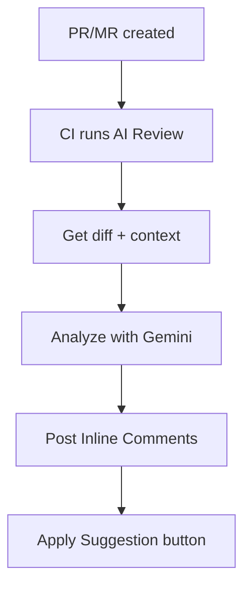

# AI ReviewBot

**AI-powered assistant for automated code review in your CI/CD pipeline.**

---

## What is it?

AI Code Reviewer is a tool that automatically analyzes your Pull Requests (GitHub) and Merge Requests (GitLab), finds issues and suggests fixes with an **"Apply Suggestion"** button.
Essentially, you get an unbiased senior developer's perspective on your code along with suggestions for improvement.

Integration with a wide range of existing LLM providers is possible (by default **Google Gemini**, model **gemini-2.5-flash** — at the time of the current release, the free tier usage limits on requests per minute and per day are sufficient for a normal workflow of a team of 4-8 full-time developers).


---

## What do you get?


- :white_check_mark: **Code Comments** — overall code assessment and recommendations
- :white_check_mark: **Task Alignment** — PR/MR alignment with task context
- :white_check_mark: **Inline Comments** — comments directly on code lines
- :white_check_mark: **Apply Suggestion** — one-click button to apply fixes
- :white_check_mark: **Mentoring explanations** — why it matters + resource links
- :white_check_mark: **Language adaptivity** — detects language from PR/MR context
- :white_check_mark: **Metrics** — execution time, tokens
- :white_check_mark: **Resilience** — retry logic for 429/5xx errors

---

## Quick Start

Important: to follow the next steps you'll need your personal Google API key. You can get it for free either at [Google AI Studio](https://aistudio.google.com/api-keys) or [Google Cloud Console](https://console.cloud.google.com/).

*AI Code Reviewer can be configured to use different LLM providers and models, both free and paid. The following examples use the* **gemini-2.5-flash** *model. Other documentation sections explain how to connect other providers and use other models. We're interested in your opinion about the differences between various models — we'd love to read about your experience in the comments.*


### GitHub


In your repository, create:
- in `Settings` → `Secrets and variables [Security]` → `Actions` → press `New repository secret`:
    - create a secret named `GOOGLE_API_KEY` with your Google API key as the value.
- in the root of your project repository:
    - create file `.github/workflows/ai-review.yml` with the following content:

```yaml
# .github/workflows/ai-review.yml
name: AI Code Review
on:
  pull_request:
    types: [opened, synchronize]

jobs:
  review:
    runs-on: ubuntu-latest
    permissions:
      contents: read
      pull-requests: write
    steps:
      - uses: KonstZiv/ai-code-reviewer@v1
        with:
          google_api_key: ${{ secrets.GOOGLE_API_KEY }}
```

### GitLab

In your repository, create:

1. **Project Access Token** (required for posting comments):
    - Go to `Settings` → `Access Tokens`
    - Create token with name `ai-reviewer`, role `Developer`, scope `api`
    - Copy the token (shown only once!)

2. **CI/CD Variables**:
    - Go to `Settings` → `CI/CD` → `Variables`
    - Add `GOOGLE_API_KEY`: your Google API key (Masked)
    - Add `GITLAB_TOKEN`: token from step 1 (Masked)

3. **CI configuration**:
    - Create file `.gitlab-ci.yml` in the project root:

```yaml
# .gitlab-ci.yml
ai-review:
  image: ghcr.io/konstziv/ai-code-reviewer:1
  script:
    - ai-review
  rules:
    - if: $CI_PIPELINE_SOURCE == "merge_request_event"
  allow_failure: true
  variables:
    GITLAB_TOKEN: $GITLAB_TOKEN
    GOOGLE_API_KEY: $GOOGLE_API_KEY
```

:point_right: [Learn more →](quick-start.md)


Create a new PR/MR — get a review.

**Review quality directly depends on AI Code Reviewer's understanding of your intentions** (just like with a real human reviewer). Therefore, it's a good idea to accompany the development process with documentation:
- create an issue describing the problem and desired results
- create a linked branch/linked PR/MR in the issue, describing the problem in more detail, the solution approach, constraints, desired results, edge cases — anything that adds context understanding, tools, results
- if you work in a team — communicate in issues, comment on PR/MRs — all this adds context and improves review quality

---

## Supported Platforms

| Platform | Status | Integration |
|----------|--------|-------------|
| **GitHub** | :white_check_mark: | GitHub Actions / GitHub Action |
| **GitLab** | :white_check_mark: | GitLab CI / Docker image |
| **Self-hosted** | :white_check_mark: | Docker / PyPI |

---

## How does it work?



**Step by step:**

1. You create a PR/MR
2. CI pipeline runs AI Code Reviewer
3. The tool fetches diff, PR description, linked task
4. Gemini analyzes the code and generates recommendations
5. Results are posted as inline comments with an "Apply" button

---

## Review Example

!!! danger "🔴 CRITICAL: Hardcoded Secret"
    **File:** `config.py:15`

    Hardcoded API key found in code.

    ```suggestion
    API_KEY = os.getenv("API_KEY")
    ```

    ??? info "Why does this matter?"
        Secrets in code end up in git history and can be stolen.
        Use environment variables or secret managers.

        :link: [OWASP: Hardcoded Credentials](https://owasp.org/www-community/vulnerabilities/Use_of_hard-coded_password)

---

## Issue Categories

| Category | Description |
|----------|-------------|
| :lock: **Security** | Vulnerabilities, hardcoded secrets |
| :memo: **Code Quality** | Readability, naming, DRY |
| :building_construction: **Architecture** | SOLID, design patterns |
| :zap: **Performance** | N+1, inefficient algorithms |
| :test_tube: **Testing** | Coverage, edge cases |

---

## Installation

=== "Docker (recommended)"

    ```bash
    docker pull ghcr.io/konstziv/ai-code-reviewer:1
    ```

=== "PyPI"

    ```bash
    pip install ai-reviewbot
    ```

=== "Source"

    ```bash
    git clone https://github.com/KonstZiv/ai-code-reviewer.git
    cd ai-code-reviewer
    uv sync
    ```

:point_right: [Learn more →](installation.md)

---

## Configuration

Minimal configuration — just the API key:

```bash
export GOOGLE_API_KEY=your_api_key
```

Additional options:

| Variable | Description | Default |
|----------|-------------|---------|
| `LANGUAGE` | Response language (ISO 639) | `en` |
| `LANGUAGE_MODE` | `adaptive` / `fixed` | `adaptive` |
| `GEMINI_MODEL` | Gemini model | `gemini-2.0-flash` |
| `LOG_LEVEL` | Logging level | `INFO` |

:point_right: [All options →](configuration.md)

---

## Documentation

<div class="grid cards" markdown>

-   :rocket: **[Quick Start](quick-start.md)**

    Copy-paste instructions for GitHub and GitLab

-   :gear: **[Configuration](configuration.md)**

    All environment variables and options

-   :octicons-mark-github-16: **[GitHub](github.md)**

    Permissions, secrets, workflow tips

-   :simple-gitlab: **[GitLab](gitlab.md)**

    Job tokens, MR triggers, self-hosted

-   :material-console: **[CLI Reference](api.md)**

    Commands and parameters

-   :material-lifebuoy: **[Troubleshooting](troubleshooting.md)**

    FAQ and problem solving

</div>

---

## Cost

AI Code Reviewer uses **Google Gemini 2.5 Flash** — in Free Tier mode. Limits (at release date) are 500 RPD. This is sufficient for serving PR/MRs for a team of 4-8 full-time developers, including both reviews and meaningful comments (without flood and off-topic).
If using the paid tier (Pay-as-you-go), the cost of a typical review and unlimited conversations:

| Metric | Cost |
|--------|------|
| Input tokens | $0.30 / 1M |
| Output tokens | $2.5 / 1M |
| **Typical review** | **~$0.003 - $0.01** |

:bulb: ~1000 reviews = ~$3 ... ~$10

---

## License

Apache 2.0 — free to use, modify, and distribute.

---

## Support

- :bug: [GitHub Issues](https://github.com/KonstZiv/ai-code-reviewer/issues) — bugs and suggestions
- :speech_balloon: [GitHub Discussions](https://github.com/KonstZiv/ai-code-reviewer/discussions) — questions and discussions

---

**Ready to improve your code reviews?** :point_right: [Get started →](quick-start.md)
