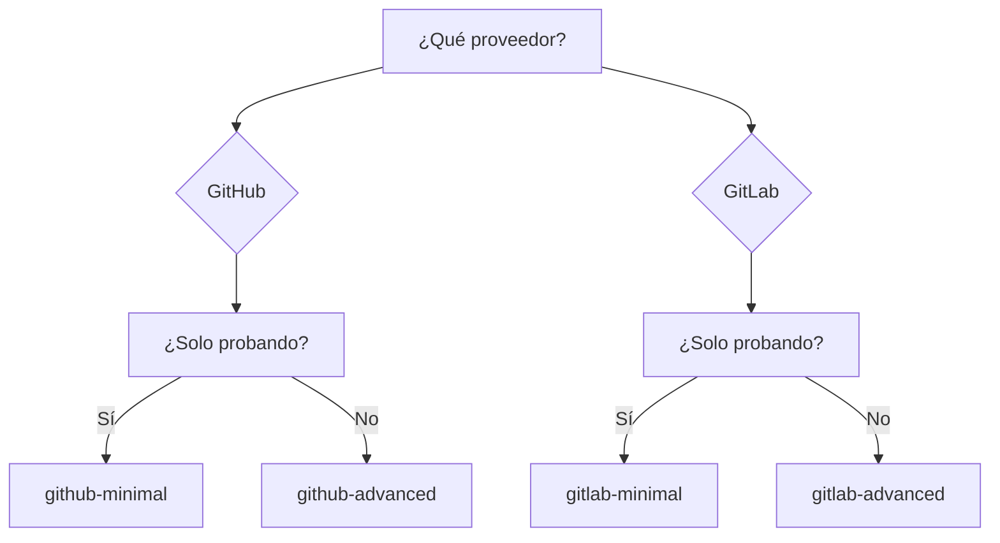

# Ejemplos

Configuraciones listas para usar, para copiar y pegar.

---

## GitHub Actions

| Ejemplo | Descripción | Complejidad |
|---------|-------------|------------|
| [Mínimo](github-minimal.md) | Configuración básica | :star: |
| [Avanzado](github-advanced.md) | Filtros, concurrencia, idioma | :star::star: |

## GitLab CI

| Ejemplo | Descripción | Complejidad |
|---------|-------------|------------|
| [Mínimo](gitlab-minimal.md) | Configuración básica | :star: |
| [Avanzado](gitlab-advanced.md) | Stages, PAT, self-hosted | :star::star: |

---

## Selección Rápida

---

## ¿Qué Elegir?

### Mínimo

- :white_check_mark: Inicio rápido
- :white_check_mark: Funciona con valores por defecto
- :white_check_mark: Configuración mínima

**Usar para:** primera ejecución, pruebas.

### Avanzado

- :white_check_mark: Concurrencia (cancelar duplicados)
- :white_check_mark: Filtrado de PRs de forks
- :white_check_mark: Idioma personalizado
- :white_check_mark: Protección de timeout

**Usar para:** producción.

---

## Consejo

1. Comienza con el ejemplo **mínimo**
2. Asegúrate de que funciona
3. Añade las opciones necesarias del ejemplo **avanzado**
