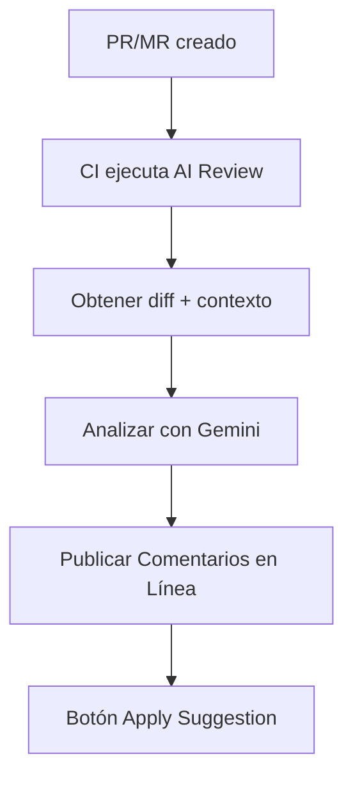

# AI ReviewBot

**Asistente impulsado por IA para revisión de código automatizada en tu pipeline de CI/CD.**

---

## ¿Qué es?

AI Code Reviewer es una herramienta que analiza automáticamente tus Pull Requests (GitHub) y Merge Requests (GitLab), encuentra problemas y sugiere correcciones con un botón **"Apply Suggestion"**.
Esencialmente, obtienes la perspectiva imparcial de un desarrollador senior sobre tu código junto con sugerencias de mejora.

Es posible la integración con una amplia gama de proveedores de LLM existentes (por defecto **Google Gemini**, modelo **gemini-2.5-flash** — en el momento del lanzamiento actual, los límites de uso del nivel gratuito en solicitudes por minuto y por día son suficientes para un flujo de trabajo normal de un equipo de 4-8 desarrolladores a tiempo completo).


---

## ¿Qué obtienes?


- :white_check_mark: **Comentarios de Código** — evaluación general del código y recomendaciones
- :white_check_mark: **Alineación con Tareas** — alineación del PR/MR con el contexto de la tarea
- :white_check_mark: **Comentarios en Línea** — comentarios directamente en las líneas de código
- :white_check_mark: **Apply Suggestion** — botón de un clic para aplicar correcciones
- :white_check_mark: **Explicaciones de mentoría** — por qué importa + enlaces a recursos
- :white_check_mark: **Adaptabilidad del idioma** — detecta el idioma del contexto del PR/MR
- :white_check_mark: **Métricas** — tiempo de ejecución, tokens
- :white_check_mark: **Resiliencia** — lógica de reintentos para errores 429/5xx

---

## Inicio Rápido

Configura AI Code Reviewer para tu proyecto en 5 minutos:

- :octicons-mark-github-16: **[Configurar revisión para GitHub →](quick-start.md)**
- :simple-gitlab: **[Configurar revisión para GitLab →](quick-start.md)**

Crea un nuevo PR/MR — obtén una revisión automáticamente.

!!! tip "Importante para la calidad de la revisión"
    **La calidad de la revisión depende directamente de la comprensión de AI Code Reviewer de tus intenciones** (igual que con un revisor humano real). Por lo tanto, es buena idea acompañar el proceso de desarrollo con documentación:

    - **Crea un issue** describiendo el problema y los resultados deseados
    - **Describe el PR/MR** — el problema con más detalle, el enfoque de la solución, restricciones, casos especiales
    - **Comunícate en los comentarios** — si trabajas en equipo, todo esto añade contexto

    ¡Cuanto más contexto — mejor será la revisión!

---

## Plataformas Soportadas

| Plataforma | Estado | Integración |
|------------|--------|-------------|
| **GitHub** | :white_check_mark: | GitHub Actions / GitHub Action |
| **GitLab** | :white_check_mark: | GitLab CI / Imagen Docker |
| **Self-hosted** | :white_check_mark: | Docker / PyPI |

---

## ¿Cómo funciona?



**Paso a paso:**

1. Creas un PR/MR
2. El pipeline de CI ejecuta AI Code Reviewer
3. La herramienta obtiene el diff, descripción del PR, tarea vinculada
4. Gemini analiza el código y genera recomendaciones
5. Los resultados se publican como comentarios en línea con un botón "Apply"

---

## Ejemplo de Revisión

!!! danger "🔴 CRÍTICO: Secreto Hardcodeado"
    **Archivo:** `config.py:15`

    Se encontró una clave API hardcodeada en el código.

    ```suggestion
    API_KEY = os.getenv("API_KEY")
    ```

    ??? info "¿Por qué importa esto?"
        Los secretos en el código terminan en el historial de git y pueden ser robados.
        Usa variables de entorno o gestores de secretos.

        :link: [OWASP: Hardcoded Credentials](https://owasp.org/www-community/vulnerabilities/Use_of_hard-coded_password)

---

## Categorías de Problemas

| Categoría | Descripción |
|-----------|-------------|
| :lock: **Seguridad** | Vulnerabilidades, secretos hardcodeados |
| :memo: **Calidad de Código** | Legibilidad, nomenclatura, DRY |
| :building_construction: **Arquitectura** | SOLID, patrones de diseño |
| :zap: **Rendimiento** | N+1, algoritmos ineficientes |
| :test_tube: **Testing** | Cobertura, casos límite |

---

## Instalación

=== "Docker (recomendado)"

    ```bash
    docker pull ghcr.io/konstziv/ai-code-reviewer:1
    ```

=== "PyPI"

    ```bash
    pip install ai-reviewbot
    ```

=== "Código Fuente"

    ```bash
    git clone https://github.com/KonstZiv/ai-code-reviewer.git
    cd ai-code-reviewer
    uv sync
    ```

:point_right: [Más información →](installation.md)

---

## Configuración

Configuración mínima — solo la clave API:

```bash
export GOOGLE_API_KEY=your_api_key
```

Opciones adicionales:

| Variable | Descripción | Por defecto |
|----------|-------------|-------------|
| `LANGUAGE` | Idioma de respuesta (ISO 639) | `en` |
| `LANGUAGE_MODE` | `adaptive` / `fixed` | `adaptive` |
| `GEMINI_MODEL` | Modelo Gemini | `gemini-2.0-flash` |
| `LOG_LEVEL` | Nivel de logging | `INFO` |

:point_right: [Todas las opciones →](configuration.md)

---

## Documentación

<div class="grid cards" markdown>

-   :rocket: **[Inicio Rápido](quick-start.md)**

    Instrucciones de copiar y pegar para GitHub y GitLab

-   :gear: **[Configuración](configuration.md)**

    Todas las variables de entorno y opciones

-   :octicons-mark-github-16: **[GitHub](github.md)**

    Permisos, secretos, consejos de workflow

-   :simple-gitlab: **[GitLab](gitlab.md)**

    Project Access Token, triggers de MR, self-hosted

-   :material-console: **[Referencia CLI](api.md)**

    Comandos y parámetros

-   :material-lifebuoy: **[Solución de Problemas](troubleshooting.md)**

    FAQ y resolución de problemas

</div>

---

## Costo

AI Code Reviewer usa **Google Gemini 2.5 Flash** — en modo Free Tier. Los límites (a la fecha de lanzamiento) son 500 RPD. Esto es suficiente para servir PR/MRs de un equipo de 4-8 desarrolladores a tiempo completo, incluyendo tanto revisiones como comentarios significativos (sin flood ni off-topic).
Si usas el nivel de pago (Pay-as-you-go), el costo de una revisión típica y conversaciones ilimitadas:

| Métrica | Costo |
|---------|-------|
| Tokens de entrada | $0.30 / 1M |
| Tokens de salida | $2.5 / 1M |
| **Revisión típica** | **~$0.003 - $0.01** |

:bulb: ~1000 revisiones = ~$3 ... ~$10

---

## Licencia

Apache 2.0 — libre para usar, modificar y distribuir.

---

## Soporte

- :bug: [GitHub Issues](https://github.com/KonstZiv/ai-code-reviewer/issues) — bugs y sugerencias
- :speech_balloon: [GitHub Discussions](https://github.com/KonstZiv/ai-code-reviewer/discussions) — preguntas y discusiones

---

**¿Listo para mejorar tus revisiones de código?** :point_right: [Comenzar →](quick-start.md)
