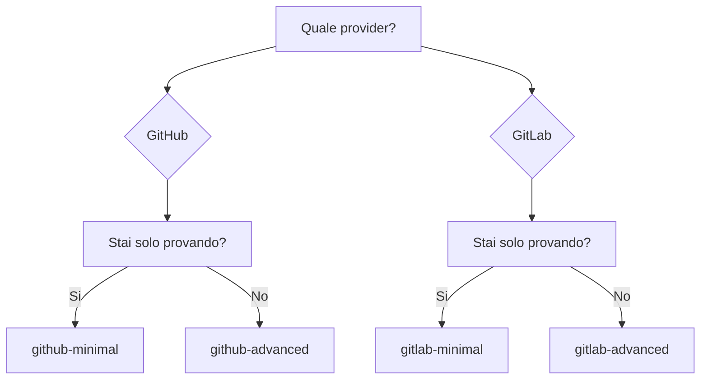

# Esempi

Configurazioni pronte all'uso per copia-incolla.

---

## GitHub Actions

| Esempio | Descrizione | Complessita |
|---------|-------------|-------------|
| [Minimo](github-minimal.md) | Configurazione base | :star: |
| [Avanzato](github-advanced.md) | Filtri, concurrency, lingua | :star::star: |

## GitLab CI

| Esempio | Descrizione | Complessita |
|---------|-------------|-------------|
| [Minimo](gitlab-minimal.md) | Configurazione base | :star: |
| [Avanzato](gitlab-advanced.md) | Stage, PAT, self-hosted | :star::star: |

---

## Selezione Rapida

---

## Cosa Scegliere?

### Minimo

- :white_check_mark: Avvio rapido
- :white_check_mark: Funziona con i default
- :white_check_mark: Configurazione minima

**Usa per:** prima esecuzione, test.

### Avanzato

- :white_check_mark: Concurrency (cancella duplicati)
- :white_check_mark: Filtro PR da fork
- :white_check_mark: Lingua personalizzata
- :white_check_mark: Protezione timeout

**Usa per:** produzione.

---

## Consiglio

1. Inizia con l'esempio **minimo**
2. Assicurati che funzioni
3. Aggiungi le opzioni necessarie dall'esempio **avanzato**
