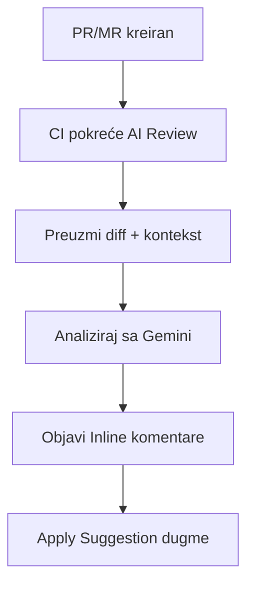

# AI ReviewBot

**AI-pokretan asistent za automatizovanu reviziju koda u vašem CI/CD pipeline-u.**

---

## Šta je to?

AI Code Reviewer je alat koji automatski analizira vaše Pull Request-e (GitHub) i Merge Request-e (GitLab), pronalazi probleme i predlaže ispravke sa dugmetom **"Apply Suggestion"**.
U suštini, dobijate nepristrasan pogled senior programera na vaš kod zajedno sa prijedlozima za poboljšanje.

Moguća je integracija sa širokim spektrom postojećih LLM provajdera (podrazumijevano **Google Gemini**, model **gemini-2.5-flash** — u trenutku ovog izdanja, besplatni nivo ograničenja zahtjeva po minuti i po danu je dovoljan za normalan radni tok tima od 4-8 programera sa punim radnim vremenom).


---

## Šta dobijate?


- :white_check_mark: **Komentari koda** — ukupna ocjena koda i preporuke
- :white_check_mark: **Usklađenost sa zadatkom** — usklađenost PR/MR sa kontekstom zadatka
- :white_check_mark: **Inline komentari** — komentari direktno na linijama koda
- :white_check_mark: **Apply Suggestion** — dugme za primjenu ispravki jednim klikom
- :white_check_mark: **Mentorska objašnjenja** — zašto je to važno + linkovi na resurse
- :white_check_mark: **Jezička adaptivnost** — prepoznaje jezik iz konteksta PR/MR
- :white_check_mark: **Metrike** — vrijeme izvršavanja, tokeni
- :white_check_mark: **Otpornost** — logika ponovnog pokušaja za 429/5xx greške

---

## Brzi početak

Važno: da biste pratili sljedeće korake, trebat će vam lični Google API ključ. Možete ga dobiti besplatno na [Google AI Studio](https://aistudio.google.com/api-keys) ili [Google Cloud Console](https://console.cloud.google.com/).

*AI Code Reviewer se može konfigurisati da koristi različite LLM provajdere i modele, besplatne i plaćene. Sljedeći primjeri koriste model* **gemini-2.5-flash**. *Drugi dijelovi dokumentacije objašnjavaju kako povezati druge provajdere i koristiti druge modele. Zainteresovani smo za vaše mišljenje o razlikama između različitih modela — rado bismo čitali o vašem iskustvu u komentarima.*


### GitHub


U vašem repozitorijumu kreirajte:
- u `Settings` → `Secrets and variables [Security]` → `Actions` → pritisnite `New repository secret`:
    - kreirajte tajnu pod imenom `GOOGLE_API_KEY` sa vašim Google API ključem kao vrijednošću.
- u korijenu vašeg projektnog repozitorijuma:
    - kreirajte fajl `.github/workflows/ai-review.yml` sa sljedećim sadržajem:

```yaml
# .github/workflows/ai-review.yml
name: AI Code Review
on:
  pull_request:
    types: [opened, synchronize]

jobs:
  review:
    runs-on: ubuntu-latest
    permissions:
      contents: read
      pull-requests: write
    steps:
      - uses: KonstZiv/ai-code-reviewer@v1
        with:
          google_api_key: ${{ secrets.GOOGLE_API_KEY }}
```

### GitLab

U vašem repozitorijumu kreirajte:

1. **Project Access Token** (za pisanje komentara):
   - `Settings` → `Access Tokens` → `Add new token`
   - Token name: `ai-reviewer`
   - Role: `Developer`
   - Scopes: `api`

2. **CI/CD varijable** u `Settings` → `CI/CD` → `Variables`:
   - `GOOGLE_API_KEY`: vaš Google API ključ (Masked)
   - `GITLAB_TOKEN`: token iz koraka 1 (Masked)

3. **Workflow fajl** `.gitlab-ci.yml` u korijenu repozitorijuma:

```yaml
# .gitlab-ci.yml
ai-review:
  image: ghcr.io/konstziv/ai-code-reviewer:1
  script:
    - ai-review
  rules:
    - if: $CI_PIPELINE_SOURCE == "merge_request_event"
  variables:
    GOOGLE_API_KEY: $GOOGLE_API_KEY
    GITLAB_TOKEN: $GITLAB_TOKEN
```

:point_right: [Saznajte više →](quick-start.md)


Kreirajte novi PR/MR — dobijte reviziju.

**Kvalitet revizije direktno zavisi od razumijevanja AI Code Reviewer-a o vašim namjerama** (baš kao i kod pravog ljudskog recenzenta). Stoga je dobra ideja pratiti razvojni proces dokumentacijom:
- kreirajte issue koji opisuje problem i željene rezultate
- kreirajte povezanu granu/povezani PR/MR u issue-u, detaljnije opisujući problem, pristup rješenju, ograničenja, željene rezultate, granične slučajeve — sve što dodaje razumijevanje konteksta, alate, rezultate
- ako radite u timu — komunicirajte u issue-ima, komentarišite PR/MR-ove — sve ovo dodaje kontekst i poboljšava kvalitet revizije

---

## Podržane platforme

| Platforma | Status | Integracija |
|----------|--------|-------------|
| **GitHub** | :white_check_mark: | GitHub Actions / GitHub Action |
| **GitLab** | :white_check_mark: | GitLab CI / Docker image |
| **Self-hosted** | :white_check_mark: | Docker / PyPI |

---

## Kako funkcioniše?



**Korak po korak:**

1. Vi kreirate PR/MR
2. CI pipeline pokreće AI Code Reviewer
3. Alat preuzima diff, PR opis, povezani zadatak
4. Gemini analizira kod i generiše preporuke
5. Rezultati se objavljuju kao inline komentari sa dugmetom "Apply"

---

## Primjer revizije

!!! danger "🔴 KRITIČNO: Hardkodovana tajna"
    **Fajl:** `config.py:15`

    Pronađen hardkodovan API ključ u kodu.

    ```suggestion
    API_KEY = os.getenv("API_KEY")
    ```

    ??? info "Zašto je ovo važno?"
        Tajne u kodu završavaju u git historiji i mogu biti ukradene.
        Koristite varijable okruženja ili menadžere tajni.

        :link: [OWASP: Hardcoded Credentials](https://owasp.org/www-community/vulnerabilities/Use_of_hard-coded_password)

---

## Kategorije problema

| Kategorija | Opis |
|----------|-------------|
| :lock: **Bezbjednost** | Ranjivosti, hardkodovane tajne |
| :memo: **Kvalitet koda** | Čitljivost, imenovanje, DRY |
| :building_construction: **Arhitektura** | SOLID, dizajn patterni |
| :zap: **Performanse** | N+1, neefikasni algoritmi |
| :test_tube: **Testiranje** | Pokrivenost, granični slučajevi |

---

## Instalacija

=== "Docker (preporučeno)"

    ```bash
    docker pull ghcr.io/konstziv/ai-code-reviewer:1
    ```

=== "PyPI"

    ```bash
    pip install ai-reviewbot
    ```

=== "Izvorni kod"

    ```bash
    git clone https://github.com/KonstZiv/ai-code-reviewer.git
    cd ai-code-reviewer
    uv sync
    ```

:point_right: [Saznajte više →](installation.md)

---

## Konfiguracija

Minimalna konfiguracija — samo API ključ:

```bash
export GOOGLE_API_KEY=your_api_key
```

Dodatne opcije:

| Varijabla | Opis | Podrazumijevano |
|----------|-------------|---------|
| `LANGUAGE` | Jezik odgovora (ISO 639) | `en` |
| `LANGUAGE_MODE` | `adaptive` / `fixed` | `adaptive` |
| `GEMINI_MODEL` | Gemini model | `gemini-2.0-flash` |
| `LOG_LEVEL` | Nivo logovanja | `INFO` |

:point_right: [Sve opcije →](configuration.md)

---

## Dokumentacija

<div class="grid cards" markdown>

-   :rocket: **[Brzi početak](quick-start.md)**

    Copy-paste instrukcije za GitHub i GitLab

-   :gear: **[Konfiguracija](configuration.md)**

    Sve varijable okruženja i opcije

-   :octicons-mark-github-16: **[GitHub](github.md)**

    Dozvole, tajne, savjeti za workflow

-   :simple-gitlab: **[GitLab](gitlab.md)**

    Job tokeni, MR triggeri, self-hosted

-   :material-console: **[CLI referenca](api.md)**

    Komande i parametri

-   :material-lifebuoy: **[Rješavanje problema](troubleshooting.md)**

    FAQ i rješavanje problema

</div>

---

## Cijena

AI Code Reviewer koristi **Google Gemini 2.5 Flash** — u Free Tier režimu. Ograničenja (na datum izdanja) su 500 RPD. Ovo je dovoljno za opsluživanje PR/MR-ova za tim od 4-8 programera sa punim radnim vremenom, uključujući i revizije i smislene komentare (bez flood-a i off-topic-a).
Ako koristite plaćeni nivo (Pay-as-you-go), cijena tipične revizije i neograničenih razgovora:

| Metrika | Cijena |
|--------|------|
| Ulazni tokeni | $0.30 / 1M |
| Izlazni tokeni | $2.5 / 1M |
| **Tipična revizija** | **~$0.003 - $0.01** |

:bulb: ~1000 revizija = ~$3 ... ~$10

---

## Licenca

Apache 2.0 — slobodno za korišćenje, modifikovanje i distribuciju.

---

## Podrška

- :bug: [GitHub Issues](https://github.com/KonstZiv/ai-code-reviewer/issues) — bagovi i prijedlozi
- :speech_balloon: [GitHub Discussions](https://github.com/KonstZiv/ai-code-reviewer/discussions) — pitanja i diskusije

---

**Spremni da poboljšate svoje revizije koda?** :point_right: [Započnite →](quick-start.md)
