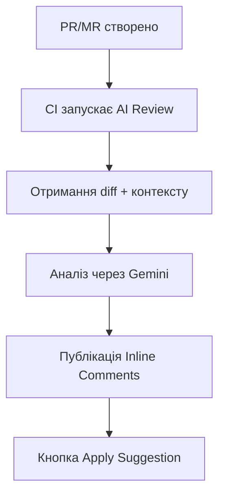

# AI ReviewBot

**AI-асистент для автоматичного code review у вашому CI/CD pipeline.**

---

## Що це?

AI Code Reviewer — інструмент, який автоматично аналізує ваші Pull Requests (GitHub) та Merge Requests (GitLab), знаходить проблеми та пропонує виправлення з кнопкою **"Apply Suggestion"**.
Фактично Ви отримуєте незаангажований погляд senior developer на Ваш код і поради як його покращити.

Можлива інтеграція з широким набором існуючих LLM провайдерів (за замовчуванням  **Google Gemini**, модель **gemini-2.5-flash** (на момент виходу поточного релізу - безкоштовного варіанту використання - Free Tier - що обмежує кількість запитів за хвилину і за день - цілком достатньо для нормального робочого процесу команди 4-8 full time розробників)).


---

## Що ви отримуєте?


- :white_check_mark: **Code Comments** — загальна оцінка коду та рекомендації
- :white_check_mark: **Task Alignment** — відповідність PR/MR контексту завдання
- :white_check_mark: **Inline Comments** — коментарі прямо до рядків коду
- :white_check_mark: **Apply Suggestion** — одна кнопка для застосування виправлення
- :white_check_mark: **Менторські пояснення** — чому це важливо + посилання на ресурси
- :white_check_mark: **Мовна адаптивність** — визначає мову з контексту PR/MR
- :white_check_mark: **Метрики** — час виконання, токени
- :white_check_mark: **Стійкість** — retry logic для 429/5xx помилок

---

## Швидкий старт

Налаштуйте AI Code Reviewer для вашого проєкту за 5 хвилин:

- :octicons-mark-github-16: **[Налаштування ревʼю для GitHub →](quick-start.md)**
- :simple-gitlab: **[Налаштування ревʼю для GitLab →](quick-start.md)**

Створіть новий PR/MR — отримайте ревʼю автоматично.

!!! tip "Важливо для якості ревʼю"
    **Якість ревʼю напряму залежить від розуміння AI Code Reviewer ваших намірів** (як і реального "живого" ревʼювера). Тому хорошою ідеєю буде супроводжувати процес розробки документуванням:

    - **Створіть issue** з описом проблеми і бажаними результатами
    - **Опишіть PR/MR** — детальніше проблему, шлях вирішення, обмеження, особливі випадки
    - **Спілкуйтесь в коментарях** — якщо працюєте командою, все це додає контекст

    Чим більше контексту — тим якісніше ревʼю!

---

## Підтримувані платформи

| Платформа | Статус | Інтеграція |
|-----------|--------|------------|
| **GitHub** | :white_check_mark: | GitHub Actions / GitHub Action |
| **GitLab** | :white_check_mark: | GitLab CI / Docker image |
| **Self-hosted** | :white_check_mark: | Docker / PyPI |

---

## Як це працює?



**Крок за кроком:**

1. Ви створюєте PR/MR
2. CI pipeline запускає AI Code Reviewer
3. Інструмент отримує diff, опис PR, linked task
4. Gemini аналізує код та генерує рекомендації
5. Результат публікується як inline comments з кнопкою "Apply"

---

## Приклад review

!!! danger "🔴 CRITICAL: Hardcoded Secret"
    **Файл:** `config.py:15`

    Знайдено захардкоджений API ключ у коді.

    ```suggestion
    API_KEY = os.getenv("API_KEY")
    ```

    ??? info "Чому це важливо?"
        Секрети в коді потрапляють у git історію і можуть бути викрадені.
        Використовуйте environment variables або secret managers.

        :link: [OWASP: Hardcoded Credentials](https://owasp.org/www-community/vulnerabilities/Use_of_hard-coded_password)

---

## Категорії проблем

| Категорія | Опис |
|-----------|------|
| :lock: **Security** | Вразливості, секрети в коді |
| :memo: **Code Quality** | Читабельність, naming, DRY |
| :building_construction: **Architecture** | SOLID, design patterns |
| :zap: **Performance** | N+1, неефективні алгоритми |
| :test_tube: **Testing** | Покриття, edge cases |

---

## Встановлення

=== "Docker (рекомендовано)"

    ```bash
    docker pull ghcr.io/konstziv/ai-code-reviewer:1
    ```

=== "PyPI"

    ```bash
    pip install ai-reviewbot
    ```

=== "Source"

    ```bash
    git clone https://github.com/KonstZiv/ai-code-reviewer.git
    cd ai-code-reviewer
    uv sync
    ```

:point_right: [Детальніше →](installation.md)

---

## Конфігурація

Мінімальна конфігурація — тільки API ключ:

```bash
export GOOGLE_API_KEY=your_api_key
```

Додаткові опції:

| Змінна | Опис | Default |
|--------|------|---------|
| `LANGUAGE` | Мова відповідей (ISO 639) | `en` |
| `LANGUAGE_MODE` | `adaptive` / `fixed` | `adaptive` |
| `GEMINI_MODEL` | Модель Gemini | `gemini-2.0-flash` |
| `LOG_LEVEL` | Рівень логування | `INFO` |

:point_right: [Всі опції →](configuration.md)

---

## Документація

<div class="grid cards" markdown>

-   :rocket: **[Швидкий старт](quick-start.md)**

    Copy-paste інструкції для GitHub та GitLab

-   :gear: **[Конфігурація](configuration.md)**

    Всі environment variables та опції

-   :octicons-mark-github-16: **[GitHub](github.md)**

    Permissions, secrets, workflow tips

-   :simple-gitlab: **[GitLab](gitlab.md)**

    Job tokens, MR triggers, self-hosted

-   :material-console: **[CLI Reference](api.md)**

    Команди та параметри

-   :material-lifebuoy: **[Troubleshooting](troubleshooting.md)**

    FAQ та вирішення проблем

</div>

---

## Вартість

AI Code Reviewer використовує **Google Gemini 2.5 Flash** — в режимі Free Tire. Обмеження (на дату релізу) 500 RPD. Цього цілком достатньо для обслуговування PR/MR команди з 4 - 8 full time розробників з врахуванням як ревʼю так і змістовних коментарів (без flood та off-top).
Якщо використовувати платний рівень використання (Pay-as-you-go), то вартість умовного ревʼю і необмежених бесід:

| Метрика | Вартість            |
|---------|---------------------|
| Input tokens | $0.30 / 1M          |
| Output tokens | $2.5 / 1M           |
| **Типовий review** | **~$0.003 - $0.01** |

:bulb: ~1000 reviews = ~$3 ... ~$10

---

## Ліцензія

Apache 2.0 — вільне використання, модифікація та розповсюдження.

---

## Підтримка

- :bug: [GitHub Issues](https://github.com/KonstZiv/ai-code-reviewer/issues) — баги та пропозиції
- :speech_balloon: [GitHub Discussions](https://github.com/KonstZiv/ai-code-reviewer/discussions) — питання та обговорення

---

**Готові покращити свої code reviews?** :point_right: [Почати →](quick-start.md)
