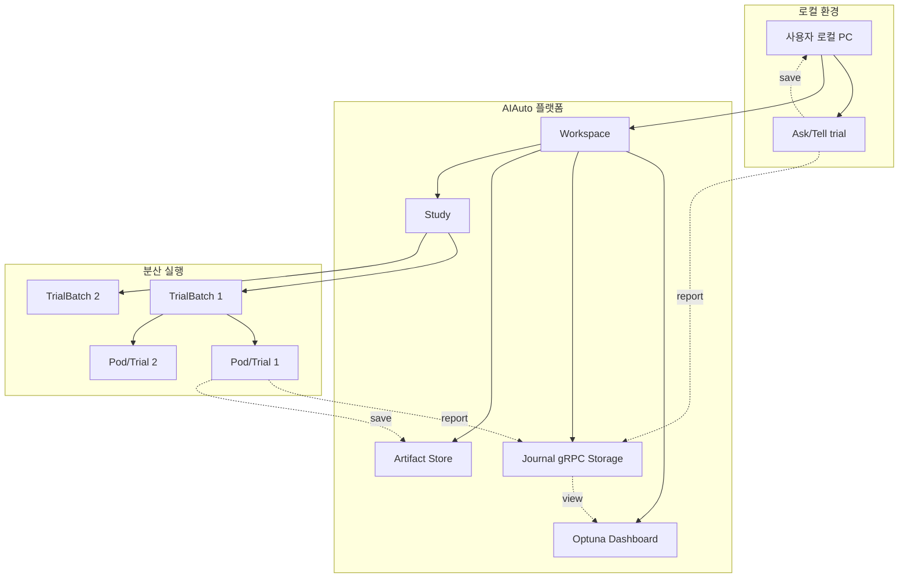

# AIAuto Client

> Kubernetes 기반 분산 하이퍼파라미터 최적화(HPO) 라이브러리

AIAuto는 기존 Optuna API와 호환되는 Kubernetes 기반 분산 HPO 플랫폼입니다. 로컬 PC에서 코드를 작성하면 ZeroOneAI의 Kubernetes 클러스터에서 병렬 최적화가 자동으로 실행됩니다. GPU도 지원합니다.

---

## 1. 설치

- 요구사항**: Python 3.8 이상
```bash
pip install aiauto-client optuna
```

### 환경변수 설정 (선택)

기본 API 서버(`https://aiauto.pangyo.ainode.ai:443`)가 아닌 다른 서버에 연결하려면 `AIAUTO_BASE_URL` 환경변수를 설정합니다.

```bash
# 방법 1: 명령어 앞에 환경변수 지정 (일회성)
AIAUTO_BASE_URL=https://aiauto.dev.example.com:443 uv run python test.py
AIAUTO_BASE_URL=https://aiauto.dev.example.com:443 python test.py

# 방법 2: shell에서 export (현재 세션 동안 유지)
export AIAUTO_BASE_URL=https://aiauto.dev.example.com:443
uv run python test.py

# IP 기반 배포의 경우
export AIAUTO_BASE_URL=https://192.168.1.100:443
export AIAUTO_BASE_URL=https://192.168.1.100:8080  # 비표준 포트
```

**URL 형식**: `scheme://host:port` (포트 필수)
- `scheme`: `http` 또는 `https`
- `port`: 필수 (예: `:443`, `:80`, `:8080`)

**Self-signed 인증서 사용 시** (내부망/개발 환경):
```bash
# SSL 인증서 검증 비활성화
export AIAUTO_INSECURE=true
export AIAUTO_BASE_URL=https://192.168.1.100:80
uv run python test.py

# 또는 한 줄로
AIAUTO_INSECURE=true AIAUTO_BASE_URL=https://192.168.1.100:80 uv run python test.py
```

> **주의**: 환경변수는 Python 프로세스 시작 시 한 번만 읽힙니다. 런타임 중 변경해도 이미 생성된 `AIAutoController` 인스턴스에는 반영되지 않습니다.

---

## 2. 주요 개념

### 2-1. [Optuna](https://optuna.org/) vs AIAuto 차이점
#### 2-1-1. AIAuto 를 사용하는 이유
- 로컬 리소스 제약 해결: 로컬 PC 의 CPU/GPU/메모리 한계 없이 ZeroOneAI 클러스터의 자원을 활용한 대규모 하이퍼파라미터 탐색
- 클라우드 GPU 활용: 로컬에서 돌아가는 것이 아닌 ZeroOneAI 클러스터의 GPU 사용
- Optuna 호환: 기존 Optuna 코드와 Sampler/Pruner 객체를 그대로 사용 가능

| 항목 | Optuna        | AIAuto                |
|------|---------------|-----------------------|
| **실행 위치** | 로컬 PC         | Kubernetes 클러스터       |
| **병렬화** | 프로세스/스레드 기반   | Kubernetes Pod 기반     |
| **GPU 사용** | 로컬 GPU 필요     | ZeroOneAI 클러스터 GPU 사용 |
| **확장성** | 로컬 리소스 확장 제한  | 노드 기반 scale out 확장 가능 |
| **API 호환성** | Optuna 기본 API | Optuna API 호환         |
| **Sampler/Pruner** | 모든 Optuna 알고리즘 | Optuna API 호환          |

### 2-2. 아키텍처 구조


#### 2-2-1. 구조 설명
- OptunaWorkspace: 사용자당 1개, Journal gRPC Storage 와 Optuna Dashboard, Artifact Store 포함
- Study: 하나의 maximize or minimize 최적화 실험 단위 (ex: "ResNet 하이퍼파라미터 탐색")
- TrialBatch: Study 내에서 병렬 실행되는 trial 그룹 (한 번의 `optimize()` 호출당 1개)
- Pod: Kubernetes 에서 실행되는 개별 trial (GPU/CPU 리소스 할당)

### 2-3. Trial Pod Volume 가이드

Trial Pod에서 사용할 수 있는 Volume은 3가지입니다.

#### 2-3-1. Volume 비교표

| Volume | 마운트 경로 | 타입 | 공유 범위 | 수명 | 주 용도 |
|--------|------------|------|----------|------|--------|
| tmp-cache | `{TmpCacheDir}` (기본: `/mnt/tmp-cache`) | emptyDir | Pod 1개 내부 | Pod 종료 시 삭제 | 임시 파일, 로컬 복사 |
| shared-cache | `{SharedCacheDir}` (기본: `/mnt/shared-cache`) | PVC | 모든 Trial | Workspace 수명 | 공유 데이터, 캐시 |
| artifact-store | `/artifacts` (고정) | PVC | 모든 Trial | Workspace 수명 | 결과물 저장 (top_n_artifacts) |

> **주의**: artifact-store (`/artifacts`)는 `top_n_artifacts` 자동 정리 로직이 동작합니다. 직접 파일을 쓰지 말고 `AIAutoController.upload_artifact()` API를 사용하세요.

#### 2-3-2. 권장 패턴: 학습 데이터 다운로드 (Trial #0 지정 방식)

**문제**: 첫 trial들이 동시에 뜰 수 있음 → 동시 다운로드 시 파일 손상

**해결**: Dashboard에서 shared-cache로 업로드하거나, Trial #0만 다운로드 후 나머지는 완료 파일 대기

```python
import os
import time
import shutil
from torchvision import datasets

def objective(trial):
    shared_path = "/mnt/shared-cache/cifar10"
    done_file = "/mnt/shared-cache/cifar10.done"
    local_path = "/mnt/tmp-cache/cifar10"

    # 1단계: Trial #0만 다운로드 (train + test 모두)
    if trial.number == 0:
        if not os.path.exists(done_file):
            datasets.CIFAR10(root=shared_path, train=True, download=True)
            datasets.CIFAR10(root=shared_path, train=False, download=True)
            # open()은 with 없이 사용 제한 (섹션 4-9 참조)
            with open(done_file, 'w'):
                pass  # 완료 표시
    else:
        # 나머지 trial은 완료 파일 대기
        while not os.path.exists(done_file):
            time.sleep(10)

    # 2단계: shared-cache → tmp-cache 복사 (빠른 로컬 I/O)
    if not os.path.exists(local_path):
        shutil.copytree(shared_path, local_path)

    # 3단계: tmp-cache에서 학습
    dataset = datasets.CIFAR10(root=local_path, download=False)
```

#### 2-3-3. tmp-cache (emptyDir)

**특징**: 노드 로컬 저장소, Pod 종료 시 자동 삭제

**저장소 옵션**:
- 기본: 노드 디스크 사용
- `use_tmp_cache_mem=True`: RAM 기반 emptyDir(tmpfs) 사용

**용도**:
- shared-cache 데이터를 로컬에 복사하여 빠른 I/O 확보
- 중간 계산 결과 임시 저장 (해당 Trial에서만 필요한 경우)
- 외부 API 호출 결과 캐싱
- objective 함수 내 반복문에서 재사용

#### 2-3-4. shared-cache (PVC)

**특징**: 모든 Trial Pod에서 공유, Workspace 삭제 전까지 유지

**용도**:
- 학습 데이터셋 (모든 Trial이 같은 데이터 사용)
- 전처리 결과 공유 (첫 Trial이 생성 → 나머지 Trial이 재사용)

#### 2-3-5. 상황별 Volume 선택 가이드

| 상황 | 추천 Volume | 이유 |
|------|-------------|-----|
| 외부 데이터 | Dashboard → shared-cache 업로드 또는 Trial #0 다운로드 | 다른 Trial도 재사용 |
| 학습 데이터셋 | shared-cache → tmp-cache 복사 | 공유 + 빠른 로컬 I/O |
| 중간 결과 (해당 Trial만) | tmp-cache | Pod 종료 시 자동 정리 |
| epoch 체크포인트 | artifact-store (`upload_artifact()` 사용) | top_n_artifacts로 자동 관리 |

---

## 3. 빠른시작 (5분)

### 3-1. 토큰 발급
- AIAuto Web 접속: [https://dashboard.common.aiauto.pangyo.ainode.ai](https://dashboard.common.aiauto.pangyo.ainode.ai)
- "Generate New Token" 버튼 클릭

- 생성된 Token 복사


### 3-2. 첫 최적화 실행
- 아래 예시 코드에 `<your-token-here>` 에 복사한 토큰 붙여넣기 (주의!! 두 군데 있음에 주의)
- Optuna 기본 개념 학습: 기존 Optuna 와 호환되므로 처음이라면 [Optuna 공식 튜토리얼](https://optuna.readthedocs.io/en/stable/tutorial/index.html)을 먼저 보길 권장
  - AIAutoController 를 사용하여 [](#studywrapper) 를 만들고 그 study_wrapper 에서 optimize() 호출한다는 점만 다름
```python
import aiauto
import optuna

# AIAuto 초기화
# 이 때 OptunaWorkspace 가 생성됨 (Front 또는 이전 실행으로 이미 존재하면 아래 설정값들은 무시됨)
ac = aiauto.AIAutoController(
    '<your-token-here>',
    # storage_size='500Mi',      # Journal Storage PVC 크기 (default: 500Mi, max: 10Gi)
    # artifact_store_size='2Gi', # Artifact Store PVC 크기 (default: 2Gi, max: 100Gi)
    # shared_cache_dir='/mnt/shared-cache', # Shared Cache 마운트 경로 (default: /mnt/shared-cache)
    # shared_cache_size='500Mi', # Shared Cache PVC 크기 (default: 500Mi, max: 4Gi)
)
# Study 생성
study_wrapper = ac.create_study(
    'my-first-study',  
    direction='minimize',  # can 'maximize'
    # sampler=optuna.samplers.TPESampler(),  # default, ref https://optuna.readthedocs.io/en/stable/reference/samplers/index.html
    # pruner=optuna.pruners.MedianPruner(),  # default, ref https://optuna.readthedocs.io/en/stable/reference/pruners.html
)

# Objective 함수 정의
def objective(trial):
    # objective 함수 안에서 import 하는 것 주의
    import aiauto
    import optuna
    from os.path import join
    
    # log 를 찍기 위한 TrialController 객체 생성 
    tc = aiauto.TrialController(trial)

    # 최적화 함수 작성
    x = trial.suggest_float('x', -10, 10)
    y = trial.suggest_float('y', -10, 10)
    value = (x - 2) ** 2 + (y - 3) ** 2
    
    # log
    tc.log(f'x={x:.2f}, y={y:.2f}, value={value:.4f}')
    
    # report
    trial.report(value, step=1)   # 중간 성능 보고
    
    # artifact 저장 시작 (필수는 아님 코드에서 제외해도 됨)
    # -------------------------------------------

    # 주의!!: artifact 저장을 위해 AIAutoController 를 objective 함수 안에서 다시 선언해야 함
    # (Front 또는 이전 실행으로 workspace가 이미 존재하면 아래 설정값들은 무시됨)
    ac_local = aiauto.AIAutoController(
        '<your-token-here>',
        # storage_size='500Mi',      # Journal Storage PVC 크기 (default: 500Mi, max: 10Gi)
        # artifact_store_size='2Gi', # Artifact Store PVC 크기 (default: 2Gi, max: 100Gi)
        # shared_cache_dir='/mnt/shared-cache', # Shared Cache 마운트 경로 (default: /mnt/shared-cache)
        # shared_cache_size='500Mi', # Shared Cache PVC 크기 (default: 500Mi, max: 4Gi)
    )
    try:
        # 파일명/내용에 trial 식별자 포함
        trial_id = f'{trial.study.study_name}_{trial.number}'
        filename = f'{trial_id}.txt'
        file_path = join(ac_local.get_artifact_tmp_dir(), filename)

        with open(file_path, 'w') as f:
          f.write(f'trial_id={trial_id}\n')
          f.write(f'final_score={value}\n')
          f.write(f'rand_value_x={x}\n')
          f.write(f'rand_value_y={y}\n')

        artifact_id = ac_local.upload_artifact(trial, file_path)
        tc.log(f'[artifact] saved {filename}, artifact_id={artifact_id}')
    except Exception as e:
        tc.log(f'[artifact] failed: {e}')
    finally:
        tc.flush()

    # -------------------------------------------
    # artifact 저장 종료 (필수는 아님 코드에서 제외해도 됨)

    return value

# 최적화 실행 (Kubernetes 클러스터에서 병렬 실행)
# 동시에 2개씩 총 10개 trial 생성
# 하나의 trial 당 1 cpu, 500Mi memory 의 pod 가 뜸
trialbatch_name = study_wrapper.optimize(
    objective,
    n_trials=10,  # default 로 전체 시도 trial 갯수
    parallelism=2,  # default 로 동시 실행 trial 갯수
    # use_gpu=False,  # default 로 gpu 미사용
    # gpu_model=None,  # default, 클러스터 상황에 맞춰 GPU 자동 선택 (use_gpu=True일 때만 의미 있음; gpu_model={'gpu_3090': 3, 'gpu_4090': 4} dict 합계 < n_trials 이면 나머지는 자동 선택); gpu_model='gpu_3090' 특정 gpu 만 선택도 가능;
    # runtime_image='ghcr.io/astral-sh/uv:python3.8-bookworm-slim',  # default(use_cpu) 로 기본 python uv
    # --- Image Pull Secret (둘 중 하나만 사용) ---
    # [방법1] registry 방식 (단일 registry, auth 자동 생성)
    # image_pull_registry='registry.gitlab.com',
    # image_pull_username='deploy-token-name',
    # image_pull_password='glpat-xxxxx',
    # [방법2] dockerconfigjson 방식 (여러 registry 지원)
    # image_pull_docker_config_json={
    #     "auths": {
    #         "ghcr.io": {"username": "user", "password": "token"},
    #         "registry.gitlab.com": {"username": "deploy-token", "password": "glpat-xxx"},
    #     }
    # },
    resources_requests={
        "cpu": "1",  # default(use_cpu): 1
        "memory": "500Mi",  # default(use_cpu): 1Gi
    },
    wait_option=aiauto.WaitOption.WAIT_ATLEAST_ONE_TRIAL, # default 로 최소 1개 trial 완료될 때까지 대기 (wait_option 기본값)
    # wait_timeout=600,  # default 로 wait_option 충족할 때 까지 기다는 max 시간
    # requirements_list=['numpy', 'torch',],  # or  # requirements_file='requirements.txt',
    # dev_shm_size="500Mi",  # /dev/shm 크기 (GPU 사용 시 자동 추가, default: 500Mi, max: 4Gi)
    # tmp_cache_dir="/mnt/tmp-cache",  # tmp-cache 마운트 경로 (default: /mnt/tmp-cache)
    # use_tmp_cache_mem=False,  # tmp-cache를 tmpfs로 사용 (default: False, disk-based emptyDir)
    # tmp_cache_size="500Mi",  # tmp-cache 크기 (default: 500Mi, max: 4Gi)
    # top_n_artifacts=5,  # 상위 N개 artifact만 보존 (default: 5, min: 1)
)

status = study_wrapper.get_status()
# 특정 TrialBatch 상태 확인
print(status)
```

### 3-3. Dashboard 결과 확인
- 최적화가 완료되면 Optuna Dashboard에서 Study 진행상황, 최적 파라미터, 시각화 그래프를 확인할 수 있습니다.
#### 3-3-1. [AIAuto Web OptunaWorkspace](https://dashboard.common.aiauto.pangyo.ainode.ai/workspace) tab 에 접속하여 `Open Dashboard` 링크 클릭

#### 3-3-2. 하나의 Optuna Dashboard 에 여러 Study 출력
- Optuna Dashboard 는 Study 단위로 진행상황과 그래프를 표시합니다
- 아래 처럼 여러 study 가 하나의 Optuna Dashboard 에 보이며, 하나의 Study에 여러 TrialBatch가 포함 됨

#### 3-3-3. Study 안에서 그래프 확인
- 생성된 Study 안에서 그래프, Hyperparameter Importance, Optimization History 등 진행 상황과 그래프 확인 가능

#### 3-3-4. 각 Trial 별 log Optuna Dashboard note 에서 확인
- 개별 trial 의 log 도 확인 가능

#### 3-3-5. Pod 상태 확인 및 artifact 다운로드
- 개별 trial 의 artifact 는 [AIAuto Web TrialBatch](https://dashboard.common.aiauto.pangyo.ainode.ai/trialbatch) 의 `Pod 상태` 버튼을 눌러 확인 가능

#### 3-3-6. Pruning 하는 경우 확인
- Optuna Dashboard 에서 그래프에서 빨간색으로 표시되는 것 확인
TODO
- 각 trial 의 상태에서 pruned 확인
TODO

### 3-4. 런타임 이미지

#### 3-4-1. 커스텀 이미지 사용 조건
`uv` 또는 `pip`가 실행 가능한 Python 3.8 이상 이미지이면 사용 가능합니다.

```python
study.optimize(
    objective,
    n_trials=10,
    runtime_image='your-registry.com/your-image:tag',  # 커스텀 이미지 지정
    # private registry인 경우 image_pull_secret 설정 필요 (아래 참고)
)
```

#### 3-4-2. 기본 제공 이미지 예시
**CPU (use_gpu=False, 기본값)**
- `ghcr.io/astral-sh/uv:python3.8-bookworm-slim` ~ `python3.13-bookworm-slim`

**GPU (use_gpu=True)**
- `pytorch/pytorch:2.0.1-cuda11.7-cudnn8-runtime` 등 PyTorch 시리즈
- `tensorflow/tensorflow:2.13.0-gpu` 등 TensorFlow 시리즈

### 3-5. 리소스 설정
#### 3-5-1. CPU 사용
```python
study.optimize(
    objective,
    n_trials=10,  # default 로 전체 시도 trial 갯수
    parallelism=2,  # default 로 동시 실행 trial 갯수
    # use_gpu=False,  # default 로 gpu 미사용
    # gpu_model=None,  # default, 클러스터 상황에 맞춰 GPU 자동 선택 (use_gpu=True일 때만 의미 있음; gpu_model={'gpu_3090': 3, 'gpu_4090': 4} dict 합계 < n_trials 이면 나머지는 자동 선택); gpu_model='gpu_3090' 특정 gpu 만 선택도 가능;
    # runtime_image='ghcr.io/astral-sh/uv:python3.8-bookworm-slim',  # default(use_cpu) 로 기본 python uv
    # --- Image Pull Secret (둘 중 하나만 사용) ---
    # [방법1] registry 방식 (단일 registry, auth 자동 생성)
    # image_pull_registry='registry.gitlab.com',
    # image_pull_username='deploy-token-name',
    # image_pull_password='glpat-xxxxx',
    # [방법2] dockerconfigjson 방식 (여러 registry 지원)
    # image_pull_docker_config_json={
    #     "auths": {
    #         "ghcr.io": {"username": "user", "password": "token"},
    #         "registry.gitlab.com": {"username": "deploy-token", "password": "glpat-xxx"},
    #     }
    # },
    resources_requests={
        "cpu": "1",  # default(use_cpu): 1
        "memory": "500Mi",  # default(use_cpu): 1Gi
    },
    # wait_option=aiauto.WaitOption.WAIT_ATLEAST_ONE_TRIAL, # default 로 최소 1개 trial 완료될 때까지 대기 (wait_option 기본값)
    # wait_timeout=600,  # default 로 wait_option 충족할 때 까지 기다는 max 시간
    # requirements_list=['numpy', 'torch',],  # or  # requirements_file='requirements.txt',
    # dev_shm_size="500Mi",  # /dev/shm 크기 (GPU 사용 시 자동 추가, default: 500Mi, max: 4Gi)
    # tmp_cache_dir="/mnt/tmp-cache",  # tmp-cache 마운트 경로 (default: /mnt/tmp-cache)
    # use_tmp_cache_mem=False,  # tmp-cache를 tmpfs로 사용 (default: False, disk-based emptyDir)
    # tmp_cache_size="500Mi",  # tmp-cache 크기 (default: 500Mi, max: 4Gi)
    # top_n_artifacts=5,  # 상위 N개 artifact만 보존 (default: 5, min: 1)
)
```
#### 3-5-2. GPU 사용
```python
study.optimize(
    objective,
    n_trials=10,  # default 로 전체 시도 trial 갯수
    parallelism=2,  # default 로 동시 실행 trial 갯수
    use_gpu=True,  # default: False
    # gpu_model=None,  # default, 클러스터 상황에 맞춰 GPU 자동 선택 (use_gpu=True일 때만 의미 있음; gpu_model={'gpu_3090': 3, 'gpu_4090': 4} dict 합계 < n_trials 이면 나머지는 자동 선택); gpu_model='gpu_3090' 특정 gpu 만 선택도 가능;
    # runtime_image='pytorch/pytorch:2.1.0-cuda12.1-cudnn8-runtime',  # default(use_gpu) 로 gpu 사용시 기본 python cuda
    # --- Image Pull Secret (둘 중 하나만 사용) ---
    # [방법1] registry 방식 (단일 registry, auth 자동 생성)
    # image_pull_registry='registry.gitlab.com',
    # image_pull_username='deploy-token-name',
    # image_pull_password='glpat-xxxxx',
    # [방법2] dockerconfigjson 방식 (여러 registry 지원)
    # image_pull_docker_config_json={
    #     "auths": {
    #         "ghcr.io": {"username": "user", "password": "token"},
    #         "registry.gitlab.com": {"username": "deploy-token", "password": "glpat-xxx"},
    #     }
    # },
    resources_requests={
        "cpu": "8",  # default(use_gpu): 2
        "memory": "16Gi",  # default(use_gpu): 4Gi
        "nvidia.com/gpu": "2",  # default(use_gpu): 1
    },
    # wait_option=aiauto.WaitOption.WAIT_ATLEAST_ONE_TRIAL, # default 로 최소 1개 trial 완료될 때까지 대기 (wait_option 기본값)
    # wait_timeout=600,  # default 로 wait_option 충족할 때 까지 기다는 max 시간
    requirements_list=['numpy', 'torch',],  # or  # requirements_file='requirements.txt',
    dev_shm_size="2Gi",  # /dev/shm 크기 (GPU 사용 시 자동 추가, default: 500Mi, max: 4Gi)
    # tmp_cache_dir="/mnt/tmp-cache",  # tmp-cache 마운트 경로 (default: /mnt/tmp-cache)
    # use_tmp_cache_mem=False,  # tmp-cache를 tmpfs로 사용 (default: False, disk-based emptyDir)
    # tmp_cache_size="500Mi",  # tmp-cache 크기 (default: 500Mi, max: 4Gi)
    # top_n_artifacts=5,  # 상위 N개 artifact만 보존 (default: 5, min: 1)
)
```

### 3-6. API 레퍼런스

#### 3-6-1. AIAutoController
- token 인증을 통해 원격으로 zerooneai kubenetes cluster 서버와 통신하기 위한 객체 
- 생성 시 OptunaWorkspace 를 초기화
- create_study() 로 optuna [Study](https://optuna.readthedocs.io/en/stable/reference/generated/optuna.study.Study.html) 의 wrapper 인 [StudyWrapper](#studywrapper) 를 생성
```python
import aiauto

# AIAuto 초기화 (Front 또는 이전 실행으로 workspace가 이미 존재하면 아래 설정값들은 무시됨)
ac = aiauto.AIAutoController(
    '<your-token>',
    # storage_size='500Mi',      # Journal Storage PVC 크기 (default: 500Mi, max: 10Gi)
    # artifact_store_size='2Gi', # Artifact Store PVC 크기 (default: 2Gi, max: 100Gi)
    # shared_cache_dir='/mnt/shared-cache', # Shared Cache 마운트 경로 (default: /mnt/shared-cache)
    # shared_cache_size='500Mi', # Shared Cache PVC 크기 (default: 500Mi, max: 4Gi)
)
study_wrapper = ac.create_study('study-name', direction='minimize')
```
##### 3-6-1-1. Parameters
- `token` (str): [Front](#1-토큰-발급)에서 발급받은 API 토큰
- `storage_size` (str, optional): Journal Storage PVC 크기 (default: '500Mi', max: 10Gi)
- `artifact_store_size` (str, optional): Artifact Store PVC 크기 (default: '2Gi', max: 100Gi)
- `shared_cache_dir` (str, optional): Shared Cache PVC 마운트 경로 - Trial Pod에서 접근하는 shared-cache 디렉토리 경로 (default: '/mnt/shared-cache')
- `shared_cache_size` (str, optional): Shared Cache PVC 크기 - 여러 trial pod에서 공유하는 캐시 스토리지, Front에서 업로드한 파일이 저장됨 (default: '500Mi', max: 4Gi)

> **주의**: `storage_size`, `artifact_store_size`, `shared_cache_dir`, `shared_cache_size` 매개변수는 **OptunaWorkspace가 처음 생성될 때만 적용**됩니다. Front에서 workspace를 먼저 생성했거나 이전 코드 실행으로 이미 존재하는 경우, 이 값들은 무시되고 기존 workspace 설정이 유지됩니다. workspace 설정을 변경하려면 [Front Workspace 페이지](https://dashboard.common.aiauto.pangyo.ainode.ai/workspace)에서 기존 workspace를 삭제 후 다시 생성해야 합니다.

##### 3-6-1-2. Methods
- `create_study(study_name, direction, ...)`: optuna [Study](https://optuna.readthedocs.io/en/stable/reference/generated/optuna.study.Study.html) 의 wrapper 인 [StudyWrapper](#studywrapper) 를 생성
  - `study_name` (str): Study 이름 (unique 해야 함, DNS-1123 subdomain 규칙: 소문자/숫자/하이픈만 허용, 최대 63자)
  - `direction` (str): Single-objective 인 경우 문자열 사용 "minimize" 또는 "maximize" (default: minimize), direction 과 directions 둘 중 하나만 지정해야 한다
  - `directions` (List[str]): Multi-objective 인 경우 문자열의 리스트 사용, direction 과 directions 둘 중 하나만 지정해야 한다
  - `sampler` (optuna.samplers.BaseSampler): Optuna Sampler 와 호환 (default: TPESampler), ref https://optuna.readthedocs.io/en/stable/reference/samplers/index.html
  - `pruner` (optuna.pruners.BasePruner): Optuna Pruner 와 호한 (default: MedianPruner), ref https://optuna.readthedocs.io/en/stable/reference/pruners.html
- `get_storage` (): Optuna study/trial 정보를 저장할 Storage 객체 반환 (OptunaWorkspace 와 연동되어야 하기 때문에 꼭 이 객체를 사용해야한다) [6-checkpoint-저장-artifact](#6-checkpoint-저장-artifact) 참고
- `get_artifact_store` (): Artifact Store 객체 반환
- `get_artifact_tmp_dir` (): Artifact 임시 디렉토리 경로 (이 경로에 파일을 저장한 후 `upload_artifact` 호출)
- `upload_artifact` (trial, file_path): Artifact 업로드 및 `artifact_id` user_attr 자동 설정
  - `trial` (optuna.trial.Trial): artifact를 연결할 trial
  - `file_path` (str): 업로드할 파일 경로
  - 반환값: artifact_id (str)

#### 3-6-2. StudyWrapper
- [Study](https://optuna.readthedocs.io/en/stable/reference/generated/optuna.study.Study.html) 는 기존 Optuna 에서 사용하는 객체, StudyWrapper 는 이를 Wrapping 하여 aiauto 에서 사용하는 객체, get_study() 통하여 wrapper 에서 부터 진짜 객체를 가져올 수 있다
```python
study_wrapper.optimize(
    objective,
    n_trials=10,  # default 로 전체 시도 trial 갯수
    parallelism=2,  # default 로 동시 실행 trial 갯수
    # use_gpu=False,  # default 로 gpu 미사용
    # gpu_model=None,  # default, 클러스터 상황에 맞춰 GPU 자동 선택 (use_gpu=True일 때만 의미 있음; gpu_model={'gpu_3090': 3, 'gpu_4090': 4} dict 합계 < n_trials 이면 나머지는 자동 선택); gpu_model='gpu_3090' 특정 gpu 만 선택도 가능;
    # runtime_image='ghcr.io/astral-sh/uv:python3.8-bookworm-slim',  # default(use_cpu) 로 기본 python uv
    # --- Image Pull Secret (둘 중 하나만 사용) ---
    # [방법1] registry 방식 (단일 registry, auth 자동 생성)
    # image_pull_registry='registry.gitlab.com',
    # image_pull_username='deploy-token-name',
    # image_pull_password='glpat-xxxxx',
    # [방법2] dockerconfigjson 방식 (여러 registry 지원)
    # image_pull_docker_config_json={
    #     "auths": {
    #         "ghcr.io": {"username": "user", "password": "token"},
    #         "registry.gitlab.com": {"username": "deploy-token", "password": "glpat-xxx"},
    #     }
    # },
    resources_requests={
        "cpu": "1",  # default(use_cpu): 1
        "memory": "500Mi",  # default(use_cpu): 1Gi
    },
    # wait_option=aiauto.WaitOption.WAIT_ATLEAST_ONE_TRIAL, # default 로 최소 1개 trial 완료될 때까지 대기 (wait_option 기본값)
    # wait_timeout=600,  # default 로 wait_option 충족할 때 까지 기다는 max 시간
    # requirements_list=['numpy', 'torch',],  # or  # requirements_file='requirements.txt',
    # dev_shm_size="500Mi",  # /dev/shm 크기 (GPU 사용 시 자동 추가, default: 500Mi, max: 4Gi)
    # tmp_cache_dir="/mnt/tmp-cache",  # tmp-cache 마운트 경로 (default: /mnt/tmp-cache)
    # use_tmp_cache_mem=False,  # tmp-cache를 tmpfs로 사용 (default: False, disk-based emptyDir)
    # tmp_cache_size="500Mi",  # tmp-cache 크기 (default: 500Mi, max: 4Gi)
    # top_n_artifacts=5,  # 상위 N개 artifact만 보존 (default: 5, min: 1)
)
status = study_wrapper.get_status()  # 진행 상황 확인
print(status)
```
##### 3-6-2-1. Methods
- `get_study` (): study_wrapper 가 아닌, optuna 의 [Study](https://optuna.readthedocs.io/en/stable/reference/generated/optuna.study.Study.html) 를 반환
- `optimize` (): zerooneai 의 kubernetes cluster 에서 병렬 실행되는 최적화를 실행 → **str (trialbatch_name) 반환**
  - `objective` (Callable[oputna.trial, None]): optuna 에서 일반적으로 구현해서 사용하는 Objective 함수를 이 매개변수로 전달
  - `n_trials` (int): 실행할 전체 trial 개수 (default: 10) (failed or pruned 갯수 포함)
  - `parallelism` (int): 동시 실행 Pod 개수 (default: 2)
  - `use_gpu` (bool): GPU 사용 여부 (default: False)
  - `gpu_model` (Optional[Union[str, Dict[str, int]]]): GPU 모델 지정 (default: None)
    - `"gpu_3090"` / `"gpu_4090"` 문자열로 특정 gpu 만 사용 또는 `{ "gpu_3090": 3, "gpu_4090": 4 }` 형태, 해당 gpu 로 돌릴 trial 갯수
    - dict 합계가 `n_trials`보다 작으면 **나머지는 클러스터 상황에 맞춰 GPU 자동 선택**
      - 예: `n_trials=10`, `gpu_model={'gpu_3090': 3, 'gpu_4090': 4}` → 7개는 고정, 나머지 3개는 자동 선택
    - dict 합계가 `n_trials`를 초과하면 오류
    - 미지정(None) 시 클러스터 상황에 맞춰 GPU 자동 선택
  - `runtime_image` (str): Docker 이미지 (default: "ghcr.io/astral-sh/uv:python3.8-bookworm-slim" / "pytorch/pytorch:2.1.0-cuda12.1-cudnn8-runtime"(use_gpu))
    - 커스텀 이미지 사용 시 **Python과 pip 또는 uv 필수** (runner가 의존성 설치에 사용)
  - **Image Pull Secret** (아래 두 방식 중 하나만 사용):
    - **[방법1] registry 방식** (단일 registry, auth 자동 생성):
      - `image_pull_registry` (str): Private registry 주소 (예: "registry.gitlab.com", "ghcr.io")
      - `image_pull_username` (str): Registry 사용자명 또는 deploy token 이름
      - `image_pull_password` (str): Registry 비밀번호 또는 access token
    - **[방법2] dockerconfigjson 방식** (여러 registry 지원):
      - `image_pull_docker_config_json` (dict): Docker config JSON 형식
      - 예: `{"auths": {"ghcr.io": {"username": "user", "password": "token"}, "registry.gitlab.com": {...}}}`
  - `requirements_list` (List[str]): 추가 설치할 패키지 리스트 (default: list 가 비어있어도 optuna, grpcio, protobuf, aiauto-client, optuna-dashboard 는 자동 설치)
  - `resources_requests` (dict): Pod 리소스 요청
    - `"cpu"`: (str) CPU 코어 수 (default: "1" / "2"(use_gpu))
    - `"memory"`: (str) 메모리 용량 (default: "1Gi" / "4Gi"(use_gpu))
    - `"nvidia.com/gpu"`: (str) GPU 개수 (default: "1"(use_gpu)) (max: 4)
  - `resources_limits` (dict): Pod 리소스 제한 (default: 빈 dict, requests 기반으로 자동 설정)
    - `"cpu"`: (str) CPU 코어 수 제한
    - `"memory"`: (str) 메모리 용량 제한
    - `"nvidia.com/gpu"`: (str) GPU 개수 제한
  - `wait_option` (WaitOption): Trial 완료 대기 옵션 (default: WaitOption.WAIT_ATLEAST_ONE_TRIAL)
    - `WaitOption.WAIT_NO`: 대기하지 않고 즉시 반환
    - `WaitOption.WAIT_ATLEAST_ONE_TRIAL`: 최소 1개 trial 완료 시 반환 (기본값)
      - 완료된 trial이 FAILED/PRUNED 일 수 있음, best_trial 접근 시 주의
    - `WaitOption.WAIT_ALL_TRIALS`: 모든 trial 완료 시 반환
  - `wait_timeout` (int): 대기 최대 시간(초) (default: 600)
  - `dev_shm_size` (str): /dev/shm emptyDir 크기 (default: "500Mi", GPU 사용 시만 적용, max: 4Gi)
  - `tmp_cache_dir` (str): tmp-cache emptyDir 마운트 경로 (default: "/mnt/tmp-cache")
  - `use_tmp_cache_mem` (bool): tmp-cache를 tmpfs(Memory medium)로 사용 여부 (default: False, disk-based emptyDir)
  - `tmp_cache_size` (str): tmp-cache emptyDir 크기 (default: "500Mi", max: 4Gi)
  - `top_n_artifacts` (int): 보존할 상위 artifact 개수 (default: 5, min: 1)
    - Trial 완료 시 objective value 기준 상위 N개 artifact만 보존하고 나머지는 삭제
    - 예: `top_n_artifacts=3` → 최적화 방향(minimize/maximize)에 따라 상위 3개 trial의 artifact만 보존
- `get_status` (trialbatch_name: Optional[str] = None, include_trials: bool = False): Study 또는 특정 TrialBatch의 상태 정보 조회
  - `trialbatch_name`
    - 미지정: Study의 모든 TrialBatch를 trialbatches dict로 반환
    - 지정: 해당 TrialBatch만 trialbatches dict에 담아 반환
  - `include_trials`: True일 때 completed_trials 상세 정보 포함 (default: False)
  - 반환 구조: `{"study_name": str, "trialbatches": {tb_name: {"count_active": int, ...}}, "dashboard_url": str, "updated_at": str}`
- `is_trial_finished` (trial_identifier: Union[int, str], trialbatch_name: Optional[str] = None): 특정 trial이 완료되었는지 확인 → **bool 반환**
  - `trial_identifier`: trial 번호(int) 또는 pod 이름(str)
  - `trialbatch_name`: 확인할 TrialBatch 이름. **trial 번호 사용 시 필수** (None이면 가장 최근 TrialBatch 사용)
  - 주의: trial 번호는 TrialBatch 내에서만 유니크하므로 trialbatch_name 명시 필요
- `wait` (trial_identifier: Union[int, str], trialbatch_name: Optional[str] = None, timeout: int = 600): 특정 trial이 완료될 때까지 대기 → **bool 반환**
  - `trial_identifier`: trial 번호(int) 또는 pod 이름(str)
  - `trialbatch_name`: 확인할 TrialBatch 이름. **trial 번호 사용 시 필수** (None이면 가장 최근 TrialBatch 사용)
  - `timeout`: 최대 대기 시간(초)
  - 반환값: 완료 시 True, 타임아웃 시 False
  - 주의: trial 번호는 TrialBatch 내에서만 유니크하므로 trialbatch_name 명시 필요

#### 3-6-3. TrialController
- Trial 실행 중 Optuna 의 save_note 기능을 활용하여 note (AIAuto Dashboard 에서 확인 가능) 에 로그를 출력하게 도와주는 객체
```python
import aiauto

def objective(trial):
    tc = aiauto.TrialController(trial)
    tc.log('Training started')
    # ... training code ...
    tc.flush()  # 로그 즉시 저장
```
##### 3-6-3-1. Parameters
- `trial` (optuna.trial.Trial, optuna.trial.FrozenTrial): objective 함수의 매개변수로 넘어오는 trial 을 Wrapping 해서 trialController 를 만든다
  - ask/tell 인 경우도 호환 되어야 하기 때문에 FrozenTrial 도 지원
##### 3-6-3-2. Methods
- `get_trial` (): TrialController 객체 생성 시 매개변수로 넣었던 trial 을 꺼낸다
- `log` (str): Optuna 의 save_note 에 로그를 기록, 성능상 이슈로 버퍼에 저장해두고 5개로그마다 저장한다
  - 로그 저장 주기
    - 5개 로그마다 자동 저장
    - `tc.flush()` 호출 시 즉시 저장
- `flush` (): 5개 로그 조건을 무시하고 지금 당장 로그를 저장한다. Optuna Callback 기능으로 종료 시 자동으로 호출 됨
- `set_user_attr` (key: str, value: Any): Trial에 사용자 정의 속성을 저장
  - 예약된 key(`pod_name`, `trialbatch_name`, `gpu_name`, `artifact_id`, `artifact_removed`)는 시스템에서 사용하므로 설정 불가
  - `artifact_id`는 `ac.upload_artifact()` 호출 시 자동 설정됨

---

## 4. 중요 주의사항

### 4-1. Objective 함수 작성 규칙 ⚠️
- 모든 import 는 objective 함수 내부에 작성해야 한다
- objective 함수는 사용자의 local 에서 실행되는게 아니라
  - serialize 되어서 원격에 있는 zerooneai 의 kubenetes cluster 에서 동작하므로 
  - objective 함수 안에서 import 해줘야 같이 serialize 되어 정상 동작한다
#### 4-1-1. 잘못된 import 예시 ❌
```python
import torch

def objective(trial):
    model = torch.nn.Linear(10, 1)  # 실패: torch를 찾을 수 없음
```
#### 4-1-2. 올바른 import 예시 ✅
```python
def objective(trial):
    import torch  # 함수 내부에서 import
    model = torch.nn.Linear(10, 1)
```

### 4-2. AIAutoController objective 함수 안 재정의 ⚠️
- Artifact 를 저장하기 위해 objective 함수 안에서 `AIAutoController.upload_artifact()` 를 사용하려면
- objective 함수 내부에서 `AIAutoController`를 재선언 해야한다
```python
def objective(trial):
    import aiauto
    import optuna

    # Objective 내부에서 재선언 (singleton이라 문제없음, Front 또는 이전 실행으로 workspace가 이미 존재하면 아래 설정값들은 무시됨)
    ac = aiauto.AIAutoController(
        '<your-token>',
        # storage_size='500Mi',      # default: 500Mi, max: 10Gi
        # artifact_store_size='2Gi', # default: 2Gi, max: 100Gi
    )

    # Artifact 저장
    artifact_id = ac.upload_artifact(trial, 'model.pth')
```

### 4-3. Jupyter Notebook 사용 시 주의사항 ⚠️
- Python REPL에서 정의한 objective 함수는 optimize 에 사용할 수 없다
  - Python REPL에서 정의한 함수는 serialize 할 수 없다
  - `%%writefile` 매직 커맨드로 파일에 저장한 후 import 해야한다
- 함수 정의 위에 `%%writefile` 매직 커맨드 사용
```python
%%writefile my_objective.py
def objective(trial):
    import aiauto
    tc = aiauto.TrialController(trial)
    x = trial.suggest_float('x', -10, 10)
    return x ** 2
```
- Jupyter Notebook directory 안에 파일이 생성된 걸 확인할 수 있고
- 다음 cell 에서 import 하여 사용할 수 있다
```python
from my_objective import objective

study.optimize(
    objective, 
    n_trials=10,  # default 로 전체 시도 trial 갯수
    parallelism=2,  # default 로 동시 실행 trial 갯수
    # use_gpu=False,  # default 로 gpu 미사용
    # gpu_model=None,  # default, 클러스터 상황에 맞춰 GPU 자동 선택 (use_gpu=True일 때만 의미 있음; gpu_model={'gpu_3090': 3, 'gpu_4090': 4} dict 합계 < n_trials 이면 나머지는 자동 선택); gpu_model='gpu_3090' 특정 gpu 만 선택도 가능;
    # runtime_image='ghcr.io/astral-sh/uv:python3.8-bookworm-slim',  # default(use_cpu) 로 기본 python uv
    # --- Image Pull Secret (둘 중 하나만 사용) ---
    # [방법1] registry 방식 (단일 registry, auth 자동 생성)
    # image_pull_registry='registry.gitlab.com',
    # image_pull_username='deploy-token-name',
    # image_pull_password='glpat-xxxxx',
    # [방법2] dockerconfigjson 방식 (여러 registry 지원)
    # image_pull_docker_config_json={
    #     "auths": {
    #         "ghcr.io": {"username": "user", "password": "token"},
    #         "registry.gitlab.com": {"username": "deploy-token", "password": "glpat-xxx"},
    #     }
    # },
    # resources_requests={
    #     "cpu": "1",  # default(use_cpu): 1
    #     "memory": "1Gi",  # default(use_cpu): 1Gi
    # },
    # wait_option=aiauto.WaitOption.WAIT_ATLEAST_ONE_TRIAL, # default 로 최소 1개 trial 완료될 때까지 대기 (wait_option 기본값)
    # wait_timeout=600,  # default 로 wait_option 충족할 때 까지 기다는 max 시간
    # requirements_list=['numpy', 'torch',],  # or  # requirements_file='requirements.txt',
    # dev_shm_size="500Mi",  # /dev/shm 크기 (GPU 사용 시 자동 추가, default: 500Mi, max: 4Gi)
    # tmp_cache_dir="/mnt/tmp-cache",  # tmp-cache 마운트 경로 (default: /mnt/tmp-cache)
    # use_tmp_cache_mem=False,  # tmp-cache를 tmpfs로 사용 (default: False, disk-based emptyDir)
    # tmp_cache_size="500Mi",  # tmp-cache 크기 (default: 500Mi, max: 4Gi)
    # top_n_artifacts=5,  # 상위 N개 artifact만 보존 (default: 5, min: 1)
)
```

### 4-4. 예약된 user_attr 키 ⚠️
시스템이 내부적으로 사용하는 user_attr 키는 사용자가 설정할 수 없습니다.

**예약된 키 목록:**
- `pod_name`: Pod <-> Trial 매칭용
- `trialbatch_name`: TrialBatch 식별자
- `gpu_name`: 실제 할당된 GPU 모델 (nvidia-smi 조회 결과)
- `artifact_id`: Artifact 다운로드 링크
- `artifact_removed`: Artifact 삭제 플래그

#### 4-4-1. 자동 검증 (optimize() 사용 시) ✅
`optimize()` 호출로 실행되는 trial에서 `TrialController.set_user_attr()`를 사용하면 예약 키 검증이 자동으로 수행됩니다.

```python
def objective(trial):
    import aiauto
    tc = aiauto.TrialController(trial)

    # 정상 동작: 커스텀 키 설정
    tc.set_user_attr('my_metric', 0.95)
    tc.set_user_attr('custom_data', {'key': 'value'})

    # 오류 발생: 예약된 키 설정 시도
    tc.set_user_attr('pod_name', 'custom-pod')  # ValueError 발생

    return trial.suggest_float('x', 0, 1)

study.optimize(objective, n_trials=10)
```

#### 4-4-2. Ask/Tell 패턴 주의사항 ⚠️
Ask/Tell 패턴으로 `study.ask()`를 통해 trial을 직접 받아온 경우, `trial.set_user_attr()`를 직접 호출하면 **검증이 우회**됩니다.

**시스템이 나중에 예약된 키를 덮어쓸 수 있으므로, Ask/Tell 패턴에서는 user_attr 설정을 아예 하지 마세요.**

```python
# Ask/Tell 패턴 사용 시 (검증 우회됨)
study = controller.create_study('my-study', direction='minimize')
real_study = study.get_study()

trial = real_study.ask()  # 직접 trial 객체 받기
trial.set_user_attr('pod_name', 'xyz')  # ⚠️ 검증 우회, 시스템이 나중에 덮어쓸 수 있음
trial.set_user_attr('my_custom', 123)   # ⚠️ 검증 우회, 예약 키는 아니지만 권장하지 않음
real_study.tell(trial, 0.5)
```

**권장:**
- 가능하면 `optimize()`를 사용하세요 (자동 검증 제공)
- Ask/Tell 패턴 사용 시 `trial.set_user_attr()` 호출을 피하세요

### 4-5. Artifact 저장 제한 ⚠️
- 갯수 제한 자동 정리: 상위 5개 trial의 artifact만 보존 (Operator가 CRD를 통해 관리)
- 용량 제한: Front Workspace 페이지에서 현재 사용량 확인 가능
- 동작 방식: Operator가 순위를 매겨 CRD의 ArtifactRemoved 필드 설정, Frontend가 이를 참조해 Download 버튼 표시/숨김

### 4-6. 로그 출력 방법 ⚠️
- 로그를 찍고 싶으면 print 나 logger 를 사용하지말고 `TrialController.log()` 를 사용하고 Optuna Dashboard 의 note 에서 로그를 확인하자
#### 4-6-1. 잘못된 log 사용 예시 ❌
```python
def objective(trial):
    print('Loss: 0.5')  # Pod 로그에만 남음
    logger.info('Epoch 1')  # Pod 로그에만 남음
```
#### 4-6-2. 올바른 log 사용 예시 ✅
```python
def objective(trial):
    import aiauto
    tc = aiauto.TrialController(trial)
    tc.log('Loss: 0.5')  # Optuna Dashboard note 에 표시 됨
    tc.log('Epoch 1')
```
#### 4-6-3. AIAuto Dashboard 로그 확인 방법
- [3-3-5-pod-상태-확인-및-artifact-다운로드](#3-3-5-pod-상태-확인-및-artifact-다운로드) 참고

### 4-7. Ask/Tell 패턴 주의사항 ⚠️
- Ask/Tell 패턴으로 trial을 수동 제어하면
  - 실행 위치: 로컬 PC (Ask/Tell 은 Kubernetes Pod 에서 실행 안 됨)
  - TrialBatch 카운트: `optimize()` 호출로 생긴 TrialBatch와 별도로 집계됨
  - 확인 방법
    - Optuna Dashboard: Study 페이지에서 `user_attr.trialbatch_name='ask_tell_local'` 확인
    - AIAuto Dashboard: Study 페이지의 "ask/tell trial 보기" 다이얼로그 버튼

### 4-8. 인자 지정 규칙 (동시 지정 금지) ⚠️
- 매개 변수 중 둘 중 하나만 지정해야 하는 것들
#### 4-8-1. `direction` or `directions`
##### 4-8-1-1. 올바른 single 예시 ✅
```python
study = controller.create_study(
    'exp1', 
    direction='minimize',
)
```
##### 4-8-1-2. 올바른 multi 예시 ✅
```python
study = controller.create_study(
    'exp2', 
    directions=['minimize', 'maximize'],
)
```
##### 4-8-1-3. 잘못된 single 예시 ❌
```python
study = controller.create_study(
    'exp3', 
    direction='minimize', 
    directions=['minimize', 'maximize'],
)
```
#### 4-8-2. `requirements_file` or `requirements_list`
##### 4-8-2-1. 올바른 file 지정 예시 ✅
```python
study.optimize(
    objective,
    n_trials=10,
    requirements_file='requirements.txt',
)
```
##### 4-8-2-2. 올바른 list 지정 예시 ✅
```python
study.optimize(
    objective,
    n_trials=10,
    requirements_list=['torch', 'numpy'],
)
```
##### 4-8-2-3. 잘못된 동시 지정 예시 ❌
```python
study.optimize(
    objective,
    n_trials=10,
    requirements_file='requirements.txt',
    requirements_list=['torch', 'numpy'],
)
```

### 4-9. Objective 함수 보안 제약
- 악의적인 코드 실행을 방지하기 위해 특정 함수 사용이 금지
- 금지된 함수
  - `eval()` - 단독 사용 금지, `model.eval()` 같은 method 호출은 허용
  - `exec()`
  - `__import__()`
  - `subprocess`
  - `os.system`
  - `input()`
  - `raw_input()`
  - `open()` - 단독 사용 금지, with 과 같이 사용하는 건 허용
- 제약: `def objective(trial):` 패턴 필수
- 검증 시점: `optimize()` 호출 시 자동 검증, 위반 시 에러 발생

---

## 5. 기본 사용법

### 5-1. 간단한 수학 함수 최적화
- AIAuto 기본 흐름 이해 (Study 생성 → optimize 호출 → 결과 확인)
- [Optuna Tutorial](https://optuna.readthedocs.io/en/stable/tutorial/index.html) 참고
```python
import aiauto
import optuna

# AIAuto 초기화 (Front 또는 이전 실행으로 workspace가 이미 존재하면 아래 설정값들은 무시됨)
ac = aiauto.AIAutoController(
    '<your-token>',
    # storage_size='500Mi',      # Journal Storage PVC 크기 (default: 500Mi, max: 10Gi)
    # artifact_store_size='2Gi', # Artifact Store PVC 크기 (default: 2Gi, max: 100Gi)
    # shared_cache_dir='/mnt/shared-cache', # Shared Cache 마운트 경로 (default: /mnt/shared-cache)
    # shared_cache_size='500Mi', # Shared Cache PVC 크기 (default: 500Mi, max: 4Gi)
)

# Study 생성
study_wrapper = ac.create_study(
    study_name="simple-quadratic",
    direction="minimize",  # can 'maximize'
    sampler=optuna.samplers.TPESampler(seed=42),  # ref https://optuna.readthedocs.io/en/stable/reference/samplers/index.html
    # pruner=optuna.pruners.MedianPruner(),  # default, ref https://optuna.readthedocs.io/en/stable/reference/pruners.html
)

# Objective 함수 정의
def objective(trial):
    # ========== 하이퍼파라미터 샘플링 ==========
    x = trial.suggest_float('x', -10, 10)
    y = trial.suggest_float('y', -10, 10)

    # ========== 모델 정의 ==========
    value = (x - 2) ** 2 + (y - 3) ** 2
    return value

# 최적화 실행, default 로 최소 1개 trial 이 완료될 때까지 대기
study_wrapper.optimize(
    objective,
    n_trials=10,  # default 로 전체 시도 trial 갯수
    parallelism=2,  # default 로 동시 실행 trial 갯수
    # use_gpu=False,  # default 로 gpu 미사용
    # gpu_model=None,  # default, 클러스터 상황에 맞춰 GPU 자동 선택 (use_gpu=True일 때만 의미 있음; gpu_model={'gpu_3090': 3, 'gpu_4090': 4} dict 합계 < n_trials 이면 나머지는 자동 선택); gpu_model='gpu_3090' 특정 gpu 만 선택도 가능;
    # runtime_image='ghcr.io/astral-sh/uv:python3.8-bookworm-slim',  # default(use_cpu) 로 기본 python uv
    # --- Image Pull Secret (둘 중 하나만 사용) ---
    # [방법1] registry 방식 (단일 registry, auth 자동 생성)
    # image_pull_registry='registry.gitlab.com',
    # image_pull_username='deploy-token-name',
    # image_pull_password='glpat-xxxxx',
    # [방법2] dockerconfigjson 방식 (여러 registry 지원)
    # image_pull_docker_config_json={
    #     "auths": {
    #         "ghcr.io": {"username": "user", "password": "token"},
    #         "registry.gitlab.com": {"username": "deploy-token", "password": "glpat-xxx"},
    #     }
    # },
    # resources_requests={
    #     "cpu": "1",  # default(use_cpu): 1
    #     "memory": "1Gi",  # default(use_cpu): 1Gi
    # },
    # wait_option=aiauto.WaitOption.WAIT_ATLEAST_ONE_TRIAL,  # default 로 최소 1개 trial 완료될 때까지 대기 (wait_option 기본값)
    # wait_timeout=600,  # default 로 wait_option 충족할 때 까지 기다는 max 시간
    # requirements_list=['numpy', 'torch',],  # or  # requirements_file='requirements.txt',
    # dev_shm_size="500Mi",  # /dev/shm 크기 (GPU 사용 시 자동 추가, default: 500Mi, max: 4Gi)
    # tmp_cache_dir="/mnt/tmp-cache",  # tmp-cache 마운트 경로 (default: /mnt/tmp-cache)
    # use_tmp_cache_mem=False,  # tmp-cache를 tmpfs로 사용 (default: False, disk-based emptyDir)
    # tmp_cache_size="500Mi",  # tmp-cache 크기 (default: 500Mi, max: 4Gi)
    # top_n_artifacts=5,  # 상위 N개 artifact만 보존 (default: 5, min: 1)
)

# 결과 확인
# default 인 WAIT_ATLEAST_ONE_TRIAL 은 trial 의 성공을 보장하진 않으므로 best_trial 접근 시 에러 주의
try:
    real_study = study_wrapper.get_study()
    print(f'Best value: {real_study.best_value:.4f}')
    print(f'Best params: {real_study.best_params}')
except ValueError as e:
    print(f'No completed trials yet: {e}')
    # get_status()로 count_succeeded 확인 후 best_trial 접근 권장
```

---

### 5-2. 로그 출력하기 (TrialController)
- AIAuto Dashboard에서 Trial 실행 중 로그 출력
- [#3-3-4-각-trial-별-log-optuna-dashboard-note-에서-확인](#3-3-4-각-trial-별-log-optuna-dashboard-note-에서-확인) 참고
- [#3-6-3-2-methods](#3-6-3-2-methods) 에서 log 저장 주기 참고
```python
import aiauto
import optuna

# AIAuto 초기화 (Front 또는 이전 실행으로 workspace가 이미 존재하면 아래 설정값들은 무시됨)
ac = aiauto.AIAutoController(
    '<your-token>',
    # storage_size='500Mi',      # Journal Storage PVC 크기 (default: 500Mi, max: 10Gi)
    # artifact_store_size='2Gi', # Artifact Store PVC 크기 (default: 2Gi, max: 100Gi)
    # shared_cache_dir='/mnt/shared-cache', # Shared Cache 마운트 경로 (default: /mnt/shared-cache)
    # shared_cache_size='500Mi', # Shared Cache PVC 크기 (default: 500Mi, max: 4Gi)
)

# Study 생성
study_wrapper = ac.create_study(
    study_name="simple-quadratic-with-log",
    direction="minimize",  # can 'maximize'
    sampler=optuna.samplers.TPESampler(seed=42),  # ref https://optuna.readthedocs.io/en/stable/reference/samplers/index.html
    # pruner=optuna.pruners.MedianPruner(),  # default, ref https://optuna.readthedocs.io/en/stable/reference/pruners.html
)

# Objective 함수 정의
def objective(trial):
    # ========== 모든 import는 함수 내부 ==========
    import aiauto

    # TrialController 생성
    tc = aiauto.TrialController(trial)

    # ========== 하이퍼파라미터 샘플링 ==========
    x = trial.suggest_float('x', -10, 10)
    y = trial.suggest_float('y', -10, 10)

    # 로그 출력 (Dashboard에 표시됨)
    tc.log(f'Trial {trial.number}: x={x:.2f}, y={y:.2f}')

    # ========== 모델 정의 ==========
    value = (x - 2) ** 2 + (y - 3) ** 2
    tc.log(f'Objective value: {value:.4f}')

    # 종료 직전에 명시적으로 호출해주어야 함
    tc.flush()

    return value

# 최적화 실행
study_wrapper.optimize(
    objective,
    n_trials=10,  # default 로 전체 시도 trial 갯수
    parallelism=2,  # default 로 동시 실행 trial 갯수
    # use_gpu=False,  # default 로 gpu 미사용
    # gpu_model=None,  # default, 클러스터 상황에 맞춰 GPU 자동 선택 (use_gpu=True일 때만 의미 있음; gpu_model={'gpu_3090': 3, 'gpu_4090': 4} dict 합계 < n_trials 이면 나머지는 자동 선택); gpu_model='gpu_3090' 특정 gpu 만 선택도 가능;
    # runtime_image='ghcr.io/astral-sh/uv:python3.8-bookworm-slim',  # default(use_cpu) 로 기본 python uv
    # --- Image Pull Secret (둘 중 하나만 사용) ---
    # [방법1] registry 방식 (단일 registry, auth 자동 생성)
    # image_pull_registry='registry.gitlab.com',
    # image_pull_username='deploy-token-name',
    # image_pull_password='glpat-xxxxx',
    # [방법2] dockerconfigjson 방식 (여러 registry 지원)
    # image_pull_docker_config_json={
    #     "auths": {
    #         "ghcr.io": {"username": "user", "password": "token"},
    #         "registry.gitlab.com": {"username": "deploy-token", "password": "glpat-xxx"},
    #     }
    # },
    # resources_requests={
    #     "cpu": "1",  # default(use_cpu): 1
    #     "memory": "1Gi",  # default(use_cpu): 1Gi
    # },
    # wait_option=aiauto.WaitOption.WAIT_ATLEAST_ONE_TRIAL,  # default 로 최소 1개 trial 완료될 때까지 대기 (wait_option 기본값)
    # wait_timeout=600,  # default 로 wait_option 충족할 때 까지 기다는 max 시간
    # requirements_list=['numpy', 'torch',],  # or  # requirements_file='requirements.txt',
    # dev_shm_size="500Mi",  # /dev/shm 크기 (GPU 사용 시 자동 추가, default: 500Mi, max: 4Gi)
    # tmp_cache_dir="/mnt/tmp-cache",  # tmp-cache 마운트 경로 (default: /mnt/tmp-cache)
    # use_tmp_cache_mem=False,  # tmp-cache를 tmpfs로 사용 (default: False, disk-based emptyDir)
    # tmp_cache_size="500Mi",  # tmp-cache 크기 (default: 500Mi, max: 4Gi)
    # top_n_artifacts=5,  # 상위 N개 artifact만 보존 (default: 5, min: 1)
)

# 결과 확인
# default 인 WAIT_ATLEAST_ONE_TRIAL 은 trial 의 성공을 보장하진 않으므로 best_trial 접근 시 에러 주의
try:
    real_study = study_wrapper.get_study()
    print(f'Best value: {real_study.best_value:.4f}')
    print(f'Best params: {real_study.best_params}')
except ValueError as e:
    print(f'No completed trials yet: {e}')
    # get_status()로 count_succeeded 확인 후 best_trial 접근 권장
```

---

### 5-3. Trial 완료 대기 옵션 (WaitOption)
- default 로 optimize()는 최소 1개 trial이 완료될 때까지 대기. wait_option 파라미터로 대기 동작 변경 가능
- [3-6-2-1-methods](#3-6-2-1-methods) 에서 wait_option 참고
  - default 인 `WAIT_ATLEAST_ONE_TRIAL` 은 trial 의 성공을 보장하진 않으므로 `study.best_trial` 접근 시 에러 주의 
```python
import aiauto
import optuna

# AIAuto 초기화 (Front 또는 이전 실행으로 workspace가 이미 존재하면 아래 설정값들은 무시됨)
ac = aiauto.AIAutoController(
    '<your-token>',
    # storage_size='500Mi',      # Journal Storage PVC 크기 (default: 500Mi, max: 10Gi)
    # artifact_store_size='2Gi', # Artifact Store PVC 크기 (default: 2Gi, max: 100Gi)
    # shared_cache_dir='/mnt/shared-cache', # Shared Cache 마운트 경로 (default: /mnt/shared-cache)
    # shared_cache_size='500Mi', # Shared Cache PVC 크기 (default: 500Mi, max: 4Gi)
)

# Study 생성
study_wrapper = ac.create_study(
    study_name="simple-quadratic-with-waiting",
    direction="minimize",  # can 'maximize'
    sampler=optuna.samplers.TPESampler(seed=42),  # ref https://optuna.readthedocs.io/en/stable/reference/samplers/index.html
    # pruner=optuna.pruners.MedianPruner(),  # default, ref https://optuna.readthedocs.io/en/stable/reference/pruners.html
)

# Objective 함수 정의
def objective(trial):
    # ========== 하이퍼파라미터 샘플링 ==========
    x = trial.suggest_float('x', -10, 10)
    y = trial.suggest_float('y', -10, 10)

    # ========== 모델 정의 ==========
    value = (x - 2) ** 2 + (y - 3) ** 2
    return value

# ========== 옵션 1: 대기하지 않고 즉시 반환 ==========
trialbatch1_name = study_wrapper.optimize(
    objective,
    n_trials=10,  # default 로 전체 시도 trial 갯수
    parallelism=1,  # default: 2
    # use_gpu=False,  # default 로 gpu 미사용
    # gpu_model=None,  # default, 클러스터 상황에 맞춰 GPU 자동 선택 (use_gpu=True일 때만 의미 있음; gpu_model={'gpu_3090': 3, 'gpu_4090': 4} dict 합계 < n_trials 이면 나머지는 자동 선택); gpu_model='gpu_3090' 특정 gpu 만 선택도 가능;
    # runtime_image='ghcr.io/astral-sh/uv:python3.8-bookworm-slim',  # default(use_cpu) 로 기본 python uv
    # --- Image Pull Secret (둘 중 하나만 사용) ---
    # [방법1] registry 방식 (단일 registry, auth 자동 생성)
    # image_pull_registry='registry.gitlab.com',
    # image_pull_username='deploy-token-name',
    # image_pull_password='glpat-xxxxx',
    # [방법2] dockerconfigjson 방식 (여러 registry 지원)
    # image_pull_docker_config_json={
    #     "auths": {
    #         "ghcr.io": {"username": "user", "password": "token"},
    #         "registry.gitlab.com": {"username": "deploy-token", "password": "glpat-xxx"},
    #     }
    # },
    # resources_requests={
    #     "cpu": "1",  # default(use_cpu): 1
    #     "memory": "1Gi",  # default(use_cpu): 1Gi
    # },
    wait_option=aiauto.WaitOption.WAIT_NO,  # 즉시 반환  # default: WaitOption.WAIT_ATLEAST_ONE_TRIAL
    # wait_timeout=600,  # default 로 wait_option 충족할 때 까지 기다는 max 시간
    # requirements_list=['numpy', 'torch',],  # or  # requirements_file='requirements.txt',
    # dev_shm_size="500Mi",  # /dev/shm 크기 (GPU 사용 시 자동 추가, default: 500Mi, max: 4Gi)
    # tmp_cache_dir="/mnt/tmp-cache",  # tmp-cache 마운트 경로 (default: /mnt/tmp-cache)
    # use_tmp_cache_mem=False,  # tmp-cache를 tmpfs로 사용 (default: False, disk-based emptyDir)
    # tmp_cache_size="500Mi",  # tmp-cache 크기 (default: 500Mi, max: 4Gi)
    # top_n_artifacts=5,  # 상위 N개 artifact만 보존 (default: 5, min: 1)
)
# 이후 수동으로 상태 확인 가능
status = study_wrapper.get_status(trialbatch_name=trialbatch1_name)
print(status)

# ========== 옵션 2: 최소 1개 trial 완료 시 반환 (기본값) ==========
trialbatch2_name = study_wrapper.optimize(
    objective,
    n_trials=10,  # default 로 전체 시도 trial 갯수
    parallelism=1,  # default: 2
    # use_gpu=False,  # default 로 gpu 미사용
    # gpu_model=None,  # default, 클러스터 상황에 맞춰 GPU 자동 선택 (use_gpu=True일 때만 의미 있음; gpu_model={'gpu_3090': 3, 'gpu_4090': 4} dict 합계 < n_trials 이면 나머지는 자동 선택); gpu_model='gpu_3090' 특정 gpu 만 선택도 가능;
    # runtime_image='ghcr.io/astral-sh/uv:python3.8-bookworm-slim',  # default(use_cpu) 로 기본 python uv
    # --- Image Pull Secret (둘 중 하나만 사용) ---
    # [방법1] registry 방식 (단일 registry, auth 자동 생성)
    # image_pull_registry='registry.gitlab.com',
    # image_pull_username='deploy-token-name',
    # image_pull_password='glpat-xxxxx',
    # [방법2] dockerconfigjson 방식 (여러 registry 지원)
    # image_pull_docker_config_json={
    #     "auths": {
    #         "ghcr.io": {"username": "user", "password": "token"},
    #         "registry.gitlab.com": {"username": "deploy-token", "password": "glpat-xxx"},
    #     }
    # },
    # resources_requests={
    #     "cpu": "1",  # default(use_cpu): 1
    #     "memory": "1Gi",  # default(use_cpu): 1Gi
    # },
    wait_option=aiauto.WaitOption.WAIT_ATLEAST_ONE_TRIAL,  # default 로 최소 1개 trial 완료될 때까지 대기 (wait_option 기본값)
    # wait_timeout=600,  # default 로 wait_option 충족할 때 까지 기다는 max 시간
    # requirements_list=['numpy', 'torch',],  # or  # requirements_file='requirements.txt',
    # dev_shm_size="500Mi",  # /dev/shm 크기 (GPU 사용 시 자동 추가, default: 500Mi, max: 4Gi)
    # tmp_cache_dir="/mnt/tmp-cache",  # tmp-cache 마운트 경로 (default: /mnt/tmp-cache)
    # use_tmp_cache_mem=False,  # tmp-cache를 tmpfs로 사용 (default: False, disk-based emptyDir)
    # tmp_cache_size="500Mi",  # tmp-cache 크기 (default: 500Mi, max: 4Gi)
    # top_n_artifacts=5,  # 상위 N개 artifact만 보존 (default: 5, min: 1)
)
# 최소 1개는 완료된 상태로 반환됨
# 이후 수동으로 상태 확인 가능
status = study_wrapper.get_status(trialbatch_name=trialbatch2_name)
print(status)

# ========== 옵션 3: 모든 trial 완료 시 반환 ==========
trialbatch3_name = study_wrapper.optimize(
    objective,
    n_trials=10,  # default 로 전체 시도 trial 갯수
    parallelism=1,  # default: 2
    # use_gpu=False,  # default 로 gpu 미사용
    # gpu_model=None,  # default, 클러스터 상황에 맞춰 GPU 자동 선택 (use_gpu=True일 때만 의미 있음; gpu_model={'gpu_3090': 3, 'gpu_4090': 4} dict 합계 < n_trials 이면 나머지는 자동 선택); gpu_model='gpu_3090' 특정 gpu 만 선택도 가능;
    # runtime_image='ghcr.io/astral-sh/uv:python3.8-bookworm-slim',  # default(use_cpu) 로 기본 python uv
    # --- Image Pull Secret (둘 중 하나만 사용) ---
    # [방법1] registry 방식 (단일 registry, auth 자동 생성)
    # image_pull_registry='registry.gitlab.com',
    # image_pull_username='deploy-token-name',
    # image_pull_password='glpat-xxxxx',
    # [방법2] dockerconfigjson 방식 (여러 registry 지원)
    # image_pull_docker_config_json={
    #     "auths": {
    #         "ghcr.io": {"username": "user", "password": "token"},
    #         "registry.gitlab.com": {"username": "deploy-token", "password": "glpat-xxx"},
    #     }
    # },
    # resources_requests={
    #     "cpu": "1",  # default(use_cpu): 1
    #     "memory": "1Gi",  # default(use_cpu): 1Gi
    # },
    wait_option=aiauto.WaitOption.WAIT_ALL_TRIALS,  # 모두 완료 대기  # default: WaitOption.WAIT_ATLEAST_ONE_TRIAL
    wait_timeout=1800,  # 30분 타임아웃
    # requirements_list=['numpy', 'torch',],  # or  # requirements_file='requirements.txt',
    # dev_shm_size="500Mi",  # /dev/shm 크기 (GPU 사용 시 자동 추가, default: 500Mi, max: 4Gi)
    # tmp_cache_dir="/mnt/tmp-cache",  # tmp-cache 마운트 경로 (default: /mnt/tmp-cache)
    # use_tmp_cache_mem=False,  # tmp-cache를 tmpfs로 사용 (default: False, disk-based emptyDir)
    # tmp_cache_size="500Mi",  # tmp-cache 크기 (default: 500Mi, max: 4Gi)
    # top_n_artifacts=5,  # 상위 N개 artifact만 보존 (default: 5, min: 1)
)
# 모든 trial이 완료된 상태로 반환됨
# 이후 수동으로 상태 확인 가능
status = study_wrapper.get_status(trialbatch_name=trialbatch3_name)
print(status)

# ========== 특정 trial 완료 대기 ==========
trialbatch4_name = study_wrapper.optimize(
    objective,
    n_trials=10,  # default 로 전체 시도 trial 갯수
    parallelism=1,  # default: 2
    # use_gpu=False,  # default 로 gpu 미사용
    # gpu_model=None,  # default, 클러스터 상황에 맞춰 GPU 자동 선택 (use_gpu=True일 때만 의미 있음; gpu_model={'gpu_3090': 3, 'gpu_4090': 4} dict 합계 < n_trials 이면 나머지는 자동 선택); gpu_model='gpu_3090' 특정 gpu 만 선택도 가능;
    # runtime_image='ghcr.io/astral-sh/uv:python3.8-bookworm-slim',  # default(use_cpu) 로 기본 python uv
    # --- Image Pull Secret (둘 중 하나만 사용) ---
    # [방법1] registry 방식 (단일 registry, auth 자동 생성)
    # image_pull_registry='registry.gitlab.com',
    # image_pull_username='deploy-token-name',
    # image_pull_password='glpat-xxxxx',
    # [방법2] dockerconfigjson 방식 (여러 registry 지원)
    # image_pull_docker_config_json={
    #     "auths": {
    #         "ghcr.io": {"username": "user", "password": "token"},
    #         "registry.gitlab.com": {"username": "deploy-token", "password": "glpat-xxx"},
    #     }
    # },
    # resources_requests={
    #     "cpu": "1",  # default(use_cpu): 1
    #     "memory": "1Gi",  # default(use_cpu): 1Gi
    # },
    wait_option=aiauto.WaitOption.WAIT_NO,  # 즉시 반환  # default: WaitOption.WAIT_ATLEAST_ONE_TRIAL
    # wait_timeout=600,  # default 로 wait_option 충족할 때 까지 기다는 max 시간
    # requirements_list=['numpy', 'torch',],  # or  # requirements_file='requirements.txt',
    # dev_shm_size="500Mi",  # /dev/shm 크기 (GPU 사용 시 자동 추가, default: 500Mi, max: 4Gi)
    # tmp_cache_dir="/mnt/tmp-cache",  # tmp-cache 마운트 경로 (default: /mnt/tmp-cache)
    # use_tmp_cache_mem=False,  # tmp-cache를 tmpfs로 사용 (default: False, disk-based emptyDir)
    # tmp_cache_size="500Mi",  # tmp-cache 크기 (default: 500Mi, max: 4Gi)
    # top_n_artifacts=5,  # 상위 N개 artifact만 보존 (default: 5, min: 1)
)

# 특정 trial (번호 5) 완료 대기 - trialbatch_name 명시 필수
if study_wrapper.wait(
    trial_identifier=31,
    trialbatch_name=trialbatch4_name,  # Trial 번호 사용 시 필수
    timeout=600,
):
    print("Trial 5 completed!")
else:
    print("Trial 5 timeout")

# 또는 이전 TrialBatch의 trial도 체크 가능
if study_wrapper.wait(
    trial_identifier=5,
    trialbatch_name=trialbatch1_name,  # 첫 번째 TrialBatch의 trial 5
    timeout=600,
):
    print("Trial 5 from trialbatch1 completed!")

# Pod 이름으로 체크할 때는 trialbatch_name 옵셔널 (최근 TrialBatch 사용)
if study_wrapper.wait(
    trial_identifier="pod-trial-trialbatch-10f804bb-simple-quadratic-with-waiting9jmg",  # Pod name
    timeout=600,
):
    print("Pod pod-trial-trialbatch-10f804bb-simple-quadratic-with-waiting9jmg completed!")
    
# 모든 trialBatch 의 상태 확인
status = study_wrapper.get_status()
print(status)

# 결과 확인
# default 인 WAIT_ATLEAST_ONE_TRIAL 은 trial 의 성공을 보장하진 않으므로 best_trial 접근 시 에러 주의
try:
    real_study = study_wrapper.get_study()
    print(f'Best value: {real_study.best_value:.4f}')
    print(f'Best params: {real_study.best_params}')
except ValueError as e:
    print(f'No completed trials yet: {e}')
    # get_status()로 count_succeeded 확인 후 best_trial 접근 권장
```

---

### 5-4. PyTorch 모델 학습 (Single Objective) - 전체 데이터 사용

- [pytorch tutorial 참고](https://tutorials.pytorch.kr/beginner/basics/quickstart_tutorial.html)
- GPU 사용, 전체 학습 파이프라인, Pruning 없음
  - `use_gpu=True`: GPU가 할당된 Pod에서 실행
  - `runtime_image`: PyTorch가 설치된 Docker 이미지 지정
  - `requirements_list`: 추가로 설치할 패키지 (torchvision)
  - `resources_requests`: Pod에 할당할 리소스 (CPU, Memory, GPU)
```python
import aiauto

# AIAuto 초기화 (Front 또는 이전 실행으로 workspace가 이미 존재하면 아래 설정값들은 무시됨)
ac = aiauto.AIAutoController(
    '<your-token>',
    # storage_size='500Mi',      # Journal Storage PVC 크기 (default: 500Mi, max: 10Gi)
    # artifact_store_size='2Gi', # Artifact Store PVC 크기 (default: 2Gi, max: 100Gi)
    # shared_cache_dir='/mnt/shared-cache', # Shared Cache 마운트 경로 (default: /mnt/shared-cache)
    # shared_cache_size='500Mi', # Shared Cache PVC 크기 (default: 500Mi, max: 4Gi)
)

study_wrapper = ac.create_study(
    study_name="pytorch-cifar10",
    direction="maximize",  # 현재는 accuracy 최대화를 하지만, "minimize" 로 train_loss 최소화를 할 수도 있음
    # sampler=optuna.samplers.TPESampler(),  # default, ref https://optuna.readthedocs.io/en/stable/reference/samplers/index.html
    # pruner=optuna.pruners.MedianPruner(),  # default, ref https://optuna.readthedocs.io/en/stable/reference/pruners.html
)

def objective(trial):
    # ========== 모든 import는 함수 내부 ==========
    import os
    import time
    import shutil
    import aiauto
    import torch
    from torch import nn, optim
    from torch.utils.data import DataLoader, random_split
    from torchvision import transforms, datasets
    import torch.nn.functional as F
    from typing import List

    tc = aiauto.TrialController(trial)

    # ========== 모델 정의 ==========
    class Net(nn.Module):
        def __init__(
            self,
            features: List[int],
            dropout: float,
            dims: List[int],
        ):
            if len(features) != 3:
                raise ValueError("Feature list must have three elements")
            if len(dims) > 3:
                raise ValueError("Dimension list must have less than three elements")

            super().__init__()

            # image: 3 * 32 * 32 * 60000
            # Conv2d 공식: output_size = (input_size - kernel_size + 2*padding) / stride + 1
            layers = [
                # (batch, 3, 32, 32)
                nn.Conv2d(3, features[0], 3, padding=1),
                # (batch, features[0], 32, 32)
                nn.ReLU(),
                nn.MaxPool2d(2, 2),
                # (batch, features[0], 16, 16)

                nn.Conv2d(features[0], features[1], 3, padding=1),
                # (batch, features[1], 16, 16)
                nn.ReLU(),
                nn.MaxPool2d(2, 2),
                # (batch, features[1], 8, 8)

                nn.Conv2d(features[1], features[2], 3, padding=1),
                # (batch, features[2], 8, 8)
                nn.ReLU(),
                nn.MaxPool2d(2, 2),
                # (batch, features[2], 4, 4)

                nn.Flatten(),
            ]

            input_dim = features[2] * 4 * 4
            for dim in dims:
                layers.append(nn.Linear(input_dim, dim))
                layers.append(nn.ReLU())
                layers.append(nn.Dropout(dropout))
                input_dim = dim

            classes = 10
            layers.append(nn.Linear(input_dim, classes))
    
            self.layers = nn.Sequential(*layers)
  
        def forward(self, x):
            logits = self.layers(x)
            return F.log_softmax(logits, dim=1)

    # ========== 하이퍼파라미터 샘플링 ==========
    batch_size = trial.suggest_categorical('batch_size', [16, 32, 64, 128])
    learning_rate = trial.suggest_float('learning_rate', 0.001, 0.3, log=True)
    momentum = trial.suggest_float('momentum', 0.0, 1.0, step=0.05)
    features = [trial.suggest_int(f'feature{i}', 4, 64, log=True) for i in range(3)]
    dropout = trial.suggest_float('dropout', 0.2, 0.5)
    n_layers = trial.suggest_int('n_layers', 1, 3)
    dims = [trial.suggest_int(f'dims{i}', 4, 128, log=True) for i in range(n_layers)]
    epochs = trial.suggest_int('epochs', 20, 300, step=10)

    tc.log(f'Hyperparameters: batch_size={batch_size}, learning_rate={learning_rate}, momentum={momentum}, features={features}, dropout={dropout}, dims={dims} epochs={epochs}')

    # ========== GPU 존재 확인 ==========
    if not torch.cuda.is_available():
        raise RuntimeError('CUDA not available')
    # GPU 없으면 cpu 지정 GPU 없으면 위 처럼 Error 를 일으키던지, cpu 를 지정하던지 알아서 하면 됨
    # 현재는 무조건 GPU 를 사용하는 예제라 Error 를 일으킴
    device = torch.device('cuda') if torch.cuda.is_available() else torch.device('cpu')
    tc.log(f'Device: {device}')

    model = Net(features, dropout, dims).to(device)
    criterion = nn.CrossEntropyLoss()
    optimizer = optim.SGD(model.parameters(), lr=learning_rate, momentum=momentum)

    # ======================== CIFAR-10 데이터 준비 ===============================
    # Trial #0 지정 다운로드 패턴: 동시 다운로드로 인한 파일 손상 방지
    shared_path = "/mnt/shared-cache/cifar10"  # PVC 영구 저장소 (모든 Trial 공유)
    done_file = "/mnt/shared-cache/cifar10.done"
    local_path = "/mnt/tmp-cache/cifar10"  # RAM 기반 tmp-cache (빠른 I/O) (use_tmp_cache_mem=True 사용해서 RAM 사용)

    if trial.number == 0:
        if not os.path.exists(done_file):
            datasets.CIFAR10(root=shared_path, train=True, download=True)  # shared-cache(PVC)에 다운로드
            datasets.CIFAR10(root=shared_path, train=False, download=True)  # shared-cache(PVC)에 다운로드
            # open()은 with 없이 사용 제한 (섹션 4-9 참조)
            with open(done_file, 'w'):
                pass
    else:
        while not os.path.exists(done_file):
            time.sleep(10)

    if not os.path.exists(local_path):
        shutil.copytree(shared_path, local_path)  # PVC → RAM 복사 (반목문에서 빠른 로딩 위해) (use_tmp_cache_mem=True 사용해서 RAM 사용)

    valid_ratio: float = 0.3
    seed: int = 42
    # hyper parameter tuning 을 할 때는 데이터의 일부만 사용하여 빠르게 HPO 를 하고
    # objective_detailed 로 best trial 의 세팅으로 전체 데이터를 학습한다
    dataset = datasets.CIFAR10(
        root=local_path,  # RAM에서 빠른 로딩 (반복문에서 이점) (use_tmp_cache_mem=True 사용해서 RAM 사용)
        train=True,
        download=False,
        transform=transforms.Compose([
            transforms.ToTensor(),
            transforms.Normalize((0.5, 0.5, 0.5), (0.5, 0.5, 0.5)),
        ]),
    )
    # train 데이터를 train, valid로 분할
    n_total = len(dataset)
    n_valid = int(n_total * valid_ratio)
    n_train = n_total - n_valid
    train_set, valid_set = random_split(
      dataset,
      [n_train, n_valid],
      generator=torch.Generator().manual_seed(seed),
    )

    train_loader = DataLoader(
        train_set,
        batch_size=batch_size,
        shuffle=True,
        num_workers=4,
        pin_memory=True,  # CPU 메모리를 GPU로 더 빠르게 전송 (Pinned Memory 사용)
        persistent_workers=True  # epoch마다 worker 프로세스 재생성하지 않고 재사용하여 초기화 오버헤드 제거
    )
    valid_loader = DataLoader(
        valid_set,
        batch_size=batch_size,
        shuffle=False,  # validation/test는 shuffle 불필요
        num_workers=4,
        pin_memory=True,  # CPU 메모리를 GPU로 더 빠르게 전송 (Pinned Memory 사용)
        persistent_workers=True  # epoch마다 worker 프로세스 재생성하지 않고 재사용하여 초기화 오버헤드 제거
    )

    # ========== 학습 ==========
    train_loss_mean_epochs = 0.0
    accuracy_mean_epochs = 0.0
    accuracy = 0.0
    for epoch in range(epochs):
        model.train()
        train_loss = 0.0
        for batch_idx, (inputs, target) in enumerate(train_loader):
            inputs, target = inputs.to(device), target.to(device)
            optimizer.zero_grad()
            outputs = model(inputs)
            loss = criterion(outputs, target)
            if batch_idx % (len(train_loader) // 4) == 0:  # 1 epoch 당 4번만 로그
                tc.log(f'epoch: {epoch}, batch: {batch_idx}, loss: {loss.item()}')
            loss.backward()
            optimizer.step()
            
            train_loss += loss.item()

        train_loss /= len(train_loader)  # 현재는 accuracy 최대화를 하지만, "minimize" 로 train_loss 최소화를 할 수도 있음
        train_loss_mean_epochs += train_loss

        # 검증, 학습 중 epoch 마다 얼마나 학습되는지를 보기 위해 epochs 반복문 안에서 계산
        model.eval()
        accuracy, correct, total = 0, 0, 0
        with torch.no_grad():
            for inputs, target in valid_loader:
                inputs, target = inputs.to(device), target.to(device)
                outputs = model(inputs)
                _, predicted = torch.max(outputs.data, 1)
                total += target.size(0)
                correct += (predicted == target).sum().item()

        accuracy = correct / total
        accuracy_mean_epochs += accuracy
        tc.log(f'Epoch {epoch+1}/{epochs}: train_loss={train_loss:.4f}, accuracy={accuracy:.4f}')

        trial.report(accuracy, epoch)

    train_loss_mean_epochs /= epochs
    accuracy_mean_epochs /= epochs
    tc.log(f'epochs mean: train_loss: {train_loss_mean_epochs}, accuracy: {accuracy_mean_epochs}')
    
    tc.flush()

    return accuracy  # 현재는 accuracy 최대화를 하지만, "minimize" 로 train_loss 최소화를 할 수도 있음

# 최적화 실행
study_wrapper.optimize(
    objective,
    n_trials=10,  # default 로 전체 시도 trial 갯수
    parallelism=2,  # default 로 동시 실행 trial 갯수
    use_gpu=True,  # GPU 사용
    # gpu_model=None,  # default, 클러스터 상황에 맞춰 GPU 자동 선택 (use_gpu=True일 때만 의미 있음; gpu_model={'gpu_3090': 3, 'gpu_4090': 4} dict 합계 < n_trials 이면 나머지는 자동 선택); gpu_model='gpu_3090' 특정 gpu 만 선택도 가능;
    runtime_image='pytorch/pytorch:2.0.1-cuda11.7-cudnn8-runtime',  # default image for use_gpu True
    resources_requests={
        "cpu": "16",  # default(use_gpu): 2
        "memory": "16Gi",  # default(use_gpu): 4Gi
        "nvidia.com/gpu": "1",  # default(use_cpu): 1
    },
    # wait_option=aiauto.WaitOption.WAIT_ATLEAST_ONE_TRIAL,  # default 로 최소 1개 trial 완료될 때까지 대기 (wait_option 기본값)
    # wait_timeout=600,  # default 로 wait_option 충족할 때 까지 기다는 max 시간
    # objective 함수 안에서 import 하는거 requirements.txt 대신 리스트로 전달 (pod 안에서 설치)
    requirements_list=['torchvision'],  # torch 를 pip list 로 다운로드 받으면 느림, runtime_image 를 torch 로 명시하는게 나음
    dev_shm_size="2Gi",  # /dev/shm 크기 (GPU 사용 시 자동 추가, default: 500Mi, max: 4Gi)
    tmp_cache_dir="/mnt/tmp-cache",  # tmp-cache 마운트 경로 (default: /mnt/tmp-cache)
    # RAM 기반 tmp-cache: shared-cache(PVC)→tmp-cache 복사 후 local_path에서 빠른 로딩 (반복문에서 이점)
    use_tmp_cache_mem=True,  # tmp-cache를 tmpfs로 사용 (default: False, disk-based emptyDir)
    tmp_cache_size="500Mi",  # tmp-cache 크기 (default: 500Mi, max: 4Gi)
    top_n_artifacts=5,  # 상위 N개 artifact만 보존 (default: 5, min: 1)
)
```

### 5-5. PyTorch with Pruning (조기 종료) - 전체 데이터 사용
- [Optuna Pruning](https://optuna.readthedocs.io/en/v2.0.0/tutorial/pruning.html) 참고
- 성능이 낮은 Trial 을 Pruning 으로 조기 종료하여 리소스 절약
  - `trial.report(value, step)`: 중간 성능을 Pruner에게 보고
  - `trial.should_prune()`: Pruner가 중단 판단 (True면 중단 권장)
  - `raise optuna.TrialPruned()`: Trial 즉시 중단
  - `min_epochs_for_pruning`: 최소 epoch 수만큼은 실행 (너무 빨리 중단하지 않도록)
- [3-3-6-pruning-하는-경우-확인](#3-3-6-pruning-하는-경우-확인) 에서 prunging 결과 확인
```python
import aiauto
import optuna

# AIAuto 초기화 (Front 또는 이전 실행으로 workspace가 이미 존재하면 아래 설정값들은 무시됨)
ac = aiauto.AIAutoController(
    '<your-token>',
    # storage_size='500Mi',      # Journal Storage PVC 크기 (default: 500Mi, max: 10Gi)
    # artifact_store_size='2Gi', # Artifact Store PVC 크기 (default: 2Gi, max: 100Gi)
    # shared_cache_dir='/mnt/shared-cache', # Shared Cache 마운트 경로 (default: /mnt/shared-cache)
    # shared_cache_size='500Mi', # Shared Cache PVC 크기 (default: 500Mi, max: 4Gi)
)

# PatientPruner + MedianPruner 조합
study_wrapper = ac.create_study(
    study_name="pytorch-cifar10-pruned",
    direction="maximize",  # can 'minimize'
    # sampler=optuna.samplers.TPESampler(),  # default, ref https://optuna.readthedocs.io/en/stable/reference/samplers/index.html
    pruner=optuna.pruners.PatientPruner(  # ref https://optuna.readthedocs.io/en/stable/reference/pruners.html
        optuna.pruners.MedianPruner(),
        patience=4,  # 4 epoch 동안 개선 없으면 중단
    ),
)

def objective(trial):
    # ========== 모든 import는 함수 내부 ==========
    import os
    import time
    import shutil
    import aiauto
    import optuna
    import torch
    from torch import nn, optim
    from torch.utils.data import DataLoader, Subset, random_split
    from torchvision import transforms, datasets
    import torch.nn.functional as F
    from typing import List

    tc = aiauto.TrialController(trial)

    # ========== 모델 정의 ==========
    class Net(nn.Module):
        def __init__(
            self,
            features: List[int],
            dropout: float,
            dims: List[int],
        ):
            if len(features) != 3:
                raise ValueError("Feature list must have three elements")
            if len(dims) > 3:
                raise ValueError("Dimension list must have less than three elements")
    
            super().__init__()
    
            # image: 3 * 32 * 32 * 60000
            # Conv2d 공식: output_size = (input_size - kernel_size + 2*padding) / stride + 1
            layers = [
                # (batch, 3, 32, 32)
                nn.Conv2d(3, features[0], 3, padding=1),
                # (batch, features[0], 32, 32)
                nn.ReLU(),
                nn.MaxPool2d(2, 2),
                # (batch, features[0], 16, 16)
      
                nn.Conv2d(features[0], features[1], 3, padding=1),
                # (batch, features[1], 16, 16)
                nn.ReLU(),
                nn.MaxPool2d(2, 2),
                # (batch, features[1], 8, 8)
      
                nn.Conv2d(features[1], features[2], 3, padding=1),
                # (batch, features[2], 8, 8)
                nn.ReLU(),
                nn.MaxPool2d(2, 2),
                # (batch, features[2], 4, 4)
      
                nn.Flatten(),
            ]
    
            input_dim = features[2] * 4 * 4
            for dim in dims:
                layers.append(nn.Linear(input_dim, dim))
                layers.append(nn.ReLU())
                layers.append(nn.Dropout(dropout))
                input_dim = dim
    
            classes = 10
            layers.append(nn.Linear(input_dim, classes))
    
            self.layers = nn.Sequential(*layers)
  
        def forward(self, x):
            logits = self.layers(x)
            return F.log_softmax(logits, dim=1)

    # ========== 하이퍼파라미터 샘플링 ==========
    batch_size = trial.suggest_categorical('batch_size', [16, 32, 64, 128])
    learning_rate = trial.suggest_float('learning_rate', 0.001, 0.3, log=True)
    momentum = trial.suggest_float('momentum', 0.0, 1.0, step=0.05)
    features = [trial.suggest_int(f'feature{i}', 4, 64, log=True) for i in range(3)]
    dropout = trial.suggest_float('dropout', 0.2, 0.5)
    n_layers = trial.suggest_int('n_layers', 1, 3)
    dims = [trial.suggest_int(f'dims{i}', 4, 128, log=True) for i in range(n_layers)]
    epochs = trial.suggest_int('epochs', 20, 300, step=10)

    tc.log(f'Hyperparameters: batch_size={batch_size}, learning_rate={learning_rate}, momentum={momentum}, features={features}, dropout={dropout}, dims={dims} epochs={epochs}')

    # ========== GPU 존재 확인 ==========
    if not torch.cuda.is_available():
        raise RuntimeError('CUDA not available')
    # GPU 없으면 cpu 지정 GPU 없으면 위 처럼 Error 를 일으키던지, cpu 를 지정하던지 알아서 하면 됨
    # 현재는 무조건 GPU 를 사용하는 예제라 Error 를 일으킴
    device = torch.device('cuda') if torch.cuda.is_available() else torch.device('cpu')
    tc.log(f'Device: {device}')

    model = Net(features, dropout, dims).to(device)
    criterion = nn.CrossEntropyLoss()
    optimizer = optim.SGD(model.parameters(), lr=learning_rate, momentum=momentum)

    # ======================== CIFAR-10 데이터 준비 ===============================
    # Trial #0 지정 다운로드 패턴: 동시 다운로드로 인한 파일 손상 방지
    shared_path = "/mnt/shared-cache/cifar10"  # PVC 영구 저장소 (모든 Trial 공유)
    done_file = "/mnt/shared-cache/cifar10.done"
    local_path = "/mnt/tmp-cache/cifar10"  # RAM 기반 tmp-cache (빠른 I/O) (use_tmp_cache_mem=True 사용해서 RAM 사용)

    if trial.number == 0:
        if not os.path.exists(done_file):
            datasets.CIFAR10(root=shared_path, train=True, download=True)  # shared-cache(PVC)에 다운로드
            datasets.CIFAR10(root=shared_path, train=False, download=True)  # shared-cache(PVC)에 다운로드
            # open()은 with 없이 사용 제한 (섹션 4-9 참조)
            with open(done_file, 'w'):
                pass
    else:
        while not os.path.exists(done_file):
            time.sleep(10)

    if not os.path.exists(local_path):
        shutil.copytree(shared_path, local_path)  # PVC → RAM 복사 (반목문에서 빠른 로딩 위해) (use_tmp_cache_mem=True 사용해서 RAM 사용)

    valid_ratio: float = 0.3
    seed: int = 42
    # hyper parameter tuning 을 할 때는 데이터의 일부만 사용하여 빠르게 HPO 를 하고
    # objective_detailed 로 best trial 의 세팅으로 전체 데이터를 학습한다
    dataset = datasets.CIFAR10(
        root=local_path,  # RAM에서 빠른 로딩 (반복문에서 이점) (use_tmp_cache_mem=True 사용해서 RAM 사용)
        train=True,
        download=False,
        transform=transforms.Compose([
            transforms.ToTensor(),
            transforms.Normalize((0.5, 0.5, 0.5), (0.5, 0.5, 0.5)),
        ]),
    )
    # train 데이터를 train, valid로 분할
    n_total = len(dataset)
    n_valid = int(n_total * valid_ratio)
    n_train = n_total - n_valid
    train_set, valid_set = random_split(
        dataset,
        [n_train, n_valid],
        generator=torch.Generator().manual_seed(seed),
    )

    train_loader = DataLoader(
        train_set,
        batch_size=batch_size,
        shuffle=True,
        num_workers=4,
        pin_memory=True,  # CPU 메모리를 GPU로 더 빠르게 전송 (Pinned Memory 사용)
        persistent_workers=True  # epoch마다 worker 프로세스 재생성하지 않고 재사용하여 초기화 오버헤드 제거
    )
    valid_loader = DataLoader(
        valid_set,
        batch_size=batch_size,
        shuffle=False,  # validation/test는 shuffle 불필요
        num_workers=4,
        pin_memory=True,  # CPU 메모리를 GPU로 더 빠르게 전송 (Pinned Memory 사용)
        persistent_workers=True  # epoch마다 worker 프로세스 재생성하지 않고 재사용하여 초기화 오버헤드 제거
    )

    # ========== 학습 ==========
    min_epochs_for_pruning = 3  # 최소 3 epoch은 실행
    train_loss_mean_epochs = 0.0
    accuracy_mean_epochs = 0.0
    accuracy = 0.0
    for epoch in range(epochs):
        model.train()
        train_loss = 0.0
        for batch_idx, (inputs, targets) in enumerate(train_loader):
            inputs, targets = inputs.to(device), targets.to(device)
            optimizer.zero_grad()
            output = model(inputs)
            loss = criterion(output, targets)
            if batch_idx % (len(train_loader) // 4) == 0:  # 1 epoch 당 4번만 로그
                tc.log(f'epoch: {epoch}, batch: {batch_idx}, loss: {loss.item()}')
            loss.backward()
            optimizer.step()
            
            train_loss += loss.item()

        train_loss /= len(train_loader)  # 현재는 accuracy 최대화를 하지만, "minimize" 로 train_loss 최소화를 할 수도 있음
        train_loss_mean_epochs += train_loss

        # 검증, 학습 중 epoch 마다 얼마나 학습되는지를 보기 위해 epochs 반복문 안에서 계산
        model.eval()
        accuracy, correct, total = 0, 0, 0
        with torch.no_grad():
            for inputs, targets in valid_loader:
              inputs, targets = inputs.to(device), targets.to(device)
              output = model(inputs)
              _, predicted = torch.max(output.data, 1)
              total += targets.size(0)
              correct += (predicted == targets).sum().item()
                
        accuracy = correct / total
        accuracy_mean_epochs += accuracy
        tc.log(f'Epoch {epoch+1}/{epochs}: train_loss={train_loss:.4f}, accuracy={accuracy:.4f}')

        # ========== 추가된 부분 Pruning 체크 ========== 
        trial.report(accuracy, step=epoch)  # 중간 성능 보고
        if epoch >= min_epochs_for_pruning:
            if trial.should_prune():  # Pruner가 중단 판단
                tc.log(f'Trial pruned at epoch {epoch+1}')
                raise optuna.TrialPruned()  # Trial 중단

    train_loss_mean_epochs /= epochs
    accuracy_mean_epochs /= epochs
    tc.log(f'epochs mean: train_loss: {train_loss_mean_epochs}, accuracy: {accuracy_mean_epochs}')
    
    tc.flush()

    return accuracy  # 현재는 accuracy 최대화를 하지만, "minimize" 로 train_loss 최소화를 할 수도 있음

study_wrapper.optimize(
    objective,
    n_trials=10,  # default 로 전체 시도 trial 갯수
    parallelism=2,  # default 로 동시 실행 trial 갯수
    use_gpu=True,  # GPU 사용
    # gpu_model=None,  # default, 클러스터 상황에 맞춰 GPU 자동 선택 (use_gpu=True일 때만 의미 있음; gpu_model={'gpu_3090': 3, 'gpu_4090': 4} dict 합계 < n_trials 이면 나머지는 자동 선택); gpu_model='gpu_3090' 특정 gpu 만 선택도 가능;
    runtime_image='pytorch/pytorch:2.0.1-cuda11.7-cudnn8-runtime',  # default image for use_gpu True
    resources_requests={
        "cpu": "16",  # default(use_gpu): 2
        "memory": "16Gi",  # default(use_gpu): 4Gi
        "nvidia.com/gpu": "1",  # default(use_cpu): 1
    },
    # wait_option=aiauto.WaitOption.WAIT_ATLEAST_ONE_TRIAL,  # default 로 최소 1개 trial 완료될 때까지 대기 (wait_option 기본값)
    # wait_timeout=600,  # default 로 wait_option 충족할 때 까지 기다는 max 시간
    # objective 함수 안에서 import 하는거 requirements.txt 대신 리스트로 전달 (pod 안에서 설치)
    requirements_list=['torchvision'],  # torch 를 pip list 로 다운로드 받으면 느림, runtime_image 를 torch 로 명시하는게 나음
    dev_shm_size="2Gi",  # /dev/shm 크기 (GPU 사용 시 자동 추가, default: 500Mi, max: 4Gi)
    tmp_cache_dir="/mnt/tmp-cache",  # tmp-cache 마운트 경로 (default: /mnt/tmp-cache)
    # RAM 기반 tmp-cache: shared-cache(PVC)→tmp-cache 복사 후 local_path에서 빠른 로딩 (반복문에서 이점)
    use_tmp_cache_mem=True,  # tmp-cache를 tmpfs로 사용 (default: False, disk-based emptyDir)
    tmp_cache_size="500Mi",  # tmp-cache 크기 (default: 500Mi, max: 4Gi)
    top_n_artifacts=5,  # 상위 N개 artifact만 보존 (default: 5, min: 1)
)
```

---

### 5-6. PyTorch 모델 학습 (Single Objective) - 일부 데이터 사용 (HPO -> Best Trial 로 전체 데이터 재학습)
- 일부 데이터로 빠르게 최적 하이퍼파라미터를 찾고, best trial의 설정으로 전체 데이터를 학습하여 최종 모델 저장
- `data_fraction_number`(4 또는 8)와 `data_subset_idx`로 여러 trial이 서로 다른 데이터 부분을 학습
  - 모든 trial이 동일한 데이터 부분(ex: 앞 10%)만 학습하면 특정 패턴에 편향된 하이퍼파라미터를 찾을 수 있으므로, 전체 데이터 영역을 고르게 탐색
  - `data_fraction_number=4, idx=0` → 0~25% 데이터, `idx=1` → 25~50% 데이터
- Best trial 재사용: `study.enqueue_trial(real_study.best_trial)`로 최적 파라미터로 전체 데이터 재학습
```python
import optuna
import aiauto

# AIAuto 초기화 (Front 또는 이전 실행으로 workspace가 이미 존재하면 아래 설정값들은 무시됨)
ac = aiauto.AIAutoController(
    '<your-token>',
    # storage_size='500Mi',      # Journal Storage PVC 크기 (default: 500Mi, max: 10Gi)
    # artifact_store_size='2Gi', # Artifact Store PVC 크기 (default: 2Gi, max: 100Gi)
    # shared_cache_dir='/mnt/shared-cache', # Shared Cache 마운트 경로 (default: /mnt/shared-cache)
    # shared_cache_size='500Mi', # Shared Cache PVC 크기 (default: 500Mi, max: 4Gi)
)

study_wrapper = ac.create_study(
    study_name="pytorch-cifar10-hpo-then-full-training",
    direction="maximize",  # 현재는 accuracy 최대화를 하지만, "minimize" 로 train_loss 최소화를 할 수도 있음
    # sampler=optuna.samplers.TPESampler(),  # default, ref https://optuna.readthedocs.io/en/stable/reference/samplers/index.html
    pruner=optuna.pruners.PatientPruner(  # ref https://optuna.readthedocs.io/en/stable/reference/pruners.html
        optuna.pruners.MedianPruner(),
        patience=4,  # 4 epoch 동안 개선 없으면 중단
    )
)

# ==================== 1단계: 일부 데이터로 HPO ====================
def objective(trial):
    # ========== 모든 import는 함수 내부 ==========
    import os
    import time
    import shutil
    import aiauto
    import optuna
    import torch
    from torch import nn, optim
    from torch.utils.data import DataLoader, Subset, random_split
    from torchvision import datasets, transforms
    import torch.nn.functional as F
    from typing import List

    tc = aiauto.TrialController(trial)

    # ========== 모델 정의 ==========
    class Net(nn.Module):
        def __init__(
            self,
            features: List[int],
            dropout: float,
            dims: List[int],
        ):
            if len(features) != 3:
                raise ValueError("Feature list must have three elements")
            if len(dims) > 3:
                raise ValueError("Dimension list must have less than three elements")
    
            super().__init__()
    
            # image: 3 * 32 * 32 * 60000
            # Conv2d 공식: output_size = (input_size - kernel_size + 2*padding) / stride + 1
            layers = [
                # (batch, 3, 32, 32)
                nn.Conv2d(3, features[0], 3, padding=1),
                # (batch, features[0], 32, 32)
                nn.ReLU(),
                nn.MaxPool2d(2, 2),
                # (batch, features[0], 16, 16)
      
                nn.Conv2d(features[0], features[1], 3, padding=1),
                # (batch, features[1], 16, 16)
                nn.ReLU(),
                nn.MaxPool2d(2, 2),
                # (batch, features[1], 8, 8)
      
                nn.Conv2d(features[1], features[2], 3, padding=1),
                # (batch, features[2], 8, 8)
                nn.ReLU(),
                nn.MaxPool2d(2, 2),
                # (batch, features[2], 4, 4)
      
                nn.Flatten(),
            ]
    
            input_dim = features[2] * 4 * 4
            for dim in dims:
                layers.append(nn.Linear(input_dim, dim))
                layers.append(nn.ReLU())
                layers.append(nn.Dropout(dropout))
                input_dim = dim
    
            classes = 10
            layers.append(nn.Linear(input_dim, classes))
    
            self.layers = nn.Sequential(*layers)
  
        def forward(self, x):
            logits = self.layers(x)
            return F.log_softmax(logits, dim=1)

    # ================== 하이퍼파라미터 샘플링 ====================
    batch_size = trial.suggest_categorical('batch_size', [16, 32, 64, 128])
    learning_rate = trial.suggest_float('learning_rate', 0.001, 0.3, log=True)
    momentum = trial.suggest_float('momentum', 0.0, 1.0, step=0.05)
    features = [trial.suggest_int(f'feature{i}', 4, 64, log=True) for i in range(3)]
    dropout = trial.suggest_float('dropout', 0.2, 0.5)
    n_layers = trial.suggest_int('n_layers', 1, 3)
    dims = [trial.suggest_int(f'dims{i}', 4, 128, log=True) for i in range(n_layers)]
    epochs = trial.suggest_int('epochs', 20, 300, step=10)

    tc.log(f'Hyperparameters: batch_size={batch_size}, learning_rate={learning_rate}, momentum={momentum}, features={features}, dropout={dropout}, dims={dims} epochs={epochs}')

    # ================== 데이터 샘플링 옵션 - 데이터 골고루 선택 (여러 trial이 다른 구간 탐색) ====================
    data_fraction_number = trial.suggest_categorical('data_fraction_number', [4, 8])
    data_subset_idx = trial.suggest_int('data_subset_idx', 0, data_fraction_number - 1)
    
    tc.log(f'data_fraction_number={data_fraction_number}, data_subset_idx={data_subset_idx}')

    # ============================ GPU 존재 확인 =================================
    if not torch.cuda.is_available():
      raise RuntimeError('CUDA not available')
    # GPU 없으면 cpu 지정 GPU 없으면 위 처럼 Error 를 일으키던지, cpu 를 지정하던지 알아서 하면 됨
    # 현재는 무조건 GPU 를 사용하는 예제라 Error 를 일으킴
    device = torch.device('cuda') if torch.cuda.is_available() else torch.device('cpu')

    model = Net(features, dropout, dims).to(device)
    criterion = nn.CrossEntropyLoss()
    optimizer = optim.SGD(model.parameters(), lr=learning_rate, momentum=momentum)

    # ======================== CIFAR-10 데이터 준비 ===============================
    # Trial #0 지정 다운로드 패턴: 동시 다운로드로 인한 파일 손상 방지
    shared_path = "/mnt/shared-cache/cifar10"  # PVC 영구 저장소 (모든 Trial 공유)
    done_file = "/mnt/shared-cache/cifar10.done"
    local_path = "/mnt/tmp-cache/cifar10"  # RAM 기반 tmp-cache (빠른 I/O) (use_tmp_cache_mem=True 사용해서 RAM 사용)

    if trial.number == 0:
        if not os.path.exists(done_file):
            datasets.CIFAR10(root=shared_path, train=True, download=True)  # shared-cache(PVC)에 다운로드
            datasets.CIFAR10(root=shared_path, train=False, download=True)  # shared-cache(PVC)에 다운로드
            # open()은 with 없이 사용 제한 (섹션 4-9 참조)
            with open(done_file, 'w'):
                pass
    else:
        while not os.path.exists(done_file):
            time.sleep(10)

    if not os.path.exists(local_path):
        shutil.copytree(shared_path, local_path)  # PVC → RAM 복사 (반목문에서 빠른 로딩 위해) (use_tmp_cache_mem=True 사용해서 RAM 사용)

    valid_ratio: float = 0.3
    seed: int = 42
    # hyper parameter tuning 을 할 때는 데이터의 일부만 사용하여 빠르게 HPO 를 하고
    # objective_detailed 로 best trial 의 세팅으로 전체 데이터를 학습한다
    dataset = datasets.CIFAR10(
        root=local_path,  # RAM에서 빠른 로딩 (반복문에서 이점) (use_tmp_cache_mem=True 사용해서 RAM 사용)
        train=True,
        download=False,
        transform=transforms.Compose([
            transforms.ToTensor(),
            transforms.Normalize((0.5, 0.5, 0.5), (0.5, 0.5, 0.5)),
        ]),
    )
    # train 데이터를 train, valid로 분할
    n_total = len(dataset)
    n_valid = int(n_total * valid_ratio)
    n_train = n_total - n_valid
    train_set, valid_set = random_split(
        dataset,
        [n_train, n_valid],
        generator=torch.Generator().manual_seed(seed),
    )

    # ================== 데이터 샘플링 옵션 - 데이터를 골고루 선택하는 로직 ====================
    if data_fraction_number > 1:
        # data_set 을 data_fraction_number 로 나누어 data_subset_idx 번째 데이터만 사용
        def get_data_subset(data_set, fraction_number, idx):
            subset_size = len(data_set) // fraction_number
            start_idx = idx * subset_size
            end_idx = start_idx + subset_size if idx < fraction_number - 1 else len(data_set)
            indices = list(range(start_idx, end_idx))
            return Subset(data_set, indices)

        # train_set, valid_set 일부만 사용
        train_set = get_data_subset(train_set, data_fraction_number, data_subset_idx)
        valid_set = get_data_subset(valid_set, data_fraction_number, data_subset_idx)
        tc.log(f'subset dataset: data_fraction_number {data_fraction_number}, data_subset_idx {data_subset_idx}, train {len(train_set)}, valid {len(valid_set)}, batch_size {batch_size}')

    train_loader = DataLoader(
        train_set,
        batch_size=batch_size,
        shuffle=True,
        num_workers=4,
        pin_memory=True,  # CPU 메모리를 GPU로 더 빠르게 전송 (Pinned Memory 사용)
        persistent_workers=True  # epoch마다 worker 프로세스 재생성하지 않고 재사용하여 초기화 오버헤드 제거
    )
    valid_loader = DataLoader(
        valid_set,
        batch_size=batch_size,
        shuffle=False,  # validation/test는 shuffle 불필요
        num_workers=4,
        pin_memory=True,  # CPU 메모리를 GPU로 더 빠르게 전송 (Pinned Memory 사용)
        persistent_workers=True  # epoch마다 worker 프로세스 재생성하지 않고 재사용하여 초기화 오버헤드 제거
    )

    # =========================== 학습 및 검증 루프 ================================
    tc.log('Start subset dataset training...')
    min_epochs_for_pruning = max(50, epochs // 5)  # 최소 50 epoch 또는 전체의 1/5 후부터 pruning
    train_loss_mean_epochs = 0.0
    accuracy_mean_epochs = 0.0
    accuracy = 0.0
    for epoch in range(epochs):
        model.train()
        train_loss = 0.0
        for batch_idx, (inputs, targets) in enumerate(train_loader):
            inputs, targets = inputs.to(device), targets.to(device)
            optimizer.zero_grad()
            outputs = model(inputs)
            loss = criterion(outputs, targets)
            if batch_idx % (len(train_loader) // 4) == 0:  # 1 epoch 당 4번만 로그
                tc.log(f'epoch: {epoch}, batch: {batch_idx}, loss: {loss.item()}')
            loss.backward()
            optimizer.step()
            
            train_loss += loss.item()
        
        train_loss /= len(train_loader)  # 현재는 accuracy 최대화를 하지만, "minimize" 로 train_loss 최소화를 할 수도 있음
        train_loss_mean_epochs += train_loss
  
        # 검증 정확도 계산
        model.eval()
        accuracy, correct, total = 0, 0, 0
        with torch.no_grad():
            for inputs, targets in valid_loader:
                inputs, targets = inputs.to(device), targets.to(device)
                outputs = model(inputs)
                _, pred = torch.max(outputs, 1)
                total += targets.size(0)
                correct += (pred == targets).sum().item()

        accuracy = correct / total
        accuracy_mean_epochs += accuracy
        tc.log(f'epoch: {epoch}, accuracy for valid: {accuracy}')
  
        # intermediate result 보고 및 조기 중단 검사 - 최소 epochs 후 부터만 pruning
        trial.report(accuracy, epoch)
        if epoch >= min_epochs_for_pruning and trial.should_prune():
            tc.log(f'Trial pruned at epoch {epoch}')
            raise optuna.TrialPruned()

    train_loss_mean_epochs /= epochs
    accuracy_mean_epochs /= epochs
    tc.log(f'epochs mean: train_loss: {train_loss_mean_epochs}, accuracy: {accuracy_mean_epochs}')
    
    tc.flush()

    return accuracy  # 현재는 accuracy 최대화를 하지만, "minimize" 로 train_loss 최소화를 할 수도 있음


# ==================== 2단계: Best trial로 전체 데이터 학습 ====================
def objective_detailed(trial):
    # ========== 모든 import는 함수 내부 ==========
    import os
    import time
    import shutil
    import aiauto
    import optuna
    import torch
    from torch import nn, optim
    from torch.utils.data import DataLoader, Subset, random_split
    from torchvision import datasets, transforms
    import torch.nn.functional as F
    from typing import List

    tc = aiauto.TrialController(trial)

    # ========== 모델 정의 ==========
    class Net(nn.Module):
        def __init__(
            self,
            features: List[int],
            dropout: float,
            dims: List[int],
        ):
            if len(features) != 3:
                raise ValueError("Feature list must have three elements")
            if len(dims) > 3:
                raise ValueError("Dimension list must have less than three elements")
    
            super().__init__()
    
            # image: 3 * 32 * 32 * 60000
            # Conv2d 공식: output_size = (input_size - kernel_size + 2*padding) / stride + 1
            layers = [
                # (batch, 3, 32, 32)
                nn.Conv2d(3, features[0], 3, padding=1),
                # (batch, features[0], 32, 32)
                nn.ReLU(),
                nn.MaxPool2d(2, 2),
                # (batch, features[0], 16, 16)
      
                nn.Conv2d(features[0], features[1], 3, padding=1),
                # (batch, features[1], 16, 16)
                nn.ReLU(),
                nn.MaxPool2d(2, 2),
                # (batch, features[1], 8, 8)
      
                nn.Conv2d(features[1], features[2], 3, padding=1),
                # (batch, features[2], 8, 8)
                nn.ReLU(),
                nn.MaxPool2d(2, 2),
                # (batch, features[2], 4, 4)
      
                nn.Flatten(),
            ]
    
            input_dim = features[2] * 4 * 4
            for dim in dims:
                layers.append(nn.Linear(input_dim, dim))
                layers.append(nn.ReLU())
                layers.append(nn.Dropout(dropout))
                input_dim = dim
    
            classes = 10
            layers.append(nn.Linear(input_dim, classes))
    
            self.layers = nn.Sequential(*layers)
  
        def forward(self, x):
            logits = self.layers(x)
            return F.log_softmax(logits, dim=1)

    # ================== Best trial의 파라미터 사용 ====================
    batch_size = trial.params['batch_size']
    learning_rate = trial.params['learning_rate']
    momentum = trial.params['momentum']
    features = [trial.params[f'feature{i}'] for i in range(3)]
    dropout = trial.params['dropout']
    n_layers = trial.params['n_layers']
    dims = [trial.params[f'dims{i}'] for i in range(n_layers)]
    epochs = trial.params['epochs']

    tc.log(f'Full training with best params: batch_size={batch_size}, learning_rate={learning_rate}, momentum={momentum}, features={features}, dropout={dropout}, dims={dims} epochs={epochs}')

    # ========== GPU 존재 확인 ==========
    if not torch.cuda.is_available():
      raise RuntimeError('CUDA not available')
    # GPU 없으면 cpu 지정 GPU 없으면 위 처럼 Error 를 일으키던지, cpu 를 지정하던지 알아서 하면 됨
    # 현재는 무조건 GPU 를 사용하는 예제라 Error 를 일으킴
    device = torch.device('cuda') if torch.cuda.is_available() else torch.device('cpu')
    tc.log(f'Device: {device}')

    model = Net(features, dropout, dims).to(device)
    criterion = nn.CrossEntropyLoss()
    optimizer = optim.SGD(model.parameters(), lr=learning_rate, momentum=momentum)

    # ======================== CIFAR-10 데이터 준비 ===============================
    # 이전 HPO 단계(objective)에서 shared-cache에 이미 다운로드됨 → 복사만 수행
    shared_path = "/mnt/shared-cache/cifar10"
    local_path = "/mnt/tmp-cache/cifar10"

    if not os.path.exists(local_path):
        shutil.copytree(shared_path, local_path)

    # 전체 데이터 로드
    full_train = datasets.CIFAR10(
        root=local_path,
        train=True,
        download=False,
        transform=transforms.Compose([
            transforms.ToTensor(),
            transforms.Normalize((0.5, 0.5, 0.5), (0.5, 0.5, 0.5)),
        ]),
    )
    test_dataset = datasets.CIFAR10(
        root=local_path,  # RAM에서 빠른 로딩 (반복문에서 이점) (use_tmp_cache_mem=True 사용해서 RAM 사용)
        train=False,
        download=False,
        transform=transforms.Compose([
            transforms.ToTensor(),
            transforms.Normalize((0.5, 0.5, 0.5), (0.5, 0.5, 0.5)),
        ]),
    )

    tc.log(f'Full dataset: train={len(full_train)}, test={len(test_dataset)}')

    train_loader = DataLoader(
        full_train,
        batch_size=batch_size,
        shuffle=True,
        num_workers=4,
        pin_memory=True,  # CPU 메모리를 GPU로 더 빠르게 전송 (Pinned Memory 사용)
        persistent_workers=True  # epoch마다 worker 프로세스 재생성하지 않고 재사용하여 초기화 오버헤드 제거
    )
    test_loader = DataLoader(
        test_dataset,
        batch_size=batch_size,
        shuffle=False,  # validation/test는 shuffle 불필요
        num_workers=4,
        pin_memory=True,  # CPU 메모리를 GPU로 더 빠르게 전송 (Pinned Memory 사용)
        persistent_workers=True  # epoch마다 worker 프로세스 재생성하지 않고 재사용하여 초기화 오버헤드 제거
    )

    # ================= best_trial 전체 데이터 학습 및 검증 루프 ======================
    tc.log('Start full dataset training...')
    train_loss_mean_epochs = 0.0
    for epoch in range(epochs):
        model.train()
        train_loss = 0.0
        for batch_idx, (inputs, targets) in enumerate(train_loader):
            inputs, targets = inputs.to(device), targets.to(device)
            optimizer.zero_grad()
            outputs = model(inputs)
            loss = criterion(outputs, targets)
            # train_loader 크기에 맞춰서 적절히 조금만 로그 출력
            if batch_idx % (len(train_loader) // 4) == 0:
                tc.log(f'Epoch {epoch}, Batch {batch_idx}/{len(train_loader)}, Loss: {loss.item():.4f}')
            loss.backward()
            optimizer.step()

            # FrozenTrial은 pruning 지원하지 않음 (should_prune 항상 False)
            # 전체 데이터 학습이므로 pruning 불필요

            train_loss += loss.item()

        train_loss /= len(train_loader)  # 현재는 accuracy 최대화를 하지만, "minimize" 로 train_loss 최소화를 할 수도 있음
        train_loss_mean_epochs += train_loss
        

    # ====================== 학습 완료 후 최종 모델 검증 정확도 계산 ========================
    # 이미 HPO 로 파라미터는 정해졌고 (파라미터 정해지기 전에는 valid 로 loss 확인)
    # 지금은 train 전체 데이터를 다 써서 학습하는 것이라 valid 가 따로 없어, epochs 반복문 밖에서 최종 한번만 test 데이터로 확인
    model.eval()
    correct, total = 0, 0
    with torch.no_grad():
        for inputs, targets in test_loader:
            inputs, targets = inputs.to(device), targets.to(device)
            outputs = model(inputs)
            _, pred = torch.max(outputs, 1)
            total += targets.size(0)
            correct += (pred == targets).sum().item()

    accuracy = correct / total
    tc.log(f'Test accuracy: {accuracy:.4f}')

    train_loss_mean_epochs /= epochs
    tc.log(f'epochs mean: train_loss: {train_loss_mean_epochs}')
    
    tc.flush()

    return accuracy  # 현재는 accuracy 최대화를 하지만, "minimize" 로 train_loss 최소화를 할 수도 있음


# HPO 실행
study_wrapper.optimize(
    objective,
    n_trials=10,  # default 로 전체 시도 trial 갯수
    parallelism=2,  # default 로 동시 실행 trial 갯수
    use_gpu=True,  # GPU 사용
    # gpu_model=None,  # default, 클러스터 상황에 맞춰 GPU 자동 선택 (use_gpu=True일 때만 의미 있음; gpu_model={'gpu_3090': 3, 'gpu_4090': 4} dict 합계 < n_trials 이면 나머지는 자동 선택); gpu_model='gpu_3090' 특정 gpu 만 선택도 가능;
    runtime_image='pytorch/pytorch:2.0.1-cuda11.7-cudnn8-runtime',  # default image for use_gpu True
    resources_requests={
        "cpu": "16",  # default(use_gpu): 2
        "memory": "16Gi",  # default(use_gpu): 4Gi
        "nvidia.com/gpu": "1",  # default(use_cpu): 1
    },
    wait_option=aiauto.WaitOption.WAIT_ALL_TRIALS,  # 모든 trial 완료까지 대기  # default: WaitOption.WAIT_ATLEAST_ONE_TRIAL
    # wait_timeout=600,  # default 로 wait_option 충족할 때 까지 기다는 max 시간
    # objective 함수 안에서 import 하는거 requirements.txt 대신 리스트로 전달 (pod 안에서 설치)
    requirements_list=['torchvision'],  # torch 를 pip list 로 다운로드 받으면 느림, runtime_image 를 torch 로 명시하는게 나음
    dev_shm_size="2Gi",  # /dev/shm 크기 (GPU 사용 시 자동 추가, default: 500Mi, max: 4Gi)
    tmp_cache_dir="/mnt/tmp-cache",  # tmp-cache 마운트 경로 (default: /mnt/tmp-cache)
    # RAM 기반 tmp-cache: shared-cache(PVC)→tmp-cache 복사 후 local_path에서 빠른 로딩 (반복문에서 이점)
    use_tmp_cache_mem=True,  # tmp-cache를 tmpfs로 사용 (default: False, disk-based emptyDir)
    tmp_cache_size="500Mi",  # tmp-cache 크기 (default: 500Mi, max: 4Gi)
    top_n_artifacts=5,  # 상위 N개 artifact만 보존 (default: 5, min: 1)
)

# Best trial의 하이퍼파라미터로 전체 데이터 학습
real_study = study_wrapper.get_study()
study_wrapper.enqueue_trial(real_study.best_trial)
# TODO study_warpper 에서 enqueue_trial 동작 안 함

study_wrapper.optimize(
    objective_detailed,
    n_trials=1,  # default: 10
    parallelism=1,  # default: 2
    use_gpu=True,  # GPU 사용
    # gpu_model=None,  # default, 클러스터 상황에 맞춰 GPU 자동 선택 (use_gpu=True일 때만 의미 있음; gpu_model={'gpu_3090': 3, 'gpu_4090': 4} dict 합계 < n_trials 이면 나머지는 자동 선택); gpu_model='gpu_3090' 특정 gpu 만 선택도 가능;
    runtime_image='pytorch/pytorch:2.0.1-cuda11.7-cudnn8-runtime',  # default image for use_gpu True
    resources_requests={
        "cpu": "16",  # default(use_gpu): 2
        "memory": "16Gi",  # default(use_gpu): 4Gi
        "nvidia.com/gpu": "1",  # default(use_cpu): 1
    },
    # wait_option=aiauto.WaitOption.WAIT_ATLEAST_ONE_TRIAL,  # default 로 최소 1개 trial 완료될 때까지 대기 (wait_option 기본값)
    # objective 함수 안에서 import 하는거 requirements.txt 대신 리스트로 전달 (pod 안에서 설치)
    requirements_list=['torchvision'],  # torch 를 pip list 로 다운로드 받으면 느림, runtime_image 를 torch 로 명시하는게 나음
    dev_shm_size="2Gi",  # /dev/shm 크기 (GPU 사용 시 자동 추가, default: 500Mi, max: 4Gi)
    tmp_cache_dir="/mnt/tmp-cache",  # tmp-cache 마운트 경로 (default: /mnt/tmp-cache)
    # RAM 기반 tmp-cache: shared-cache(PVC)→tmp-cache 복사 후 local_path에서 빠른 로딩 (반복문에서 이점)
    use_tmp_cache_mem=True,  # tmp-cache를 tmpfs로 사용 (default: False, disk-based emptyDir)
    tmp_cache_size="500Mi",  # tmp-cache 크기 (default: 500Mi, max: 4Gi)
    top_n_artifacts=5,  # 상위 N개 artifact만 보존 (default: 5, min: 1)
)
```

---

### 5-7. 복잡한 다항식 + Pruning
- 복잡한 다항 함수로 Pruning 사용법 확인
  - 성능이 낮은 trial은 50 step을 다 실행하지 않고 중간에 중단
- default resource [#3-6-2-1-methods](#3-6-2-1-methods) 참고
  - cpu 인데 지정하지 않아서 1 cpu, 1Gi memory 로 설정 됨 
```python
import aiauto
import optuna

# AIAuto 초기화 (Front 또는 이전 실행으로 workspace가 이미 존재하면 아래 설정값들은 무시됨)
ac = aiauto.AIAutoController(
    '<your-token>',
    # storage_size='500Mi',      # Journal Storage PVC 크기 (default: 500Mi, max: 10Gi)
    # artifact_store_size='2Gi', # Artifact Store PVC 크기 (default: 2Gi, max: 100Gi)
    # shared_cache_dir='/mnt/shared-cache', # Shared Cache 마운트 경로 (default: /mnt/shared-cache)
    # shared_cache_size='500Mi', # Shared Cache PVC 크기 (default: 500Mi, max: 4Gi)
)

study_wrapper = ac.create_study(
    study_name="polynomial-pruning",
    direction="maximize",  # can 'minimize'
    # sampler=optuna.samplers.TPESampler(),  # default, ref https://optuna.readthedocs.io/en/stable/reference/samplers/index.html
    pruner=optuna.pruners.PatientPruner(  # ref https://optuna.readthedocs.io/en/stable/reference/pruners.html
        optuna.pruners.MedianPruner(),
        patience=4,  # 4 epoch 동안 개선 없으면 중단
    ),
)

def objective(trial):
    # ========== 모든 import는 함수 내부 ==========
    import aiauto
    import optuna
    import numpy as np
    from numpy.polynomial.chebyshev import Chebyshev

    tc = aiauto.TrialController(trial)

    # ========== 하이퍼파라미터 샘플링 ==========
    # 하이퍼파라미터: 0~1 사이의 혼합 비율
    r = trial.suggest_float('rand_value', 0.0, 1.0)
    tc.log(f'Trial {trial.number}: rand_value={r:.6f}')

    # ========== 모델 정의 ==========
    # 복잡한 다항 함수 정의 (Chebyshev + Wilkinson)
    # A) Chebyshev T_35  (등진동 → 굴곡/변곡 다수)
    Tc = Chebyshev.basis(35).convert(kind=np.polynomial.Polynomial)  # coef: low->high
    coef_A = Tc.coef

    # B) Wilkinson 변형: 1..20 실근을 [-1,1]로 선형 스케일링
    roots = np.arange(1, 21, dtype=float)
    xroots = (roots - 10.5) / 9.5
    coef_B = np.poly(xroots)  # high->low

    X = np.linspace(-1.2, 1.2, 2048)
    pA = np.polyval(coef_A[::-1], X)
    pB = np.polyval(coef_B, X)
    pA /= (np.std(pA) + 1e-12)
    pB /= (np.std(pB) + 1e-12)

    target = pA
    pred = (1.0 - r) * pA + r * pB

    rng = np.random.RandomState(trial.number + 12345)
    final_score = None

    # ========== 학습 ==========
    # 50 step 동안 점진적으로 성능 측정 intermediate report + prune
    for step in range(1, 51):
        m = 32 + step * 16
        idx = rng.choice(len(X), size=min(m, len(X)), replace=False)

        err = pred[idx] - target[idx]
        mse = float(np.mean(err * err))
        
        # 약간의 결정적 노이즈로 스코어 변동성 부여
        noise = 0.002 * np.sin(0.5 * step) + 0.002 * rng.randn()
        score = -(mse + noise)  # maximize
        
        # 간헐적으로 logging
        if step == 1 or step % 10 == 0 or step == 50:
            tc.log(f'Step {step}: mse={mse:.6e}, score={score:.6f}')

        # ========== 추가된 부분 Pruning 체크 ==========
        trial.report(score, step=step)  # intermediate report
        if trial.should_prune():  # pruning checking
            tc.log(f'Pruned at step {step}, score={score:.6f}')
            raise optuna.TrialPruned()
        
        final_score = score

    return final_score

study_wrapper.optimize(
    objective,
    n_trials=10,  # default 로 전체 시도 trial 갯수 
    parallelism=4,  # default: 2
    use_gpu=False,  # default 로 gpu 미사용
    # gpu_model=None,  # default, 클러스터 상황에 맞춰 GPU 자동 선택 (use_gpu=True일 때만 의미 있음; gpu_model={'gpu_3090': 3, 'gpu_4090': 4} dict 합계 < n_trials 이면 나머지는 자동 선택); gpu_model='gpu_3090' 특정 gpu 만 선택도 가능;
    runtime_image='ghcr.io/astral-sh/uv:python3.8-bookworm-slim',  # default(use_cpu) 로 기본 python uv
    # resources_requests={
    #     "cpu": "1",  # default(use_cpu): 1 
    #     "memory": "1Gi",  # default(use_cpu): 1Gi
    # },
    # wait_option=aiauto.WaitOption.WAIT_ATLEAST_ONE_TRIAL,  # default 로 최소 1개 trial 완료될 때까지 대기 (wait_option 기본값)
    # wait_timeout=600,  # default 로 wait_option 충족할 때 까지 기다는 max 시간
    requirements_list=['numpy'],
    dev_shm_size="2Gi",  # /dev/shm 크기 (GPU 사용 시 자동 추가, default: 500Mi, max: 4Gi)
    tmp_cache_dir="/mnt/tmp-cache",  # tmp-cache 마운트 경로 (default: /mnt/tmp-cache)
    # RAM 기반 tmp-cache: shared-cache(PVC)→tmp-cache 복사 후 local_path에서 빠른 로딩 (반복문에서 이점)
    use_tmp_cache_mem=True,  # tmp-cache를 tmpfs로 사용 (default: False, disk-based emptyDir)
    tmp_cache_size="500Mi",  # tmp-cache 크기 (default: 500Mi, max: 4Gi)
    top_n_artifacts=5,  # 상위 N개 artifact만 보존 (default: 5, min: 1)
)
```

---

### 5-8. Checkpoint 저장 (Artifact)
- `ac.get_artifact_tmp_dir()`: 임시 디렉토리 경로 (Pod 내부)
- `ac.upload_artifact(trial, file_path)`: Artifact 업로드 및 `artifact_id` 자동 설정
- 자동 정리: 상위 5개 trial의 artifact만 보존 (Operator가 CRD를 통해 관리)
- ask/tell 은 로컬에서 실행되는 것이므로 artifact 저장 안 되므로 주의
- AIAuto Dashboard 에서 다운로드 [3-3-5-pod-상태-확인-및-artifact-다운로드](#3-3-5-pod-상태-확인-및-artifact-다운로드) 참고
- Artifact Store 용량 확인: [AIAuto Dashboard Workspace 페이지](https://dashboard.common.aiauto.pangyo.ainode.ai/workspace) 의 "Artifact Store" 섹션에서 총량 확인
```python
import aiauto
import optuna

# AIAuto 초기화 (Front 또는 이전 실행으로 workspace가 이미 존재하면 아래 설정값들은 무시됨)
ac = aiauto.AIAutoController(
    '<your-token>',
    # storage_size='500Mi',      # Journal Storage PVC 크기 (default: 500Mi, max: 10Gi)
    # artifact_store_size='2Gi', # Artifact Store PVC 크기 (default: 2Gi, max: 100Gi)
    # shared_cache_dir='/mnt/shared-cache', # Shared Cache 마운트 경로 (default: /mnt/shared-cache)
    # shared_cache_size='500Mi', # Shared Cache PVC 크기 (default: 500Mi, max: 4Gi)
)

study_wrapper = ac.create_study(
    study_name="polynomial-checkpoint-save",
    direction="maximize",  # can 'minimize'
    # sampler=optuna.samplers.TPESampler(),  # default, ref https://optuna.readthedocs.io/en/stable/reference/samplers/index.html
    # pruner=optuna.pruners.MedianPruner(),  # default, ref https://optuna.readthedocs.io/en/stable/reference/pruners.html
)

def objective(trial):
    # ========== 모든 import는 함수 내부 ==========
    import aiauto
    from optuna.artifact import upload_artifact
    import numpy as np
    from numpy.polynomial.chebyshev import Chebyshev
    from os.path import join

    # Objective 내부에서 AIAutoController 재초기화 필수 (Front 또는 이전 실행으로 workspace가 이미 존재하면 아래 설정값들은 무시됨)
    ac_local = aiauto.AIAutoController(
        '<your-token>',
        # storage_size='500Mi',      # default: 500Mi, max: 10Gi
        # artifact_store_size='2Gi', # default: 2Gi, max: 100Gi
    )
    tc = aiauto.TrialController(trial)

    # ========== 하이퍼파라미터 샘플링 ==========
    # 하이퍼파라미터: 0~1 사이의 혼합 비율
    r = trial.suggest_float('rand_value', 0.0, 1.0)
    tc.log(f'Trial {trial.number}: rand_value={r:.6f}')

    # ========== 모델 정의 ==========
    # 복잡한 다항 함수 정의 (Chebyshev + Wilkinson)
    # A) Chebyshev T_35  (등진동 → 굴곡/변곡 다수)
    Tc = Chebyshev.basis(35).convert(kind=np.polynomial.Polynomial)  # coef: low->high
    coef_A = Tc.coef

    # B) Wilkinson 변형: 1..20 실근을 [-1,1]로 선형 스케일링
    roots = np.arange(1, 21, dtype=float)
    xroots = (roots - 10.5) / 9.5
    coef_B = np.poly(xroots)  # high->low

    X = np.linspace(-1.2, 1.2, 2048)
    pA = np.polyval(coef_A[::-1], X)
    pB = np.polyval(coef_B, X)
    pA /= (np.std(pA) + 1e-12)
    pB /= (np.std(pB) + 1e-12)

    target = pA
    pred = (1.0 - r) * pA + r * pB

    rng = np.random.RandomState(trial.number + 12345)
    final_score = None

    # ========== 학습 ==========
    # 50 step 동안 점진적으로 성능 측정 intermediate report + prune
    for step in range(1, 51):
        m = 32 + step * 16
        idx = rng.choice(len(X), size=min(m, len(X)), replace=False)
  
        err = pred[idx] - target[idx]
        mse = float(np.mean(err * err))
  
        # 약간의 결정적 노이즈로 스코어 변동성 부여
        noise = 0.002 * np.sin(0.5 * step) + 0.002 * rng.randn()
        score = -(mse + noise)  # maximize
  
        # 간헐적으로 logging
        if step == 1 or step % 10 == 0 or step == 50:
            tc.log(f'Step {step}: mse={mse:.6e}, score={score:.6f}')
  
        # ========== 추가된 부분 Pruning 체크 ==========
        trial.report(score, step=step)  # intermediate report
        if trial.should_prune():  # pruning checking
            tc.log(f'Pruned at step {step}, score={score:.6f}')
            raise optuna.TrialPruned()
  
        final_score = score

    # ========== artifact checkpoint 저장 ==========
    try:
        # 파일명/내용에 trial 식별자 포함
        trial_id = f'{trial.study.study_name}_{trial.number}'
        filename = f'{trial_id}.txt'
        file_path = join(ac_local.get_artifact_tmp_dir(), filename)

        with open(file_path, 'w') as f:
            f.write(f'trial_id={trial_id}\n')
            f.write(f'final_score={final_score}\n')
            f.write(f'rand_value={r}\n')

        artifact_id = ac_local.upload_artifact(trial, file_path)
        tc.log(f'[artifact] saved {filename}, artifact_id={artifact_id}')
    except Exception as e:
        tc.log(f'[artifact] failed: {e}')
    finally:
        tc.flush()
        
    return final_score

study_wrapper.optimize(
    objective,
    n_trials=10,  # default 로 전체 시도 trial 갯수
    parallelism=4,  # default: 2
    use_gpu=False,  # default 로 gpu 미사용
    # gpu_model=None,  # default, 클러스터 상황에 맞춰 GPU 자동 선택 (use_gpu=True일 때만 의미 있음; gpu_model={'gpu_3090': 3, 'gpu_4090': 4} dict 합계 < n_trials 이면 나머지는 자동 선택); gpu_model='gpu_3090' 특정 gpu 만 선택도 가능;
    runtime_image='ghcr.io/astral-sh/uv:python3.8-bookworm-slim',  # default(use_cpu) 로 기본 python uv
    resources_requests={
        "cpu": "1",  # default(use_cpu): 1
        "memory": "500Mi",  # default(use_cpu): 1Gi
    },
    # wait_option=aiauto.WaitOption.WAIT_ATLEAST_ONE_TRIAL,  # default 로 최소 1개 trial 완료될 때까지 대기 (wait_option 기본값)
    # wait_timeout=600,  # default 로 wait_option 충족할 때 까지 기다는 max 시간
    # objective 함수 안에서 import 하는거 requirements.txt 대신 리스트로 전달 (pod 안에서 설치)
    requirements_list=['numpy'],
    dev_shm_size="2Gi",  # /dev/shm 크기 (GPU 사용 시 자동 추가, default: 500Mi, max: 4Gi)
    tmp_cache_dir="/mnt/tmp-cache",  # tmp-cache 마운트 경로 (default: /mnt/tmp-cache)
    # RAM 기반 tmp-cache: shared-cache(PVC)→tmp-cache 복사 후 local_path에서 빠른 로딩 (반복문에서 이점)
    use_tmp_cache_mem=True,  # tmp-cache를 tmpfs로 사용 (default: False, disk-based emptyDir)
    tmp_cache_size="500Mi",  # tmp-cache 크기 (default: 500Mi, max: 4Gi)
    top_n_artifacts=5,  # 상위 N개 artifact만 보존 (default: 5, min: 1)
)
```
#### 5-8-1. Pruning과 조합 시 주의사항
- pruned 된 trial 은 artifact 를 저장할 필요 없다
```python
def objective(trial):
    # ... 학습 코드 ...

    for epoch in range(n_epochs):
        # ... 학습 ...

        # Pruning 체크
        trial.report(accuracy, step=epoch)
        if trial.should_prune():
            tc.log(f'Pruned at epoch {epoch}')
            # ❌ 여기서 artifact 저장하면 안 됨 (PRUNED trial은 저장 불필요)
            raise optuna.TrialPruned()

    # ✅ COMPLETE trial만 여기 도달 → artifact 저장
    artifact_id = ac.upload_artifact(trial, file_path)
```

---

### 5-9. PyTorch 모델 학습 (Multi-Objective) - 전체 데이터 사용
- Accuracy와 FLOPS를 동시에 최적화 (Pareto front 탐색)
  - `return accuracy, total_flops`: 2개 값 반환
- `directions=["maximize", "minimize"]`: 2개의 목표 방향 지정
  - 원래 maximize minimize direction 동시에 안 되지만 directions 리스트 사용 하면 된다
- Pruning 미지원: Multi-objective에서는 Pruning을 사용할 수 없음
```python
import aiauto

# AIAuto 초기화 (Front 또는 이전 실행으로 workspace가 이미 존재하면 아래 설정값들은 무시됨)
ac = aiauto.AIAutoController(
    '<your-token>',
    # storage_size='500Mi',      # Journal Storage PVC 크기 (default: 500Mi, max: 10Gi)
    # artifact_store_size='2Gi', # Artifact Store PVC 크기 (default: 2Gi, max: 100Gi)
    # shared_cache_dir='/mnt/shared-cache', # Shared Cache 마운트 경로 (default: /mnt/shared-cache)
    # shared_cache_size='500Mi', # Shared Cache PVC 크기 (default: 500Mi, max: 4Gi)
)

# Multi-objective: accuracy 최대화 + FLOPS 최소화
study = ac.create_study(
    study_name="pytorch-cifar10-multi-objective",
    directions=["maximize", "minimize"],  # 2개의 목표  # 현재는 accuracy 최대화를 하지만, "minimize" 로 train_loss 최소화를 할 수도 있음
    # sampler=optuna.samplers.TPESampler(),  # default, ref https://optuna.readthedocs.io/en/stable/reference/samplers/index.html
    # pruner=optuna.pruners.MedianPruner(),  # default, ref https://optuna.readthedocs.io/en/stable/reference/pruners.html
)

def objective(trial):
    # ========== 모든 import는 함수 내부 ==========
    import os
    import time
    import shutil
    import aiauto
    import torch
    from torch import nn, optim
    from torch.utils.data import DataLoader, random_split
    from torchvision import transforms, datasets
    import torch.nn.functional as F
    from typing import List
    from fvcore.nn import FlopCountAnalysis

    tc = aiauto.TrialController(trial)

    # ========== 모델 정의 ==========
    class Net(nn.Module):
        def __init__(
                self,
                features: List[int],
                dropout: float,
                dims: List[int],
        ):
            if len(features) != 3:
                raise ValueError("Feature list must have three elements")
            if len(dims) > 3:
                raise ValueError("Dimension list must have less than three elements")
    
            super().__init__()
    
            # image: 3 * 32 * 32 * 60000
            # Conv2d 공식: output_size = (input_size - kernel_size + 2*padding) / stride + 1
            layers = [
                # (batch, 3, 32, 32)
                nn.Conv2d(3, features[0], 3, padding=1),
                # (batch, features[0], 32, 32)
                nn.ReLU(),
                nn.MaxPool2d(2, 2),
                # (batch, features[0], 16, 16)
      
                nn.Conv2d(features[0], features[1], 3, padding=1),
                # (batch, features[1], 16, 16)
                nn.ReLU(),
                nn.MaxPool2d(2, 2),
                # (batch, features[1], 8, 8)
      
                nn.Conv2d(features[1], features[2], 3, padding=1),
                # (batch, features[2], 8, 8)
                nn.ReLU(),
                nn.MaxPool2d(2, 2),
                # (batch, features[2], 4, 4)
      
                nn.Flatten(),
            ]
    
            input_dim = features[2] * 4 * 4
            for dim in dims:
                layers.append(nn.Linear(input_dim, dim))
                layers.append(nn.ReLU())
                layers.append(nn.Dropout(dropout))
                input_dim = dim
    
            classes = 10
            layers.append(nn.Linear(input_dim, classes))
    
            self.layers = nn.Sequential(*layers)
  
        def forward(self, x):
            logits = self.layers(x)
            return F.log_softmax(logits, dim=1)

    # ========== 하이퍼파라미터 샘플링 ==========
    batch_size = trial.suggest_categorical('batch_size', [16, 32, 64, 128])
    learning_rate = trial.suggest_float('learning_rate', 0.001, 0.3, log=True)
    momentum = trial.suggest_float('momentum', 0.0, 1.0, step=0.05)
    features = [trial.suggest_int(f'feature{i}', 4, 64, log=True) for i in range(3)]
    dropout = trial.suggest_float('dropout', 0.2, 0.5)
    n_layers = trial.suggest_int('n_layers', 1, 3)
    dims = [trial.suggest_int(f'dims{i}', 4, 128, log=True) for i in range(n_layers)]
    epochs = trial.suggest_int('epochs', 20, 300, step=10)

    tc.log(f'Hyperparameters: batch_size={batch_size}, learning_rate={learning_rate}, momentum={momentum}, features={features}, dropout={dropout}, dims={dims} epochs={epochs}')

    # ========== GPU 존재 확인 ==========
    if not torch.cuda.is_available():
        raise RuntimeError('CUDA not available')
    # GPU 없으면 cpu 지정 GPU 없으면 위 처럼 Error 를 일으키던지, cpu 를 지정하던지 알아서 하면 됨
    # 현재는 무조건 GPU 를 사용하는 예제라 Error 를 일으킴
    device = torch.device('cuda') if torch.cuda.is_available() else torch.device('cpu')
    tc.log(f'Device: {device}')

    model = Net(features, dropout, dims).to(device)
    criterion = nn.CrossEntropyLoss()
    optimizer = optim.SGD(model.parameters(), lr=learning_rate, momentum=momentum)

    # ======================== CIFAR-10 데이터 준비 ===============================
    # Trial #0 지정 다운로드 패턴: 동시 다운로드로 인한 파일 손상 방지
    shared_path = "/mnt/shared-cache/cifar10"  # PVC 영구 저장소 (모든 Trial 공유)
    done_file = "/mnt/shared-cache/cifar10.done"
    local_path = "/mnt/tmp-cache/cifar10"  # RAM 기반 tmp-cache (빠른 I/O) (use_tmp_cache_mem=True 사용해서 RAM 사용)

    if trial.number == 0:
        if not os.path.exists(done_file):
            datasets.CIFAR10(root=shared_path, train=True, download=True)  # shared-cache(PVC)에 다운로드
            datasets.CIFAR10(root=shared_path, train=False, download=True)  # shared-cache(PVC)에 다운로드
            # open()은 with 없이 사용 제한 (섹션 4-9 참조)
            with open(done_file, 'w'):
                pass
    else:
        while not os.path.exists(done_file):
            time.sleep(10)

    if not os.path.exists(local_path):
        shutil.copytree(shared_path, local_path)  # PVC → RAM 복사 (반목문에서 빠른 로딩 위해) (use_tmp_cache_mem=True 사용해서 RAM 사용)

    valid_ratio: float = 0.3
    seed: int = 42
    # hyper parameter tuning 을 할 때는 데이터의 일부만 사용하여 빠르게 HPO 를 하고
    # objective_detailed 로 best trial 의 세팅으로 전체 데이터를 학습한다
    dataset = datasets.CIFAR10(
        root=local_path,  # RAM에서 빠른 로딩 (반복문에서 이점) (use_tmp_cache_mem=True 사용해서 RAM 사용)
        train=True,
        download=False,
        transform=transforms.Compose([
            transforms.ToTensor(),
            transforms.Normalize((0.5, 0.5, 0.5), (0.5, 0.5, 0.5)),
        ]),
    )
    # train 데이터를 train, valid로 분할
    n_total = len(dataset)
    n_valid = int(n_total * valid_ratio)
    n_train = n_total - n_valid
    train_set, valid_set = random_split(
        dataset,
        [n_train, n_valid],
        generator=torch.Generator().manual_seed(seed),
    )

    train_loader = DataLoader(
        train_set,
        batch_size=batch_size,
        shuffle=True,
        num_workers=4,
        pin_memory=True,  # CPU 메모리를 GPU로 더 빠르게 전송 (Pinned Memory 사용)
        persistent_workers=True  # epoch마다 worker 프로세스 재생성하지 않고 재사용하여 초기화 오버헤드 제거
    )
    valid_loader = DataLoader(
        valid_set,
        batch_size=batch_size,
        shuffle=False,  # validation/test는 shuffle 불필요
        num_workers=4,
        pin_memory=True,  # CPU 메모리를 GPU로 더 빠르게 전송 (Pinned Memory 사용)
        persistent_workers=True  # epoch마다 worker 프로세스 재생성하지 않고 재사용하여 초기화 오버헤드 제거
    )

    # ========== 학습 ==========
    train_loss_mean_epochs = 0.0
    accuracy_mean_epochs = 0.0
    accuracy = 0.0
    for epoch in range(epochs):
        model.train()
        train_loss = 0.0
        for batch_idx, (inputs, targets) in enumerate(train_loader):
            inputs, targets = inputs.to(device), targets.to(device)
            optimizer.zero_grad()
            output = model(inputs)
            loss = criterion(output, targets)
            if batch_idx % (len(train_loader) // 4) == 0:  # 1 epoch 당 4번만 로그
                tc.log(f'epoch: {epoch}, batch: {batch_idx}, loss: {loss.item()}')
            loss.backward()
            optimizer.step()
            
            train_loss += loss.item()

        train_loss /= len(train_loader)  # 현재는 accuracy 최대화를 하지만, "minimize" 로 train_loss 최소화를 할 수도 있음
        train_loss_mean_epochs += train_loss
  
        # 검증
        model.eval()
        accuracy, correct, total = 0, 0, 0
        with torch.no_grad():
            for inputs, targets in valid_loader:
              inputs, targets = inputs.to(device), targets.to(device)
              output = model(inputs)
              _, predicted = torch.max(output.data, 1)
              total += targets.size(0)
              correct += (predicted == targets).sum().item()

        accuracy = correct / total
        accuracy_mean_epochs += accuracy
        tc.log(f'Epoch {epoch+1}/{epochs}: train_loss={train_loss:.4f}, accuracy={accuracy:.4f}')

    train_loss_mean_epochs /= epochs
    accuracy_mean_epochs /= epochs
    tc.log(f'epochs mean: train_loss: {train_loss_mean_epochs}, accuracy: {accuracy_mean_epochs}')

    # FLOPS 계산
    dummy_input = torch.randn(1, 3, 32, 32).to(device)
    flops = FlopCountAnalysis(model, dummy_input)
    total_flops = flops.total()
    tc.log(f'FLOPS={total_flops/1e6:.2f}M')

    tc.flush()

    # Multi-objective: 2개 값 반환
    return accuracy, total_flops

study.optimize(
    objective,
    n_trials=10,  # default 로 전체 시도 trial 갯수
    parallelism=2,  # default 로 동시 실행 trial 갯수
    use_gpu=True,  # GPU 사용
    # gpu_model=None,  # default, 클러스터 상황에 맞춰 GPU 자동 선택 (use_gpu=True일 때만 의미 있음; gpu_model={'gpu_3090': 3, 'gpu_4090': 4} dict 합계 < n_trials 이면 나머지는 자동 선택); gpu_model='gpu_3090' 특정 gpu 만 선택도 가능;
    runtime_image='pytorch/pytorch:2.0.1-cuda11.7-cudnn8-runtime',  # default image for use_gpu True
    resources_requests={
        "cpu": "2",  # default(use_gpu): 2
        "memory": "4Gi",  # default(use_gpu): 4Gi
        "nvidia.com/gpu": "1",  # default(use_gpu): 1
    },
    # wait_option=aiauto.WaitOption.WAIT_ATLEAST_ONE_TRIAL,  # default 로 최소 1개 trial 완료될 때까지 대기 (wait_option 기본값)
    # wait_timeout=600,  # default 로 wait_option 충족할 때 까지 기다는 max 시간
    # objective 함수 안에서 import 하는거 requirements.txt 대신 리스트로 전달 (pod 안에서 설치)
    requirements_list=['torchvision', 'fvcore'],  # torch 를 pip list 로 다운로드 받으면 느림, runtime_image 를 torch 로 명시하는게 나음
    dev_shm_size="2Gi",  # /dev/shm 크기 (GPU 사용 시 자동 추가, default: 500Mi, max: 4Gi)
    tmp_cache_dir="/mnt/tmp-cache",  # tmp-cache 마운트 경로 (default: /mnt/tmp-cache)
    # RAM 기반 tmp-cache: shared-cache(PVC)→tmp-cache 복사 후 local_path에서 빠른 로딩 (반복문에서 이점)
    use_tmp_cache_mem=True,  # tmp-cache를 tmpfs로 사용 (default: False, disk-based emptyDir)
    tmp_cache_size="500Mi",  # tmp-cache 크기 (default: 500Mi, max: 4Gi)
    top_n_artifacts=5,  # 상위 N개 artifact만 보존 (default: 5, min: 1)
)
```

---

### 5-10. PyTorch 모델 학습 모든 기능 사용 (Single Objective) - Log, Pruning, artifact 저장, 일부 데이터 사용
- Artifact 저장: HPO에서는 저장 안 하고, 전체 데이터 학습 시에만 저장
```python
import optuna
import aiauto

# AIAuto 초기화 (Front 또는 이전 실행으로 workspace가 이미 존재하면 아래 설정값들은 무시됨)
ac = aiauto.AIAutoController(
    '<your-token>',
    # storage_size='500Mi',      # Journal Storage PVC 크기 (default: 500Mi, max: 10Gi)
    # artifact_store_size='2Gi', # Artifact Store PVC 크기 (default: 2Gi, max: 100Gi)
    # shared_cache_dir='/mnt/shared-cache', # Shared Cache 마운트 경로 (default: /mnt/shared-cache)
    # shared_cache_size='500Mi', # Shared Cache PVC 크기 (default: 500Mi, max: 4Gi)
)

study_wrapper = ac.create_study(
    study_name="pytorch-cifar10-full",
    direction="maximize",  # 현재는 accuracy 최대화를 하지만, "minimize" 로 train_loss 최소화를 할 수도 있음
    # sampler=optuna.samplers.TPESampler(),  # default, ref https://optuna.readthedocs.io/en/stable/reference/samplers/index.html
    pruner=optuna.pruners.PatientPruner(  # ref https://optuna.readthedocs.io/en/stable/reference/pruners.html
        optuna.pruners.MedianPruner(),
        patience=4,  # 4 epoch 동안 개선 없으면 중단
    )
)

# ==================== 1단계: 일부 데이터로 HPO ====================
def objective(trial):
    # ========== 모든 import는 함수 내부 ==========
    import os
    import time
    import shutil
    import aiauto
    import optuna
    import torch
    from torch import nn, optim
    from torch.utils.data import DataLoader, Subset, random_split
    from torchvision import datasets, transforms
    import torch.nn.functional as F
    from typing import List

    tc = aiauto.TrialController(trial)

    # ========== 모델 정의 ==========
    class Net(nn.Module):
        def __init__(
            self,
            features: List[int],
            dropout: float,
            dims: List[int],
        ):
            if len(features) != 3:
                raise ValueError("Feature list must have three elements")
            if len(dims) > 3:
                raise ValueError("Dimension list must have less than three elements")
    
            super().__init__()
    
            # image: 3 * 32 * 32 * 60000
            # Conv2d 공식: output_size = (input_size - kernel_size + 2*padding) / stride + 1
            layers = [
                # (batch, 3, 32, 32)
                nn.Conv2d(3, features[0], 3, padding=1),
                # (batch, features[0], 32, 32)
                nn.ReLU(),
                nn.MaxPool2d(2, 2),
                # (batch, features[0], 16, 16)
      
                nn.Conv2d(features[0], features[1], 3, padding=1),
                # (batch, features[1], 16, 16)
                nn.ReLU(),
                nn.MaxPool2d(2, 2),
                # (batch, features[1], 8, 8)
      
                nn.Conv2d(features[1], features[2], 3, padding=1),
                # (batch, features[2], 8, 8)
                nn.ReLU(),
                nn.MaxPool2d(2, 2),
                # (batch, features[2], 4, 4)
      
                nn.Flatten(),
            ]
    
            input_dim = features[2] * 4 * 4
            for dim in dims:
                layers.append(nn.Linear(input_dim, dim))
                layers.append(nn.ReLU())
                layers.append(nn.Dropout(dropout))
                input_dim = dim
    
            classes = 10
            layers.append(nn.Linear(input_dim, classes))
    
            self.layers = nn.Sequential(*layers)
  
        def forward(self, x):
            logits = self.layers(x)
            return F.log_softmax(logits, dim=1)

    # ================== 하이퍼파라미터 샘플링 ====================
    batch_size = trial.suggest_categorical('batch_size', [16, 32, 64, 128])
    learning_rate = trial.suggest_float('learning_rate', 0.001, 0.3, log=True)
    momentum = trial.suggest_float('momentum', 0.0, 1.0, step=0.05)
    features = [trial.suggest_int(f'feature{i}', 4, 64, log=True) for i in range(3)]
    dropout = trial.suggest_float('dropout', 0.2, 0.5)
    n_layers = trial.suggest_int('n_layers', 1, 3)
    dims = [trial.suggest_int(f'dims{i}', 4, 128, log=True) for i in range(n_layers)]
    epochs = trial.suggest_int('epochs', 20, 300, step=10)

    tc.log(f'Hyperparameters: batch_size={batch_size}, learning_rate={learning_rate}, momentum={momentum}, features={features}, dropout={dropout}, dims={dims} epochs={epochs}')

    # ================== 데이터 샘플링 옵션 - 데이터 골고루 선택 (여러 trial이 다른 구간 탐색) ====================
    data_fraction_number = trial.suggest_categorical('data_fraction_number', [4, 8])
    data_subset_idx = trial.suggest_int('data_subset_idx', 0, data_fraction_number - 1)
    
    tc.log(f'data_fraction_number={data_fraction_number}, data_subset_idx={data_subset_idx}')

    # ============================ GPU 존재 확인 =================================
    if not torch.cuda.is_available():
      raise RuntimeError('CUDA not available')
    # GPU 없으면 cpu 지정 GPU 없으면 위 처럼 Error 를 일으키던지, cpu 를 지정하던지 알아서 하면 됨
    # 현재는 무조건 GPU 를 사용하는 예제라 Error 를 일으킴
    device = torch.device('cuda') if torch.cuda.is_available() else torch.device('cpu')

    model = Net(features, dropout, dims).to(device)
    criterion = nn.CrossEntropyLoss()
    optimizer = optim.SGD(model.parameters(), lr=learning_rate, momentum=momentum)

    # ======================== CIFAR-10 데이터 준비 ===============================
    # Trial #0 지정 다운로드 패턴: 동시 다운로드로 인한 파일 손상 방지
    shared_path = "/mnt/shared-cache/cifar10"  # PVC 영구 저장소 (모든 Trial 공유)
    done_file = "/mnt/shared-cache/cifar10.done"
    local_path = "/mnt/tmp-cache/cifar10"  # RAM 기반 tmp-cache (빠른 I/O) (use_tmp_cache_mem=True 사용해서 RAM 사용)

    if trial.number == 0:
        if not os.path.exists(done_file):
            datasets.CIFAR10(root=shared_path, train=True, download=True)  # shared-cache(PVC)에 다운로드
            datasets.CIFAR10(root=shared_path, train=False, download=True)  # shared-cache(PVC)에 다운로드
            # open()은 with 없이 사용 제한 (섹션 4-9 참조)
            with open(done_file, 'w'):
                pass
    else:
        while not os.path.exists(done_file):
            time.sleep(10)

    if not os.path.exists(local_path):
        shutil.copytree(shared_path, local_path)  # PVC → RAM 복사 (반목문에서 빠른 로딩 위해) (use_tmp_cache_mem=True 사용해서 RAM 사용)

    valid_ratio: float = 0.3
    seed: int = 42
    # hyper parameter tuning 을 할 때는 데이터의 일부만 사용하여 빠르게 HPO 를 하고
    # objective_detailed 로 best trial 의 세팅으로 전체 데이터를 학습한다
    dataset = datasets.CIFAR10(
        root=local_path,  # RAM에서 빠른 로딩 (반복문에서 이점) (use_tmp_cache_mem=True 사용해서 RAM 사용)
        train=True,
        download=False,
        transform=transforms.Compose([
            transforms.ToTensor(),
            transforms.Normalize((0.5, 0.5, 0.5), (0.5, 0.5, 0.5)),
        ]),
    )
    # train 데이터를 train, valid로 분할
    n_total = len(dataset)
    n_valid = int(n_total * valid_ratio)
    n_train = n_total - n_valid
    train_set, valid_set = random_split(
        dataset,
        [n_train, n_valid],
        generator=torch.Generator().manual_seed(seed),
    )

    # ================== 데이터 샘플링 옵션 - 데이터를 골고루 선택하는 로직 ====================
    if data_fraction_number > 1:
        # data_set 을 data_fraction_number 로 나누어 data_subset_idx 번째 데이터만 사용
        def get_data_subset(data_set, fraction_number, idx):
            subset_size = len(data_set) // fraction_number
            start_idx = idx * subset_size
            end_idx = start_idx + subset_size if idx < fraction_number - 1 else len(data_set)
            indices = list(range(start_idx, end_idx))
            return Subset(data_set, indices)

        # train_set, valid_set 일부만 사용
        train_set = get_data_subset(train_set, data_fraction_number, data_subset_idx)
        valid_set = get_data_subset(valid_set, data_fraction_number, data_subset_idx)
        tc.log(f'subset dataset: data_fraction_number {data_fraction_number}, data_subset_idx {data_subset_idx}, train {len(train_set)}, valid {len(valid_set)}, batch_size {batch_size}')

    train_loader = DataLoader(
        train_set,
        batch_size=batch_size,
        shuffle=True,
        num_workers=4,
        pin_memory=True,  # CPU 메모리를 GPU로 더 빠르게 전송 (Pinned Memory 사용)
        persistent_workers=True  # epoch마다 worker 프로세스 재생성하지 않고 재사용하여 초기화 오버헤드 제거
    )
    valid_loader = DataLoader(
        valid_set,
        batch_size=batch_size,
        shuffle=False,  # validation/test는 shuffle 불필요
        num_workers=4,
        pin_memory=True,  # CPU 메모리를 GPU로 더 빠르게 전송 (Pinned Memory 사용)
        persistent_workers=True  # epoch마다 worker 프로세스 재생성하지 않고 재사용하여 초기화 오버헤드 제거
    )

    # =========================== 학습 및 검증 루프 ================================
    tc.log('Start subset dataset training...')
    min_epochs_for_pruning = max(50, epochs // 5)  # 최소 50 epoch 또는 전체의 1/5 후부터 pruning
    train_loss_mean_epochs = 0.0
    accuracy_mean_epochs = 0.0
    accuracy = 0.0
    for epoch in range(epochs):
        model.train()
        train_loss = 0.0
        for batch_idx, (inputs, targets) in enumerate(train_loader):
            inputs, targets = inputs.to(device), targets.to(device)
            optimizer.zero_grad()
            outputs = model(inputs)
            loss = criterion(outputs, targets)
            if batch_idx % (len(train_loader) // 4) == 0:  # 1 epoch 당 4번만 로그
                tc.log(f'epoch: {epoch}, batch: {batch_idx}, loss: {loss.item()}')
            loss.backward()
            optimizer.step()
            
            train_loss += loss.item()
        
        train_loss /= len(train_loader)  # 현재는 accuracy 최대화를 하지만, "minimize" 로 train_loss 최소화를 할 수도 있음
        train_loss_mean_epochs += train_loss
  
        # 검증 정확도 계산
        model.eval()
        accuracy, correct, total = 0, 0, 0
        with torch.no_grad():
            for inputs, targets in valid_loader:
                inputs, targets = inputs.to(device), targets.to(device)
                outputs = model(inputs)
                _, pred = torch.max(outputs, 1)
                total += targets.size(0)
                correct += (pred == targets).sum().item()

        accuracy = correct / total
        accuracy_mean_epochs += accuracy
        tc.log(f'epoch: {epoch}, accuracy for valid: {accuracy}')
  
        # intermediate result 보고 및 조기 중단 검사 - 최소 epochs 후 부터만 pruning
        trial.report(accuracy, epoch)
        if epoch >= min_epochs_for_pruning and trial.should_prune():
            tc.log(f'Trial pruned at epoch {epoch}')
            raise optuna.TrialPruned()

    train_loss_mean_epochs /= epochs
    accuracy_mean_epochs /= epochs
    tc.log(f'epochs mean: train_loss: {train_loss_mean_epochs}, accuracy: {accuracy_mean_epochs}')
    
    tc.flush()

    return accuracy  # 현재는 accuracy 최대화를 하지만, "minimize" 로 train_loss 최소화를 할 수도 있음


# ==================== 2단계: Best trial로 전체 데이터 학습 ====================
def objective_detailed(trial):
    # ========== 모든 import는 함수 내부 ==========
    import os
    import time
    import shutil
    import aiauto
    from optuna.artifact import upload_artifact
    import torch
    from torch import nn, optim
    from torch.utils.data import DataLoader, Subset, random_split
    from torchvision import datasets, transforms
    import torch.nn.functional as F
    from typing import List
    from os.path import join

    tc = aiauto.TrialController(trial)

    # ========== 모델 정의 ==========
    class Net(nn.Module):
        def __init__(
            self,
            features: List[int],
            dropout: float,
            dims: List[int],
        ):
            if len(features) != 3:
                raise ValueError("Feature list must have three elements")
            if len(dims) > 3:
                raise ValueError("Dimension list must have less than three elements")
    
            super().__init__()
    
            # image: 3 * 32 * 32 * 60000
            # Conv2d 공식: output_size = (input_size - kernel_size + 2*padding) / stride + 1
            layers = [
                # (batch, 3, 32, 32)
                nn.Conv2d(3, features[0], 3, padding=1),
                # (batch, features[0], 32, 32)
                nn.ReLU(),
                nn.MaxPool2d(2, 2),
                # (batch, features[0], 16, 16)
      
                nn.Conv2d(features[0], features[1], 3, padding=1),
                # (batch, features[1], 16, 16)
                nn.ReLU(),
                nn.MaxPool2d(2, 2),
                # (batch, features[1], 8, 8)
      
                nn.Conv2d(features[1], features[2], 3, padding=1),
                # (batch, features[2], 8, 8)
                nn.ReLU(),
                nn.MaxPool2d(2, 2),
                # (batch, features[2], 4, 4)
      
                nn.Flatten(),
            ]
    
            input_dim = features[2] * 4 * 4
            for dim in dims:
                layers.append(nn.Linear(input_dim, dim))
                layers.append(nn.ReLU())
                layers.append(nn.Dropout(dropout))
                input_dim = dim
    
            classes = 10
            layers.append(nn.Linear(input_dim, classes))
    
            self.layers = nn.Sequential(*layers)
  
        def forward(self, x):
            logits = self.layers(x)
            return F.log_softmax(logits, dim=1)

    # ================== Best trial의 파라미터 사용 ====================
    batch_size = trial.params['batch_size']
    learning_rate = trial.params['learning_rate']
    momentum = trial.params['momentum']
    features = [trial.params[f'feature{i}'] for i in range(3)]
    dropout = trial.params['dropout']
    n_layers = trial.params['n_layers']
    dims = [trial.params[f'dims{i}'] for i in range(n_layers)]
    epochs = trial.params['epochs']

    tc.log(f'Full training with best params: batch_size={batch_size}, learning_rate={learning_rate}, momentum={momentum}, features={features}, dropout={dropout}, dims={dims} epochs={epochs}')

    # ========== GPU 존재 확인 ==========
    if not torch.cuda.is_available():
      raise RuntimeError('CUDA not available')
    # GPU 없으면 cpu 지정 GPU 없으면 위 처럼 Error 를 일으키던지, cpu 를 지정하던지 알아서 하면 됨
    # 현재는 무조건 GPU 를 사용하는 예제라 Error 를 일으킴
    device = torch.device('cuda') if torch.cuda.is_available() else torch.device('cpu')
    tc.log(f'Device: {device}')

    model = Net(features, dropout, dims).to(device)
    criterion = nn.CrossEntropyLoss()
    optimizer = optim.SGD(model.parameters(), lr=learning_rate, momentum=momentum)

    # ======================== CIFAR-10 데이터 준비 ===============================
    # 이전 HPO 단계(objective)에서 shared-cache에 이미 다운로드됨 → 복사만 수행
    shared_path = "/mnt/shared-cache/cifar10"
    local_path = "/mnt/tmp-cache/cifar10"

    if not os.path.exists(local_path):
        shutil.copytree(shared_path, local_path)

    # 전체 데이터 로드
    full_train = datasets.CIFAR10(
        root=local_path,
        train=True,
        download=False,
        transform=transforms.Compose([
            transforms.ToTensor(),
            transforms.Normalize((0.5, 0.5, 0.5), (0.5, 0.5, 0.5)),
        ]),
    )
    test_dataset = datasets.CIFAR10(
        root=local_path,  # RAM에서 빠른 로딩 (반복문에서 이점) (use_tmp_cache_mem=True 사용해서 RAM 사용)
        train=False,
        download=False,
        transform=transforms.Compose([
            transforms.ToTensor(),
            transforms.Normalize((0.5, 0.5, 0.5), (0.5, 0.5, 0.5)),
        ]),
    )

    tc.log(f'Full dataset: train={len(full_train)}, test={len(test_dataset)}')

    train_loader = DataLoader(
        full_train,
        batch_size=batch_size,
        shuffle=True,
        num_workers=4,
        pin_memory=True,  # CPU 메모리를 GPU로 더 빠르게 전송 (Pinned Memory 사용)
        persistent_workers=True  # epoch마다 worker 프로세스 재생성하지 않고 재사용하여 초기화 오버헤드 제거
    )
    test_loader = DataLoader(
        test_dataset,
        batch_size=batch_size,
        shuffle=False,  # validation/test는 shuffle 불필요
        num_workers=4,
        pin_memory=True,  # CPU 메모리를 GPU로 더 빠르게 전송 (Pinned Memory 사용)
        persistent_workers=True  # epoch마다 worker 프로세스 재생성하지 않고 재사용하여 초기화 오버헤드 제거
    )

    # ================= best_trial 전체 데이터 학습 및 검증 루프 ======================
    tc.log('Start full dataset training...')
    train_loss_mean_epochs = 0.0
    for epoch in range(epochs):
        model.train()
        train_loss = 0.0
        for batch_idx, (inputs, targets) in enumerate(train_loader):
            inputs, targets = inputs.to(device), targets.to(device)
            optimizer.zero_grad()
            outputs = model(inputs)
            loss = criterion(outputs, targets)
            # train_loader 크기에 맞춰서 적절히 조금만 로그 출력
            if batch_idx % (len(train_loader) // 4) == 0:
                tc.log(f'Epoch {epoch}, Batch {batch_idx}/{len(train_loader)}, Loss: {loss.item():.4f}')
            loss.backward()
            optimizer.step()

            # FrozenTrial은 pruning 지원하지 않음 (should_prune 항상 False)
            # 전체 데이터 학습이므로 pruning 불필요

            train_loss += loss.item()

        train_loss /= len(train_loader)  # 현재는 accuracy 최대화를 하지만, "minimize" 로 train_loss 최소화를 할 수도 있음
        train_loss_mean_epochs += train_loss
        

    # ====================== 학습 완료 후 최종 모델 검증 정확도 계산 ========================
    # 이미 HPO 로 파라미터는 정해졌고 (파라미터 정해지기 전에는 valid 로 loss 확인)
    # 지금은 train 전체 데이터를 다 써서 학습하는 것이라 valid 가 따로 없어, epochs 반복문 밖에서 최종 한번만 test 데이터로 확인
    model.eval()
    correct, total = 0, 0
    with torch.no_grad():
        for inputs, targets in test_loader:
            inputs, targets = inputs.to(device), targets.to(device)
            outputs = model(inputs)
            _, pred = torch.max(outputs, 1)
            total += targets.size(0)
            correct += (pred == targets).sum().item()

    accuracy = correct / total
    tc.log(f'Test accuracy: {accuracy:.4f}')

    train_loss_mean_epochs /= epochs
    tc.log(f'epochs mean: train_loss: {train_loss_mean_epochs}')

    # =========================== 학습 완료 후 모델 스냅샷 저장 ================================
    try:
        filename = f'{trial.study.study_name}_{trial.number}.pt'
        model_path = join(ac.get_artifact_tmp_dir(), filename)
        # 모델 임시 폴더에 저장
        torch.save(
            model.state_dict(),
            model_path,
        )
        # artifact 업로드 (artifact_id 자동 설정)
        artifact_id = ac.upload_artifact(trial, model_path)
    except Exception as e:
        tc.log(f'Fail to save model file {filename}: {e}')
    finally:
        tc.flush()
    
    return accuracy  # 현재는 accuracy 최대화를 하지만, "minimize" 로 train_loss 최소화를 할 수도 있음


# HPO 실행
study_wrapper.optimize(
    objective,
    n_trials=10,  # default 로 전체 시도 trial 갯수
    parallelism=2,  # default 로 동시 실행 trial 갯수
    use_gpu=True,  # GPU 사용
    # gpu_model=None,  # default, 클러스터 상황에 맞춰 GPU 자동 선택 (use_gpu=True일 때만 의미 있음; gpu_model={'gpu_3090': 3, 'gpu_4090': 4} dict 합계 < n_trials 이면 나머지는 자동 선택); gpu_model='gpu_3090' 특정 gpu 만 선택도 가능;
    runtime_image='pytorch/pytorch:2.0.1-cuda11.7-cudnn8-runtime',  # default image for use_gpu True
    resources_requests={
        "cpu": "2",  # default(use_gpu): 2
        "memory": "4Gi",  # default(use_gpu): 4Gi
        "nvidia.com/gpu": "1",  # default(use_gpu): 1
    },
    wait_option=aiauto.WaitOption.WAIT_ALL_TRIALS,  # 모든 trial 완료까지 대기  # default: WaitOption.WAIT_ATLEAST_ONE_TRIAL
    # wait_timeout=600,  # default 로 wait_option 충족할 때 까지 기다는 max 시간
    # objective 함수 안에서 import 하는거 requirements.txt 대신 리스트로 전달 (pod 안에서 설치)
    requirements_list=['torchvision'],  # torch 를 pip list 로 다운로드 받으면 느림, runtime_image 를 torch 로 명시하는게 나음
    dev_shm_size="2Gi",  # /dev/shm 크기 (GPU 사용 시 자동 추가, default: 500Mi, max: 4Gi)
    tmp_cache_dir="/mnt/tmp-cache",  # tmp-cache 마운트 경로 (default: /mnt/tmp-cache)
    # RAM 기반 tmp-cache: shared-cache(PVC)→tmp-cache 복사 후 local_path에서 빠른 로딩 (반복문에서 이점)
    use_tmp_cache_mem=True,  # tmp-cache를 tmpfs로 사용 (default: False, disk-based emptyDir)
    tmp_cache_size="500Mi",  # tmp-cache 크기 (default: 500Mi, max: 4Gi)
    top_n_artifacts=5,  # 상위 N개 artifact만 보존 (default: 5, min: 1)
)

# Best trial의 하이퍼파라미터로 전체 데이터 학습
real_study = study_wrapper.get_study()
study_wrapper.enqueue_trial(real_study.best_trial)
# TODO study_warpper 에서 enqueue_trial 동작 안 함

study_wrapper.optimize(
    objective_detailed,
    n_trials=1,  # default: 10
    parallelism=1,  # default: 2
    use_gpu=True,  # GPU 사용
    # gpu_model=None,  # default, 클러스터 상황에 맞춰 GPU 자동 선택 (use_gpu=True일 때만 의미 있음; gpu_model={'gpu_3090': 3, 'gpu_4090': 4} dict 합계 < n_trials 이면 나머지는 자동 선택); gpu_model='gpu_3090' 특정 gpu 만 선택도 가능;
    runtime_image='pytorch/pytorch:2.0.1-cuda11.7-cudnn8-runtime',  # default image for use_gpu True
    resources_requests={
        "cpu": "2",  # default(use_gpu): 2
        "memory": "4Gi",  # default(use_gpu): 4Gi
        "nvidia.com/gpu": "1",  # default(use_gpu): 1
    },
    # wait_option=aiauto.WaitOption.WAIT_ATLEAST_ONE_TRIAL,  # default 로 최소 1개 trial 완료될 때까지 대기 (wait_option 기본값)
    # wait_timeout=600,  # default 로 wait_option 충족할 때 까지 기다는 max 시간
    # objective 함수 안에서 import 하는거 requirements.txt 대신 리스트로 전달 (pod 안에서 설치)
    requirements_list=['torchvision'],  # torch 를 pip list 로 다운로드 받으면 느림, runtime_image 를 torch 로 명시하는게 나음
    dev_shm_size="2Gi",  # /dev/shm 크기 (GPU 사용 시 자동 추가, default: 500Mi, max: 4Gi)
    tmp_cache_dir="/mnt/tmp-cache",  # tmp-cache 마운트 경로 (default: /mnt/tmp-cache)
    # RAM 기반 tmp-cache: shared-cache(PVC)→tmp-cache 복사 후 local_path에서 빠른 로딩 (반복문에서 이점)
    use_tmp_cache_mem=True,  # tmp-cache를 tmpfs로 사용 (default: False, disk-based emptyDir)
    tmp_cache_size="500Mi",  # tmp-cache 크기 (default: 500Mi, max: 4Gi)
    top_n_artifacts=5,  # 상위 N개 artifact만 보존 (default: 5, min: 1)
)
```

---

### 5-11. Zipline 백테스트 HPO (암호화폐/주식)

- Zipline API를 사용한 백테스트 전략 하이퍼파라미터 최적화
- 분봉 기반 암호화폐/주식 백테스팅 지원
- `shared_cache`: 시세 데이터를 여러 Trial 간 공유 (Trial #0 다운로드 패턴)
- `tmp_cache`: RAM 기반 빠른 I/O (반복 백테스트에서 이점)
- NDJSON Streaming Response 처리
```python
import aiauto

# ==================== AIAuto 초기화 ====================
ac = aiauto.AIAutoController(
    '<your-aiauto-token>',  # Dashboard에서 복사한 토큰
    # storage_size='500Mi',      # Journal Storage PVC 크기 (default: 500Mi, max: 10Gi)
    # artifact_store_size='2Gi', # Artifact Store PVC 크기 (default: 2Gi, max: 100Gi)
    # shared_cache_dir='/mnt/shared-cache',  # Shared Cache 마운트 경로 (default: /mnt/shared-cache)
    # shared_cache_size='500Mi',  # Shared Cache PVC 크기 (default: 500Mi, max: 4Gi)
)

study_wrapper = ac.create_study(
    study_name="zipline-crypto-backtest-hpo",
    direction="maximize",  # sharpe ratio 최대화
    # sampler=optuna.samplers.TPESampler(),  # default, ref https://optuna.readthedocs.io/en/stable/reference/samplers/index.html
    # pruner=optuna.pruners.MedianPruner(),  # default, ref https://optuna.readthedocs.io/en/stable/reference/pruners.html
)


def objective(trial):
    """
    Zipline 백테스트 objective 함수

    strategy_config의 하이퍼파라미터를 튜닝하여 최적의 백테스트 성과를 찾습니다.

    튜닝 대상 하이퍼파라미터:
    - rebalancing_interval_hours: 리밸런싱 주기 (6, 12, 24, 72시간)
    - lookback_bars: 과거 데이터 참조 길이 (분봉 기준)
    """
    # ========== 모든 import는 함수 내부 ==========
    import os
    import time
    import json
    import shutil
    import aiauto
    import requests

    tc = aiauto.TrialController(trial)

    # ========== 하이퍼파라미터 샘플링 ==========
    rebalancing_interval_hours = trial.suggest_categorical(
        'rebalancing_interval_hours', [6, 12, 24, 72]
    )
    lookback_bars = trial.suggest_int('lookback_bars', 60, 1440, step=60)  # 1시간 ~ 24시간

    tc.log(f'Hyperparameters: rebalancing_interval_hours={rebalancing_interval_hours}, lookback_bars={lookback_bars}')

    # ========== strategy_config 구성 ==========
    strategy_config = {
        "rebalancing_config": {
            "rebalancing_interval_hours": rebalancing_interval_hours,
        },
        # 추가 전략 설정은 전략 파일에 맞게 구성
        # "weight_method": "equal",  # equal, split, custom
    }

    # ========== 환경 설정 ==========
    # 참고: 현재 zipline은 API 형태로 제공되어, 백테스트 실행이 서버에서 이루어집니다.
    # 따라서 trial pod에서 tmp_cache를 활용하기 어렵습니다.
    #
    # 향후 zipline이 lib 형태로 제공되면, 아래 패턴으로 cache를 효과적으로 활용할 수 있습니다:
    # - shared_cache: 시세 데이터를 여러 trial 간 공유 (Trial #0이 다운로드)
    # - tmp_cache: 단일 trial 내 반복문에서 빠른 I/O (RAM 기반)
    ZIPLINE_API_URL = "http://<zipline-server>:<port>"
    ZIPLINE_API_KEY = "<your-zipline-api-key>"
    DATA_API_KEY = "<your-data-api-key>"
    STRATEGY_NAME = "<your-strategy-name>"  # 업로드된 전략 파일명 (확장자 제외)

    # ========== [shared_cache] 시세 데이터 다운로드 (Trial #0 지정 패턴) ==========
    # 여러 trial이 동일한 시세 데이터를 사용할 때, Trial #0만 다운로드하고 나머지는 대기
    shared_data_path = "/mnt/shared-cache/market_data"
    done_file = "/mnt/shared-cache/market_data.done"
    local_data_path = "/mnt/tmp-cache/market_data"

    if trial.number == 0:
        if not os.path.exists(done_file):
            tc.log("Trial #0: Downloading market data to shared-cache...")
            # 시세 데이터 API 호출하여 shared_cache에 저장
            # response = requests.get(f"{DATA_API_URL}/market_data", headers={"API-Key": DATA_API_KEY})
            # os.makedirs(shared_data_path, exist_ok=True)
            # with open(f"{shared_data_path}/ohlcv.json", "w") as f:
            #     json.dump(response.json(), f)
            with open(done_file, 'w'):
                pass
            tc.log("Trial #0: Market data download complete")
    else:
        tc.log(f"Trial #{trial.number}: Waiting for market data...")
        while not os.path.exists(done_file):
            time.sleep(5)
        tc.log(f"Trial #{trial.number}: Market data ready")

    # ========== [tmp_cache] shared_cache → tmp_cache 복사 (빠른 I/O) ==========
    # RAM 기반 tmp_cache로 복사하여 반복 접근 시 빠른 로딩
    if not os.path.exists(local_data_path):
        shutil.copytree(shared_data_path, local_data_path)
        tc.log(f"Copied market data to tmp-cache: {local_data_path}")

    # ========== [tmp_cache 활용] 여러 기간 백테스트 반복 수행 ==========
    test_periods = [
        ("2024-01-01 00:00", "2024-01-31 23:59"),
        ("2024-02-01 00:00", "2024-02-29 23:59"),
        ("2024-03-01 00:00", "2024-03-31 23:59"),
    ]
    sharpe_ratios = []

    for start_date, end_date in test_periods:
        backtest_request = {
            "data_apikey": DATA_API_KEY,
            "strategy": STRATEGY_NAME,
            "strategy_config": strategy_config,
            "start_date": start_date,
            "end_date": end_date,
            "lookback_bars": lookback_bars,
            "capital": 10000.0,
            "leverage": 1,
            "calendar": "24/7",
            "frequency": "minute",
            "generate_pyfolio_report": False,
        }

        tc.log(f'Backtest period: {start_date} ~ {end_date}')

        try:
            response = requests.post(
                f"{ZIPLINE_API_URL}/run/spot/backtest",
                headers={"API-Key": ZIPLINE_API_KEY},
                json=backtest_request,
                stream=True,
                timeout=7200,
            )
            response.raise_for_status()
        except requests.RequestException as e:
            tc.log(f'API request failed: {e}')
            continue

        # Streaming Response 처리 (NDJSON)
        final_result = None
        for line in response.iter_lines():
            if line:
                try:
                    data = json.loads(line.decode('utf-8'))
                except json.JSONDecodeError:
                    continue
                status = data.get("status")
                if status == "running":
                    tc.log(f'Heartbeat: {data.get("message", "running...")}')
                elif status in ("success", "failed", "error"):
                    final_result = data
                    break

        if final_result and final_result.get("status") == "success":
            metrics = final_result.get("metrics", {})
            period_sharpe = float(metrics.get("sharpe_ratio", 0.0))
            sharpe_ratios.append(period_sharpe)
            tc.log(f'Period Sharpe Ratio: {period_sharpe:.4f}')

    # 여러 기간의 평균 sharpe ratio 반환
    if sharpe_ratios:
        sharpe_ratio = sum(sharpe_ratios) / len(sharpe_ratios)
        tc.log(f'Average Sharpe Ratio: {sharpe_ratio:.4f}')
    else:
        sharpe_ratio = 0.0
        tc.log('No successful backtest results')

    tc.flush()

    return sharpe_ratio


# ==================== HPO 실행 ====================
study_wrapper.optimize(
    objective,
    n_trials=10,  # 전체 시도 trial 갯수
    parallelism=2,  # 동시 실행 trial 갯수
    use_gpu=False,  # GPU 미사용
    # gpu_model=None,  # default, 클러스터 상황에 맞춰 GPU 자동 선택 (use_gpu=True일 때만 의미 있음)
    runtime_image='registry.gitlab.com/01ai/eng/finsimul/zipline:zipline-feat-v01.00.08',
    resources_requests={
        "cpu": "1",  # default(use_cpu): 1
        "memory": "1Gi",  # default(use_cpu): 1Gi
    },
    # wait_option=aiauto.WaitOption.WAIT_ATLEAST_ONE_TRIAL,  # default 로 최소 1개 trial 완료될 때까지 대기
    # wait_timeout=600,  # default 로 wait_option 충족할 때까지 기다리는 max 시간
    requirements_list=['requests'],  # objective 함수 안에서 import 하는 패키지
    # dev_shm_size="500Mi",  # /dev/shm 크기 (GPU 사용 시 자동 추가, default: 500Mi, max: 4Gi)
    tmp_cache_dir="/mnt/tmp-cache",  # tmp-cache 마운트 경로 (default: /mnt/tmp-cache)
    use_tmp_cache_mem=True,  # tmp-cache를 tmpfs로 사용 (default: False, disk-based emptyDir)
    tmp_cache_size="500Mi",  # tmp-cache 크기 (default: 500Mi, max: 4Gi)
    # top_n_artifacts=5,  # 상위 N개 artifact만 보존 (default: 5, min: 1)
)

# ==================== 결과 확인 ====================
real_study = study_wrapper.get_study()
print(f"\nBest trial:")
print(f"  Value (Sharpe Ratio): {real_study.best_trial.value:.4f}")
print(f"  Params: {real_study.best_trial.params}")
```

---

### 5-12. Ask/Tell 패턴 TODO
- 로컬 PC에서 Trial 을 수동으로 제어 (Kubernetes Pod 생성 안 됨)
- user_attr 에 `trialbatch_name='ask_tell_local'` 자동 설정 확인 TODO
- `optimize()` 호출로 생긴 TrialBatch 의 내부 count 와는 별도로 집계
- [AIAuto Dashboard 의 Study](https://dashboard.common.aiauto.pangyo.ainode.ai/study) tab 에 `Ask/Tell Trials` 다이얼로그에서 로컬 실행 trial 목록 확인
- ask/tell 은 로컬에서 실행되는 것이므로 artifact 저장 안 됨 주의
```python
import aiauto
import optuna

# AIAuto 초기화 (Front 또는 이전 실행으로 workspace가 이미 존재하면 아래 설정값들은 무시됨)
ac = aiauto.AIAutoController(
    '<your-token>',
    # storage_size='500Mi',      # Journal Storage PVC 크기 (default: 500Mi, max: 10Gi)
    # artifact_store_size='2Gi', # Artifact Store PVC 크기 (default: 2Gi, max: 100Gi)
    # shared_cache_dir='/mnt/shared-cache', # Shared Cache 마운트 경로 (default: /mnt/shared-cache)
    # shared_cache_size='500Mi', # Shared Cache PVC 크기 (default: 500Mi, max: 4Gi)
)

study_wrapper = ac.create_study(
    study_name="ask-tell-example",
    direction="minimize",  # can 'maximize'
    # sampler=optuna.samplers.TPESampler(),  # default, ref https://optuna.readthedocs.io/en/stable/reference/samplers/index.html
    # pruner=optuna.pruners.MedianPruner(),  # default, ref https://optuna.readthedocs.io/en/stable/reference/pruners.html
)
study = study_wrapper.get_study()  # Optuna Study 객체 가져오기

# 여러 trial 반복
for _ in range(0, 5):
    # Trial 요청 (ask)
    trial = study.ask()
    print(f'Trial {trial.number} started (locally)')
    
    # tc.log 는 그대로 사용 가능
    tc = aiauto.TrialController(trial)
    
    # ========== 하이퍼파라미터 샘플링 ==========
    x = trial.suggest_float('x', -10, 10)
    y = trial.suggest_float('y', -10, 10)
    
    # ========== 모델 정의 ==========
    value = (x - 2) ** 2 + (y - 3) ** 2
    
    tc.log(f'value: {value}')
    
    # ========== 학습 ==========
    # 결과 보고 (tell)
    study.tell(trial, value)
    print(f'Trial {trial.number} completed: value={value:.4f}')
```

### 5-13. 커스텀 이미지 사용
- 커스텀 이미지에는 **Python**과 **pip 또는 uv** 설치 필수 (runner가 의존성 설치에 사용)
- Private registry 이미지는 인증 정보 필요 (**둘 중 하나만 사용**):
  - **registry 방식**: `image_pull_registry`, `image_pull_username`, `image_pull_password` (auth 자동 생성)
  - **dockerconfigjson 방식**: `image_pull_docker_config_json` (여러 registry 지원)
- `registry.gitlab.com/01ai/...` 경로 이미지는 인증 정보 불필요 (시스템 자동 처리)
```python
import aiauto

ac = aiauto.AIAutoController('<your-token>')
study = ac.create_study(study_name="custom-image-test", direction="minimize")

def objective(trial, tc):
    x = trial.suggest_float('x', -10, 10)
    return x ** 2

# registry 방식 (단일 registry)
study.optimize(
    objective=objective,
    runtime_image='registry.gitlab.com/myorg/myimage:v1.0.0',
    image_pull_registry='registry.gitlab.com',
    image_pull_username='deploy-token-name',
    image_pull_password='glpat-xxxxx',
    n_trials=5,
)

# 또는 dockerconfigjson 방식 (여러 registry 지원)
study.optimize(
    objective=objective,
    runtime_image='ghcr.io/myorg/myimage:latest',
    image_pull_docker_config_json={
        "auths": {
            "ghcr.io": {"username": "github-user", "password": "ghp_xxxxx"},
            "registry.gitlab.com": {"username": "deploy-token", "password": "glpat-xxxxx"},
            "docker.io": {"username": "dockerhub-user", "password": "dckr_pat_xxxxx"}
        }
    },
    n_trials=5,
)
```

## 6. 문제 해결

### 6-1. Q: "ModuleNotFoundError: No module named 'xxx'" 에러
- 원인: Objective 함수 내부에서 import하지 않았거나, `requirements_list`에 패키지를 추가하지 않음
- 해결:
  1. Import를 함수 내부로 이동
  2. `requirements_list`에 패키지 추가
```python
study.optimize(
    objective,
    requirements_list=['torch', 'torchvision', 'numpy'],
)
```

### 6-2. Q: 로그가 Dashboard에 표시되지 않음
- 원인: `print()` 또는 `logger`를 사용함
- 해결: `TrialController.log()` 사용
```python
def objective(trial):
    import aiauto
    tc = aiauto.TrialController(trial)
    tc.log('This will appear in Dashboard')
```

### 6-3. Q: Artifact 저장이 실패함
- 원인: Objective 내부에서 `AIAutoController`를 재초기화하지 않음
- 해결:
```python
def objective(trial):
    import aiauto
    # Objective 내부에서 재선언 (singleton이라 문제없음, Front 또는 이전 실행으로 workspace가 이미 존재하면 아래 설정값들은 무시됨)
    ac = aiauto.AIAutoController(
        '<your-token>',
        # storage_size='500Mi',      # default: 500Mi, max: 10Gi
        # artifact_store_size='2Gi', # default: 2Gi, max: 100Gi
    )  # objective 함수 안에서 재초기화 필수
    # ... artifact 저장 ...
```
- 원인: ask/tell 에서 artifact 저장을 시도 함
- 해결: ask/tell 에서는 artifact 를 지원 안 함 

### 6-4. Q: Pruning이 동작하지 않음
- 원인: `trial.report()` 호출 누락 또는 Multi-objective에서 Pruning 사용
- 해결:
  - Single-objective에서만 Pruning 사용 가능
  - 매 epoch마다 `trial.report(value, step)` 호출
  - `trial.should_prune()` 체크 후 `raise optuna.TrialPruned()`
