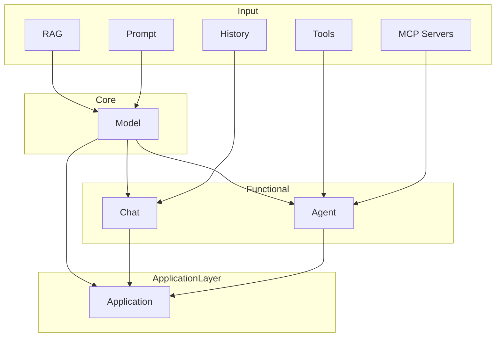

# AIDK


### The complete framework to build AI-powered applications


**AIDK** is the Python framework that enables structured, standardized, and efficient interactions with multiple AI models to develop production-ready AI Applications and AI Agents.

---

## Installation
You can install AIDK via PyPi.
```
pip install aidk
```

### 🔑 API Key Management
AIDK simplifies API key management through a `providers.keys` file in the root directory.  
Each line should follow this format:
```
PROVIDER_NAME=API_KEY
```

**Example `providers.keys`:**
```
OPENAI=sk-proj-ABCDE12345
DEEPSEEK=sk-proj-FGHIJ67890
```

**Important:** do *not* commit your `providers.keys` file to version control — the project ignores `*.keys` and `providers.keys` is explicitly ignored via `.gitignore`. Use `providers.keys.example` as a template and keep the real `providers.keys` out of the repository.

AIDK automatically loads these keys at runtime — no extra setup needed.

#### Keys on Google Colab
If you are working on Google Colab, just put your API KEYS in "Secrets", AIDK will load them automatically.

---

## 🚀 Quick Start

### 1. Use a Model
```python
from aidk.models import Model

model = Model(provider="openai", model="gpt-4o-mini")
response = model.ask("What is 2 + 2?")
print(response["response"])  # 4
```

---

### 2. Load Prompt from .prompt file

```
# sum.prompt
<prompt response_type="int">
What is 2 + 2?
</prompt>
```

```python
from aidk.models import Model
from aidk.prompts import Prompt

model = Model(provider="openai", model="gpt-4o-mini")
prompt = Prompt(prompt_id="sum")
response = model.ask(prompt)
print(response["response"])  # 4
```
---

### 3. Create a Chat

```python
from aidk.models import Model    
from aidk.chat import Chat

model = Model(provider="openai", model="gpt-4o-mini")
chat = Chat(model=model, history="json")
response = chat.ask("Hi, I'm Giuseppe")
print(response["response"])  # "Hi Giuseppe, nice to meet you!"

response = chat.ask("What's my name?")
print(response["response"])  # "You are Giuseppe"
```

### 4. Create an Agent

```python
from aidk.models import Model   
from aidk.agents import Agent
from aidk.tools.websearch import search_web_with_duckduckgo
from aidk.tools.domain_whois import domain_whois 

model = Model(provider="openai", model="gpt-4o-mini")
agent = Agent(model=model, paradigm="react", tools=[search_web_with_duckduckgo, domain_whois])
response = agent.run("Look for information about the owner of the website profession.ai")
print(response["response"])  # Agent's response with domain information
```

### 5. Create an Application

```python
from aidk.models import Model   
from aidk.agents import Agent
from aidk.application import Application, RateLimiter
from aidk.tools.websearch import search_web_with_duckduckgo

model = Model(provider="openai", model="gpt-4o-mini")
agent = Agent(
  model=model,
  name="search_agent",
  agent_prompt="You are a helpful assistant who searches for information on the web",
  tools=[search_web_with_duckduckgo]
)

rate_limiter = RateLimiter(requests_per_minute=20)
application = Application(
  name="search_ai", 
  model=model, 
  agents=[agent], 
  rate_limiter=rate_limiter
)
application.serve(port=8000)
```

```bash
curl -X POST "http://localhost:8000/agent/search_agent" \
  -H "Content-Type: application/json" \
  -d '{"prompt":"What is ProfessionAI?"}'
```

---

## 📗 Conceptual Guide

AIDK is based on composable modules that enable the development of sophisticated and scalable AI architectures.



### 1. Prompt
The foundation of all AI interactions in AIDK. Prompts serve as the communication bridge between your application and the AI model, carrying not just the question or instruction, but also metadata about how the response should be structured and processed.

AIDK treats prompts as first-class citizens, supporting everything from simple text strings to complex structured objects loaded from files. The system can automatically detect response types, validate prompt structure, and even template variables for dynamic content generation. This approach ensures consistency across your application while providing the flexibility to handle complex prompt engineering scenarios.

The prompt system integrates seamlessly with the configuration hierarchy, allowing you to define reusable prompt templates that can be shared across different parts of your application. Whether you're building a simple Q&A system or a complex multi-step reasoning pipeline, the prompt layer provides the foundation for reliable AI communication.

### 2. Model
At the heart of AIDK lies the Model component, which abstracts away the complexity of different AI providers behind a unified interface. This architectural choice means you can switch between OpenAI's GPT models, Anthropic's Claude, Google's Gemini, or even local models without changing your application code.

The Model component handles all the low-level details of API communication, including authentication, request formatting, response parsing, and error handling. It provides both synchronous and asynchronous interfaces, with built-in streaming support for real-time applications. The system automatically manages token usage and costs, giving you visibility into your AI spending across different providers and models.

AIDK extends beyond traditional text models to support specialized model types for different media. Voice models enable speech-to-text and text-to-speech capabilities, allowing your applications to process audio input and generate spoken responses. Image models provide computer vision capabilities, enabling your applications to analyze, describe, and generate visual content. This multimodal approach ensures that your AI applications can handle the full spectrum of human communication, from text and voice to images and beyond.

### 3. Chat
The Chat component transforms simple model interactions into rich, context-aware conversations. It maintains the state of multi-turn dialogues, ensuring that each interaction builds upon previous exchanges. This persistence is crucial for creating applications that feel natural and intelligent to users.

AIDK's chat system supports multiple storage backends, from simple in-memory dictionaries for development to robust database solutions for production. The system can automatically summarize long conversation histories to manage token costs while preserving important context. This intelligent memory management allows for extended conversations without exponential cost growth.

The chat component also handles file attachments, enabling users to upload documents, images, or other content that becomes part of the conversation context. This multimodal capability opens up possibilities for document analysis, image understanding, and other complex AI applications that require processing multiple types of content.

### 4. Agent
Agents represent the pinnacle of AIDK's capabilities, combining the power of AI models with external tools and sophisticated reasoning patterns. Unlike simple chatbots, agents can perform complex tasks that require planning, tool usage, and iterative problem-solving.

The agent system supports multiple reasoning paradigms, each optimized for different types of tasks. The ReAct pattern enables step-by-step reasoning with action execution, while plan-and-execute agents break down complex problems into manageable steps. Programmatic agents can generate and execute code, while reflexion agents learn from their mistakes and improve over time.

Each agent can be equipped with a custom set of tools, from web search capabilities to database queries, API integrations, or even custom functions. This tool ecosystem allows agents to interact with the real world, making them capable of performing tasks that go far beyond simple text generation. The system handles tool execution, error recovery, and result integration seamlessly.

### 5. Application
The Application layer transforms your AI components into production-ready web services. It provides a complete HTTP and WebSocket API that exposes your models and agents to external clients, whether they're web applications, mobile apps, or other services.

The application layer includes enterprise-grade features like rate limiting, user authentication, health monitoring, and comprehensive error handling. It automatically generates API documentation and provides built-in endpoints for monitoring usage, managing rate limits, and validating user credentials.

The system supports both REST APIs for traditional web applications and WebSocket connections for real-time applications. This dual approach ensures that your AI services can integrate with any type of client application, from simple web forms to complex real-time dashboards. The application layer also handles CORS, security headers, and other web service concerns automatically.

## ⚙️ Configuration

AIDK can be configured globally using a `ai.yaml` file in your project root.

Supported configuration fields:

| Field             | Description                                          | Default             |
|-------------------|------------------------------------------------------|---------------------|
| `prompts_path`    | Directory where `.prompt` files are stored           | `""` (current folder) |
| `keysfile_path`   | Path to the API keys file                            | `"providers.keys"`  |
| `base_model`      | Default model to use when no model is specified      | None                |
| `supported_files` | Supported file types for prompt upload               | None                |
| `default_prompt`  | Default prompts for RAG, summary and file upload     | None                |
| `observability`   | List of observability platforms to use               | None                |

**Example `ai.yaml`:**
```yaml
base_model:
  provider: openai
  model: gpt-4o-mini
prompts_path: prompts
supported_files: 
  text: ["txt", "py", "md", "json", "csv"]
  image: ["png", "jpg", "jpeg", "gif", "webp"]
default_prompt:
  rag: "Use also the following information to answer the question: "
  summary: "Here is the summary of the conversation so far:\n\n"
  file: "Here is the content of the file:\n\n"
observability: ["logfire"]
```

---

## 👨‍💻 Command-line Interface

AIDK includes a CLI that supports various operations, such as serving applications and automatically optimizing and localizing prompts. You can find the full list of available commands in the documentation.


## 📚 Documentation

Full documentation is available at:  
👉 [AIDK Documentation](https://profession-ai.github.io/MonoAI/aidk.html)


## 📄 License

This project is licensed under the MIT License