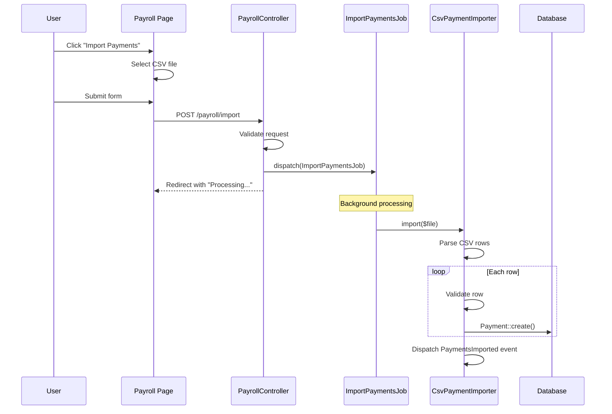

# Code Flow Documentation Workflow

**Goal:** Create user-friendly documentation that explains how a feature works, with screenshots and clear step-by-step instructions.

**Your Role:** You are a documentation specialist creating guides for END USERS, not developers. Focus on:
- **Codebase first** - Understand the implementation before capturing UI
- **Screenshots with context** - Know what to capture from code analysis
- **Plain English** - Avoid technical jargon
- **Step-by-step instructions** - What the user clicks/sees

**CRITICAL - CODEBASE BEFORE UI:**
Understanding the code FIRST ensures:
- You know what forms/fields exist (even hidden/conditional ones)
- You understand validation rules and can capture error states
- You know the complete flow path from code, not just visible UI
- Screenshots are comprehensive and accurate

**IMPORTANT - Screenshots are REQUIRED:**
- You MUST use Playwright MCP to capture screenshots
- If Playwright is not available, STOP and tell the user to install it
- Screenshots should show: the page, buttons to click, forms to fill

---

## STEP 0: FIND AND LOAD CONFIGURATION

**CRITICAL:** Before doing anything else, locate and load the configuration file.

### 0.1 Search for Config File

Search for `aidocs-config.yml` in this order:
1. `docs/aidocs-config.yml` (default location)
2. `./aidocs-config.yml` (project root)

**Also check for old config format:**
If `docs/config.yml` exists but `aidocs-config.yml` doesn't:
```
⚠️  Found old config format: docs/config.yml

Please rename it to: docs/aidocs-config.yml
Then run this command again.
```

### 0.2 If Config Found

Load the config and extract these values:
- `docs_root` → Base directory for all documentation (default: `docs`)
- `urls.base` → Base URL for screenshots (e.g., `https://app.example.com`)
- `auth.method` → How to authenticate for screenshots

### 0.3 If Config NOT Found

Display message and STOP:
```
⚠️  No aidocs-config.yml found.

This workflow requires a configuration file to run.

Would you like to create one now?
1. Yes - run /docs:init to set up configuration
2. No - I'll create docs/aidocs-config.yml manually
```

**If user chooses "Yes":** Execute the `/docs:init` workflow to walk through setup.
**If user chooses "No":** Stop and provide this minimal config template:

```yaml
# Minimal aidocs-config.yml
docs_root: docs
urls:
  base: "https://your-app.com"
auth:
  required: false
```

**IMPORTANT:** Do NOT proceed without config. Config is required.

### 0.4 Resolve Paths

Once config is loaded, set these path variables:
- `{docs_root}` → Use for all output paths (from config, default: `docs`)
- `{docs_root}/.auth` → Credentials file location
- `{docs_root}/flows/` → Flow documentation folder
- `{docs_root}/flows/images/` → Flow screenshots folder

---

## ARGUMENTS PARSING

Parse the arguments passed to this workflow. Expected format:
```
/docs:flow "<description>" [--technical] [--no-screenshots]
```

Examples:
```
/docs:flow "sync users from discord"              # User-focused (default)
/docs:flow "import payments from csv"             # User-focused (default)
/docs:flow "payment processing" --technical       # Developer-focused
/docs:flow "webhook handling" --no-screenshots    # Skip screenshots
```

Extract:
- `description` (required) - The natural language description of the flow
- `--technical` (optional) - Generate developer-focused documentation with code snippets, file paths, and technical diagrams
- `--no-screenshots` (optional) - Skip UI screenshot capture

**Output modes:**
- **Default (user-focused)**: Plain English, screenshots, step-by-step instructions for end users
- **Technical (`--technical`)**: Code snippets, file paths, call graphs, mermaid diagrams for developers

If description is missing or empty, ask the user:
```
Please describe the flow you want to document.

Examples:
  /docs:flow "sync users from discord"
  /docs:flow "create employees" --technical
```

---

## STEP 1: PARSE DESCRIPTION

Analyze the description to extract searchable terms.

### 1.1 Extract Keywords

From the description, identify:
- **Action verbs**: sync, import, export, process, handle, create, send, receive, update, delete
- **Entities/nouns**: users, payments, orders, webhooks, discord, stripe, email
- **Technical terms**: API, webhook, queue, job, cron, scheduled
- **UI hints**: button, page, form, modal, screen (indicates UI involvement)

### 1.2 Build Search Strategy

Generate search patterns:
- Direct matches: `discord`, `sync`, `user`
- Combined patterns: `sync.*user`, `discord.*user`
- Class name patterns: `SyncDiscord`, `DiscordUser`, `UserSync`
- File patterns: `*Discord*`, `*Sync*User*`

### 1.3 Identify Target Directories

Based on the action type, prioritize directories:

| Action Type | Primary Directories |
|-------------|---------------------|
| Sync/Import | Jobs/, Commands/, Services/ |
| Webhook | Controllers/, Listeners/, Webhooks/ |
| API Call | Services/, Clients/, Http/ |
| Scheduled | Jobs/, Console/, Commands/ |
| Event | Listeners/, Events/, Subscribers/ |
| Email | Mail/, Notifications/ |

### 1.4 Detect UI Involvement

Check if the flow likely has a UI component:
- Description contains: import, export, upload, download, button, form, page
- Action is user-initiated (not scheduled/webhook)

Flag: `has_ui_component = true/false`

Display progress:
```
📝 Parsing: "import payments from csv"

Extracted:
  Action: import (import/sync type)
  Entities: payments, csv
  Keywords: import, payments, csv, upload

Search strategy:
  Primary patterns: import.*payment, csv.*payment, PaymentImport
  Target directories: Jobs/, Commands/, Services/, Controllers/

UI Detection:
  ✓ "import" suggests user-initiated action
  ✓ May have UI trigger (button, form)
```

---

## STEP 2: SEARCH CODEBASE

Search for relevant files using the extracted keywords.

### 2.1 Search by Keywords

For each keyword, search in relevant directories:

```
🔍 Searching codebase...

[1/4] Searching "import.*payment" in Jobs/, Commands/, Services/...
[2/4] Searching "csv" in Controllers/, Services/...
[3/4] Searching class names with "Payment" and "Import"...
[4/4] Searching file names with "*Import*" or "*Payment*"...
```

### 2.2 Rank Results by Relevance

Score files based on:
- Keyword matches in filename (+30 points per match)
- Keyword matches in content (+10 points per match)
- Location in expected directory (+20 points)
- Class/function name matches (+25 points)

### 2.3 Display Found Files

```
📊 Found 6 relevant files:

  Score  File
  ─────  ────────────────────────────────────────────
  95%    app/Jobs/ImportPaymentsJob.php
  88%    app/Services/CsvPaymentImporter.php
  75%    app/Http/Controllers/PayrollController.php
  60%    app/Http/Requests/ImportPaymentsRequest.php
  45%    routes/web.php (POST /payroll/import)
  40%    resources/js/Pages/Payroll/Index.vue

Analyzing top files...
```

### 2.4 Extract UI Route (for screenshots)

From the found files, identify the UI route:

```
🔗 UI Route detected:
  Route: POST /payroll/import
  Controller: PayrollController@import
  View: resources/js/Pages/Payroll/Index.vue

  → UI Page: /payroll (where the import button lives)
```

### 2.5 Handle No Results

If no relevant files found:
```
⚠️  No relevant code found for: "import payments from csv"

Suggestions:
  • Try different keywords: "payment upload", "csv import"
  • Check if the feature exists in your codebase
  • Provide more specific terms

Would you like to try a different description?
```

---

## STEP 3: IDENTIFY ENTRY POINTS

Read the top-ranked files and identify how the flow is triggered.

### 3.1 Detect Entry Point Types

Look for these patterns:

**Controller Actions (User-initiated):**
```php
public function import(ImportPaymentsRequest $request)
```

**Jobs (Background):**
```php
class ImportPaymentsJob implements ShouldQueue
```

**Commands (Artisan):**
```php
protected $signature = 'payments:import {file}';
```

**Routes:**
```php
Route::post('/payroll/import', [PayrollController::class, 'import']);
```

### 3.2 Display Entry Points

```
📍 Entry points identified:

1. Controller: PayrollController@import
   └── Route: POST /payroll/import
   └── UI: /payroll page → "Import Payments" button
   └── Validation: ImportPaymentsRequest

2. Job: ImportPaymentsJob
   └── Dispatched by: PayrollController@import
   └── Queue: payments

3. Command: payments:import
   └── Artisan: php artisan payments:import {file}

Primary entry point: PayrollController@import (user-initiated)
UI Location: /payroll page
```

---

## STEP 4: TRACE EXECUTION FLOW

Starting from the primary entry point, trace the execution path.

### 4.1 Read Entry Point Code

Read the main method (controller action, handle(), etc.).

### 4.2 Build Call Graph

Trace method calls and identify:
- Request validation
- Service/class instantiations
- File processing
- Database operations
- Job dispatching
- Events/notifications

### 4.3 Display Call Graph

```
📊 Execution flow from: PayrollController@import()

PayrollController@import(ImportPaymentsRequest $request)
├── $request->file('csv')                           [File Upload]
├── ImportPaymentsJob::dispatch($file)              [Queue Job]
│   └── CsvPaymentImporter::import($file)
│       ├── Reader::createFromPath($file)           [CSV Parse]
│       ├── foreach ($rows as $row)
│       │   ├── PaymentValidator::validate($row)    [Validation]
│       │   └── Payment::create($data)              [Database]
│       └── event(new PaymentsImported($count))     [Event]
└── return redirect()->back()->with('success')      [Response]

Database operations:
  • payments table: insert (bulk)

Events dispatched:
  • PaymentsImported
```

---

## STEP 5: GENERATE MERMAID DIAGRAM

Create a sequence diagram showing the flow.

### 5.1 Identify Participants

From the call graph, extract:
- User/Browser (for UI-initiated flows)
- Controller
- Services
- Queue/Job
- Database
- Events

### 5.2 Generate Diagram



---

## STEP 6: CAPTURE UI SCREENSHOTS (REQUIRED)

**Screenshots are the MOST IMPORTANT part of the documentation.**

You MUST capture screenshots using Playwright MCP. Do NOT skip this step.

### 6.1 Check Playwright MCP

First, verify Playwright MCP is available by attempting to use it.

If Playwright MCP is NOT available:
```
❌ STOP: Playwright MCP is required for documentation.

Please install Playwright MCP to continue:
  https://github.com/anthropics/mcp-playwright

Or run with --no-screenshots flag (not recommended).
```

**DO NOT CONTINUE without screenshots unless --no-screenshots was explicitly provided.**

### 6.1b Use Codebase Knowledge to Plan Screenshots

**CRITICAL:** Before capturing any screenshots, use the knowledge gathered from Steps 1-5:

From your codebase analysis, you now know:
- **Entry points** → Which URLs/pages to navigate to
- **Form fields** → What inputs to show and fill
- **Validation rules** → What error states to trigger and capture
- **Flow steps** → The exact sequence of pages/actions
- **Conditional logic** → Hidden fields or states to reveal

```
📸 Planning screenshots based on code analysis:

From code analysis:
  • Entry point: PayrollController@import (POST /payroll/import)
  • UI page: /payroll
  • Form fields: csv (file upload)
  • Validation: file required, mimes:csv,txt, max:10240

Screenshots to capture:
  1. Payroll page with "Import" button visible
  2. Import modal/form (empty state)
  3. Form with file selected
  4. Validation error (wrong file type)
  5. Success state after import

This ensures we capture ALL relevant states, not just what's visible.
```

### 6.2 Authenticate (if needed)

**IMPORTANT:** Before capturing screenshots, check if authentication is required.

**Step 1: Check for credentials file**

Read the `{docs_root}/.auth` file if it exists:

```yaml
# {docs_root}/.auth format:
username: "user@example.com"
password: "secretpassword"
login_url: "/login"  # optional, defaults to /login
```

**Step 2: Check config for auth settings**

The config was already loaded in Step 0. Use:
- `auth.method` - How to authenticate (file, env, manual)
- `urls.base` - Base URL for login page

**Step 3: Perform login if credentials found**

If `{docs_root}/.auth` exists and contains credentials:

1. Navigate to login URL: `{base_url}/login` (or custom `login_url`)
2. Wait for login form to load
3. Fill username field (look for: input[type="email"], input[name="email"], #email)
4. Fill password field (look for: input[type="password"], input[name="password"], #password)
5. Click submit button (look for: button[type="submit"], input[type="submit"], button containing "Login"/"Sign in")
6. Wait for redirect/navigation to complete
7. Verify login succeeded (check for dashboard, user menu, or absence of login form)

```
🔐 Authenticating...
   Reading credentials from {docs_root}/.auth
   Navigating to: https://app.example.com/login
   Filling login form...
   ✓ Logged in successfully
```

**If login fails:**
```
⚠️ Authentication failed
   Could not log in with provided credentials.
   Continuing without screenshots.
```

### 6.3 Set Viewport Size

**IMPORTANT:** Always set a consistent viewport size before capturing screenshots:

```javascript
// Use browser_resize to set viewport
await page.setViewportSize({ width: 1440, height: 900 });
```

This ensures consistent positioning of highlight elements.

### 6.4 Navigate to UI Page

Navigate to the page where the flow is initiated:

```
🌐 Navigating to: https://app.example.com/payroll

   Loading page...
   Waiting for network idle...
```

### 6.5 Apply Spotlight Highlight (When Appropriate)

**Use highlights strategically - only for interactive elements the user needs to find or click.**

**WHEN TO USE highlights:**
- Buttons the user needs to click
- Form fields the user needs to fill
- Links or menu items to navigate
- Specific UI elements in a multi-step flow

**WHEN NOT TO use highlights:**
- Overview/context screenshots showing the full page
- Informational screens with no specific action
- Dashboard views meant to show layout
- Screenshots that are purely illustrative

The spotlight effect:
- Darkens the entire page with a semi-transparent overlay
- Creates a "cutout" around the highlighted element
- Adds a white glowing border for visibility

**Use `browser_run_code` with this pattern:**

```javascript
async (page) => {
  // Clear any existing highlights
  await page.evaluate(() => {
    document.querySelectorAll('[data-doc-highlight]').forEach(el => el.remove());
  });

  // Get the element to highlight
  const element = page.getByRole('button', { name: 'Import Payments' });
  const box = await element.boundingBox();
  if (!box) return 'Element not found';

  // Apply spotlight effect
  await page.evaluate((rect) => {
    // Dark overlay with cutout
    const spotlight = document.createElement('div');
    spotlight.setAttribute('data-doc-highlight', 'true');
    spotlight.style.cssText = `
      position: fixed;
      left: ${rect.x - 8}px;
      top: ${rect.y - 8}px;
      width: ${rect.width + 16}px;
      height: ${rect.height + 16}px;
      border-radius: 8px;
      z-index: 999999;
      pointer-events: none;
      box-shadow: 0 0 0 9999px rgba(0, 0, 0, 0.6);
    `;

    // White glow border
    const glow = document.createElement('div');
    glow.setAttribute('data-doc-highlight', 'true');
    glow.style.cssText = `
      position: fixed;
      left: ${rect.x - 4}px;
      top: ${rect.y - 4}px;
      width: ${rect.width + 8}px;
      height: ${rect.height + 8}px;
      border-radius: 6px;
      border: 3px solid rgba(255, 255, 255, 0.9);
      z-index: 1000000;
      pointer-events: none;
      box-shadow: 0 0 20px rgba(255, 255, 255, 0.5);
    `;

    document.body.appendChild(spotlight);
    document.body.appendChild(glow);
  }, box);

  return 'Spotlight applied';
}
```

**Highlight utility reference:** See `{docs_root}/highlight-utils.js` for templates.

### 6.6 Capture Screenshots

For each step in the flow:
1. Navigate to the appropriate page/state
2. Decide: Is this an action step or informational?
   - **Action step** → Apply spotlight highlight to the interactive element
   - **Informational** → Take clean screenshot without highlights
3. Take screenshot
4. Clear any highlights before next screenshot

**Screenshot 1: Overview (no highlight needed)**
```
📸 Capturing: Payroll page overview
   Type: Informational - showing page context
   Highlight: None

   Saved: {docs_root}/flows/images/payroll-overview.png
```

**Screenshot 2: Action step (with highlight)**
```
📸 Capturing: Import button location
   Type: Action - user needs to click this
   Applying spotlight to: "Import Payments" button

   Saved: {docs_root}/flows/images/import-payments-button.png
```

**IMPORTANT: Screenshot Output Directory**
Always save screenshots to `{docs_root}/flows/images/` within the project, NOT to `.playwright-mcp/` or other temporary directories.

Use the `filename` parameter with `browser_take_screenshot`:
```javascript
// Correct - saves to project docs folder
{ filename: "{docs_root}/flows/images/screenshot-name.png" }

// Wrong - saves to temporary playwright folder
{ filename: ".playwright-mcp/{docs_root}/flows/images/screenshot-name.png" }
```

**Screenshot 2: Modal/Form (if applicable)**
```
📸 Capturing: Import modal/form
   Clicking: "Import Payments" button
   Waiting for: modal or form
   Applying spotlight to: file upload field

   Saved: {docs_root}/flows/images/import-payments-form.png
```

### 6.7 Clear Highlights Between Screenshots

**IMPORTANT:** Always clear highlights before adding new ones:

```javascript
() => {
  document.querySelectorAll('[data-doc-highlight]').forEach(el => el.remove());
  return 'Cleared';
}
```

### 6.8 Screenshot Summary

```
📸 Screenshots captured:

  1. payroll-overview.png
     └── Payroll page context (no highlight)

  2. import-payments-button.png
     └── "Import Payments" button highlighted (action step)

  3. import-payments-form.png
     └── File upload field highlighted (action step)

Screenshots saved to: {docs_root}/flows/images/
```

---

## STEP 7: EXTRACT CODE SNIPPETS

Extract the most relevant code sections with file:line references.

### 7.1 Prioritize Code Sections

Extract in order of importance:
1. Entry point method (controller action, handle)
2. Request validation rules
3. Main business logic (service)
4. Database operations
5. Event dispatching

### 7.2 Format Snippets

For each snippet, include:
- File path with line numbers
- Language identifier for syntax highlighting
- Brief description of what it does

```php
// app/Http/Controllers/PayrollController.php:45-58
public function import(ImportPaymentsRequest $request)
{
    $file = $request->file('csv');

    ImportPaymentsJob::dispatch(
        $file->store('imports'),
        auth()->id()
    );

    return redirect()
        ->back()
        ->with('success', 'Import started. You will be notified when complete.');
}
```

---

## STEP 8: GENERATE DOCUMENTATION

Create the markdown file with all gathered information.

### 8.1 Create Output Directory

Ensure `{docs_root}/flows/` and `{docs_root}/flows/images/` directories exist.

### 8.2 Generate Filename

Convert description to kebab-case:
- "import payments from csv" → `import-payments-from-csv.md`

### 8.3 Write Markdown File

Use this USER-FOCUSED template (avoid technical jargon):

```markdown
# {Title - Action-oriented, e.g., "How to Import Payments"}

{One sentence explaining what users can do with this feature}

## Before You Start

{List any prerequisites in plain English}
- What the user needs to have ready
- Any permissions required
- File format requirements (if applicable)

## Steps

### Step 1: {Action verb - e.g., "Go to Payroll"}

{Simple instruction in plain English}


### Step 2: {Action verb - e.g., "Click Import"}

{Simple instruction}


### Step 3: {Action verb - e.g., "Upload Your File"}

{Simple instruction}


### Step 4: {Action verb - e.g., "Review and Confirm"}

{Simple instruction}


## What Happens Next

{Explain what the user should expect after completing the steps}
- How long it takes
- Where to see results
- Any notifications they'll receive

## Troubleshooting

{Common issues and solutions in plain English}

| Problem | Solution |
|---------|----------|
| "{Error message user might see}" | {How to fix it} |

---

*Documentation generated by [aidocs](https://github.com/binarcode/aidocs-cli)*
```

**IMPORTANT OUTPUT RULES (User-focused mode - default):**
- NO file paths or line numbers
- NO code snippets (unless it's a developer tool)
- NO technical diagrams (unless specifically requested)
- Use action verbs: "Click", "Go to", "Enter", "Select"
- Write for someone who has never seen the app before

---

### 8.3b TECHNICAL TEMPLATE (only if `--technical` flag provided)

If `--technical` flag was provided, use this developer-focused template instead:

```markdown
# {Title from Description}

## Overview

{Brief technical description of what this flow does}

## Architecture

```mermaid
{Generated sequence diagram showing all components}
```

## Entry Points

| Trigger | Location | Route/Command |
|---------|----------|---------------|
| UI | /payroll | POST /payroll/import |
| CLI | Artisan | `php artisan payments:import` |
| API | REST | POST /api/v1/payments/import |

## Execution Flow

### 1. Request Handling

**File:** `app/Http/Controllers/PayrollController.php:45`

```php
public function import(ImportPaymentsRequest $request)
{
    $file = $request->file('csv');
    ImportPaymentsJob::dispatch($file->store('imports'));
    return redirect()->back()->with('success', 'Import started');
}
```

### 2. Validation

**File:** `app/Http/Requests/ImportPaymentsRequest.php:12`

| Field | Rules |
|-------|-------|
| csv | required, file, mimes:csv,txt, max:10240 |

### 3. Background Processing

**File:** `app/Jobs/ImportPaymentsJob.php:28`

```php
public function handle(CsvPaymentImporter $importer)
{
    $importer->import($this->filePath);
}
```

### 4. Business Logic

**File:** `app/Services/CsvPaymentImporter.php:15`

{Code snippet of main logic}

## Database Operations

| Table | Operation | Description |
|-------|-----------|-------------|
| payments | INSERT | Creates payment records |
| import_logs | INSERT | Logs import progress |

## Events Dispatched

- `PaymentsImported` - After successful import

## Configuration

- `config/queue.php` - Queue connection
- `QUEUE_CONNECTION` - Environment variable

## Related Files

| File | Purpose |
|------|---------|
| app/Http/Controllers/PayrollController.php | HTTP entry point |
| app/Jobs/ImportPaymentsJob.php | Background job |
| app/Services/CsvPaymentImporter.php | Core import logic |

---

*Documentation generated by [aidocs](https://github.com/binarcode/aidocs-cli)*
```

**TECHNICAL MODE RULES:**
- Include file paths with line numbers
- Show relevant code snippets
- Include mermaid sequence diagrams
- Document database operations
- List events and configuration
- Write for developers who need to understand/modify the code

---

### 8.4 Save File

Write to `{docs_root}/flows/{kebab-case-title}.md`

---

## STEP 9: COMPLETION SUMMARY

Display final summary:

```
✅ Flow Documentation Complete

📄 Output: {docs_root}/flows/import-payments-from-csv.md

📊 Analysis Summary:
   Files analyzed: 6
   Entry points found: 3
   Code snippets: 5
   Diagram: sequenceDiagram
   Screenshots: 2

📸 Screenshots captured:
   • import-payments-trigger.png (Payroll page)
   • import-payments-form.png (Import modal)

📁 Key files documented:
   • app/Http/Controllers/PayrollController.php
   • app/Jobs/ImportPaymentsJob.php
   • app/Services/CsvPaymentImporter.php

💡 Suggestions:
   • Review the generated documentation for accuracy
   • Add any domain-specific context
   • Consider documenting error handling flows
```

---

## ERROR HANDLING

| Error | Action |
|-------|--------|
| No description provided | Ask user for description |
| No relevant files found | Suggest alternative keywords |
| File read error | Skip file, note in output |
| Playwright MCP missing | Skip screenshots, note in output |
| Screenshot failed | Continue without screenshot, note in output |
| Auth failed | Skip screenshots, suggest checking credentials |
| No UI route found | Skip screenshots, document code-only |

---

## TIPS

- Be thorough in keyword extraction - more search terms = better results
- Follow dependency injection to trace service calls
- Look for Request classes to find validation rules
- Check for Vue/React components that correspond to routes
- If a flow has both UI and CLI entry points, document both
- Screenshots are optional but greatly improve documentation quality
