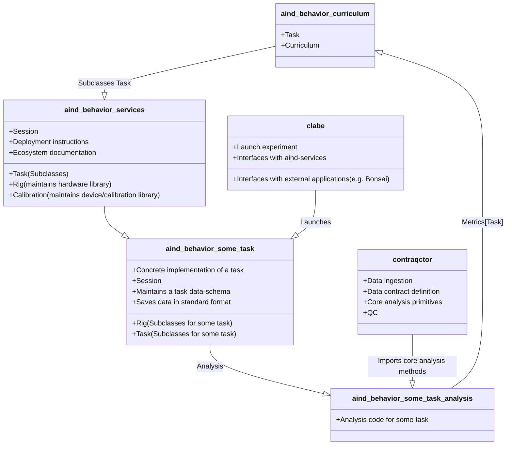

# aind-behavior-services


[](https://pypi.org/project/aind-behavior-services/)
[](LICENSE)
[](https://github.com/astral-sh/ruff)
[](https://github.com/astral-sh/uv)

A library for defining and maintaining behavior tasks.

---

## Installation

The python package can be installed from pypi using the following command:

```bash
pip install aind-behavior-services
```

However, to use all the tasks and hardware that this package supports, you should over over the [prerequisites](#prerequisites) and [deployment](#deployment) sections.

## Prerequisites

These should only need to be installed once on a fresh new system, and are not required if simply refreshing the install or deploying to a new folder.

- Windows 10 or 11
- Run `./scripts/install_dependencies.ps1` to automatically install dependencies
- The following dependencies should be manually installed:
  - [Spinnaker SDK 1.29.0.5](https://www.flir.co.uk/support/products/spinnaker-sdk/#Downloads) (device drivers for FLIR cameras)

    - On FLIR website: `Download > archive > 1.29.0.5 > SpinnakerSDK_FULL_1.29.0.5_x64.exe`

---

## Deployment

Install the [prerequisites](#prerequisites) mentioned below.
From the root of the repository, run `./scripts/deploy.ps1` to bootstrap both python and bonsai environments.

---

## Generating valid JSON input files

One of the core principles of this repository is the strict adherence to [json-schemas](https://json-schema.org/). We use [Pydantic](https://pydantic.dev/) as a way to write and compile our schemas, but also to generate valid JSON input files. These files can be used by Bonsai (powered by [Bonsai.SGen](https://github.com/bonsai-rx/sgen) code generation tool) or to simply record metadata. Examples of how to interact with the library can be found in the `./examples` folder.

---

## Regenerating schemas

Once a Pydantic model is updated, updates to all downstream dependencies must be made to ensure that the ground-truth data schemas (and all dependent interoperability tools) are also updated. This can be achieved by running `uv run ./src/_generators/<__init__.py>` from the root of the repository.
This script will regenerate all `json-schemas` along with `C#` code (`./scr/Extensions`) used by the Bonsai environment.

---

## Contributors

Contributions to this repository are welcome! However, please ensure that your code adheres to the recommended DevOps practices below:

### Linting

We use [ruff](https://docs.astral.sh/ruff/) as our primary linting tool.

### Testing

Attempt to add tests when new features are added.
To run the currently available tests, run `python -m unittest` from the root of the repository.

### Lock files

We use [uv](https://docs.astral.sh/uv/) to manage our lock files.

### Versioning

Where possible, adhere to [Semantic Versioning](https://semver.org/).

---

## Project dependency tree




