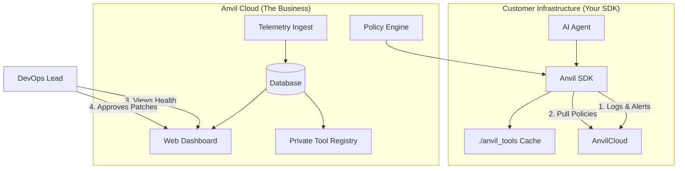

You have an excellent **Execution Engine** (the "Muscle").
What you are missing is the **Control Plane** (the "Brain" and "report card").

To turn this from a cool GitHub repo into a **B2B Enterprise Business**, you need to build the layer that allows a CTO to sleep at night. You are moving from "Developer Tool" to "Infrastructure Platform."

Here is the **Enterprise Delta**—the specific components you need to build on top of your current SDK to make it a sellable business.

---

### 1. The "Anvil Cloud" (The SaaS Dashboard)

Currently, Anvil runs locally. To charge money, you need a centralized dashboard where teams can see their agent fleet's health.

* **The "Health" Monitor:** A Datadog-style dashboard showing real-time status of all tools.
* *Visual:* A grid of traffic lights. Green = Healthy. Yellow = Patched recently. Red = Needs human intervention.

* **The "Fix" Timeline:** A log showing exactly *when* a tool broke and *how* Anvil fixed it.
* *Value:* This proves your ROI. "Anvil saved you 40 engineering hours this week."

* **Remote Configuration:** Push config updates (e.g., "Rotate API Key for Stripe") from the dashboard to all running agents without redeploying code.

### 2. The "Telemetry" Link (The Glue)

You need to update `logger.py` and `core.py` to send events to your cloud (asynchronously, so it doesn't slow down the agent).

* **Heartbeats:** Agents ping "I'm alive."
* **Incident Reports:** When `Self-Healing` kicks in, it sends a payload: `Original Error`, `Generated Patch`, `Success/Fail`.
* **Usage Metrics:** Number of tool calls, latency, and token costs for repairs.

### 3. Enterprise Governance (The "Permission to Buy")

Large companies won't let self-healing code run wild. You need **Policy-as-Code**.

* **The "Human-in-the-Loop" Gate:**
* *Feature:* If a tool tries to import a sensitive library (e.g., `os`, `subprocess`) or access a blocked domain, Anvil pauses execution and Slack/Emails the admin for approval.

* **Allowed/Blocked Lists:** A centralized policy defining:
* *Allowed:* `requests`, `pandas`, `numpy`
* *Blocked:* `socket`, `ftplib`, `crypto_mining_lib`

* **Secret Redaction:** Ensure that when logs are sent to Anvil Cloud, API keys and PII are stripped out automatically.

### 4. The Private Registry ("Internal PyPI")

Enterprises hate "generating from scratch" every time. They want **Standardization**.

* **The Feature:** A private, versioned hub for "Golden Tools."
* **Workflow:**
1. Developer A builds a "Salesforce Query Tool" that works perfectly.
2. They push it to the **Anvil Private Registry**.
3. Developer B's agent pulls that exact version instead of trying to generate a new one.
4. If Salesforce changes their API, Anvil updates the Golden Tool *once*, and all agents inherit the fix.

### 5. Collaboration Features

* **SSO (Single Sign-On):** Support Okta/Google Workspace (Non-negotiable for enterprise).
* **RBAC (Role-Based Access Control):**
* *Admin:* Can approve patches and change policies.
* *Developer:* Can view logs and debug.
* *Viewer:* Can only see the dashboard.

---

### **The Updated Architecture Diagram (Target State)**

To be a business, your architecture needs to expand to this:

### **Immediate Next Step: The "Ghost" Dashboard**

You don't need to build the backend yet. You need to **fake the frontend** to sell the vision.

1. **Build a simple React/Next.js page.**
2. **Mock up data:** Show a graph of "Tools Broken vs. Tools Fixed." Show a list of "Recent Incidents" (e.g., "Stripe API v2 -> v3 Patch: Success").
3. **The Pitch:** Show this to a potential customer and say, *"This SDK runs locally, but this dashboard tells you when it saves your butt. Would you pay $20/month per agent for this view?"*

Do you want me to generate a **JSON Schema** for the "Incident Report" that your SDK would send to the cloud? This effectively defines the API for your SaaS.