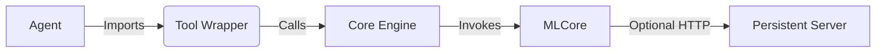

# CrewAI Enterprise Tools

> [!IMPORTANT]
> **INTERNAL PACKAGE**
> This package is for internal use only and is distributed via our **Private PyPI** registry. Do not publish to public PyPI.

## Overview
This repository functions as a centralized **Tool Registry** for CrewAI agents. It bridges the gap between high-level agentic reasoning and low-level, heavy-duty processing engines.

**For:** AI Engineers & Agent Developers using CrewAI.

> [!NOTE]
> A compatibility shim is applied for OCR tooling to support legacy langchain interfaces. This is only imported when OCR is used.

## Environment Variables
The following environment variables are required for runtime usage:

| Variable | Description | Required For |
| :--- | :--- | :--- |
| `OPENAI_API_KEY` | OpenAI API Key (starts with `sk-`) | Core Agent Logic |
| `GMAIL_EMAIL` | Google Workspace Email Account | Gmail Tools |
| `GMAIL_PASSWORD` | App Password (not login password) | Gmail Tools |

## Design Philosophy
We follow a strict **Four-Tier Architecture** to ensure Scalability and Stability:

1.  **Agents (Consumers)**: The CrewAI agents that define *why* a task is done.
2.  **Tools (`tools/`)**: The **Public Interface**. Lightweight wrappers that define *how* an agent calls a function.
3.  **Cores (`cores/`)**: The **Heavy Engines**. Complex logic (external APIs, protocol handling).
4.  **MLCore (`mlcore/`)**: The **Intelligence Assets**. Proprietary model weights and inference logic.



## Discovery & Usage
Tools are located in `tools/<tool_name>/tool.py`.

### Installation
1. Clone the repository.
2. Install in editable mode:
   ```bash
   pip install -e .
   ```

### Usage
Now you can import tools from anywhere on your system:

```python
from crewai import Agent
from apolis_ai_tools import OutlookSendTool
# ... imports ...

# Instantiate
outlook_tool = OutlookSendTool()

data_agent = Agent(
    role="...",
    goal="...",
    tools=[outlook_tool],
    verbose=True
)
```
*See individual tool READMEs for specific instructions.*

## Available Tools

### Document Processing
- **DocParserTool** (`parse_document`) - Extract structured data from PDFs with OCR fallback
  - Uses Docling + PaddleOCR for robust extraction
  - Returns pages, blocks, tables, and layout information
  - [Documentation](tools/doc_parser/README.md)

### Email Integration
- **GmailSendTool** - Send emails via Gmail SMTP
- **GmailSearchTool** - Search Gmail inbox with filters
- **GmailDraftTool** - Create email drafts
  - [Documentation](tools/gmail_tools/README.md)

### Validation
- **ValidateExtractionTool** - Validate extracted data with automatic confidence scoring
  - Type validation (string, number, date, email, currency, percentage, etc.)
  - Constraint validation (min/max, patterns, enums)
  - Business rule validation
  - Pre-built schemas for hotel contracts, invoices, contacts
  - [Documentation](tools/validation/README.md)

### Enterprise Email
- **OutlookTools** - Microsoft Outlook integration for enterprise environments
  - [Documentation](tools/outlook_tools/README.md)

## Installation Details

| Method | Command | Use Case |
| :--- | :--- | :--- |
| **Editable** | `pip install -e .` | Best for development. Changes to code update immediately. |
| **Standard** | `pip install .` | Best for deployment. Freezes the code version. |

> [!NOTE]
> The package name is `apolis-ai-tools`. All imports must start with `apolis_ai_tools.`.

## Strict Usage Rules
1.  **NO Core Imports**: Agents must never import from `cores/`. Treat `cores` as internal implementation details that may change or move to microservices.
2.  **Immutability**: Do not modify tool code to fit an agent's prompt. Fix the prompt, not the tool.
3.  **Statelessness**: Tools should be stateless. If state is needed (e.g., loading a 5GB model), it must remain in the **Core** or a **Server**.

## Acceleration Infrastructure
Some tools require heavy initialization.
-   These tools support an optional **Server Mode**.
-   If a local server is running, the tool automatically detects it for 10x-100x speedups.
-   If not, it falls back to local execution.
-   *See individual tool READMEs for specific server instructions.*

## Versioning & Stability
-   **Tools**: Semantic Versioning. Breaking changes to input/output schemas will be major version bumps.
-   **Cores**: Internal APIs may change without notice. Only the Tool wrapper is guaranteed stable.

## Common Anti-Patterns
-   ❌ Importing `cores.tool_name_core.app` directly in an agent script.
-   ❌ Hardcoding server start commands inside an agent (Servers should be long-running background processes).
-   ❌ Parsing JSON outputs manually with regex (Trust the structured return).

## Best Practices: Tool Implementation

When contributing new tools, choose the right implementation pattern:

### 1. Functional Tools (`@tool`)
*Best for: Simple, Single-Argument Tools*
- Use the simple `@tool` decorator.
- **Pros**: Minimal code, easy to read.
- **Cons**: Limited schema validation. CrewAI infers schema from type hints, which can sometimes fail with complex types.
- **Example**: `doc_parser` (Accepts a single `file_path` string).

### 2. Class-Based Tools (`BaseTool` + `args_schema`)
*Best for: Complex, Multi-Argument Tools*
- Create a class inheriting from `crewai.tools.BaseTool`.
- Define a Pydantic model for input and assign it to `args_schema`.
- **Why?**: This enforces strict validation and generation of correct JSON schemas for the LLM. It prevents common "Action Input" errors where the LLM sends unstructured data.
- **Example**: `gmail_tools` (Requires precise distinct arguments like `to_emails`, `subject`, `body`).

```python
# Standard Pattern for Robust Tools
class MyToolInput(BaseModel):
    arg1: str = Field(..., description="...")
    arg2: int = Field(..., description="...")

class MyTool(BaseTool):
    name: str = "my_tool"
    args_schema: Type[BaseModel] = MyToolInput
    def _run(self, arg1: str, arg2: int): ...
```
