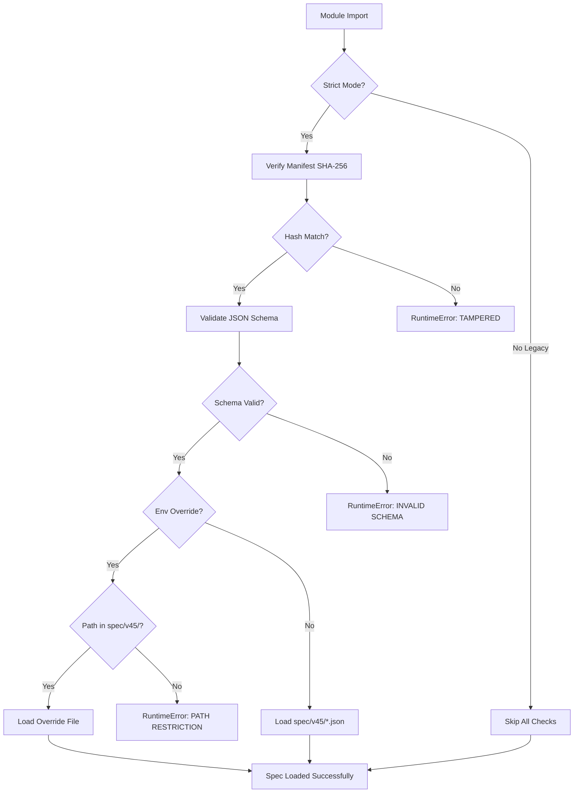

# SEAL CHECKLIST - Track B v45 Spec Integrity

**Version:** v45.0
**Last Updated:** 2025-12-25
**Purpose:** Audit procedures for cryptographic integrity verification of Track B specifications

---

## Overview

Track B v45 specifications use **SHA-256 manifest verification** to ensure tamper-evident integrity at load-time. This checklist provides auditors with 3-command proof of spec integrity.

**Authority:** spec/v45/ is the SINGLE SOURCE OF TRUTH for tunable thresholds (F1-F9 floors, GENIUS LAW constants, session physics).

---

## Strict vs Legacy Behavior

| Mode | Trigger | Manifest Verification | Schema Validation | Env Override Path Restriction |
|------|---------|----------------------|-------------------|------------------------------|
| **Strict (default)** | `ARIFOS_ALLOW_LEGACY_SPEC=0` or unset | ✅ ENFORCED (fail-closed) | ✅ ENFORCED (fail-closed) | ✅ ENFORCED (spec/v45/ only) |
| **Legacy (bypass)** | `ARIFOS_ALLOW_LEGACY_SPEC=1` | ❌ SKIPPED | ❌ SKIPPED | ❌ SKIPPED (external paths allowed) |

**Strict mode guarantees:**
1. All specs match SHA-256 manifest hashes (tamper detection)
2. All specs match JSON Schema structure (validation)
3. Env overrides (`ARIFOS_FLOORS_SPEC`, `ARIFOS_GENIUS_SPEC`, `ARIFOS_PHYSICS_SPEC`) must point to files within `spec/v45/` directory

**Legacy mode risks:** NO cryptographic verification, NO schema validation, allows untrusted external specs.

---

## 3-Command Proof for Auditors

### Proof 1: Verify Manifest Hashes Match Current Files

```bash
python scripts/regenerate_manifest_v45.py --check
```

**Expected output (if integrity OK):**
```
[SUCCESS] All 8 files match manifest.
Spec integrity verified. No tampering detected.
```

**Exit code:** 0 (success)

**If tampered:**
```
[FAILURE] Manifest verification failed!

Hash mismatches (1) - FILES HAVE BEEN MODIFIED:
  - spec/v45/constitutional_floors.json
```

**Exit code:** 1 (failure)

---

### Proof 2: Run Manifest Enforcement Tests (Subprocess Proof)

```bash
pytest tests/test_spec_v44_manifest_enforcement_subprocess.py -v
```

**Expected output (excerpt):**
```
test_default_import_verifies_manifest_successfully PASSED
test_tampered_spec_file_triggers_manifest_mismatch PASSED
test_missing_manifest_triggers_hard_fail PASSED
test_legacy_mode_bypasses_manifest_verification PASSED
```

**Exit code:** 0 (all tests pass)

**What this proves:**
- Fresh Python subprocess loads specs → manifest verification triggers at import time
- Tampered files cause RuntimeError with "MANIFEST MISMATCH" message
- Missing manifest causes hard fail (fail-closed)
- Legacy mode correctly bypasses verification (when explicitly enabled)

---

### Proof 3: Try Tampering a Spec (Should Fail in Strict Mode)

```bash
# Tamper with a spec file (change one value)
echo '{"version":"TAMPERED"}' > spec/v45/constitutional_floors.json

# Try to import (should fail with manifest mismatch)
python -c "from arifos_core.enforcement.metrics import _FLOORS_SPEC_V38; print('SHOULD NOT REACH HERE')"
```

**Expected output (strict mode):**
```
RuntimeError: TRACK B AUTHORITY FAILURE: Manifest verification failed.

Hash mismatches (1) - FILES HAVE BEEN TAMPERED:
  - spec/v45/constitutional_floors.json
    Expected: 3f0894faffb84fbad1c84018dd7273c43a5c6633bc0b4ec63f3a773a9d23846a
    Actual:   <different hash>

To fix:
  1. Restore original files from git
  2. Or regenerate manifest: python -m arifos_core.spec.regenerate_manifest
  3. Or bypass (NOT RECOMMENDED): set ARIFOS_ALLOW_LEGACY_SPEC=1
```

**Exit code:** Non-zero (import failed)

**Restore original:**
```bash
git restore spec/v45/constitutional_floors.json
```

---

## Manifest File Structure

**Location:** `spec/v45/MANIFEST.sha256.json`

**Format:**
```json
{
  "version": "v45.0",
  "created_at": "2025-12-25T07:26:30.601458Z",
  "algorithm": "SHA-256",
  "description": "Cryptographic manifest for Track B v45 specifications (tamper-evident integrity)",
  "files": {
    "spec/v45/constitutional_floors.json": "3f0894faffb84fbad1c84018dd7273c43a5c6633bc0b4ec63f3a773a9d23846a",
    "spec/v45/genius_law.json": "b1b697f418c7bff14020a50dd2b44c8fdef67cf98c78d7ca8d53b84f52992133",
    "spec/v45/session_physics.json": "a5b0babf0d16c8021d934b6fbd551251ed5d81ec18746c77b6f4adda094ae84f",
    "spec/v45/red_patterns.json": "56318d307fdac873f90c3155cb63cee5c5519422126e1265686488a009d40fe4",
    "spec/v45/schema/constitutional_floors.schema.json": "e79ce809c0124e7421ab3895433078aedcacad27327385562e85e150e3f11d37",
    "spec/v45/schema/genius_law.schema.json": "b2376388611f40f33f2b7ebdcf0351726c39a03f96c4344f9e9e9fec38242d1a",
    "spec/v45/schema/session_physics.schema.json": "cf1605835961304897494eaeb539350c62f3b6216b6283e38b334d879a18cb3d",
    "spec/v45/schema/red_patterns.schema.json": "adb6b6cf246f29d18e22c8cdedfd8a79bf19bcfa95d5f882c6bb479c060c5d06"
  }
}
```

**Covered files (8 total):**
- 4 spec files (constitutional_floors, genius_law, session_physics, red_patterns)
- 4 schema files (JSON Schema Draft-07 validation)

---

## Regenerating the Manifest (After Intentional Changes)

**⚠️ WARNING:** Only regenerate if you INTENTIONALLY modified spec files. Regenerating after tampering defeats the purpose of integrity verification.

```bash
# Regenerate manifest with current file hashes
python scripts/regenerate_manifest_v45.py

# Commit both spec changes AND new manifest together
git add spec/v45/
git commit -m "feat(v44): Update constitutional floors thresholds + manifest"
```

---

## Env Override Security (Strict Mode)

In strict mode (`ARIFOS_ALLOW_LEGACY_SPEC=0` or unset), env overrides are path-restricted:

**Allowed (within spec/v45/):**
```bash
export ARIFOS_FLOORS_SPEC="spec/v45/constitutional_floors.json"  # ✅ OK
export ARIFOS_GENIUS_SPEC="spec/v45/genius_law.json"            # ✅ OK
```

**Rejected (outside spec/v45/):**
```bash
export ARIFOS_FLOORS_SPEC="/tmp/custom_floors.json"  # ❌ FAIL (path outside spec/v45/)
export ARIFOS_FLOORS_SPEC="../malicious.json"        # ❌ FAIL (path outside spec/v45/)
```

**Error message (strict mode):**
```
RuntimeError: TRACK B AUTHORITY FAILURE: Environment override points to path outside spec/v45/.
  Override path: /tmp/custom_floors.json
  Expected within: /path/to/repo/spec/v44
In strict mode, only manifest-covered files (spec/v45/) are allowed.
Set ARIFOS_ALLOW_LEGACY_SPEC=1 to bypass (NOT RECOMMENDED).
```

**Rationale:** Strict mode ensures env overrides point to manifest-verified files only (tamper-evident).

---

## Verification Workflow Summary



---

## CI Integration Example

```yaml
# .github/workflows/seal-check.yml
name: Spec Integrity Check

on: [push, pull_request]

jobs:
  verify-manifest:
    runs-on: ubuntu-latest
    steps:
      - uses: actions/checkout@v3
      - uses: actions/setup-python@v4
        with:
          python-version: '3.10'
      - name: Verify manifest hashes
        run: python scripts/regenerate_manifest_v45.py --check
      - name: Run manifest enforcement tests
        run: pytest tests/test_spec_v44_manifest_enforcement_subprocess.py -v
```

**CI passes if:** All hashes match + all tests pass
**CI fails if:** Any file tampered or manifest out of sync

---

## Cryptographic Guarantees & Limitations

### ✅ What SHA-256 Manifest Provides
- **Tamper detection:** Any modification to spec files will cause hash mismatch
- **Fail-closed:** Invalid/tampered specs cause RuntimeError (no silent fallback)
- **Deterministic:** Same file → same hash (reproducible verification)
- **Load-time enforcement:** Verification happens at module import (before specs used)

### ❌ What SHA-256 Manifest Does NOT Provide
- **Authentication:** SHA-256 detects tampering but does NOT prove who created the file
- **Non-repudiation:** No cryptographic signatures (anyone can regenerate manifest)
- **Timestamp integrity:** Manifest creation time is self-reported (not tamper-proof)

**Recommendation:** For high-security deployments, consider adding GPG/PGP signatures:
```bash
gpg --sign --detach-sign --armor spec/v45/MANIFEST.sha256.json
```

---

## Quick Reference Card

| Task | Command |
|------|---------|
| Verify integrity (CI check) | `python scripts/regenerate_manifest_v45.py --check` |
| Run enforcement tests | `pytest tests/test_spec_v44_manifest_enforcement_subprocess.py -v` |
| Regenerate manifest (after intentional changes) | `python scripts/regenerate_manifest_v45.py` |
| Enable strict mode (default) | `export ARIFOS_ALLOW_LEGACY_SPEC=0` or unset |
| Enable legacy mode (bypass) | `export ARIFOS_ALLOW_LEGACY_SPEC=1` |
| Restore tampered files | `git restore spec/v45/` |

---

## Audit Trail

| Version | Date | Change | Authority |
|---------|------|--------|-----------|
| v45.0 | 2025-12-25 | Initial SHA-256 manifest + strict-mode env path restriction | Track B Consolidation |

---

**DITEMPA BUKAN DIBERI** — Forged, not given; truth must cool before it rules.

Authority sealed: Track B (tunable thresholds) governed by Track A canon.
