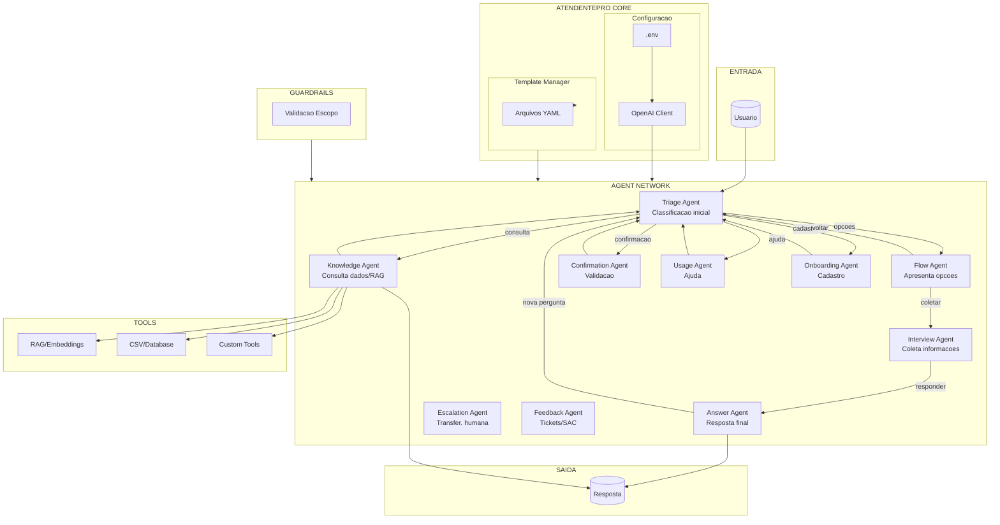
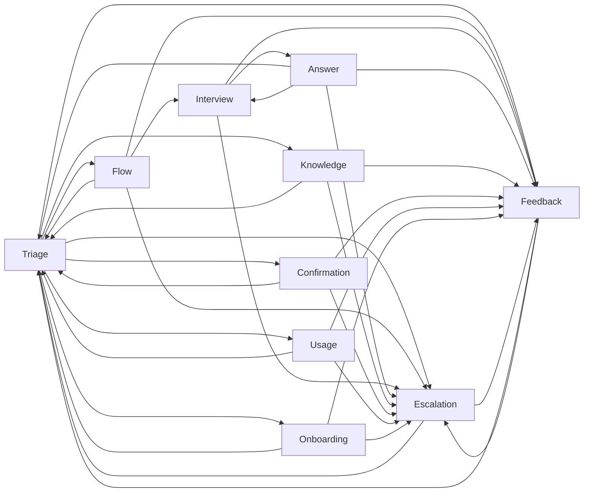
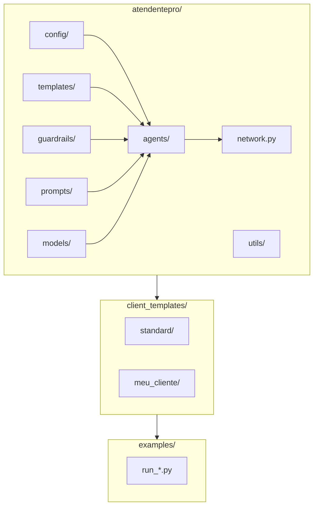
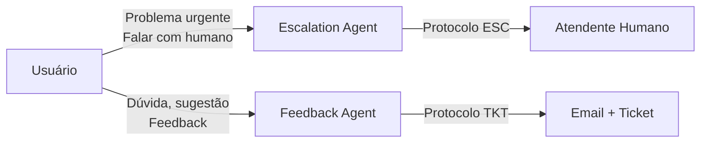

# AtendentePro 🤖

**Sistema de Atendimento Inteligente com Múltiplos Agentes IA**

Uma biblioteca Python modular e independente para criar sistemas de atendimento automatizado usando múltiplos agentes de IA especializados baseados no OpenAI Agents SDK.

---

## 📦 Instalação

```bash
# Ativar ambiente virtual
source venv/bin/activate

# Instalar a biblioteca
pip install -e .
```

---

## 🔑 Ativação (Obrigatório)

A biblioteca AtendentePro **requer um token de licença** para funcionar. Sem ativação, a biblioteca lançará um erro ao tentar criar agentes ou redes.

### Opção 1: Ativar via Código

```python
from atendentepro import activate

# Ativar a biblioteca
activate("ATP_seu-token-aqui")

# ✅ Agora pode usar normalmente
from atendentepro import create_standard_network
```

### Opção 2: Variável de Ambiente

```bash
# Definir no terminal ou no .env
export ATENDENTEPRO_LICENSE_KEY="ATP_seu-token-aqui"
```

```python
# A biblioteca ativa automaticamente se encontrar a variável
from atendentepro import create_standard_network  # ✅ Funciona automaticamente
```

### Opção 3: Arquivo .env

```bash
# .env
ATENDENTEPRO_LICENSE_KEY=ATP_seu-token-aqui
OPENAI_API_KEY=sua-chave-openai
```

```python
from dotenv import load_dotenv
load_dotenv()

from atendentepro import create_standard_network  # ✅ Funciona automaticamente
```

### Verificar Status da Licença

```python
from atendentepro import is_activated, get_license_info

# Verificar se está ativado
if is_activated():
    info = get_license_info()
    print(f"Organização: {info.organization}")
    print(f"Expira em: {info.expiration or 'Sem expiração'}")
    print(f"Features: {info.features}")
```

### Obter um Token

Entre em contato para obter seu token de licença:
- 📧 **Email:** contato@monkai.com.br
- 🌐 **Site:** https://www.monkai.com.br

---

## 🔐 Configurar API Key do OpenAI/Azure

A biblioteca precisa de uma chave de API para funcionar. Existem várias formas de configurar:

### Opção 1: Variáveis de Ambiente (Recomendado)

```bash
# Criar arquivo .env na raiz do projeto
ATENDENTEPRO_LICENSE_KEY=ATP_seu-token
OPENAI_API_KEY=sk-sua-chave-openai
```

```python
from dotenv import load_dotenv
load_dotenv()  # Carrega o .env

from atendentepro import create_standard_network
# ✅ API key carregada automaticamente!
```

### Opção 2: Função `configure()`

```python
from atendentepro import activate, configure, create_standard_network

# 1. Ativar licença
activate("ATP_seu-token")

# 2. Configurar API key programaticamente
configure(
    openai_api_key="sk-sua-chave-openai",
    default_model="gpt-4o-mini"  # Opcional: mudar modelo padrão
)

# 3. Usar normalmente
network = create_standard_network(...)
```

### Opção 3: Configuração Completa com `AtendentProConfig`

```python
from atendentepro import activate, configure, AtendentProConfig

activate("ATP_seu-token")

# Configuração detalhada
config = AtendentProConfig(
    provider="openai",
    openai_api_key="sk-sua-chave-openai",
    default_model="gpt-4o",
)

configure(config)
```

### Opção 4: Configurar Azure OpenAI

```python
from atendentepro import activate, configure, AtendentProConfig

activate("ATP_seu-token")

config = AtendentProConfig(
    provider="azure",
    azure_api_key="sua-chave-azure",
    azure_api_endpoint="https://seu-recurso.openai.azure.com",
    azure_api_version="2024-02-15-preview",
    azure_deployment_name="gpt-4o",  # Nome do deployment
)

configure(config)
```

### Opção 5: Variáveis de Ambiente para Azure

```bash
# .env
ATENDENTEPRO_LICENSE_KEY=ATP_seu-token
OPENAI_PROVIDER=azure
AZURE_API_KEY=sua-chave-azure
AZURE_API_ENDPOINT=https://seu-recurso.openai.azure.com
AZURE_API_VERSION=2024-02-15-preview
AZURE_DEPLOYMENT_NAME=gpt-4o
```

### Verificar Configuração Atual

```python
from atendentepro import get_config

config = get_config()
print(f"Provider: {config.provider}")
print(f"Model: {config.default_model}")
print(f"API Key configurada: {'Sim' if config.openai_api_key else 'Não'}")
```

### Tabela de Variáveis de Ambiente

| Variável | Descrição | Obrigatório |
|----------|-----------|-------------|
| `ATENDENTEPRO_LICENSE_KEY` | Token de licença | ✅ Sim |
| `OPENAI_API_KEY` | Chave API OpenAI | ✅ (se OpenAI) |
| `OPENAI_PROVIDER` | `openai` ou `azure` | Não (padrão: openai) |
| `DEFAULT_MODEL` | Modelo padrão | Não (padrão: gpt-4.1) |
| `AZURE_API_KEY` | Chave API Azure | ✅ (se Azure) |
| `AZURE_API_ENDPOINT` | Endpoint Azure | ✅ (se Azure) |
| `AZURE_API_VERSION` | Versão API Azure | ✅ (se Azure) |
| `AZURE_DEPLOYMENT_NAME` | Nome do deployment | Não |

---

## ⚡ Início Rápido

### 1. Ativar + Configurar Variáveis de Ambiente

```bash
# Token de licença
export ATENDENTEPRO_LICENSE_KEY="ATP_seu-token"

# Para OpenAI
export OPENAI_API_KEY="sua-chave-openai"

# Para Azure OpenAI (opcional)
export OPENAI_PROVIDER="azure"
export AZURE_API_KEY="sua-chave-azure"
export AZURE_API_ENDPOINT="https://seu-endpoint.openai.azure.com"
export AZURE_API_VERSION="2024-02-15-preview"
```

### 2. Uso Programático

```python
from pathlib import Path
from atendentepro import activate, create_standard_network
from agents import Runner
import asyncio

# 1. Ativar (ou use variável de ambiente)
activate("ATP_seu-token")

async def main():
    # 2. Criar rede com template específico
    network = create_standard_network(
        templates_root=Path("./client_templates"),
        client="meu_cliente"
    )
    
    # 3. Executar conversa
    result = await Runner.run(
        network.triage,
        [{"role": "user", "content": "Olá, preciso de ajuda"}]
    )
    
    print(result.final_output)

asyncio.run(main())
```

---

## 🏗️ Arquitetura

### Analogia: O Restaurante Inteligente 🍽️

Imagine o **AtendentePro** como um **restaurante sofisticado** onde cada funcionário tem uma função específica:

```
┌──────────────────────────────────────────────────────────────────────────────┐
│                       🍽️  RESTAURANTE ATENDENTEPRO                           │
├──────────────────────────────────────────────────────────────────────────────┤
│                                                                              │
│   👤 CLIENTE chega e é recebido pelo:                                       │
│                                                                              │
│   🚪 RECEPCIONISTA (Triage Agent)                                           │
│      └─ "Boa noite! Você quer jantar, fazer reserva ou tirar dúvida?"       │
│         Ele IDENTIFICA a intenção e DIRECIONA para o setor certo.           │
│                                                                              │
│   ┌──────────┬──────────┬──────────┬──────────┬──────────┬──────────┐       │
│   │          │          │          │          │          │          │       │
│   ▼          ▼          ▼          ▼          ▼          ▼          ▼       │
│                                                                              │
│   📋 MAITRE  📚 SOMME   ✅ CONFIRMA ❓ CONCI   📞 GERENTE 📝 SUGEST  🆕 VIP  │
│   (Flow)     (Knowledge) (Confirm)  (Usage)   (Escalat)  (Feedback) (Onb.)  │
│   "3 opções" "Malbec     "Confirma  "Deixa eu "Chamo o   "Quer      "Novo   │
│              2019"       2 pessoas?" explicar" gerente"  registrar?" aqui?"  │
│                                                                              │
│   │                                                                          │
│   ▼                                                                          │
│                                                                              │
│   📝 GARÇOM (Interview Agent)                                               │
│      └─ Coleta as informações: "Quantas pessoas? Alguma alergia?"           │
│                                                                              │
│   │                                                                          │
│   ▼                                                                          │
│                                                                              │
│   🍳 CHEF (Answer Agent)                                                    │
│      └─ Prepara a resposta final com todas as informações                   │
│                                                                              │
│   │                                                                          │
│   ▼                                                                          │
│                                                                              │
│   🎉 PRATO ENTREGUE (Resposta ao usuário)                                   │
│                                                                              │
│ ═══════════════════════════════════════════════════════════════════════════ │
│                                                                              │
│   📞 GERENTE (Escalation) ──► Transfere para atendimento humano IMEDIATO    │
│   📝 SUGESTÕES (Feedback) ──► Registra reclamações/sugestões para DEPOIS    │
│                                                                              │
│   💡 Qualquer agente pode chamar o Gerente ou enviar para Sugestões!        │
│                                                                              │
└──────────────────────────────────────────────────────────────────────────────┘
```

**Traduzindo para o código:**

| Restaurante | AtendentePro | Função |
|-------------|--------------|--------|
| 🚪 Recepcionista | **Triage Agent** | Identifica necessidade e direciona |
| 📋 Maître | **Flow Agent** | Apresenta opções disponíveis |
| 📝 Garçom | **Interview Agent** | Coleta informações necessárias |
| 🍳 Chef | **Answer Agent** | Prepara a resposta final |
| 📚 Sommelier | **Knowledge Agent** | Consulta base de conhecimento |
| ✅ Confirmador | **Confirmation Agent** | Valida com sim/não |
| ❓ Concierge | **Usage Agent** | Explica como funciona |
| 🆕 Recepção VIP | **Onboarding Agent** | Cadastra novos clientes |
| 📞 Gerente | **Escalation Agent** | Chama o gerente quando precisa |
| 📝 Caixa de Sugestões | **Feedback Agent** | Registra elogios, reclamações e sugestões |
| 🚫 Segurança | **Guardrails** | Define o que pode/não pode ser feito |
| 📖 Menu/Cardápio | **YAML Configs** | Configurações de cada "funcionário" |

**E os módulos do código?**

```
atendentepro/                    # 🍽️ O RESTAURANTE
├── config/                      # ⚙️ Regras gerais (horário, API keys)
├── agents/                      # 👥 Funcionários (fabricas de agentes)
├── prompts/                     # 📜 Scripts de atendimento
├── guardrails/                  # 🚫 Políticas de segurança
├── templates/                   # 📋 Carrega cardápios personalizados
├── models/                      # 📦 Formatos de dados
├── utils/                       # 🔧 Utilitários
└── network.py                   # 🔗 Como os funcionários se conectam

client_templates/                # 📖 CARDÁPIOS DIFERENTES
├── standard/                    # Menu básico
├── restaurante_italiano/        # Menu italiano
└── sushi_bar/                   # Menu japonês
```

**Fluxo típico de uma conversa:**

```
1. Cliente: "Quero fazer um pedido"
   └─> Recepcionista (Triage) identifica: "É um pedido!"
   
2. Recepcionista passa para Maître (Flow)
   └─> "Temos pizza, massa ou sobremesa. O que prefere?"
   
3. Cliente: "Pizza"
   └─> Maître passa para Garçom (Interview)
   
4. Garçom: "Qual sabor? Borda recheada?"
   └─> Cliente responde as perguntas
   
5. Garçom passa para Chef (Answer)
   └─> "Perfeito! Sua pizza de calabresa com borda recheada
       será entregue em 30 minutos. Valor: R$ 45,00"
```

---

### Fluxograma Geral



### Fluxo de Handoffs



### Estrutura de Componentes



### Estrutura da Biblioteca

```
atendentepro/
├── __init__.py          # API publica principal
├── config/              # Configuracoes globais
├── models/              # Modelos Pydantic
├── agents/              # Fabricas de agentes
├── prompts/             # Prompts modulares
├── guardrails/          # Validacao de escopo
├── templates/           # Gerenciamento de templates
├── utils/               # Utilitarios
└── network.py           # Configuracao de rede
```

### Templates de Clientes (Externos)

Os templates de clientes ficam **fora** da biblioteca principal, na pasta `client_templates/`:

```
client_templates/
├── standard/                # Template base/genérico
│   ├── triage_config.yaml
│   ├── flow_config.yaml
│   ├── interview_config.yaml
│   ├── answer_config.yaml
│   ├── knowledge_config.yaml
│   ├── confirmation_config.yaml
│   ├── onboarding_config.yaml
│   └── guardrails_config.yaml
└── meu_cliente/             # Template específico
    ├── __init__.py          # (Opcional) Pacote Python
    ├── network.py           # (Opcional) Rede específica
    ├── tools.py             # (Opcional) Tools customizadas
    ├── *.yaml               # Configurações
    └── data/                # (Opcional) Dados
```

> ⚠️ **Importante**: Configurações específicas de clientes (como `network.py`, `tools.py`) 
> ficam SEMPRE na pasta do cliente, não na biblioteca principal `atendentepro`.

---

## 🔧 Agentes Disponíveis

| Agente | Descrição |
|--------|-----------|
| **Triage** | Identifica necessidade e direciona para agente especializado |
| **Flow** | Identifica tópicos e apresenta opções ao usuário |
| **Interview** | Coleta informações através de perguntas estruturadas |
| **Answer** | Sintetiza respostas finais com dados coletados |
| **Knowledge** | Pesquisa em documentos (RAG) e dados estruturados |
| **Confirmation** | Valida hipóteses com respostas sim/não |
| **Usage** | Responde dúvidas sobre uso do sistema |
| **Onboarding** | Acolhe novos usuários e guia cadastro |
| **Escalation** | Transfere para atendimento humano quando necessário |
| **Feedback** | Registra dúvidas, feedbacks, reclamações e sugestões |

---

## 📝 Criando Agentes Individuais

```python
from atendentepro import (
    create_triage_agent,
    create_flow_agent,
    create_interview_agent,
    create_escalation_agent,
)

# Criar agente de triagem customizado
triage = create_triage_agent(
    keywords_text="- vendas: 'preço', 'comprar'\n- suporte: 'problema', 'erro'",
)

# Criar agente de fluxo com tópicos específicos
flow = create_flow_agent(
    flow_template="1. Vendas\n2. Suporte\n3. Dúvidas",
    flow_keywords="- Vendas: 'preço'\n- Suporte: 'erro'",
)

# Criar agente de escalação para transferência humana
escalation = create_escalation_agent(
    escalation_channels="Telefone: 0800-123-456 (Seg-Sex 8h-18h)",
)

# Criar agente de feedback para registrar tickets
feedback = create_feedback_agent(
    protocol_prefix="SAC",
    email_brand_color="#660099",
    email_brand_name="Minha Empresa",
)

# Configurar handoffs (todos podem escalar ou registrar feedback)
triage.handoffs = [flow, escalation, feedback]
flow.handoffs = [triage, escalation, feedback]
escalation.handoffs = [triage, feedback]
feedback.handoffs = [triage, escalation]
```

---

## 🛠️ Criando Seu Próprio Client Template

### Passo 1: Criar a Pasta do Cliente

```bash
mkdir -p client_templates/meu_cliente
```

### Passo 2: Criar os Arquivos de Configuração YAML

Copie do template `standard/` (localizado em `templates/standard/`) e customize:

```bash
cp templates/standard/*.yaml client_templates/meu_cliente/
```

> **Nota:** O template `standard` está em `templates/standard/` e serve como exemplo genérico.
> Suas configurações de cliente devem ficar em `client_templates/`.

### Passo 3: Configurar o Triage (triage_config.yaml)

Define as palavras-chave para identificar a intenção do usuário:

```yaml
agent_name: "Triage Agent"

keywords:
  - agent: "Flow Agent"
    keywords:
      - "produto"
      - "serviço"
      - "preço"
  
  - agent: "Knowledge Agent"
    keywords:
      - "documentação"
      - "manual"
  
  - agent: "Usage Agent"
    keywords:
      - "como usar"
      - "ajuda"
```

### Passo 4: Configurar o Flow (flow_config.yaml)

Define os tópicos/opções que o usuário pode escolher:

```yaml
agent_name: "Flow Agent"

topics:
  - id: 1
    label: "Vendas"
    keywords:
      - "preço"
      - "comprar"
  
  - id: 2
    label: "Suporte Técnico"
    keywords:
      - "erro"
      - "problema"
  
  - id: 3
    label: "Financeiro"
    keywords:
      - "pagamento"
      - "fatura"
```

### Passo 5: Configurar o Interview (interview_config.yaml)

Define as perguntas para coletar informações:

```yaml
agent_name: "Interview Agent"

questions:
  Vendas:
    - "Qual produto você tem interesse?"
    - "Qual a quantidade desejada?"
  
  Suporte Técnico:
    - "Qual o erro que está aparecendo?"
    - "Em qual dispositivo ocorre o problema?"
```

### Passo 6: Configurar Guardrails (guardrails_config.yaml)

Define limites de escopo para cada agente:

```yaml
global:
  out_of_scope_message: "Desculpe, não posso ajudar com isso."

agents:
  Triage Agent:
    scope:
      - "vendas"
      - "suporte"
    forbidden:
      - "política"
      - "religião"
```

### Passo 7: Configurar Knowledge (Opcional)

O Knowledge Agent suporta **múltiplas fontes de dados**:
- 📄 **Documentos** - RAG com embeddings (PDF, TXT, MD)
- 📊 **Dados Estruturados** - CSV, banco de dados, APIs

#### Apenas Documentos (RAG)

```yaml
agent_name: "Knowledge Agent"

about: "Base de conhecimento"

embeddings_path: "knowledge_documentos/embedding/embeddings.pkl"

documents:
  - name: "Manual"
    path: "docs/manual.pdf"
  - name: "FAQ"
    path: "docs/faq.md"
```

#### Apenas Dados Estruturados

```yaml
agent_name: "Knowledge Agent"

about: "Consulta de dados"

data_sources:
  - type: "csv"
    path: "data/produtos.csv"
    columns:
      - name: "codigo"
        description: "Código do produto"
      - name: "nome"
        description: "Nome do produto"
```

#### Ambos (Documentos + Dados)

```yaml
agent_name: "Knowledge Agent"

about: "Base de conhecimento e dados"

# Documentos
embeddings_path: "knowledge_documentos/embedding/embeddings.pkl"
documents:
  - name: "Manual"
    path: "docs/manual.pdf"

# Dados estruturados
data_sources:
  - type: "csv"
    path: "data/produtos.csv"
    columns:
      - name: "codigo"
        description: "Código do produto"
```

### Passo 8: Criar Tools Customizadas (Opcional)

Se precisar de consultas a dados estruturados:

```python
# client_templates/meu_cliente/tools.py
from agents import function_tool
import csv
from pathlib import Path

@function_tool
def buscar_produto(codigo: str = "", nome: str = "") -> str:
    """Busca produto na base de dados."""
    csv_path = Path(__file__).parent / "data" / "produtos.csv"
    
    resultados = []
    with open(csv_path, "r", encoding="utf-8") as f:
        reader = csv.DictReader(f)
        for row in reader:
            if codigo and row.get("codigo") == codigo:
                resultados.append(row)
            elif nome and nome.lower() in row.get("nome", "").lower():
                resultados.append(row)
    
    if not resultados:
        return "Nenhum produto encontrado."
    
    return "\n".join([f"- {r['nome']} (Cód: {r['codigo']})" for r in resultados])
```

### Passo 9: Configurar Escalation (Opcional - escalation_config.yaml)

O **Escalation Agent** permite transferir para atendimento humano quando:
- O usuário solicita explicitamente ("quero falar com um humano")
- O tópico não é coberto pelo sistema
- O agente não consegue resolver após múltiplas tentativas
- O usuário demonstra frustração

#### Configuração YAML Completa

```yaml
# escalation_config.yaml
name: "Escalation Agent"

description: >
  Transfere para atendimento humano quando necessário.

# =============================================================================
# Triggers - Situações que ativam a escalação
# =============================================================================
triggers:
  # Quando o usuário pede explicitamente
  explicit_request:
    - "quero falar com um humano"
    - "atendente humano"
    - "falar com uma pessoa"
    - "transferir para atendimento"
    - "pessoa de verdade"
  
  # Indicadores de frustração
  frustration:
    - "você não está me ajudando"
    - "isso não resolve"
    - "já tentei isso"
    - "não funciona"
    - "estou perdendo tempo"
  
  # Tópicos que requerem humano
  topics_requiring_human:
    - "questão jurídica"
    - "cancelar contrato"
    - "dados pessoais"
    - "LGPD"
    - "emergência"

# =============================================================================
# Canais de Atendimento
# =============================================================================
channels:
  phone:
    enabled: true
    number: "0800-123-4567"
    description: "Telefone"
    hours: "Seg-Sex 8h-18h"
  
  email:
    enabled: true
    address: "atendimento@empresa.com"
    description: "Email"
    sla: "Resposta em até 24h úteis"
  
  whatsapp:
    enabled: true
    number: "(11) 99999-9999"
    description: "WhatsApp"
    hours: "Seg-Sex 9h-18h"
  
  chat:
    enabled: false
    url: ""
    description: "Chat ao vivo"

# =============================================================================
# Horário de Atendimento
# =============================================================================
business_hours:
  start: 8
  end: 18
  days:
    - monday
    - tuesday
    - wednesday
    - thursday
    - friday
  timezone: "America/Sao_Paulo"

# =============================================================================
# Classificação de Prioridade Automática
# =============================================================================
priority:
  urgent:
    - "urgente"
    - "emergência"
    - "crítico"
    - "bloqueado"
  high:
    - "reclamação"
    - "insatisfeito"
    - "problema grave"
  default: "normal"

# =============================================================================
# Notificações
# =============================================================================
notifications:
  webhook:
    enabled: false
    url: ""  # Configure via ESCALATION_WEBHOOK_URL
  email_team:
    enabled: true
    recipients:
      - "equipe@empresa.com"

# =============================================================================
# Mensagens Customizadas
# =============================================================================
messages:
  greeting: >
    Entendo que você precisa de um atendimento mais especializado.
    Vou transferir para um de nossos atendentes.
  
  collecting_info: >
    Para agilizar o atendimento, preciso de algumas informações.
  
  confirmation: >
    Pronto! Um atendente humano entrará em contato em breve.
    Guarde o protocolo para acompanhamento.
  
  out_of_hours: >
    Nosso atendimento humano funciona de Segunda a Sexta, das 8h às 18h.
    Você pode deixar seus dados que retornaremos no próximo dia útil.
  
  apology: >
    Peço desculpas se não consegui resolver sua questão.
    Um atendente especializado poderá ajudá-lo melhor.
```

#### Variáveis de Ambiente para Escalation

| Variável | Descrição |
|----------|-----------|
| `ESCALATION_WEBHOOK_URL` | URL para notificar sistemas externos (Slack, Teams) |
| `ESCALATION_HOUR_START` | Hora de início do atendimento (padrão: 8) |
| `ESCALATION_HOUR_END` | Hora de fim do atendimento (padrão: 18) |

#### Uso Programático

```python
# Com configuração via parâmetros
network = create_standard_network(
    templates_root=Path("./client_templates"),
    client="meu_cliente",
    include_escalation=True,
    escalation_channels="""
📞 **Telefone:** 0800-123-4567 (Seg-Sex 8h-18h)
📧 **Email:** atendimento@empresa.com
💬 **WhatsApp:** (11) 99999-9999
""",
)

# Sem escalação
network = create_standard_network(
    templates_root=Path("./client_templates"),
    client="meu_cliente",
    include_escalation=False,
)

# Criar agente standalone
from atendentepro import create_escalation_agent

escalation = create_escalation_agent(
    escalation_channels="Telefone: 0800-123-4567",
    name="Suporte Humano",
)
```

### Passo 10: Configurar Feedback (Opcional - feedback_config.yaml)

O **Feedback Agent** permite registrar:
- ❓ **Dúvidas** que precisam de pesquisa
- 💬 **Feedbacks** sobre produtos/serviços
- 📢 **Reclamações** formais
- 💡 **Sugestões** de melhoria
- ⭐ **Elogios** e agradecimentos
- ⚠️ **Problemas** técnicos

#### Configuração YAML Completa

```yaml
# feedback_config.yaml
name: "Feedback Agent"

description: >
  Registra dúvidas, feedbacks, reclamações, sugestões e elogios
  através de tickets com protocolo de acompanhamento.

# =============================================================================
# Configuração de Protocolo
# =============================================================================

# Prefixo do protocolo (ex: SAC-20240106-ABC123, TKT-20240106-XYZ789)
protocol_prefix: "SAC"

# =============================================================================
# Tipos de Ticket Habilitados
# =============================================================================
ticket_types:
  - name: "duvida"
    label: "Dúvida"
    icon: "❓"
    description: "Pergunta que precisa de pesquisa ou análise"
    default_priority: "normal"
  
  - name: "feedback"
    label: "Feedback"
    icon: "💬"
    description: "Opinião sobre produto ou serviço"
    default_priority: "normal"
  
  - name: "reclamacao"
    label: "Reclamação"
    icon: "📢"
    description: "Reclamação formal"
    default_priority: "alta"
  
  - name: "sugestao"
    label: "Sugestão"
    icon: "💡"
    description: "Sugestão de melhoria"
    default_priority: "baixa"
  
  - name: "elogio"
    label: "Elogio"
    icon: "⭐"
    description: "Elogio ou agradecimento"
    default_priority: "baixa"
  
  - name: "problema"
    label: "Problema"
    icon: "⚠️"
    description: "Problema técnico ou bug"
    default_priority: "alta"

# =============================================================================
# Níveis de Prioridade
# =============================================================================
priorities:
  - name: "baixa"
    label: "Baixa"
    icon: "🟢"
    sla_hours: 72
    description: "Pode aguardar alguns dias"
  
  - name: "normal"
    label: "Normal"
    icon: "🟡"
    sla_hours: 24
    description: "Atendimento padrão"
  
  - name: "alta"
    label: "Alta"
    icon: "🟠"
    sla_hours: 8
    description: "Requer atenção prioritária"
  
  - name: "urgente"
    label: "Urgente"
    icon: "🔴"
    sla_hours: 2
    description: "Crítico, ação imediata"

# =============================================================================
# Categorias (opcional)
# =============================================================================
categories:
  - "Produto"
  - "Serviço"
  - "Atendimento"
  - "Sistema"
  - "Financeiro"
  - "Outro"

# =============================================================================
# Configuração de Email
# =============================================================================
email:
  enabled: true
  brand_color: "#660099"           # Cor da marca (hexadecimal)
  brand_name: "Minha Empresa"      # Nome no email
  sla_message: "Retornaremos em até 24h úteis."
  notify_team: true                # Enviar cópia para equipe

# =============================================================================
# Mensagens Customizadas
# =============================================================================
messages:
  greeting: >
    Posso ajudá-lo a registrar sua solicitação.
    Qual tipo de ticket você gostaria de abrir?
  
  confirmation: >
    Seu chamado foi registrado com sucesso!
    Guarde o protocolo para acompanhamento.
  
  email_sent: >
    Enviamos um email de confirmação para você.
  
  validation_error_email: >
    Por favor, informe um email válido para que possamos responder.

# =============================================================================
# Campos Obrigatórios vs Opcionais
# =============================================================================
fields:
  required:
    - tipo
    - descricao
    - email_usuario
  optional:
    - nome_usuario
    - telefone_usuario
    - prioridade
    - categoria

# =============================================================================
# Regras de Priorização Automática
# =============================================================================
auto_priority:
  urgent:
    - "urgente"
    - "emergência"
    - "parou de funcionar"
  high:
    - "reclamação"
    - "problema grave"
    - "prejuízo"
  high_priority_types:
    - "reclamacao"
    - "problema"
```

#### Variáveis de Ambiente para Feedback

| Variável | Descrição |
|----------|-----------|
| `SMTP_HOST` | Servidor SMTP (padrão: smtp.gmail.com) |
| `SMTP_PORT` | Porta SMTP (padrão: 587) |
| `SMTP_USER` | Usuário SMTP |
| `SMTP_PASSWORD` | Senha SMTP |
| `SMTP_FROM` | Email remetente |
| `FEEDBACK_EMAIL_DESTINO` | Email da equipe para receber notificações |

#### Uso Programático

```python
# Com configuração via parâmetros
network = create_standard_network(
    templates_root=Path("./client_templates"),
    client="meu_cliente",
    include_feedback=True,
    feedback_protocol_prefix="SAC",
    feedback_brand_color="#660099",
    feedback_brand_name="Minha Empresa",
)

# Sem feedback
network = create_standard_network(
    templates_root=Path("./client_templates"),
    client="meu_cliente",
    include_feedback=False,
)

# Criar agente standalone
from atendentepro import create_feedback_agent

feedback = create_feedback_agent(
    protocol_prefix="SAC",
    email_brand_color="#660099",
    email_brand_name="Minha Empresa",
    email_sla_message="Retornaremos em até 24h úteis.",
    name="SAC",
)
```

---

### Diferença entre Escalation e Feedback

| Aspecto | Escalation | Feedback |
|---------|------------|----------|
| **Propósito** | Transferir para humano **agora** | Registrar para resposta **posterior** |
| **Urgência** | Imediata | Pode aguardar |
| **Canal** | Telefone, chat ao vivo | Email, ticket |
| **Protocolo** | ESC-YYYYMMDD-XXXXXX | TKT/SAC-YYYYMMDD-XXXXXX |
| **Quando usar** | "Quero falar com alguém" | "Tenho uma dúvida/sugestão" |
| **Horário** | Respeita horário comercial | 24/7 (registro) |



### Passo 11: Configurar Estilo de Comunicação (Opcional - style_config.yaml)

O **AgentStyle** permite personalizar o tom e estilo de comunicação dos agentes.

#### Configuração YAML

```yaml
# style_config.yaml

# Estilo Global (aplicado a todos os agentes por padrão)
global:
  tone: "profissional e cordial"
  language_style: "formal"  # formal, informal, neutro
  response_length: "moderado"  # conciso, moderado, detalhado
  custom_rules: |
    - Seja objetivo e claro nas respostas
    - Use linguagem inclusiva

# Estilos específicos por agente (sobrescrevem o global)
agents:
  escalation:
    tone: "empático e tranquilizador"
    custom_rules: |
      - Demonstre compreensão pela situação do usuário
      - Assegure que o problema será resolvido
  
  knowledge:
    tone: "didático e paciente"
    response_length: "detalhado"
    custom_rules: |
      - Explique conceitos de forma acessível
      - Cite as fontes das informações
```

#### Uso Programático com AgentStyle

```python
from pathlib import Path
from atendentepro import create_standard_network, AgentStyle

# Estilo global formal
global_style = AgentStyle(
    tone="profissional e consultivo",
    language_style="formal",
    response_length="moderado",
    custom_rules="Sempre se apresente como assistente da empresa.",
)

# Estilo específico para escalation (mais empático)
escalation_style = AgentStyle(
    tone="empático e acolhedor",
    custom_rules="Demonstre compreensão e assegure resolução.",
)

network = create_standard_network(
    templates_root=Path("./client_templates"),
    client="meu_cliente",
    global_style=global_style,
    agent_styles={
        "escalation": escalation_style,
        "feedback": AgentStyle(tone="solícito", custom_rules="Agradeça o feedback."),
    },
)
```

#### Opções Disponíveis

| Parâmetro | Valores | Descrição |
|-----------|---------|-----------|
| `tone` | Texto livre | Tom da conversa (ex: "profissional", "empático") |
| `language_style` | `formal`, `informal`, `neutro` | Nível de formalidade |
| `response_length` | `conciso`, `moderado`, `detalhado` | Tamanho das respostas |
| `custom_rules` | Texto livre | Regras adicionais personalizadas |

### Passo 12: Criar Rede Específica (Opcional)

Se precisar de lógica customizada:

```python
# client_templates/meu_cliente/network.py
from pathlib import Path
from atendentepro import AgentNetwork, create_standard_network

from .tools import buscar_produto

def create_meu_cliente_network(templates_root: Path) -> AgentNetwork:
    """Rede específica para Meu Cliente."""
    
    return create_standard_network(
        templates_root=templates_root,
        client="meu_cliente",
        custom_tools={
            "knowledge": [buscar_produto],
        },
    )
```

```python
# client_templates/meu_cliente/__init__.py
from .network import create_meu_cliente_network
__all__ = ["create_meu_cliente_network"]
```

### Passo 10: Usar o Template

**Opção A - Rede Padrão:**

```python
from pathlib import Path
from atendentepro import create_standard_network

network = create_standard_network(
    templates_root=Path("./client_templates"),
    client="meu_cliente"
)
```

**Opção B - Rede Customizada (handoffs diferentes):**

```python
from atendentepro import create_custom_network

network = create_custom_network(
    templates_root=Path("./client_templates"),
    client="meu_cliente",
    network_config={
        "triage": ["flow", "knowledge"],
        "flow": ["interview"],
        "interview": ["answer"],
        "answer": ["triage"],
    },
)
```

**Opção C - Rede Específica do Cliente:**

```python
import sys
from pathlib import Path

sys.path.insert(0, str(Path("./client_templates")))

from meu_cliente import create_meu_cliente_network

network = create_meu_cliente_network(
    templates_root=Path("./client_templates")
)
```

### Estrutura Final do Template

```
client_templates/meu_cliente/
├── __init__.py                # (Opcional) Pacote Python
├── network.py                 # (Opcional) Rede específica
├── tools.py                   # (Opcional) Tools customizadas
│
│   # Configurações de Agentes (YAML)
├── triage_config.yaml         # ✅ Obrigatório - Classificação inicial
├── flow_config.yaml           # ✅ Recomendado - Opções/menu
├── interview_config.yaml      # ✅ Recomendado - Coleta de dados
├── answer_config.yaml         # Opcional - Resposta final
├── knowledge_config.yaml      # Opcional - Base de conhecimento
├── confirmation_config.yaml   # Opcional - Validação sim/não
├── onboarding_config.yaml     # Opcional - Cadastro novos usuários
├── escalation_config.yaml     # ✅ Recomendado - Transferência humana
├── feedback_config.yaml       # ✅ Recomendado - Tickets/SAC
├── guardrails_config.yaml     # ✅ Recomendado - Políticas de segurança
├── style_config.yaml          # Opcional - Tom e estilo de comunicação
│
│   # Dados (opcionais)
├── data/                      # Dados estruturados
│   └── produtos.csv
└── knowledge_documentos/      # Documentos para RAG
    ├── docs/
    │   └── manual.pdf
    └── embedding/
        └── embeddings.pkl
```

#### Arquivos YAML por Agente

| Arquivo | Agente | Obrigatório | Descrição |
|---------|--------|-------------|-----------|
| `triage_config.yaml` | Triage | ✅ Sim | Keywords para classificação |
| `flow_config.yaml` | Flow | Recomendado | Opções de menu/tópicos |
| `interview_config.yaml` | Interview | Recomendado | Perguntas para coleta |
| `answer_config.yaml` | Answer | Opcional | Template de resposta |
| `knowledge_config.yaml` | Knowledge | Opcional | Docs RAG + fontes dados |
| `confirmation_config.yaml` | Confirmation | Opcional | Validação de hipóteses |
| `onboarding_config.yaml` | Onboarding | Opcional | Campos de cadastro |
| `escalation_config.yaml` | Escalation | Recomendado | Canais e triggers |
| `feedback_config.yaml` | Feedback | Recomendado | Tipos ticket e email |
| `guardrails_config.yaml` | Todos | Recomendado | Escopo e restrições |
| `style_config.yaml` | Todos | Opcional | Tom e estilo de comunicação |

---

## 🌐 Redes Pré-configuradas

### Rede Standard

```python
from atendentepro import create_standard_network

network = create_standard_network(
    templates_root=Path("./client_templates"),
    client="meu_cliente"
)
```

Configuração padrão de handoffs (com Escalation e Feedback habilitados):
- Triage → Flow, Confirmation, Knowledge, Usage, Onboarding, **Escalation**, **Feedback**
- Flow → Interview, Triage, **Escalation**, **Feedback**
- Interview → Answer, **Escalation**, **Feedback**
- Answer → Triage, **Escalation**, **Feedback**
- Confirmation → Triage, **Escalation**, **Feedback**
- Knowledge → Triage, **Escalation**, **Feedback**
- Usage → Triage, **Escalation**, **Feedback**
- Onboarding → Triage, **Escalation**, **Feedback**
- **Escalation → Triage, Feedback**
- **Feedback → Triage, Escalation**

> 💡 **Todos os agentes** podem escalar para atendimento humano ou registrar feedback!

### Rede Customizada

```python
from atendentepro import create_custom_network

network = create_custom_network(
    templates_root=Path("./client_templates"),
    client="meu_cliente",
    network_config={
        "triage": ["flow", "knowledge"],
        "flow": ["interview"],
        "interview": ["answer"],
        "answer": ["triage"],
    },
)
```

---

## 📚 Exemplo Completo

```python
import asyncio
from pathlib import Path
from atendentepro import create_standard_network
from agents import Runner

async def main():
    # 1. Criar rede de agentes
    network = create_standard_network(
        templates_root=Path("./client_templates"),
        client="meu_cliente"
    )
    
    # 2. Conversa interativa
    messages = []
    
    while True:
        user_input = input("Você: ")
        if user_input.lower() == "sair":
            break
        
        messages.append({"role": "user", "content": user_input})
        
        result = await Runner.run(network.triage, messages)
        
        print(f"Assistente: {result.final_output}")
        messages.append({"role": "assistant", "content": str(result.final_output)})

if __name__ == "__main__":
    asyncio.run(main())
```

---

## 🔒 Guardrails (Validação de Escopo)

```python
from atendentepro import get_guardrails_for_agent, set_guardrails_client
from pathlib import Path

# Configurar guardrails para um cliente
set_guardrails_client(
    client_key="meu_cliente",
    templates_root=Path("./client_templates")
)

# Obter guardrails para um agente
guardrails = get_guardrails_for_agent("Triage Agent")
```

---

## 🔗 Dependências

- `openai-agents>=0.3.3` - OpenAI Agents SDK
- `openai>=1.107.1` - OpenAI Python SDK
- `pydantic>=2.0.0` - Validação de dados
- `PyYAML>=6.0` - Configurações YAML
- `python-dotenv>=1.0.0` - Variáveis de ambiente
- `numpy>=1.24.0` - Operações vetoriais (RAG)
- `scikit-learn>=1.3.0` - Similaridade coseno (RAG)

---

## 📁 Estrutura do Projeto

```
monkai_atendentepro/
├── atendentepro/           # Biblioteca principal (genérica)
│   ├── __init__.py
│   ├── agents/
│   ├── config/
│   ├── guardrails/
│   ├── models/
│   ├── prompts/
│   ├── templates/
│   ├── utils/
│   ├── network.py
│   └── README.md
├── client_templates/       # Templates de clientes (específicos)
│   ├── standard/           # Template base
│   └── meu_cliente/        # Templates customizados
├── examples/               # Exemplos de uso
├── venv/                   # Ambiente virtual
├── pyproject.toml
├── requirements.txt
└── setup.py
```

---

## 📄 Licença

MIT License - BeMonkAI

---

## 🤝 Contribuindo

1. Fork o repositório
2. Crie sua branch (`git checkout -b feature/nova-feature`)
3. Commit suas mudanças (`git commit -m 'Adiciona nova feature'`)
4. Push para a branch (`git push origin feature/nova-feature`)
5. Abra um Pull Request
