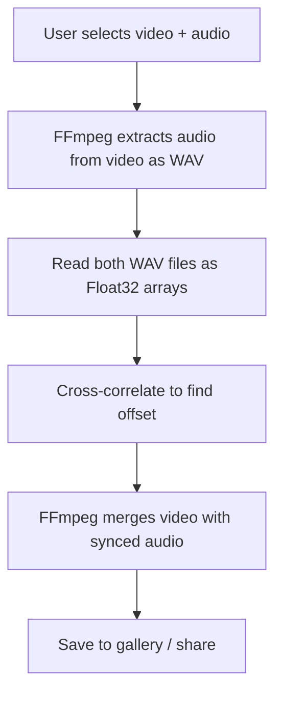

<!-- cd04e3ec-916f-4418-922a-390f05ece83b -->
---
todos:
  - id: "init-expo"
    content: "Create Expo app with npx create-expo-app mobile"
    status: pending
  - id: "install-deps"
    content: "Install ffmpeg-kit-react-native, expo-document-picker, expo-file-system"
    status: pending
  - id: "configure-native"
    content: "Configure app.json for native modules and create EAS build config"
    status: pending
  - id: "build-app"
    content: "Implement UI, sync algorithm, and FFmpeg integration"
    status: pending
  - id: "test-device"
    content: "Build with EAS and test on Android device"
    status: pending
isProject: false
---
# React Native Audio-Video Sync App

## Research Summary

- **ffmpeg-kit** original was retired, but **RebootMotion/ffmpeg-kit-react-native** is an active maintained fork
- FFmpeg commands are identical to CLI - same commands as Python version
- Cross-correlation can be implemented in JavaScript (just math, no special libraries needed)

## Architecture



## Key Dependencies

- **Expo SDK** with development build (simpler than bare React Native)
- `ffmpeg-kit-react-native` from RebootMotion fork
- `expo-document-picker` for file selection
- `expo-file-system` for file access
- `expo-media-library` for saving to gallery

## Setup Approach

Use **Expo with EAS Build** instead of bare React Native:
- No Android SDK setup required locally
- `npx create-expo-app` to start
- EAS Build (free tier) compiles the native code in the cloud
- Test on physical device via QR code

## Files to Create

**New folder**: `mobile/` in the repo

- `mobile/package.json` - Dependencies
- `mobile/App.tsx` - Main UI (file pickers, sync button, progress)
- `mobile/src/sync.ts` - Cross-correlation algorithm (port from Python)
- `mobile/src/ffmpeg.ts` - FFmpeg wrapper functions
- `mobile/android/` - Android-specific config

## Implementation Details

### 1. Cross-correlation (port from [sync.py](src/audio_video_sync/sync.py))

```typescript
// Same algorithm, just in TypeScript
function crossCorrelate(audio1: Float32Array, audio2: Float32Array): number {
  // Direct correlation, find peak, return offset in seconds
}
```

### 2. FFmpeg commands (same as [ffmpeg.py](src/audio_video_sync/ffmpeg.py))

```typescript
// Extract audio for analysis
await FFmpegKit.execute(`-i ${videoPath} -vn -ar 22050 -ac 1 -t 30 ${tempWav}`);

// Merge with offset
await FFmpegKit.execute(`-i ${videoPath} -itsoffset ${offset} -i ${audioPath} -map 0:v -map 1:a -c:v copy output.mp4`);
```

### 3. UI Flow

1. "Select Video" button -> document picker
2. "Select Audio" button -> document picker
3. "Sync" button -> shows progress
4. "Save" or "Share" when done

## Risks and Mitigations

| Risk | Mitigation |
|------|------------|
| RebootMotion fork maintenance | Fork is active, has clear docs, worst case we can fork it |
| Audio file reading in JS | Use react-native-fs to read WAV bytes, parse header manually |
| Large video files | Stream processing, show progress |

## Alternative Considered

Flutter + ffmpeg_kit_flutter - Also viable, but React Native chosen because LLMs have more JS training data and we can reuse some web code patterns.
