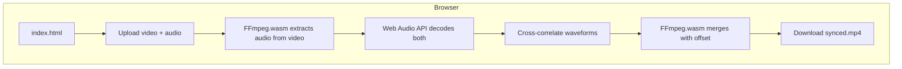

<!-- cd04e3ec-916f-4418-922a-390f05ece83b -->
---
todos:
  - id: "create-web-app"
    content: "Create web/index.html with UI and sync logic"
    status: pending
  - id: "test-locally"
    content: "Test the web app locally"
    status: pending
  - id: "add-deploy-config"
    content: "Add GitHub Pages deployment config if needed"
    status: pending
isProject: false
---
# Web Audio-Video Sync App

## Approach

A minimal client-side web app that replicates the core `avsync` functionality in the browser. No build step, no server - just static files that can be deployed to GitHub Pages.

## Architecture



## Files to Create

**`web/index.html`** - Single file containing:
- Clean mobile-friendly UI (file inputs, progress, download button)
- Inline JS for:
  - FFmpeg.wasm loading (from CDN)
  - Audio extraction and decoding
  - Cross-correlation (simplified waveform method)
  - Video merging with calculated offset

## Key Implementation Details

1. **FFmpeg.wasm** - Load from jsdelivr CDN with automatic fallback:
   - Try multi-thread (`@ffmpeg/core-mt`) if SharedArrayBuffer available
   - Fall back to single-thread (`@ffmpeg/core`) for iOS Safari and older browsers
   ```js
   const supportsMultiThread = typeof SharedArrayBuffer !== 'undefined';
   const corePackage = supportsMultiThread ? '@ffmpeg/core-mt' : '@ffmpeg/core';
   ```

2. **Cross-correlation** - Simplified version of the Python logic:
   - Analyze first 30s of each audio track using Web Audio API `decodeAudioData`
   - Downsample to 22050 Hz
   - Direct waveform correlation (skip chromagram for simplicity)
   - Find peak to determine offset

3. **Merge command** - Same approach as [ffmpeg.py](src/audio_video_sync/ffmpeg.py):
   ```
   ffmpeg -i video.mp4 -itsoffset {offset}s -i audio.mp3 -c:v copy -map 0:v -map 1:a output.mp4
   ```

## Browser Compatibility

- Android Chrome 92+: Full support (multi-thread)
- iOS Safari: Works with single-thread fallback
- Desktop browsers: Full support
- 2GB file size limit (WebAssembly constraint)

## UI Flow

1. User selects video file
2. User selects audio file  
3. Click "Sync" button
4. Progress bar shows: extracting -> analyzing -> merging
5. Download button appears when done

## Deployment

Deploy to **Cloudflare Pages** (free, supports required headers for multi-threaded FFmpeg.wasm):

1. Add `web/_headers` file with COOP/COEP headers
2. Connect repo to Cloudflare Pages, set build output to `/web`

```
# web/_headers
/*
  Cross-Origin-Opener-Policy: same-origin
  Cross-Origin-Embedder-Policy: require-corp
```
