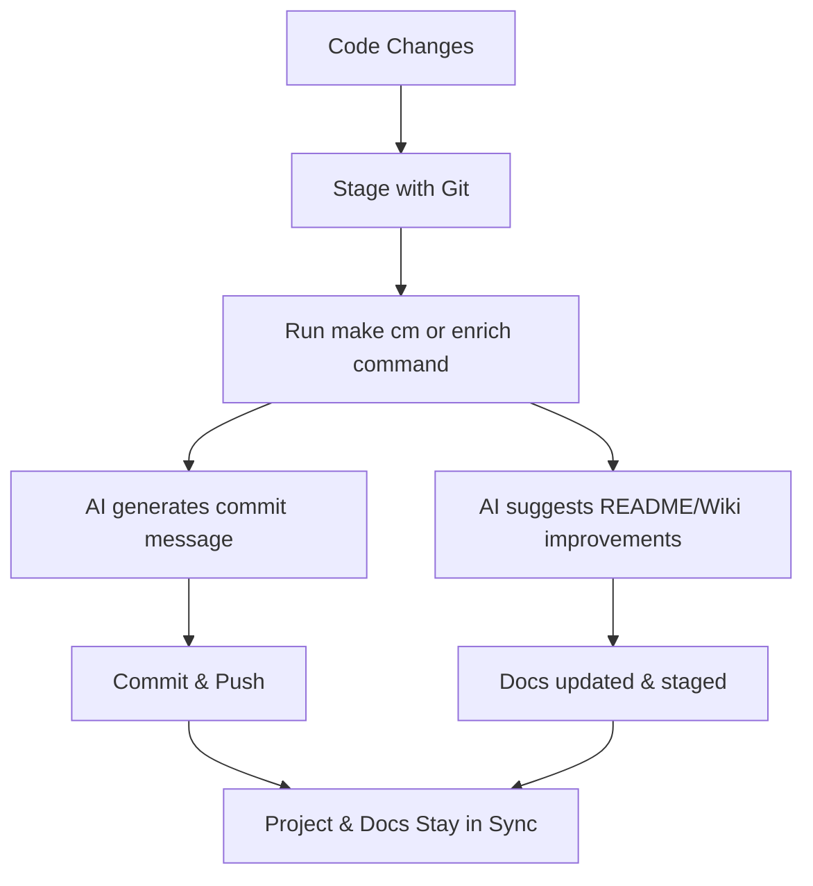

# Welcome to **autodoc_ai** 🚀

**autodoc_ai** is your all-in-one toolkit for automating commit message generation and enriching your README and Wiki documentation using AI. Designed for seamless integration into any development workflow, it helps you keep your project documentation and commit history clear, up-to-date, and high quality—with minimal effort.

---

## ✨ What Does It Do?

- **AI-Powered Commit Messages:** Instantly generate meaningful, context-aware commit messages based on your code changes.
- **Automated README & Wiki Enrichment:** Let AI suggest and append improvements to your README and Wiki articles, keeping docs fresh and relevant.
- **Effortless Integration:** Works with your existing Makefile and git workflow—no need to change your habits.
- **Robust Testing & Linting:** Includes helpers for code quality, formatting, and comprehensive test coverage.
- **Smart Diff Analysis:** Only documents what's changed, making updates precise and concise.

---

## 🛠️ Key Features

- **One-Command Enrichment:** Update your README and Wiki with a single command.
- **Customizable Prompts:** Fine-tune how AI suggests documentation improvements.
- **Fallbacks & Error Handling:** Gracefully handles missing API keys, empty diffs, or absent files.
- **Extensible:** Easily add new documentation targets or AI enrichment strategies.
- **Modern Python:** Built with best practices, type hints, and a clean, maintainable codebase.

---

## 🚦 Typical Workflow

---

## 📦 Quick Start

1. [Install the project and dependencies](Installation)
2. [Configure your environment](Configuration)
3. Use the provided [Makefile commands](Usage) to lint, test, format, and commit with AI assistance

---

## 📚 Documentation

- [Installation](Installation)
- [Usage](Usage)
- [Configuration](Configuration)
- [FAQ](FAQ)
- [Contributing](Contributing)
- [Changelog](Changelog)
- [API Reference](API)
