# Autonomize Observability Platform - Strategic Architecture Plan

> **Version**: 2.0
> **Date**: December 2024
> **Status**: Planning

---

## Table of Contents
1. [Executive Summary](#executive-summary)
2. [Current State Analysis](#current-state-analysis)
3. [High-Level Architecture](#high-level-architecture)
4. [SDK Architecture](#sdk-architecture)
5. [Analytics Platform Architecture](#analytics-platform-architecture)
6. [Data Flow Diagrams](#data-flow-diagrams)
7. [Integration Points](#integration-points)
8. [Implementation Phases](#implementation-phases)
9. [Component Specifications](#component-specifications)

---

## Executive Summary

### Vision
Transform `autonomize-observer` from an AI Studio v1-specific SDK into a universal observability and analytics platform that supports both legacy systems and the new AI Studio v2 (Temporal + PydanticAI).

### Key Decisions

| Decision | Choice | Rationale |
|----------|--------|-----------|
| Monorepo structure | ✅ Yes | Single source of truth, easier versioning |
| Keep Kafka | ✅ Optional | External integrations, MindsDB streaming |
| Keep Logfire | ✅ Yes | PydanticAI native support |
| Deprecate AgentTracer | ⚠️ Soft deprecate | Temporal replaces this in v2 |
| Analytics DB | ClickHouse | Best for time-series analytics |

---

## Current State Analysis

### AI Studio Evolution

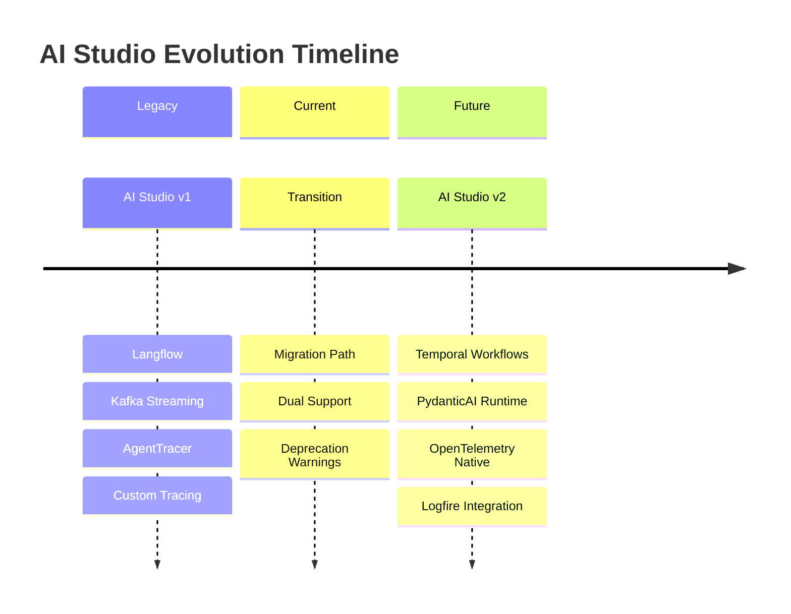
```mermaid
timeline
    title AI Studio Evolution Timeline
    section Legacy
        AI Studio v1 : Langflow
                     : Kafka Streaming
                     : AgentTracer
                     : Custom Tracing
    section Current
        Transition : Migration Path
                  : Dual Support
                  : Deprecation Warnings
    section Future
        AI Studio v2 : Temporal Workflows
                    : PydanticAI Runtime
                    : OpenTelemetry Native
                    : Logfire Integration
```

### Component Migration Status

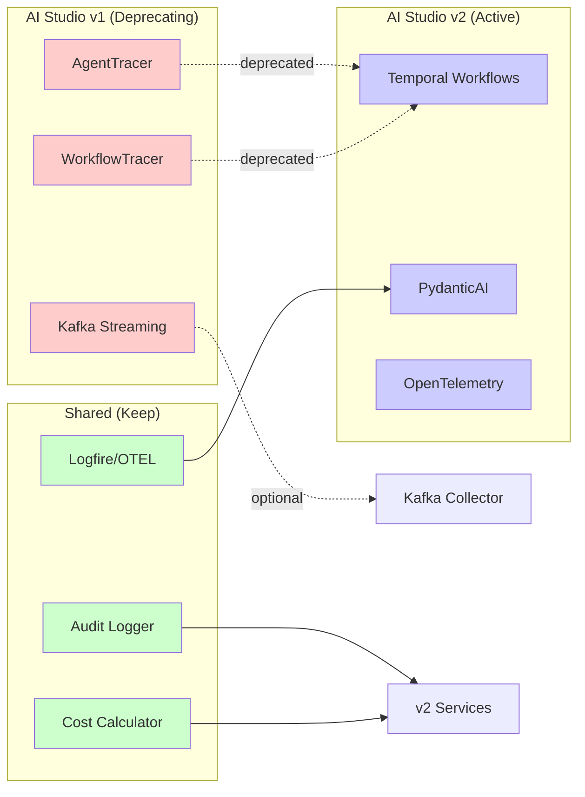
```mermaid
graph LR
    subgraph "AI Studio v1 (Deprecating)"
        AT1[AgentTracer]
        WT1[WorkflowTracer]
        KS1[Kafka Streaming]
    end

    subgraph "Shared (Keep)"
        AL[Audit Logger]
        CC[Cost Calculator]
        LF[Logfire/OTEL]
    end

    subgraph "AI Studio v2 (Active)"
        TW[Temporal Workflows]
        PA[PydanticAI]
        OT[OpenTelemetry]
    end

    AT1 -.->|deprecated| TW
    WT1 -.->|deprecated| TW
    KS1 -.->|optional| KS2[Kafka Collector]

    AL --> V2[v2 Services]
    CC --> V2
    LF --> PA

    style AT1 fill:#ffcccc
    style WT1 fill:#ffcccc
    style KS1 fill:#ffcccc
    style AL fill:#ccffcc
    style CC fill:#ccffcc
    style LF fill:#ccffcc
    style TW fill:#ccccff
    style PA fill:#ccccff
    style OT fill:#ccccff
```

---

## High-Level Architecture

### Complete System Architecture

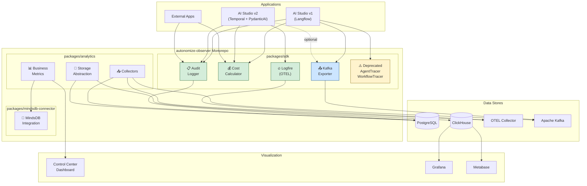
```mermaid
graph TB
    subgraph "Applications"
        AS1["AI Studio v1<br/>(Langflow)"]
        AS2["AI Studio v2<br/>(Temporal + PydanticAI)"]
        EXT["External Apps"]
    end

    subgraph "autonomize-observer Monorepo"
        subgraph "packages/sdk"
            AUDIT["📋 Audit<br/>Logger"]
            COST["💰 Cost<br/>Calculator"]
            LOGFIRE["🔥 Logfire<br/>(OTEL)"]
            KAFKA_EXP["📤 Kafka<br/>Exporter"]
            DEPRECATED["⚠️ Deprecated<br/>AgentTracer<br/>WorkflowTracer"]
        end

        subgraph "packages/analytics"
            COLLECTORS["📥 Collectors"]
            STORAGE["💾 Storage<br/>Abstraction"]
            METRICS["📊 Business<br/>Metrics"]
        end

        subgraph "packages/mindsdb-connector"
            MINDSDB["🤖 MindsDB<br/>Integration"]
        end
    end

    subgraph "Data Stores"
        PG[(PostgreSQL)]
        CH[(ClickHouse)]
        OTEL_COL[OTEL Collector]
        KAFKA[Apache Kafka]
    end

    subgraph "Visualization"
        CC["Control Center<br/>Dashboard"]
        GF["Grafana"]
        MB["Metabase"]
    end

    AS1 --> DEPRECATED
    AS1 --> AUDIT
    AS1 --> COST
    AS1 --> KAFKA_EXP

    AS2 --> AUDIT
    AS2 --> COST
    AS2 --> LOGFIRE
    AS2 -.->|optional| KAFKA_EXP

    EXT --> AUDIT
    EXT --> COST

    AUDIT --> PG
    KAFKA_EXP --> KAFKA
    LOGFIRE --> OTEL_COL

    COLLECTORS --> PG
    COLLECTORS --> KAFKA
    COLLECTORS --> OTEL_COL
    STORAGE --> CH
    STORAGE --> PG

    METRICS --> CC
    METRICS --> MINDSDB
    CH --> GF
    CH --> MB

    style DEPRECATED fill:#fff3cd,stroke:#856404
    style AUDIT fill:#d4edda,stroke:#155724
    style COST fill:#d4edda,stroke:#155724
    style LOGFIRE fill:#d4edda,stroke:#155724
    style KAFKA_EXP fill:#cce5ff,stroke:#004085
```

### Package Dependency Graph

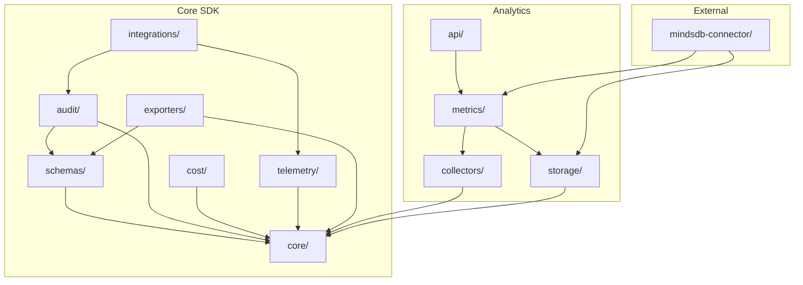
```mermaid
graph TD
    subgraph "Core SDK"
        CORE[core/]
        SCHEMAS[schemas/]
        AUDIT[audit/]
        COST[cost/]
        TELEMETRY[telemetry/]
        EXPORTERS[exporters/]
        INTEGRATIONS[integrations/]
    end

    subgraph "Analytics"
        A_COLLECTORS[collectors/]
        A_STORAGE[storage/]
        A_METRICS[metrics/]
        A_API[api/]
    end

    subgraph "External"
        MINDSDB_PKG[mindsdb-connector/]
    end

    SCHEMAS --> CORE
    AUDIT --> CORE
    AUDIT --> SCHEMAS
    COST --> CORE
    TELEMETRY --> CORE
    EXPORTERS --> CORE
    EXPORTERS --> SCHEMAS
    INTEGRATIONS --> AUDIT
    INTEGRATIONS --> TELEMETRY

    A_COLLECTORS --> CORE
    A_STORAGE --> CORE
    A_METRICS --> A_STORAGE
    A_METRICS --> A_COLLECTORS
    A_API --> A_METRICS

    MINDSDB_PKG --> A_STORAGE
    MINDSDB_PKG --> A_METRICS
```

---

## SDK Architecture

### Core SDK Class Diagram

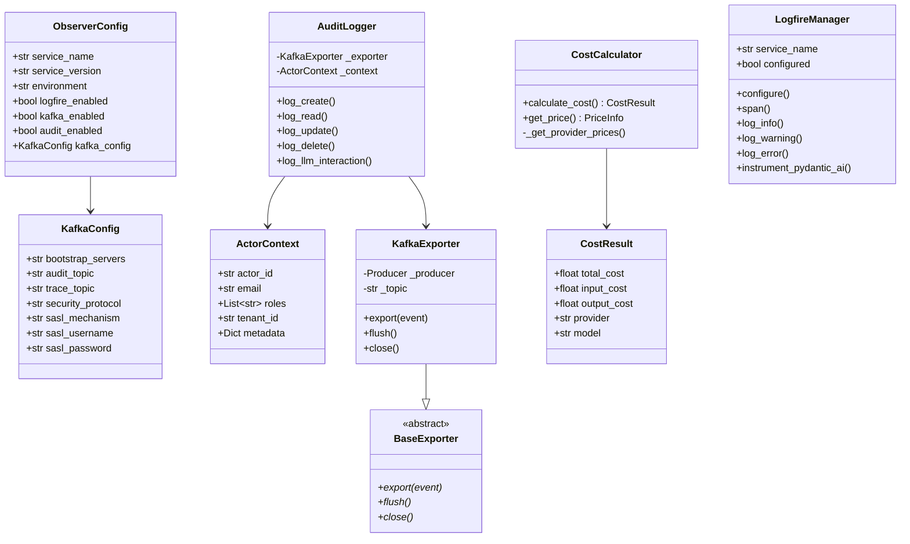
```mermaid
classDiagram
    class ObserverConfig {
        +str service_name
        +str service_version
        +str environment
        +bool logfire_enabled
        +bool kafka_enabled
        +bool audit_enabled
        +KafkaConfig kafka_config
    }

    class KafkaConfig {
        +str bootstrap_servers
        +str audit_topic
        +str trace_topic
        +str security_protocol
        +str sasl_mechanism
        +str sasl_username
        +str sasl_password
    }

    class AuditLogger {
        -KafkaExporter _exporter
        -ActorContext _context
        +log_create()
        +log_read()
        +log_update()
        +log_delete()
        +log_llm_interaction()
    }

    class ActorContext {
        +str actor_id
        +str email
        +List~str~ roles
        +str tenant_id
        +Dict metadata
    }

    class CostCalculator {
        +calculate_cost() CostResult
        +get_price() PriceInfo
        -_get_provider_prices()
    }

    class CostResult {
        +float total_cost
        +float input_cost
        +float output_cost
        +str provider
        +str model
    }

    class LogfireManager {
        +str service_name
        +bool configured
        +configure()
        +span()
        +log_info()
        +log_warning()
        +log_error()
        +instrument_pydantic_ai()
    }

    class BaseExporter {
        <<abstract>>
        +export(event)*
        +flush()*
        +close()*
    }

    class KafkaExporter {
        -Producer _producer
        -str _topic
        +export(event)
        +flush()
        +close()
    }

    ObserverConfig --> KafkaConfig
    AuditLogger --> ActorContext
    AuditLogger --> KafkaExporter
    KafkaExporter --|> BaseExporter
    CostCalculator --> CostResult
```

### SDK Module Structure

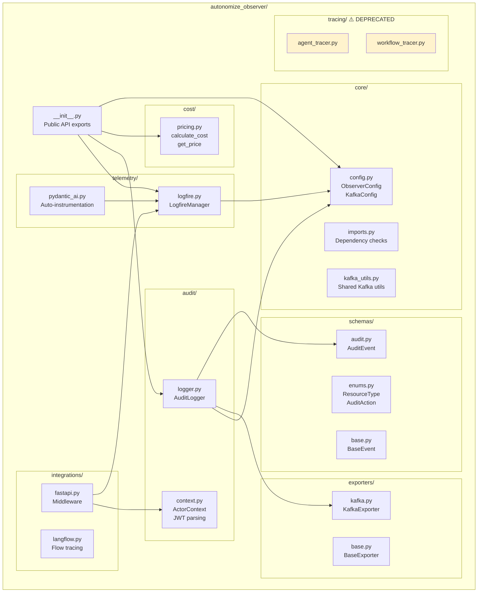
```mermaid
graph TB
    subgraph "autonomize_observer/"
        INIT["__init__.py<br/>Public API exports"]

        subgraph "core/"
            C_CONFIG["config.py<br/>ObserverConfig<br/>KafkaConfig"]
            C_IMPORTS["imports.py<br/>Dependency checks"]
            C_KAFKA["kafka_utils.py<br/>Shared Kafka utils"]
        end

        subgraph "audit/"
            A_LOGGER["logger.py<br/>AuditLogger"]
            A_CONTEXT["context.py<br/>ActorContext<br/>JWT parsing"]
        end

        subgraph "cost/"
            CO_PRICING["pricing.py<br/>calculate_cost<br/>get_price"]
        end

        subgraph "telemetry/"
            T_LOGFIRE["logfire.py<br/>LogfireManager"]
            T_PYDANTIC["pydantic_ai.py<br/>Auto-instrumentation"]
        end

        subgraph "exporters/"
            E_BASE["base.py<br/>BaseExporter"]
            E_KAFKA["kafka.py<br/>KafkaExporter"]
        end

        subgraph "schemas/"
            S_AUDIT["audit.py<br/>AuditEvent"]
            S_ENUMS["enums.py<br/>ResourceType<br/>AuditAction"]
            S_BASE["base.py<br/>BaseEvent"]
        end

        subgraph "integrations/"
            I_FASTAPI["fastapi.py<br/>Middleware"]
            I_LANGFLOW["langflow.py<br/>Flow tracing"]
        end

        subgraph "tracing/ ⚠️ DEPRECATED"
            TR_AGENT["agent_tracer.py"]
            TR_WORKFLOW["workflow_tracer.py"]
        end
    end

    INIT --> A_LOGGER
    INIT --> CO_PRICING
    INIT --> T_LOGFIRE
    INIT --> C_CONFIG

    A_LOGGER --> C_CONFIG
    A_LOGGER --> E_KAFKA
    A_LOGGER --> S_AUDIT

    T_LOGFIRE --> C_CONFIG
    T_PYDANTIC --> T_LOGFIRE

    I_FASTAPI --> A_CONTEXT
    I_FASTAPI --> T_LOGFIRE

    style TR_AGENT fill:#fff3cd
    style TR_WORKFLOW fill:#fff3cd
```

---

## Analytics Platform Architecture

### Analytics Package Structure

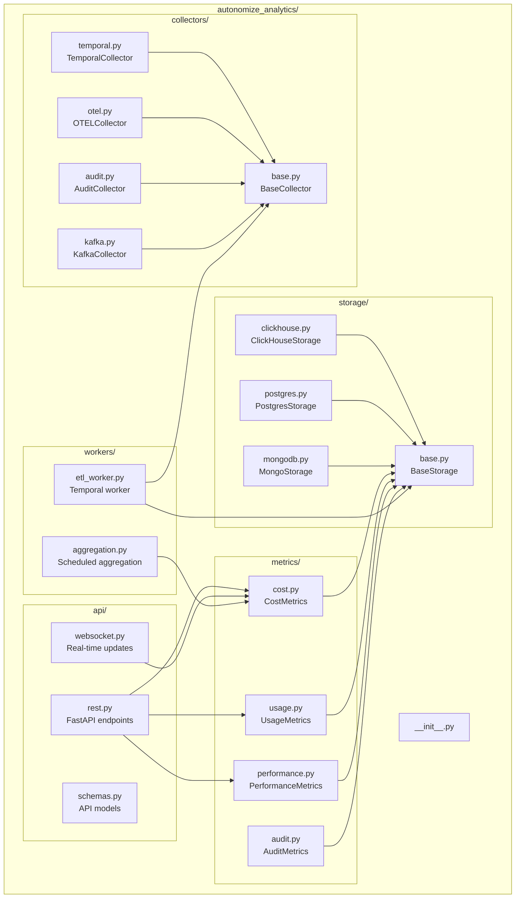
```mermaid
graph TB
    subgraph "autonomize_analytics/"
        INIT2["__init__.py"]

        subgraph "collectors/"
            COL_BASE["base.py<br/>BaseCollector"]
            COL_TEMPORAL["temporal.py<br/>TemporalCollector"]
            COL_OTEL["otel.py<br/>OTELCollector"]
            COL_AUDIT["audit.py<br/>AuditCollector"]
            COL_KAFKA["kafka.py<br/>KafkaCollector"]
        end

        subgraph "storage/"
            ST_BASE["base.py<br/>BaseStorage"]
            ST_CH["clickhouse.py<br/>ClickHouseStorage"]
            ST_PG["postgres.py<br/>PostgresStorage"]
            ST_MONGO["mongodb.py<br/>MongoStorage"]
        end

        subgraph "metrics/"
            M_COST["cost.py<br/>CostMetrics"]
            M_USAGE["usage.py<br/>UsageMetrics"]
            M_PERF["performance.py<br/>PerformanceMetrics"]
            M_AUDIT["audit.py<br/>AuditMetrics"]
        end

        subgraph "api/"
            API_REST["rest.py<br/>FastAPI endpoints"]
            API_WS["websocket.py<br/>Real-time updates"]
            API_SCHEMAS["schemas.py<br/>API models"]
        end

        subgraph "workers/"
            W_ETL["etl_worker.py<br/>Temporal worker"]
            W_AGG["aggregation.py<br/>Scheduled aggregation"]
        end
    end

    COL_TEMPORAL --> COL_BASE
    COL_OTEL --> COL_BASE
    COL_AUDIT --> COL_BASE
    COL_KAFKA --> COL_BASE

    ST_CH --> ST_BASE
    ST_PG --> ST_BASE
    ST_MONGO --> ST_BASE

    M_COST --> ST_BASE
    M_USAGE --> ST_BASE
    M_PERF --> ST_BASE
    M_AUDIT --> ST_BASE

    API_REST --> M_COST
    API_REST --> M_USAGE
    API_REST --> M_PERF
    API_WS --> M_COST

    W_ETL --> COL_BASE
    W_ETL --> ST_BASE
    W_AGG --> M_COST
```

### Collector Architecture

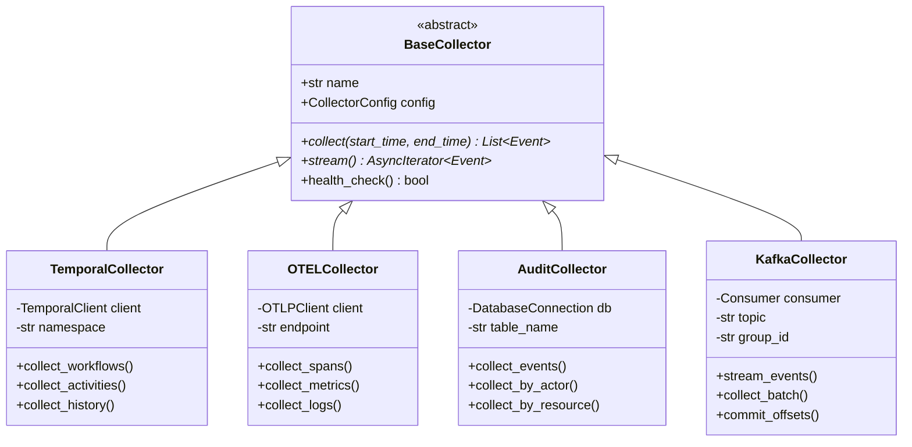
```mermaid
classDiagram
    class BaseCollector {
        <<abstract>>
        +str name
        +CollectorConfig config
        +collect(start_time, end_time)* List~Event~
        +stream()* AsyncIterator~Event~
        +health_check() bool
    }

    class TemporalCollector {
        -TemporalClient client
        -str namespace
        +collect_workflows()
        +collect_activities()
        +collect_history()
    }

    class OTELCollector {
        -OTLPClient client
        -str endpoint
        +collect_spans()
        +collect_metrics()
        +collect_logs()
    }

    class AuditCollector {
        -DatabaseConnection db
        -str table_name
        +collect_events()
        +collect_by_actor()
        +collect_by_resource()
    }

    class KafkaCollector {
        -Consumer consumer
        -str topic
        -str group_id
        +stream_events()
        +collect_batch()
        +commit_offsets()
    }

    BaseCollector <|-- TemporalCollector
    BaseCollector <|-- OTELCollector
    BaseCollector <|-- AuditCollector
    BaseCollector <|-- KafkaCollector
```

### Storage Abstraction

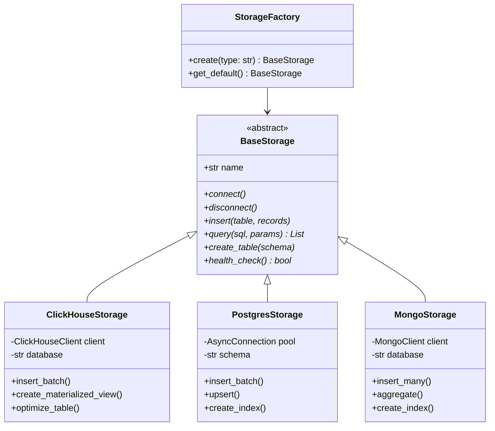
```mermaid
classDiagram
    class BaseStorage {
        <<abstract>>
        +str name
        +connect()*
        +disconnect()*
        +insert(table, records)*
        +query(sql, params)* List
        +create_table(schema)*
        +health_check()* bool
    }

    class ClickHouseStorage {
        -ClickHouseClient client
        -str database
        +insert_batch()
        +create_materialized_view()
        +optimize_table()
    }

    class PostgresStorage {
        -AsyncConnection pool
        -str schema
        +insert_batch()
        +upsert()
        +create_index()
    }

    class MongoStorage {
        -MongoClient client
        -str database
        +insert_many()
        +aggregate()
        +create_index()
    }

    class StorageFactory {
        +create(type: str) BaseStorage
        +get_default() BaseStorage
    }

    BaseStorage <|-- ClickHouseStorage
    BaseStorage <|-- PostgresStorage
    BaseStorage <|-- MongoStorage
    StorageFactory --> BaseStorage
```

---

## Data Flow Diagrams

### Complete Data Flow Architecture

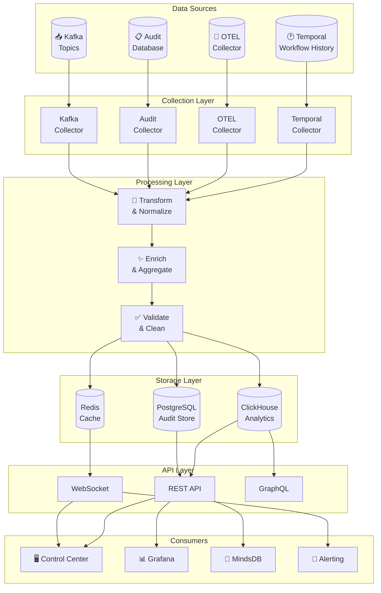
```mermaid
flowchart TB
    subgraph "Data Sources"
        direction TB
        TEMPORAL[("🕐 Temporal<br/>Workflow History")]
        OTEL[("📡 OTEL<br/>Collector")]
        AUDIT_DB[("📋 Audit<br/>Database")]
        KAFKA_IN[("📥 Kafka<br/>Topics")]
    end

    subgraph "Collection Layer"
        TC["Temporal<br/>Collector"]
        OC["OTEL<br/>Collector"]
        AC["Audit<br/>Collector"]
        KC["Kafka<br/>Collector"]
    end

    subgraph "Processing Layer"
        direction TB
        TRANSFORM["🔄 Transform<br/>& Normalize"]
        ENRICH["✨ Enrich<br/>& Aggregate"]
        VALIDATE["✅ Validate<br/>& Clean"]
    end

    subgraph "Storage Layer"
        CH[("ClickHouse<br/>Analytics")]
        PG_AN[("PostgreSQL<br/>Audit Store")]
        REDIS[("Redis<br/>Cache")]
    end

    subgraph "API Layer"
        REST["REST API"]
        WS["WebSocket"]
        GRAPHQL["GraphQL"]
    end

    subgraph "Consumers"
        CC["🖥️ Control Center"]
        GRAFANA["📊 Grafana"]
        MINDS["🤖 MindsDB"]
        ALERTS["🔔 Alerting"]
    end

    TEMPORAL --> TC
    OTEL --> OC
    AUDIT_DB --> AC
    KAFKA_IN --> KC

    TC --> TRANSFORM
    OC --> TRANSFORM
    AC --> TRANSFORM
    KC --> TRANSFORM

    TRANSFORM --> ENRICH
    ENRICH --> VALIDATE

    VALIDATE --> CH
    VALIDATE --> PG_AN
    VALIDATE --> REDIS

    CH --> REST
    CH --> GRAPHQL
    PG_AN --> REST
    REDIS --> WS

    REST --> CC
    REST --> GRAFANA
    REST --> MINDS
    WS --> ALERTS
    WS --> CC
```

### ETL Pipeline Flow

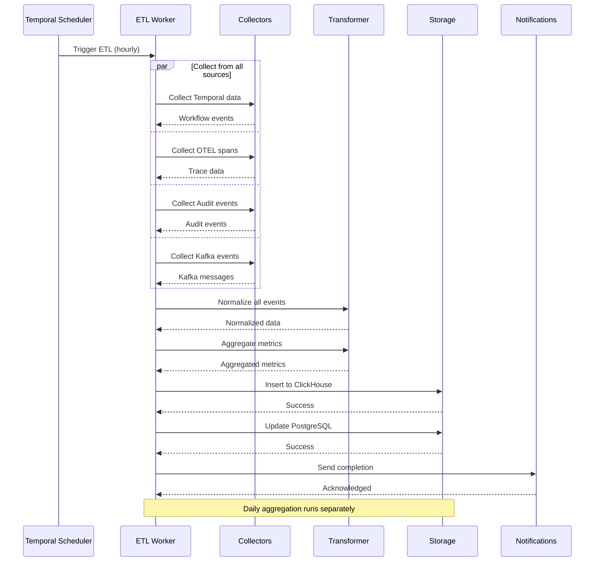
```mermaid
sequenceDiagram
    participant Scheduler as Temporal Scheduler
    participant Worker as ETL Worker
    participant Collectors as Collectors
    participant Transform as Transformer
    participant Storage as Storage
    participant Notify as Notifications

    Scheduler->>Worker: Trigger ETL (hourly)

    par Collect from all sources
        Worker->>Collectors: Collect Temporal data
        Collectors-->>Worker: Workflow events
    and
        Worker->>Collectors: Collect OTEL spans
        Collectors-->>Worker: Trace data
    and
        Worker->>Collectors: Collect Audit events
        Collectors-->>Worker: Audit events
    and
        Worker->>Collectors: Collect Kafka events
        Collectors-->>Worker: Kafka messages
    end

    Worker->>Transform: Normalize all events
    Transform-->>Worker: Normalized data

    Worker->>Transform: Aggregate metrics
    Transform-->>Worker: Aggregated metrics

    Worker->>Storage: Insert to ClickHouse
    Storage-->>Worker: Success

    Worker->>Storage: Update PostgreSQL
    Storage-->>Worker: Success

    Worker->>Notify: Send completion
    Notify-->>Worker: Acknowledged

    Note over Worker,Storage: Daily aggregation runs separately
```

### Real-time Streaming Flow

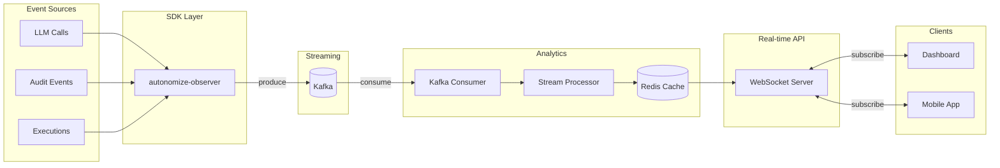
```mermaid
flowchart LR
    subgraph "Event Sources"
        LLM["LLM Calls"]
        AUDIT_EV["Audit Events"]
        EXEC["Executions"]
    end

    subgraph "SDK Layer"
        OBS["autonomize-observer"]
    end

    subgraph "Streaming"
        KAFKA_STREAM[("Kafka")]
    end

    subgraph "Analytics"
        CONSUMER["Kafka Consumer"]
        PROCESSOR["Stream Processor"]
        CACHE[("Redis Cache")]
    end

    subgraph "Real-time API"
        WS_SERVER["WebSocket Server"]
    end

    subgraph "Clients"
        DASHBOARD["Dashboard"]
        MOBILE["Mobile App"]
    end

    LLM --> OBS
    AUDIT_EV --> OBS
    EXEC --> OBS

    OBS -->|produce| KAFKA_STREAM
    KAFKA_STREAM -->|consume| CONSUMER

    CONSUMER --> PROCESSOR
    PROCESSOR --> CACHE
    CACHE --> WS_SERVER

    WS_SERVER <-->|subscribe| DASHBOARD
    WS_SERVER <-->|subscribe| MOBILE
```

---

## Integration Points

### AI Studio v2 Integration

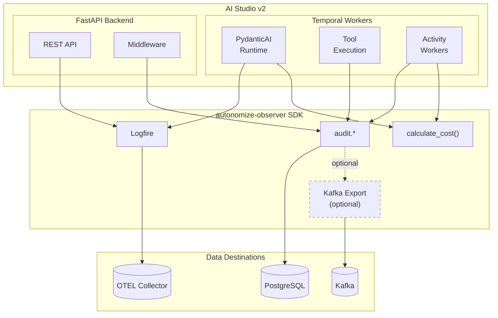
```mermaid
flowchart TB
    subgraph "AI Studio v2"
        subgraph "Temporal Workers"
            PAI["PydanticAI<br/>Runtime"]
            TOOLS["Tool<br/>Execution"]
            ACTIVITIES["Activity<br/>Workers"]
        end

        subgraph "FastAPI Backend"
            API["REST API"]
            MW["Middleware"]
        end
    end

    subgraph "autonomize-observer SDK"
        AUDIT_INT["audit.*"]
        COST_INT["calculate_cost()"]
        LOGFIRE_INT["Logfire"]
        KAFKA_OPT["Kafka Export<br/>(optional)"]
    end

    subgraph "Data Destinations"
        PG_DB[("PostgreSQL")]
        OTEL_DEST[("OTEL Collector")]
        KAFKA_DEST[("Kafka")]
    end

    PAI --> LOGFIRE_INT
    PAI --> COST_INT
    ACTIVITIES --> AUDIT_INT
    ACTIVITIES --> COST_INT
    TOOLS --> AUDIT_INT

    MW --> AUDIT_INT
    API --> LOGFIRE_INT

    AUDIT_INT --> PG_DB
    AUDIT_INT -.->|optional| KAFKA_OPT
    LOGFIRE_INT --> OTEL_DEST
    KAFKA_OPT --> KAFKA_DEST

    style KAFKA_OPT stroke-dasharray: 5 5
```

### Activity-Level Integration Sequence

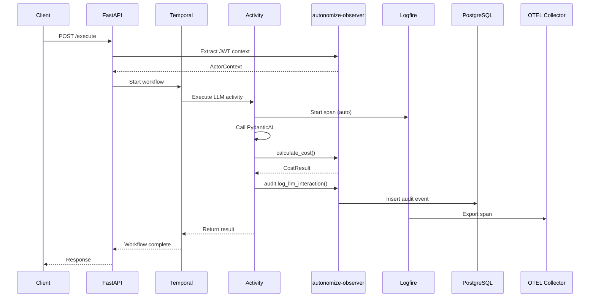
```mermaid
sequenceDiagram
    participant Client
    participant FastAPI
    participant Temporal
    participant Activity
    participant SDK as autonomize-observer
    participant Logfire
    participant DB as PostgreSQL
    participant OTEL as OTEL Collector

    Client->>FastAPI: POST /execute

    FastAPI->>SDK: Extract JWT context
    SDK-->>FastAPI: ActorContext

    FastAPI->>Temporal: Start workflow
    Temporal->>Activity: Execute LLM activity

    Activity->>Logfire: Start span (auto)

    Activity->>Activity: Call PydanticAI

    Activity->>SDK: calculate_cost()
    SDK-->>Activity: CostResult

    Activity->>SDK: audit.log_llm_interaction()
    SDK->>DB: Insert audit event

    Logfire->>OTEL: Export span

    Activity-->>Temporal: Return result
    Temporal-->>FastAPI: Workflow complete
    FastAPI-->>Client: Response
```

### Keycloak JWT Flow

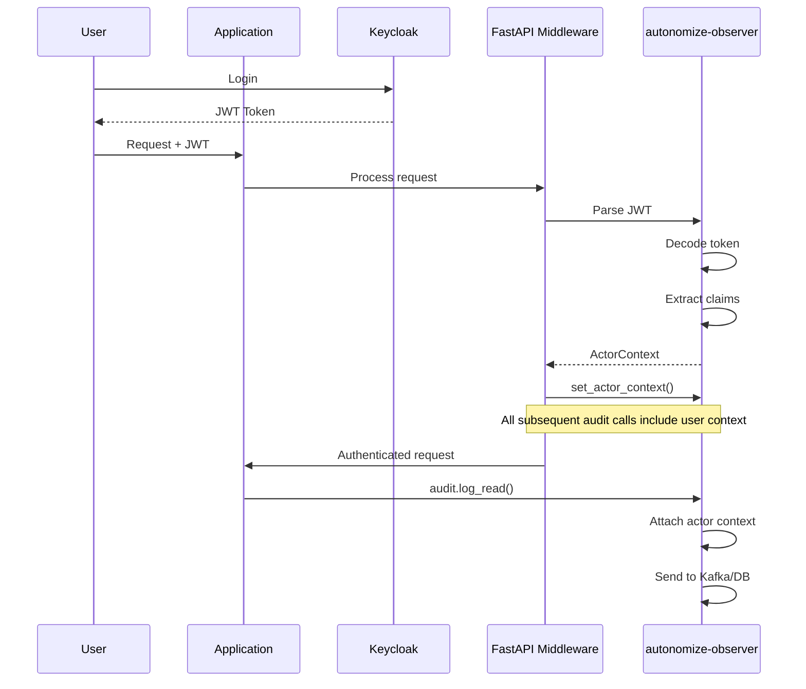
```mermaid
sequenceDiagram
    participant User
    participant App as Application
    participant KC as Keycloak
    participant MW as FastAPI Middleware
    participant SDK as autonomize-observer

    User->>KC: Login
    KC-->>User: JWT Token

    User->>App: Request + JWT
    App->>MW: Process request

    MW->>SDK: Parse JWT
    SDK->>SDK: Decode token
    SDK->>SDK: Extract claims
    SDK-->>MW: ActorContext

    MW->>SDK: set_actor_context()

    Note over MW,SDK: All subsequent audit calls include user context

    MW->>App: Authenticated request
    App->>SDK: audit.log_read()
    SDK->>SDK: Attach actor context
    SDK->>SDK: Send to Kafka/DB
```

---

## Implementation Phases

### Phase Roadmap

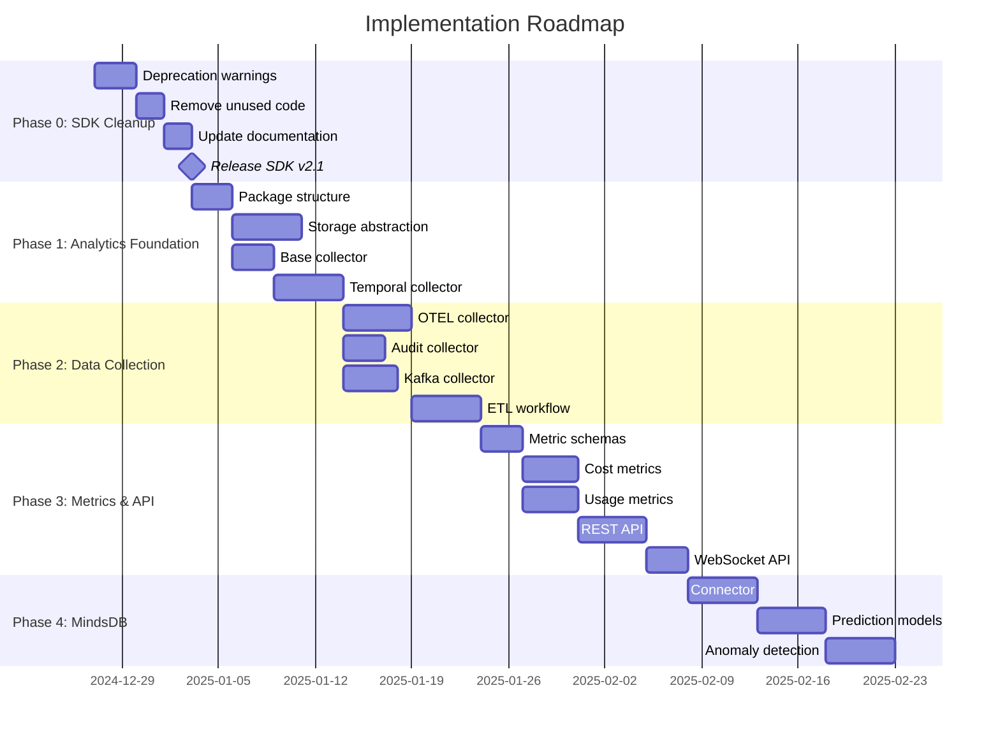
```mermaid
gantt
    title Implementation Roadmap
    dateFormat  YYYY-MM-DD

    section Phase 0: SDK Cleanup
    Deprecation warnings     :p0-1, 2024-12-27, 3d
    Remove unused code       :p0-2, after p0-1, 2d
    Update documentation     :p0-3, after p0-2, 2d
    Release SDK v2.1        :milestone, after p0-3, 0d

    section Phase 1: Analytics Foundation
    Package structure       :p1-1, after p0-3, 3d
    Storage abstraction     :p1-2, after p1-1, 5d
    Base collector          :p1-3, after p1-1, 3d
    Temporal collector      :p1-4, after p1-3, 5d

    section Phase 2: Data Collection
    OTEL collector          :p2-1, after p1-4, 5d
    Audit collector         :p2-2, after p1-4, 3d
    Kafka collector         :p2-3, after p1-4, 4d
    ETL workflow            :p2-4, after p2-1, 5d

    section Phase 3: Metrics & API
    Metric schemas          :p3-1, after p2-4, 3d
    Cost metrics            :p3-2, after p3-1, 4d
    Usage metrics           :p3-3, after p3-1, 4d
    REST API                :p3-4, after p3-2, 5d
    WebSocket API           :p3-5, after p3-4, 3d

    section Phase 4: MindsDB
    Connector               :p4-1, after p3-5, 5d
    Prediction models       :p4-2, after p4-1, 5d
    Anomaly detection       :p4-3, after p4-2, 5d
```

### Phase Details

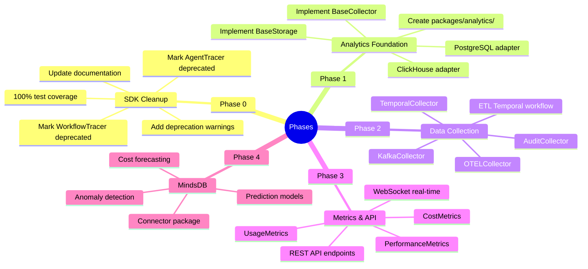
```mermaid
mindmap
  root((Phases))
    Phase 0
      SDK Cleanup
        Add deprecation warnings
        Mark AgentTracer deprecated
        Mark WorkflowTracer deprecated
        Update documentation
        100% test coverage
    Phase 1
      Analytics Foundation
        Create packages/analytics/
        Implement BaseCollector
        Implement BaseStorage
        ClickHouse adapter
        PostgreSQL adapter
    Phase 2
      Data Collection
        TemporalCollector
        OTELCollector
        AuditCollector
        KafkaCollector
        ETL Temporal workflow
    Phase 3
      Metrics & API
        CostMetrics
        UsageMetrics
        PerformanceMetrics
        REST API endpoints
        WebSocket real-time
    Phase 4
      MindsDB
        Connector package
        Prediction models
        Anomaly detection
        Cost forecasting
```

---

## Component Specifications

### What Stays (SDK Core)

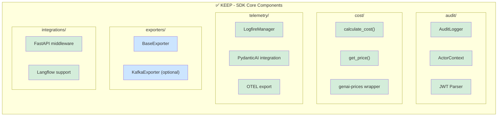
```mermaid
graph TB
    subgraph "✅ KEEP - SDK Core Components"
        direction TB

        subgraph "audit/"
            A1["AuditLogger"]
            A2["ActorContext"]
            A3["JWT Parser"]
        end

        subgraph "cost/"
            C1["calculate_cost()"]
            C2["get_price()"]
            C3["genai-prices wrapper"]
        end

        subgraph "telemetry/"
            T1["LogfireManager"]
            T2["PydanticAI integration"]
            T3["OTEL export"]
        end

        subgraph "exporters/"
            E1["BaseExporter"]
            E2["KafkaExporter (optional)"]
        end

        subgraph "integrations/"
            I1["FastAPI middleware"]
            I2["Langflow support"]
        end
    end

    style A1 fill:#d4edda
    style A2 fill:#d4edda
    style A3 fill:#d4edda
    style C1 fill:#d4edda
    style C2 fill:#d4edda
    style C3 fill:#d4edda
    style T1 fill:#d4edda
    style T2 fill:#d4edda
    style T3 fill:#d4edda
    style E1 fill:#cce5ff
    style E2 fill:#cce5ff
    style I1 fill:#d4edda
    style I2 fill:#d4edda
```

### What Gets Deprecated

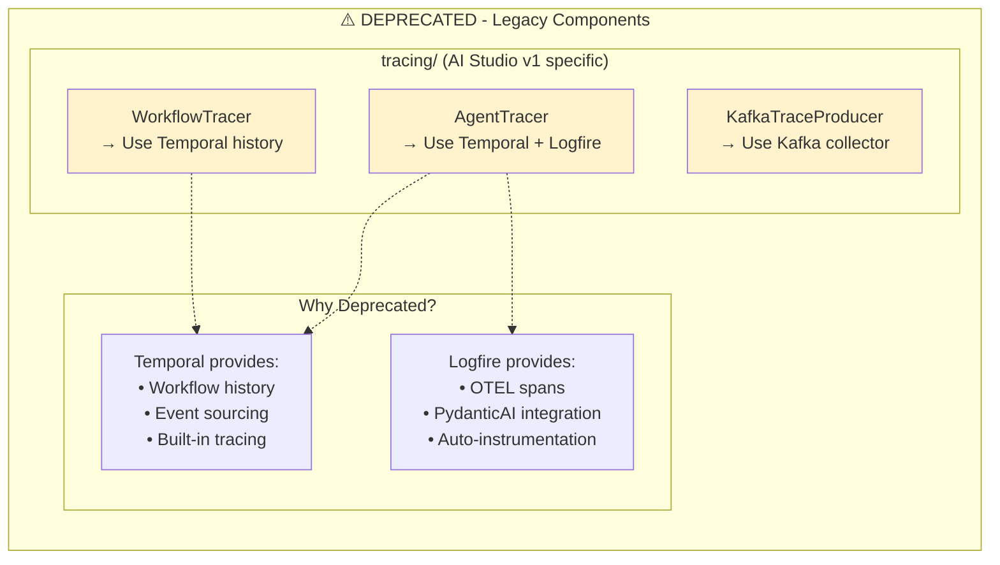
```mermaid
graph TB
    subgraph "⚠️ DEPRECATED - Legacy Components"
        direction TB

        subgraph "tracing/ (AI Studio v1 specific)"
            D1["AgentTracer<br/>→ Use Temporal + Logfire"]
            D2["WorkflowTracer<br/>→ Use Temporal history"]
            D3["KafkaTraceProducer<br/>→ Use Kafka collector"]
        end

        subgraph "Why Deprecated?"
            R1["Temporal provides:<br/>• Workflow history<br/>• Event sourcing<br/>• Built-in tracing"]
            R2["Logfire provides:<br/>• OTEL spans<br/>• PydanticAI integration<br/>• Auto-instrumentation"]
        end
    end

    D1 -.-> R1
    D2 -.-> R1
    D1 -.-> R2

    style D1 fill:#fff3cd
    style D2 fill:#fff3cd
    style D3 fill:#fff3cd
```

### New Analytics Components

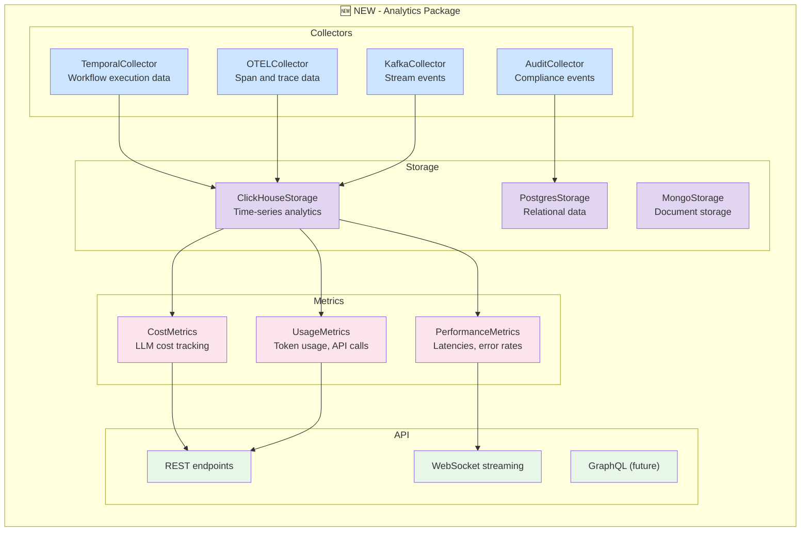
```mermaid
graph TB
    subgraph "🆕 NEW - Analytics Package"
        direction TB

        subgraph "Collectors"
            NC1["TemporalCollector<br/>Workflow execution data"]
            NC2["OTELCollector<br/>Span and trace data"]
            NC3["AuditCollector<br/>Compliance events"]
            NC4["KafkaCollector<br/>Stream events"]
        end

        subgraph "Storage"
            NS1["ClickHouseStorage<br/>Time-series analytics"]
            NS2["PostgresStorage<br/>Relational data"]
            NS3["MongoStorage<br/>Document storage"]
        end

        subgraph "Metrics"
            NM1["CostMetrics<br/>LLM cost tracking"]
            NM2["UsageMetrics<br/>Token usage, API calls"]
            NM3["PerformanceMetrics<br/>Latencies, error rates"]
        end

        subgraph "API"
            NA1["REST endpoints"]
            NA2["WebSocket streaming"]
            NA3["GraphQL (future)"]
        end
    end

    NC1 --> NS1
    NC2 --> NS1
    NC3 --> NS2
    NC4 --> NS1

    NS1 --> NM1
    NS1 --> NM2
    NS1 --> NM3

    NM1 --> NA1
    NM2 --> NA1
    NM3 --> NA2

    style NC1 fill:#cce5ff
    style NC2 fill:#cce5ff
    style NC3 fill:#cce5ff
    style NC4 fill:#cce5ff
    style NS1 fill:#e2d5f1
    style NS2 fill:#e2d5f1
    style NS3 fill:#e2d5f1
    style NM1 fill:#fce4ec
    style NM2 fill:#fce4ec
    style NM3 fill:#fce4ec
    style NA1 fill:#e8f5e9
    style NA2 fill:#e8f5e9
    style NA3 fill:#e8f5e9
```

---

## Deployment Architecture

### Production Deployment

```mermaid
graph TB
    subgraph "Kubernetes Cluster"
        subgraph "AI Studio v2 Namespace"
            API_POD["FastAPI Pods"]
            WORKER_POD["Temporal Workers"]
        end

        subgraph "Analytics Namespace"
            ETL_POD["ETL Workers"]
            API_AN_POD["Analytics API"]
            WS_POD["WebSocket Server"]
        end

        subgraph "Data Namespace"
            TEMPORAL_SVC[("Temporal")]
            PG_SVC[("PostgreSQL")]
            CH_SVC[("ClickHouse")]
            KAFKA_SVC[("Kafka")]
            REDIS_SVC[("Redis")]
        end

        subgraph "Observability Namespace"
            OTEL_SVC["OTEL Collector"]
            GRAFANA_SVC["Grafana"]
            JAEGER_SVC["Jaeger"]
        end
    end

    subgraph "External"
        MINDSDB_EXT["MindsDB Cloud"]
        KC_EXT["Keycloak"]
    end

    API_POD --> PG_SVC
    API_POD --> REDIS_SVC
    API_POD --> OTEL_SVC

    WORKER_POD --> TEMPORAL_SVC
    WORKER_POD --> OTEL_SVC
    WORKER_POD --> KAFKA_SVC

    ETL_POD --> TEMPORAL_SVC
    ETL_POD --> CH_SVC
    ETL_POD --> PG_SVC
    ETL_POD --> KAFKA_SVC

    API_AN_POD --> CH_SVC
    WS_POD --> REDIS_SVC

    OTEL_SVC --> JAEGER_SVC
    CH_SVC --> GRAFANA_SVC
    CH_SVC --> MINDSDB_EXT

    API_POD --> KC_EXT
```

---

## Summary

### Component Status Matrix

| Component | Package | Status | Purpose | AI Studio v2 |
|-----------|---------|--------|---------|--------------|
| AuditLogger | sdk/audit | ✅ Keep | Compliance logging | ✅ Used |
| ActorContext | sdk/audit | ✅ Keep | JWT/Keycloak context | ✅ Used |
| calculate_cost | sdk/cost | ✅ Keep | LLM cost tracking | ✅ Used |
| LogfireManager | sdk/telemetry | ✅ Keep | OTEL via Logfire | ✅ Used |
| KafkaExporter | sdk/exporters | ✅ Optional | Event streaming | Optional |
| FastAPI middleware | sdk/integrations | ✅ Keep | Request tracing | ✅ Used |
| AgentTracer | sdk/tracing | ⚠️ Deprecated | AI Studio v1 | ❌ Not used |
| WorkflowTracer | sdk/tracing | ⚠️ Deprecated | Step timing | ❌ Not used |
| TemporalCollector | analytics | 🆕 New | Workflow data | Data source |
| OTELCollector | analytics | 🆕 New | Trace data | Data source |
| ClickHouseStorage | analytics | 🆕 New | Analytics storage | Data sink |
| CostMetrics | analytics | 🆕 New | Business metrics | Dashboard |
| MindsDB connector | mindsdb | 🆕 New | ML predictions | Analytics |

### Final Monorepo Structure

```
autonomize-observer/
├── packages/
│   ├── sdk/                     # pip install autonomize-observer
│   │   ├── autonomize_observer/
│   │   │   ├── audit/          # ✅ Compliance logging
│   │   │   ├── cost/           # ✅ Cost calculation
│   │   │   ├── telemetry/      # ✅ Logfire/OTEL
│   │   │   ├── exporters/      # ✅ Kafka (optional)
│   │   │   ├── integrations/   # ✅ FastAPI, Langflow
│   │   │   ├── tracing/        # ⚠️ Deprecated
│   │   │   ├── schemas/        # ✅ Data models
│   │   │   └── core/           # ✅ Config, utils
│   │   └── tests/
│   │
│   ├── analytics/              # pip install autonomize-analytics
│   │   ├── autonomize_analytics/
│   │   │   ├── collectors/     # 🆕 Data collection
│   │   │   ├── storage/        # 🆕 Multi-DB support
│   │   │   ├── metrics/        # 🆕 Business metrics
│   │   │   ├── api/            # 🆕 REST/WebSocket
│   │   │   └── workers/        # 🆕 ETL workflows
│   │   └── tests/
│   │
│   └── mindsdb-connector/      # pip install autonomize-mindsdb
│       └── autonomize_mindsdb/
│
├── services/
│   ├── analytics-worker/       # Temporal worker deployment
│   └── control-center-api/     # Dashboard API
│
├── docs/
│   ├── sdk/
│   ├── analytics/
│   └── architecture/
│
├── pyproject.toml              # Monorepo configuration
└── README.md
```
