# Autonomize Observability Platform - Strategic Architecture Plan

> **Version**: 2.0
> **Date**: December 2024
> **Status**: Planning

---

## Table of Contents
1. [Executive Summary](#executive-summary)
2. [Current State Analysis](#current-state-analysis)
3. [High-Level Architecture](#high-level-architecture)
4. [SDK Architecture](#sdk-architecture)
5. [Analytics Platform Architecture](#analytics-platform-architecture)
6. [Data Flow Diagrams](#data-flow-diagrams)
7. [Integration Points](#integration-points)
8. [Implementation Phases](#implementation-phases)
9. [Component Specifications](#component-specifications)

---

## Executive Summary

### Vision
Transform `autonomize-observer` from an AI Studio v1-specific SDK into a universal observability and analytics platform that supports both legacy systems and the new AI Studio v2 (Temporal + PydanticAI).

### Key Decisions

| Decision | Choice | Rationale |
|----------|--------|-----------|
| Monorepo structure | ✅ Yes | Single source of truth, easier versioning |
| Keep Kafka | ✅ Optional | External integrations, MindsDB streaming |
| Keep Logfire | ✅ Yes | PydanticAI native support |
| Deprecate AgentTracer | ⚠️ Soft deprecate | Temporal replaces this in v2 |
| Analytics DB | ClickHouse | Best for time-series analytics |

---

## Current State Analysis

### AI Studio Evolution


### Component Migration Status


---

## High-Level Architecture

### Complete System Architecture

```mermaid
graph TB
    subgraph "Applications"
        AS1["AI Studio v1<br/>(Langflow)"]
        AS2["AI Studio v2<br/>(Temporal + PydanticAI)"]
        EXT["External Apps"]
    end

    subgraph "autonomize-observer Monorepo"
        subgraph "packages/sdk"
            AUDIT["📋 Audit<br/>Logger"]
            COST["💰 Cost<br/>Calculator"]
            LOGFIRE["🔥 Logfire<br/>(OTEL)"]
            KAFKA_EXP["📤 Kafka<br/>Exporter"]
            DEPRECATED["⚠️ Deprecated<br/>AgentTracer<br/>WorkflowTracer"]
        end

        subgraph "packages/analytics"
            COLLECTORS["📥 Collectors"]
            STORAGE["💾 Storage<br/>Abstraction"]
            METRICS["📊 Business<br/>Metrics"]
        end

        subgraph "packages/mindsdb-connector"
            MINDSDB["🤖 MindsDB<br/>Integration"]
        end
    end

    subgraph "Data Stores"
        PG[(PostgreSQL)]
        CH[(ClickHouse)]
        OTEL_COL[OTEL Collector]
        KAFKA[Apache Kafka]
    end

    subgraph "Visualization"
        CC["Control Center<br/>Dashboard"]
        GF["Grafana"]
        MB["Metabase"]
    end

    AS1 --> DEPRECATED
    AS1 --> AUDIT
    AS1 --> COST
    AS1 --> KAFKA_EXP

    AS2 --> AUDIT
    AS2 --> COST
    AS2 --> LOGFIRE
    AS2 -.->|optional| KAFKA_EXP

    EXT --> AUDIT
    EXT --> COST

    AUDIT --> PG
    KAFKA_EXP --> KAFKA
    LOGFIRE --> OTEL_COL

    COLLECTORS --> PG
    COLLECTORS --> KAFKA
    COLLECTORS --> OTEL_COL
    STORAGE --> CH
    STORAGE --> PG

    METRICS --> CC
    METRICS --> MINDSDB
    CH --> GF
    CH --> MB

    style DEPRECATED fill:#fff3cd,stroke:#856404
    style AUDIT fill:#d4edda,stroke:#155724
    style COST fill:#d4edda,stroke:#155724
    style LOGFIRE fill:#d4edda,stroke:#155724
    style KAFKA_EXP fill:#cce5ff,stroke:#004085
```



### Package Dependency Graph


---

## SDK Architecture

### Core SDK Class Diagram


### SDK Module Structure


---

## Analytics Platform Architecture

### Analytics Package Structure


### Collector Architecture


### Storage Abstraction


---

## Data Flow Diagrams

### Complete Data Flow Architecture

```mermaid
flowchart TB
    subgraph "Data Sources"
        direction TB
        TEMPORAL[("🕐 Temporal<br/>Workflow History")]
        OTEL[("📡 OTEL<br/>Collector")]
        AUDIT_DB[("📋 Audit<br/>Database")]
        KAFKA_IN[("📥 Kafka<br/>Topics")]
    end

    subgraph "Collection Layer"
        TC["Temporal<br/>Collector"]
        OC["OTEL<br/>Collector"]
        AC["Audit<br/>Collector"]
        KC["Kafka<br/>Collector"]
    end

    subgraph "Processing Layer"
        direction TB
        TRANSFORM["🔄 Transform<br/>& Normalize"]
        ENRICH["✨ Enrich<br/>& Aggregate"]
        VALIDATE["✅ Validate<br/>& Clean"]
    end

    subgraph "Storage Layer"
        CH[("ClickHouse<br/>Analytics")]
        PG_AN[("PostgreSQL<br/>Audit Store")]
        REDIS[("Redis<br/>Cache")]
    end

    subgraph "API Layer"
        REST["REST API"]
        WS["WebSocket"]
        GRAPHQL["GraphQL"]
    end

    subgraph "Consumers"
        CC["🖥️ Control Center"]
        GRAFANA["📊 Grafana"]
        MINDS["🤖 MindsDB"]
        ALERTS["🔔 Alerting"]
    end

    TEMPORAL --> TC
    OTEL --> OC
    AUDIT_DB --> AC
    KAFKA_IN --> KC

    TC --> TRANSFORM
    OC --> TRANSFORM
    AC --> TRANSFORM
    KC --> TRANSFORM

    TRANSFORM --> ENRICH
    ENRICH --> VALIDATE

    VALIDATE --> CH
    VALIDATE --> PG_AN
    VALIDATE --> REDIS

    CH --> REST
    CH --> GRAPHQL
    PG_AN --> REST
    REDIS --> WS

    REST --> CC
    REST --> GRAFANA
    REST --> MINDS
    WS --> ALERTS
    WS --> CC
```



### ETL Pipeline Flow


### Real-time Streaming Flow


---

## Integration Points

### AI Studio v2 Integration


### Activity-Level Integration Sequence


### Keycloak JWT Flow


---

## Implementation Phases

### Phase Roadmap


### Phase Details


---

## Component Specifications

### What Stays (SDK Core)

```mermaid
graph TB
    subgraph "✅ KEEP - SDK Core Components"
        direction TB

        subgraph "audit/"
            A1["AuditLogger"]
            A2["ActorContext"]
            A3["JWT Parser"]
        end

        subgraph "cost/"
            C1["calculate_cost()"]
            C2["get_price()"]
            C3["genai-prices wrapper"]
        end

        subgraph "telemetry/"
            T1["LogfireManager"]
            T2["PydanticAI integration"]
            T3["OTEL export"]
        end

        subgraph "exporters/"
            E1["BaseExporter"]
            E2["KafkaExporter (optional)"]
        end

        subgraph "integrations/"
            I1["FastAPI middleware"]
            I2["Langflow support"]
        end
    end

    style A1 fill:#d4edda
    style A2 fill:#d4edda
    style A3 fill:#d4edda
    style C1 fill:#d4edda
    style C2 fill:#d4edda
    style C3 fill:#d4edda
    style T1 fill:#d4edda
    style T2 fill:#d4edda
    style T3 fill:#d4edda
    style E1 fill:#cce5ff
    style E2 fill:#cce5ff
    style I1 fill:#d4edda
    style I2 fill:#d4edda
```



### What Gets Deprecated

```mermaid
graph TB
    subgraph "⚠️ DEPRECATED - Legacy Components"
        direction TB

        subgraph "tracing/ (AI Studio v1 specific)"
            D1["AgentTracer<br/>→ Use Temporal + Logfire"]
            D2["WorkflowTracer<br/>→ Use Temporal history"]
            D3["KafkaTraceProducer<br/>→ Use Kafka collector"]
        end

        subgraph "Why Deprecated?"
            R1["Temporal provides:<br/>• Workflow history<br/>• Event sourcing<br/>• Built-in tracing"]
            R2["Logfire provides:<br/>• OTEL spans<br/>• PydanticAI integration<br/>• Auto-instrumentation"]
        end
    end

    D1 -.-> R1
    D2 -.-> R1
    D1 -.-> R2

    style D1 fill:#fff3cd
    style D2 fill:#fff3cd
    style D3 fill:#fff3cd
```



### New Analytics Components

```mermaid
graph TB
    subgraph "🆕 NEW - Analytics Package"
        direction TB

        subgraph "Collectors"
            NC1["TemporalCollector<br/>Workflow execution data"]
            NC2["OTELCollector<br/>Span and trace data"]
            NC3["AuditCollector<br/>Compliance events"]
            NC4["KafkaCollector<br/>Stream events"]
        end

        subgraph "Storage"
            NS1["ClickHouseStorage<br/>Time-series analytics"]
            NS2["PostgresStorage<br/>Relational data"]
            NS3["MongoStorage<br/>Document storage"]
        end

        subgraph "Metrics"
            NM1["CostMetrics<br/>LLM cost tracking"]
            NM2["UsageMetrics<br/>Token usage, API calls"]
            NM3["PerformanceMetrics<br/>Latencies, error rates"]
        end

        subgraph "API"
            NA1["REST endpoints"]
            NA2["WebSocket streaming"]
            NA3["GraphQL (future)"]
        end
    end

    NC1 --> NS1
    NC2 --> NS1
    NC3 --> NS2
    NC4 --> NS1

    NS1 --> NM1
    NS1 --> NM2
    NS1 --> NM3

    NM1 --> NA1
    NM2 --> NA1
    NM3 --> NA2

    style NC1 fill:#cce5ff
    style NC2 fill:#cce5ff
    style NC3 fill:#cce5ff
    style NC4 fill:#cce5ff
    style NS1 fill:#e2d5f1
    style NS2 fill:#e2d5f1
    style NS3 fill:#e2d5f1
    style NM1 fill:#fce4ec
    style NM2 fill:#fce4ec
    style NM3 fill:#fce4ec
    style NA1 fill:#e8f5e9
    style NA2 fill:#e8f5e9
    style NA3 fill:#e8f5e9
```



---

## Deployment Architecture

### Production Deployment

```mermaid
graph TB
    subgraph "Kubernetes Cluster"
        subgraph "AI Studio v2 Namespace"
            API_POD["FastAPI Pods"]
            WORKER_POD["Temporal Workers"]
        end

        subgraph "Analytics Namespace"
            ETL_POD["ETL Workers"]
            API_AN_POD["Analytics API"]
            WS_POD["WebSocket Server"]
        end

        subgraph "Data Namespace"
            TEMPORAL_SVC[("Temporal")]
            PG_SVC[("PostgreSQL")]
            CH_SVC[("ClickHouse")]
            KAFKA_SVC[("Kafka")]
            REDIS_SVC[("Redis")]
        end

        subgraph "Observability Namespace"
            OTEL_SVC["OTEL Collector"]
            GRAFANA_SVC["Grafana"]
            JAEGER_SVC["Jaeger"]
        end
    end

    subgraph "External"
        MINDSDB_EXT["MindsDB Cloud"]
        KC_EXT["Keycloak"]
    end

    API_POD --> PG_SVC
    API_POD --> REDIS_SVC
    API_POD --> OTEL_SVC

    WORKER_POD --> TEMPORAL_SVC
    WORKER_POD --> OTEL_SVC
    WORKER_POD --> KAFKA_SVC

    ETL_POD --> TEMPORAL_SVC
    ETL_POD --> CH_SVC
    ETL_POD --> PG_SVC
    ETL_POD --> KAFKA_SVC

    API_AN_POD --> CH_SVC
    WS_POD --> REDIS_SVC

    OTEL_SVC --> JAEGER_SVC
    CH_SVC --> GRAFANA_SVC
    CH_SVC --> MINDSDB_EXT

    API_POD --> KC_EXT
```

---

## Summary

### Component Status Matrix

| Component | Package | Status | Purpose | AI Studio v2 |
|-----------|---------|--------|---------|--------------|
| AuditLogger | sdk/audit | ✅ Keep | Compliance logging | ✅ Used |
| ActorContext | sdk/audit | ✅ Keep | JWT/Keycloak context | ✅ Used |
| calculate_cost | sdk/cost | ✅ Keep | LLM cost tracking | ✅ Used |
| LogfireManager | sdk/telemetry | ✅ Keep | OTEL via Logfire | ✅ Used |
| KafkaExporter | sdk/exporters | ✅ Optional | Event streaming | Optional |
| FastAPI middleware | sdk/integrations | ✅ Keep | Request tracing | ✅ Used |
| AgentTracer | sdk/tracing | ⚠️ Deprecated | AI Studio v1 | ❌ Not used |
| WorkflowTracer | sdk/tracing | ⚠️ Deprecated | Step timing | ❌ Not used |
| TemporalCollector | analytics | 🆕 New | Workflow data | Data source |
| OTELCollector | analytics | 🆕 New | Trace data | Data source |
| ClickHouseStorage | analytics | 🆕 New | Analytics storage | Data sink |
| CostMetrics | analytics | 🆕 New | Business metrics | Dashboard |
| MindsDB connector | mindsdb | 🆕 New | ML predictions | Analytics |

### Final Monorepo Structure

```
autonomize-observer/
├── packages/
│   ├── sdk/                     # pip install autonomize-observer
│   │   ├── autonomize_observer/
│   │   │   ├── audit/          # ✅ Compliance logging
│   │   │   ├── cost/           # ✅ Cost calculation
│   │   │   ├── telemetry/      # ✅ Logfire/OTEL
│   │   │   ├── exporters/      # ✅ Kafka (optional)
│   │   │   ├── integrations/   # ✅ FastAPI, Langflow
│   │   │   ├── tracing/        # ⚠️ Deprecated
│   │   │   ├── schemas/        # ✅ Data models
│   │   │   └── core/           # ✅ Config, utils
│   │   └── tests/
│   │
│   ├── analytics/              # pip install autonomize-analytics
│   │   ├── autonomize_analytics/
│   │   │   ├── collectors/     # 🆕 Data collection
│   │   │   ├── storage/        # 🆕 Multi-DB support
│   │   │   ├── metrics/        # 🆕 Business metrics
│   │   │   ├── api/            # 🆕 REST/WebSocket
│   │   │   └── workers/        # 🆕 ETL workflows
│   │   └── tests/
│   │
│   └── mindsdb-connector/      # pip install autonomize-mindsdb
│       └── autonomize_mindsdb/
│
├── services/
│   ├── analytics-worker/       # Temporal worker deployment
│   └── control-center-api/     # Dashboard API
│
├── docs/
│   ├── sdk/
│   ├── analytics/
│   └── architecture/
│
├── pyproject.toml              # Monorepo configuration
└── README.md
```
