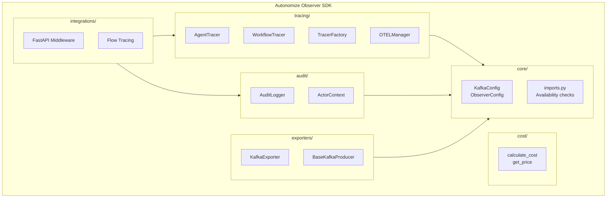
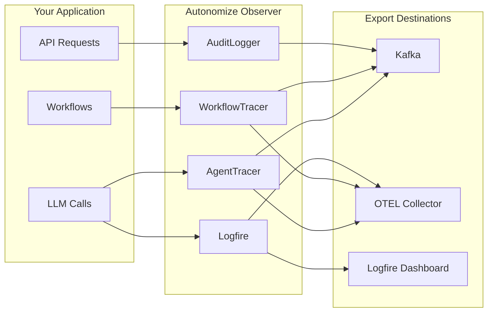
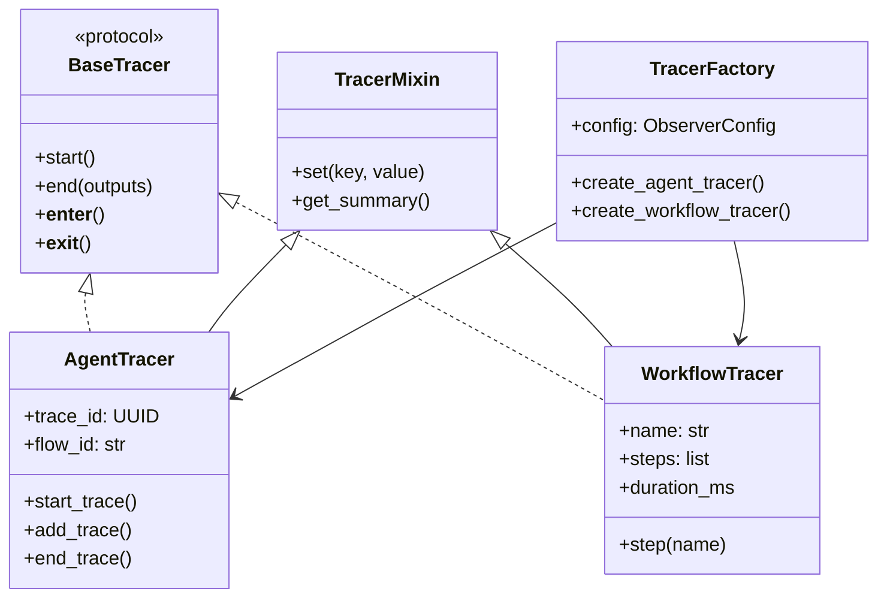

# Autonomize Observer SDK

[](https://badge.fury.io/py/autonomize-observer)
[](https://pypi.org/project/autonomize-observer/)
[](LICENSE)
[](tests/)

A lightweight, production-ready SDK for LLM observability and audit logging. Built as a thin wrapper around [Pydantic Logfire](https://logfire.pydantic.dev/) for tracing and [genai-prices](https://github.com/jetify-com/genai-prices) for cost calculation, with additional support for:

- **Audit Logging** - Compliance-ready audit trails with Keycloak JWT integration
- **Kafka Export** - Stream audit events to Kafka for downstream processing
- **Langflow Integration** - First-class support for Langflow/Flow tracing
- **FastAPI Middleware** - Automatic user context extraction from JWT tokens

## Why Autonomize Observer?

Instead of reinventing the wheel, we leverage best-in-class libraries:

| Feature | Powered By |
|---------|------------|
| OTEL Tracing & Spans | [Pydantic Logfire](https://logfire.pydantic.dev/) |
| OpenAI/Anthropic Instrumentation | [Logfire Integrations](https://logfire.pydantic.dev/docs/integrations/) |
| LLM Cost Calculation | [genai-prices](https://github.com/jetify-com/genai-prices) (28+ providers) |
| Audit Logging & Keycloak | **Autonomize Observer** |
| Kafka Event Export | **Autonomize Observer** |
| Langflow Integration | **Autonomize Observer** |

## Quick Start

### Installation

```bash
# Using pip
pip install autonomize-observer

# Using uv (recommended)
uv add autonomize-observer
```

### Basic Usage

```python
from autonomize_observer import init, audit
from autonomize_observer import ResourceType

# Initialize once at startup
init(
    service_name="my-service",
    kafka_enabled=False,  # Enable for Kafka export
)

# Log audit events
audit.log_create(
    resource_type=ResourceType.DOCUMENT,
    resource_id="doc-123",
    resource_name="Project Proposal",
)

# Log LLM interactions for compliance
audit.log_llm_interaction(
    flow_id="flow-456",
    model="gpt-4o",
    provider="openai",
    input_tokens=150,
    output_tokens=75,
    cost=0.025,
)
```

### LLM Tracing with Logfire

For LLM tracing, use Logfire directly - we don't duplicate its functionality:

```python
import logfire
from openai import OpenAI

# Configure Logfire (data stays local by default)
logfire.configure(
    service_name="my-service",
    send_to_logfire=False,  # Keep data local
)

# One-line instrumentation for all OpenAI calls
logfire.instrument_openai()

# Use OpenAI normally - all calls are traced
client = OpenAI()
response = client.chat.completions.create(
    model="gpt-4o",
    messages=[{"role": "user", "content": "Hello!"}]
)
```

### Cost Calculation

```python
from autonomize_observer import calculate_cost, get_price

# Calculate cost for an LLM call
result = calculate_cost(
    provider="openai",
    model="gpt-4o",
    input_tokens=1000,
    output_tokens=500,
)

print(f"Total cost: ${result.total_cost:.4f}")
print(f"Input cost: ${result.input_cost:.4f}")
print(f"Output cost: ${result.output_cost:.4f}")

# Get price info for a model
price = get_price("anthropic", "claude-3-5-sonnet-20241022")
if price:
    print(f"Input: ${price.input_price_per_1k:.4f}/1K tokens")
    print(f"Output: ${price.output_price_per_1k:.4f}/1K tokens")
```

## Key Features

### Audit Logging with Keycloak Support

```python
from autonomize_observer import (
    init, audit,
    ActorContext, set_actor_context,
    ResourceType, AuditAction,
)

# Set user context from Keycloak JWT
set_actor_context(ActorContext(
    actor_id="user-123",
    email="user@example.com",
    roles=["admin", "analyst"],
))

# All audit events now include user context
audit.log_read(
    resource_type=ResourceType.FILE,
    resource_id="sensitive-data.csv",
)

audit.log_update(
    resource_type=ResourceType.USER,
    resource_id="user-456",
    changes=[
        {"field": "role", "old_value": "viewer", "new_value": "editor"},
    ],
)
```

### Kafka Export for Audit Events

```python
from autonomize_observer import init, KafkaConfig

init(
    service_name="my-service",
    kafka_config=KafkaConfig(
        bootstrap_servers="kafka:9092",
        audit_topic="audit-events",
        security_protocol="SASL_SSL",
        sasl_mechanism="PLAIN",
        sasl_username="user",
        sasl_password="secret",
    ),
    kafka_enabled=True,
)

# All audit events are now streamed to Kafka
```

### Langflow Integration

```python
from autonomize_observer.integrations import trace_flow, trace_component

@trace_flow(
    flow_id="customer-support-flow",
    flow_name="Customer Support Bot",
    session_id="session-123",
)
def run_customer_support(query: str) -> str:
    # Flow execution is automatically traced

    @trace_component("LLMComponent", "Query Analyzer")
    def analyze_query():
        # Component execution is traced as a child span
        return process_with_llm(query)

    @trace_component("LLMComponent", "Response Generator")
    def generate_response(analysis):
        return generate_with_llm(analysis)

    analysis = analyze_query()
    return generate_response(analysis)
```

### FastAPI Integration

```python
from fastapi import FastAPI
from autonomize_observer.integrations import setup_fastapi

app = FastAPI()

# Automatically extracts user context from JWT tokens
setup_fastapi(
    app,
    service_name="my-api",
    keycloak_enabled=True,
)

@app.get("/documents/{doc_id}")
async def get_document(doc_id: str):
    # User context is automatically available for audit logging
    from autonomize_observer import audit, ResourceType

    audit.log_read(
        resource_type=ResourceType.DOCUMENT,
        resource_id=doc_id,
    )

    return {"id": doc_id, "content": "..."}
```

## Workflow Tracing

For transactional workflows that need step-by-step timing (not LLM-specific):

```python
from autonomize_observer.tracing import WorkflowTracer

with WorkflowTracer("process-order", order_id="123") as tracer:
    with tracer.step("validate") as step:
        validate_order()
        step.set("items_count", 5)

    with tracer.step("payment") as step:
        result = process_payment()
        step.set("amount", result.amount)

    with tracer.step("fulfillment"):
        send_to_warehouse()

    tracer.set("status", "completed")

# Access timing data
for step in tracer.steps:
    print(f"{step.name}: {step.duration_ms:.2f}ms")
```

## Agent Tracing

The SDK provides two approaches for tracing agents/LLM workflows:

### Standalone Agent Tracing (Recommended for new projects)

Use Logfire directly for modern OTEL-based tracing:

```python
import logfire
from openai import OpenAI

# Configure Logfire (one-time setup)
logfire.configure(
    service_name="my-agent",
    send_to_logfire=False,  # Keep data local or send to your OTEL collector
)

# Auto-instrument LLM clients
logfire.instrument_openai()
logfire.instrument_anthropic()

# Use normally - all LLM calls are automatically traced with token usage
client = OpenAI()
response = client.chat.completions.create(
    model="gpt-4o",
    messages=[{"role": "user", "content": "Hello!"}]
)
```

### AI Studio Integration (Legacy streaming format)

For AI Studio (Langflow) compatibility, use `AgentTracer`:

```python
from uuid import uuid4
from autonomize_observer.tracing import AgentTracer

# Create tracer with Kafka streaming
tracer = AgentTracer(
    trace_name="Customer Support Flow",
    trace_id=uuid4(),
    flow_id="flow-123",
    kafka_bootstrap_servers="kafka:9092",
    kafka_topic="genesis-traces-streaming",
    # Optional: Enable dual export (Kafka + OTEL)
    enable_otel=True,
)

# Trace workflow
tracer.start_trace()

tracer.add_trace("comp-1", "QueryAnalyzer", "llm", {"query": "..."})
# ... component execution ...
tracer.end_trace("comp-1", "QueryAnalyzer", {"result": "..."})

tracer.end(inputs={}, outputs={})
```

## Architecture

### SDK Components



### Data Flow



### Class Hierarchy



### Directory Structure

<details>
<summary>Click to expand file tree</summary>

```
autonomize-observer/
├── audit/           # Audit logging with Keycloak support
│   ├── context.py   # ActorContext and JWT parsing
│   └── logger.py    # AuditLogger with convenience methods
├── core/            # Shared utilities and configuration
│   ├── config.py    # KafkaConfig, ObserverConfig
│   ├── imports.py   # Centralized dependency availability checks
│   └── kafka_utils.py # Shared Kafka config builder
├── cost/            # Cost calculation (wraps genai-prices)
│   └── pricing.py   # calculate_cost, get_price
├── exporters/       # Event export (Kafka)
│   ├── base.py      # BaseExporter interface
│   ├── kafka_base.py # BaseKafkaProducer (shared Kafka logic)
│   └── kafka.py     # KafkaExporter for audit events
├── integrations/    # Framework integrations
│   ├── fastapi.py   # FastAPI middleware
│   └── langflow.py  # Langflow/Flow tracing
├── schemas/         # Pydantic models
│   ├── audit.py     # AuditEvent, ChangeRecord
│   ├── base.py      # BaseEvent
│   ├── streaming.py # TraceEvent for streaming
│   └── enums.py     # AuditAction, ResourceType, etc.
└── tracing/         # Tracing module
    ├── base.py          # BaseTracer protocol & TracerMixin
    ├── factory.py       # TracerFactory for creating tracers
    ├── agent_tracer.py  # AgentTracer for AI Studio
    ├── workflow_tracer.py # WorkflowTracer for step timing
    ├── kafka_trace_producer.py # Kafka streaming producer
    ├── otel_utils.py    # OTELManager for Logfire integration
    ├── logfire_integration.py # Logfire configuration
    └── utils/           # Utility modules
        ├── token_extractors.py # Strategy pattern for token extraction
        ├── model_utils.py     # Model name normalization
        └── serialization.py   # Safe serialization utilities
```

</details>

## Configuration

### Environment Variables

```bash
# Kafka Configuration
export KAFKA_BOOTSTRAP_SERVERS="kafka:9092"
export KAFKA_AUDIT_TOPIC="audit-events"
export KAFKA_SECURITY_PROTOCOL="SASL_SSL"
export KAFKA_SASL_MECHANISM="PLAIN"
export KAFKA_SASL_USERNAME="user"
export KAFKA_SASL_PASSWORD="secret"

# Service Configuration
export SERVICE_NAME="my-service"
export SERVICE_VERSION="1.0.0"
export ENVIRONMENT="production"
```

### Programmatic Configuration

```python
from autonomize_observer import init, configure, ObserverConfig, KafkaConfig

# Option 1: Direct initialization
init(
    service_name="my-service",
    service_version="1.0.0",
    environment="production",
    send_to_logfire=False,
    kafka_config=KafkaConfig(bootstrap_servers="kafka:9092"),
    kafka_enabled=True,
)

# Option 2: Configuration object
config = ObserverConfig(
    service_name="my-service",
    kafka=KafkaConfig(bootstrap_servers="kafka:9092"),
    kafka_enabled=True,
)
configure(config)
```

## Testing

```bash
# Run all tests with coverage
uv run pytest tests/ -v --cov

# Run specific test modules
uv run pytest tests/test_audit_logger.py -v
uv run pytest tests/test_integrations.py -v
```

**Test Coverage: 97%+** with 574 tests covering all modules.

## Documentation

- [INSTALL.md](INSTALL.md) - Installation and setup guide
- [GUIDE.md](GUIDE.md) - Comprehensive usage guide
- [INTEGRATIONS.md](INTEGRATIONS.md) - Integration guides for Langflow, FastAPI, etc.

## Requirements

- Python 3.10+
- Dependencies:
  - `logfire>=4.0.0` - OTEL tracing
  - `genai-prices>=0.0.40` - LLM cost calculation
  - `pydantic>=2.10.0` - Data validation
  - `pyjwt>=2.10.0` - JWT token parsing
  - `confluent-kafka>=2.10.0` - Kafka export (optional)

## License

Proprietary - Autonomize AI

## Support

- **Issues**: [GitHub Issues](https://github.com/autonomize-ai/autonomize-observer/issues)
- **Email**: [support@autonomize.ai](mailto:support@autonomize.ai)

---

**Autonomize Observer SDK v2.0.0** - Lightweight LLM observability and audit logging, powered by Pydantic Logfire and genai-prices.
