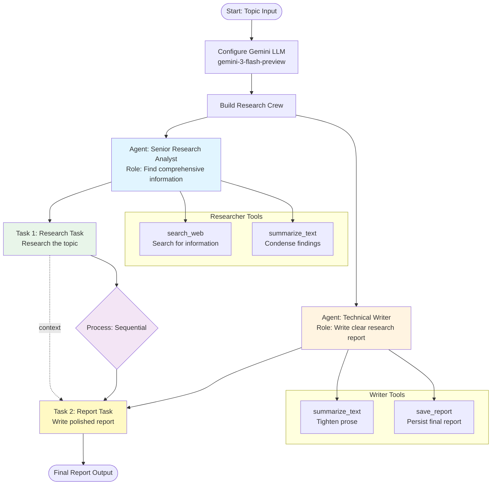
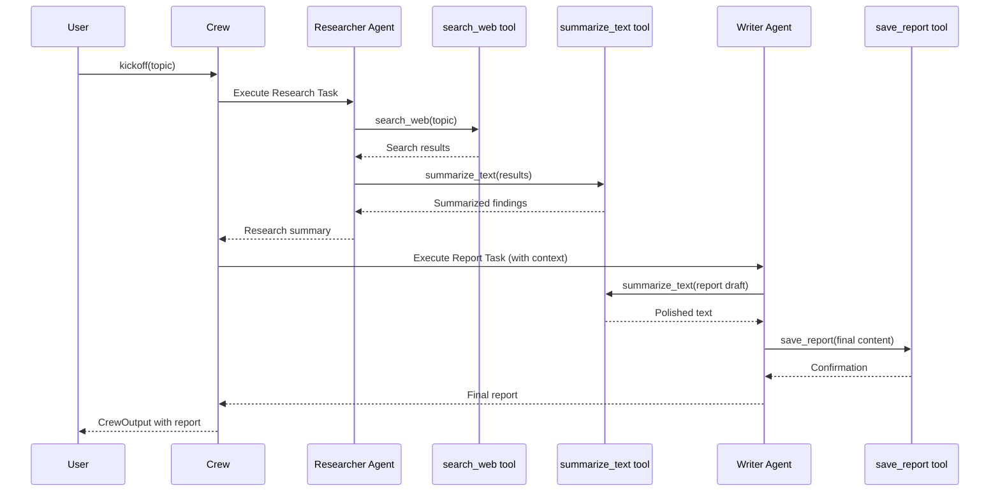
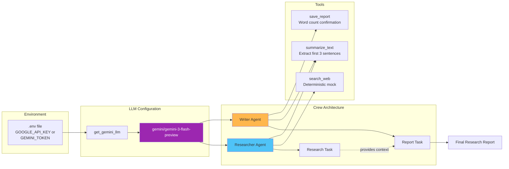

# CrewAI Gemini Research Agent - Architecture Diagrams

This document provides visual diagrams of the CrewAI Gemini Research Agent architecture and flow.

## System Architecture

## Execution Sequence

## Component Overview

## Key Components

### Agents
- **Senior Research Analyst**: Finds comprehensive information on the given topic
- **Technical Writer**: Writes clear, concise research reports

### Tasks
1. **Research Task**: Search and summarize information on the topic
2. **Report Task**: Write a polished report based on research (with context from Task 1)

### Tools
- **search_web**: Returns simulated search results (deterministic)
- **summarize_text**: Extracts first 3 sentences from text
- **save_report**: Returns word count confirmation

### Process Flow
- Sequential execution: Researcher → Writer
- Task context passing: Research findings are provided to the Writer
- Deterministic tools enable reliable testing and stress testing with BalaganAgent
