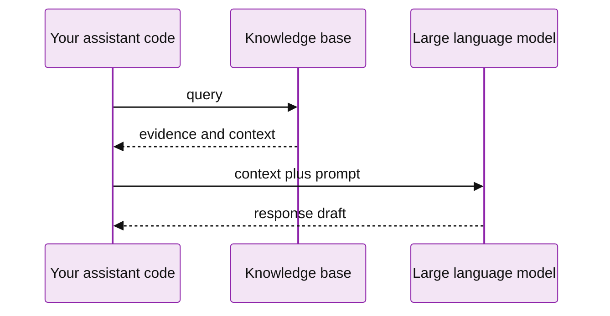
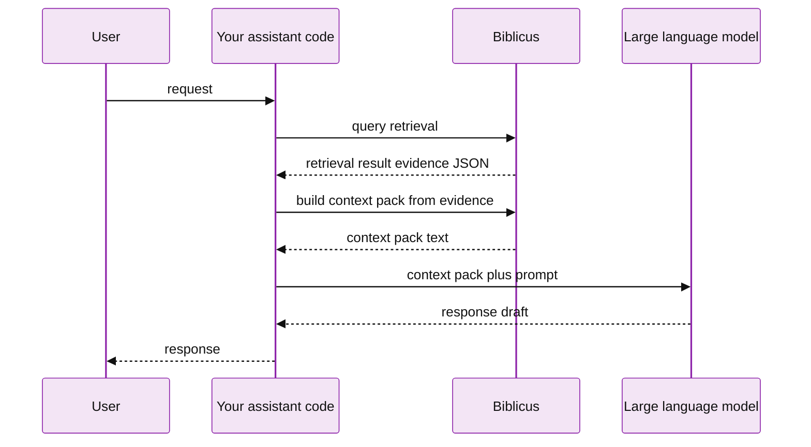

# Biblicus

![Continuous integration][continuous-integration-badge]
![Coverage][coverage-badge]
![Documentation][documentation-badge]

Make your documents usable by your assistant, then decide later how you will search and retrieve them.

If you are building an assistant in Python, you probably have material you want it to use: notes, documents, web pages, and reference files. A common approach is retrieval augmented generation, where a system retrieves relevant material and uses it as evidence when generating a response.

The first practical problem is not retrieval. It is collection and care. You need a stable place to put raw items, you need a small amount of metadata so you can find them again, and you need a way to evolve your retrieval approach over time without rewriting ingestion.

This library gives you a corpus, which is a normal folder on disk. It stores each ingested item as a file, with optional metadata stored next to it. You can open and inspect the raw files directly. Any derived catalog or index can be rebuilt from the raw corpus.

It can be used alongside LangGraph, Tactus, Pydantic AI, any agent framework, or your own setup. Use it from Python or from the command line interface.

See [retrieval augmented generation overview] for a short introduction to the idea.

## Start with a knowledge base

If you just want to hand a folder to your assistant and move on, use the high-level knowledge base interface. The folder can be nothing more than a handful of plain text files. You are not choosing a retrieval strategy yet. You are just collecting.

This example assumes a folder called `notes/` with a few `.txt` files. The knowledge base handles sensible defaults and still gives you a clear context pack for your model call.

```python
from biblicus.knowledge_base import KnowledgeBase


kb = KnowledgeBase.from_folder("notes")
result = kb.query("Primary button style preference")
context_pack = kb.context_pack(result, max_tokens=800)

print(context_pack.text)
```

If you want to run a real, executable version of this story, use `scripts/readme_end_to_end_demo.py` from a fresh clone.

This simplified sequence diagram shows the same idea at a high level.



## A simple mental model

Think in three stages.

- Ingest puts raw items into a corpus. This is file first and human inspectable.
- Extract turns items into usable text. This is where you would do text extraction from Portable Document Format files, optical character recognition for images, or speech to text for audio. If an item is already text, extraction can simply read it. Extraction outputs are derived artifacts, not edits to the raw files.
- Retrieve searches extracted text and returns evidence. Evidence is structured so you can turn it into context for your model call in whatever way your project prefers.

If you learn a few project words, the rest of the system becomes predictable.

- Corpus is the folder that holds raw items and their metadata.
- Item is the raw bytes plus optional metadata and source information.
- Catalog is the rebuildable index of the corpus.
- Extraction run is a recorded extraction build that produces text artifacts.
- Backend is a pluggable retrieval implementation.
- Run is a recorded retrieval build for a corpus.
- Evidence is what retrieval returns, with identifiers and source information.

## Where it fits in an assistant

Biblicus does not answer user questions. It is not a language model. It helps your assistant answer them by retrieving relevant material and returning it as structured evidence. Your code decides how to turn evidence into a context pack for the model call, which is then passed to a model you choose.

In a coding assistant, retrieval is often triggered by what the user is doing right now. For example: you are about to propose a user interface change, so you retrieve the user's stated preferences, then you include that as context for the model call.

This diagram shows two sequential Biblicus calls. They are shown separately to make the boundaries explicit: retrieval returns evidence, and context pack building consumes evidence.



## Practical value

- You can ingest raw material once, then try many retrieval approaches over time.
- You can keep raw files readable and portable, without locking your data inside a database.
- You can evaluate retrieval runs against shared datasets and compare backends using the same corpus.

## Typical flow

- Initialize a corpus folder.
- Ingest items from file paths, web addresses, or text input.
- Crawl a website section into corpus items when you want a repeatable “import from the web” workflow.
- Run extraction when you want derived text artifacts from non-text sources.
- Reindex to refresh the catalog after edits.
- Build a retrieval run with a backend.
- Query the run to collect evidence and evaluate it with datasets.

## Install

This repository is a working Python package. Install it into a virtual environment from the repository root.

```
python3 -m pip install -e .
```

After the first release, you can install it from Python Package Index.

```
python3 -m pip install biblicus
```

### Optional extras

Some extractors are optional so the base install stays small.

- Optical character recognition for images: `python3 -m pip install "biblicus[ocr]"`
- Advanced optical character recognition with PaddleOCR: `python3 -m pip install "biblicus[paddleocr]"`
- Document understanding with Docling VLM: `python3 -m pip install "biblicus[docling]"`
- Document understanding with Docling VLM and MLX acceleration: `python3 -m pip install "biblicus[docling-mlx]"`
- Speech to text transcription with OpenAI: `python3 -m pip install "biblicus[openai]"` (requires an OpenAI API key in `~/.biblicus/config.yml` or `./.biblicus/config.yml`)
- Speech to text transcription with Deepgram: `python3 -m pip install "biblicus[deepgram]"` (requires a Deepgram API key in `~/.biblicus/config.yml` or `./.biblicus/config.yml`)
- Broad document parsing fallback: `python3 -m pip install "biblicus[unstructured]"`
- MarkItDown document conversion (requires Python 3.10 or higher): `python3 -m pip install "biblicus[markitdown]"`
- Topic modeling analysis with BERTopic: `python3 -m pip install "biblicus[topic-modeling]"`

## Quick start

```
mkdir -p notes
echo "A small file note" > notes/example.txt

biblicus init corpora/example
biblicus ingest --corpus corpora/example notes/example.txt
echo "A short note" | biblicus ingest --corpus corpora/example --stdin --title "First note"
biblicus list --corpus corpora/example
biblicus extract build --corpus corpora/example --step pass-through-text --step metadata-text
biblicus extract list --corpus corpora/example
biblicus build --corpus corpora/example --backend scan
biblicus query --corpus corpora/example --query "note"
```

If you want to turn a website section into corpus items, crawl a root web address while restricting the crawl to an allowed prefix:

```
biblicus crawl --corpus corpora/example \\
  --root-url https://example.com/docs/index.html \\
  --allowed-prefix https://example.com/docs/ \\
  --max-items 50 \\
  --tag crawled
```

## End-to-end example: lower-level control

The command-line interface returns JavaScript Object Notation by default. This makes it easy to use Biblicus in scripts and to treat retrieval as a deterministic, testable step.

This version shows the lower-level pieces explicitly. You are building the corpus, controlling each memory string, choosing the backend, and shaping the context pack yourself.

```python
from biblicus.backends import get_backend
from biblicus.context import ContextPackPolicy, TokenBudget, build_context_pack, fit_context_pack_to_token_budget
from biblicus.corpus import Corpus
from biblicus.models import QueryBudget


corpus = Corpus.init("corpora/story")

notes = [
    ("User name", "The user's name is Tactus Maximus."),
    ("Button style preference", "Primary button style preference: the user's favorite color is magenta."),
    ("Style preference", "The user prefers concise answers."),
    ("Language preference", "The user dislikes idioms and abbreviations."),
    ("Engineering preference", "The user likes code that is over-documented and behavior-driven."),
]
for note_title, note_text in notes:
    corpus.ingest_note(note_text, title=note_title, tags=["memory"])

backend = get_backend("scan")
run = backend.build_run(corpus, recipe_name="Story demo", config={})
budget = QueryBudget(max_total_items=5, max_total_characters=2000, max_items_per_source=None)
result = backend.query(
    corpus,
    run=run,
    query_text="Primary button style preference",
    budget=budget,
)

policy = ContextPackPolicy(join_with="\n\n")
context_pack = build_context_pack(result, policy=policy)
context_pack = fit_context_pack_to_token_budget(
    context_pack,
    policy=policy,
    token_budget=TokenBudget(max_tokens=60),
)
print(context_pack.text)
```

If you want a runnable version of this story, use the script at `scripts/readme_end_to_end_demo.py`.

If you prefer the command-line interface, here is the same flow in compressed form:

```
biblicus init corpora/story
biblicus ingest --corpus corpora/story --stdin --title "User name" --tag memory <<< "The user's name is Tactus Maximus."
biblicus ingest --corpus corpora/story --stdin --title "Button style preference" --tag memory <<< "Primary button style preference: the user's favorite color is magenta."
biblicus ingest --corpus corpora/story --stdin --title "Style preference" --tag memory <<< "The user prefers concise answers."
biblicus ingest --corpus corpora/story --stdin --title "Language preference" --tag memory <<< "The user dislikes idioms and abbreviations."
biblicus ingest --corpus corpora/story --stdin --title "Engineering preference" --tag memory <<< "The user likes code that is over-documented and behavior-driven."
biblicus build --corpus corpora/story --backend scan
biblicus query --corpus corpora/story --query "Primary button style preference"
```

Example output:

```json
{
  "query_text": "Primary button style preference",
  "budget": {
    "max_total_items": 5,
    "max_total_characters": 2000,
    "max_items_per_source": null
  },
  "run_id": "RUN_ID",
  "recipe_id": "RECIPE_ID",
  "backend_id": "scan",
  "generated_at": "2026-01-29T00:00:00.000000Z",
  "evidence": [
    {
      "item_id": "ITEM_ID",
      "source_uri": "text",
      "media_type": "text/markdown",
      "score": 1.0,
      "rank": 1,
      "text": "Primary button style preference: the user's favorite color is magenta.",
      "content_ref": null,
      "span_start": null,
      "span_end": null,
      "stage": "scan",
      "recipe_id": "RECIPE_ID",
      "run_id": "RUN_ID",
      "hash": null
    }
  ],
  "stats": {}
}
```

Evidence is the output contract. Your code decides how to convert evidence into assistant context.

### Turn evidence into a context pack

A context pack is a readable text block you send to a model. There is no single correct format. Treat it as a policy surface you can iterate on.

Here is a minimal example that builds a context pack from evidence:

```python
from biblicus.context import ContextPackPolicy, build_context_pack


policy = ContextPackPolicy(
    join_with="\n\n",
)
context_pack = build_context_pack(result, policy=policy)
print(context_pack.text)
```

Example context pack output:

```text
Primary button style preference: the user's favorite color is magenta.
```

You can also build a context pack from the command-line interface by piping the retrieval result:

```
biblicus query --corpus corpora/story --query "Primary button style preference" \\
  | biblicus context-pack build
```

Most production systems also apply a budget when building context. If you want a precise token budget, the budgeting logic needs a specific tokenizer and should be treated as its own stage.

## Pipeline diagram

This diagram shows how a corpus becomes evidence for your assistant. Your code decides how to turn evidence into context and how to call a model.

```mermaid
%%{init: {"theme": "base", "themeVariables": {"primaryColor": "#f3e5f5", "primaryTextColor": "#111111", "primaryBorderColor": "#8e24aa", "lineColor": "#90a4ae", "secondaryColor": "#eceff1", "tertiaryColor": "#ffffff"}, "flowchart": {"useMaxWidth": true, "nodeSpacing": 18, "rankSpacing": 22}}}%%
flowchart TB
  subgraph Legend[Legend]
    direction LR
    LegendArtifact[Stored artifact or evidence]
    LegendStep[Step]
    LegendArtifact --- LegendStep
  end

  subgraph Main[" "]
    direction TB

    subgraph Pipeline[" "]
      direction TB

      subgraph RowStable[Stable core]
        direction TB
        Source[Source items] --> Ingest[Ingest] --> Raw[Raw item files] --> Catalog[Catalog file]
      end

      subgraph RowExtraction[Pluggable: extraction pipeline]
        direction TB
        Catalog --> Extract[Extract pipeline] --> ExtractedText[Extracted text artifacts] --> ExtractionRun[Extraction run manifest]
      end

      subgraph RowRetrieval[Pluggable: retrieval backend]
        direction TB
        ExtractionRun --> Build[Build run] --> BackendIndex[Backend index] --> Run[Run manifest] --> Retrieve[Retrieve] --> Rerank[Rerank optional] --> Filter[Filter optional] --> Evidence[Evidence]
      end

      subgraph RowContext[Context]
        direction TB
        Evidence --> ContextPack[Context pack] --> FitTokens[Fit tokens optional] --> Context[Assistant context]
      end

      subgraph RowYourCode[Your code]
        direction TB
        Context --> Model[Large language model call] --> Answer[Answer]
      end
    end

    style RowStable fill:#ffffff,stroke:#8e24aa,stroke-width:2px,color:#111111
    style RowExtraction fill:#ffffff,stroke:#5e35b1,stroke-dasharray:6 3,stroke-width:2px,color:#111111
    style RowRetrieval fill:#ffffff,stroke:#1e88e5,stroke-dasharray:6 3,stroke-width:2px,color:#111111
    style RowContext fill:#ffffff,stroke:#7b1fa2,stroke-width:2px,color:#111111
    style RowYourCode fill:#ffffff,stroke:#d81b60,stroke-width:2px,color:#111111

    style Raw fill:#f3e5f5,stroke:#8e24aa,color:#111111
    style Catalog fill:#f3e5f5,stroke:#8e24aa,color:#111111
    style ExtractedText fill:#f3e5f5,stroke:#8e24aa,color:#111111
    style ExtractionRun fill:#f3e5f5,stroke:#8e24aa,color:#111111
    style BackendIndex fill:#f3e5f5,stroke:#8e24aa,color:#111111
    style Run fill:#f3e5f5,stroke:#8e24aa,color:#111111
    style Evidence fill:#f3e5f5,stroke:#8e24aa,color:#111111
    style ContextPack fill:#f3e5f5,stroke:#8e24aa,color:#111111
    style Context fill:#f3e5f5,stroke:#8e24aa,color:#111111
    style Answer fill:#f3e5f5,stroke:#8e24aa,color:#111111
    style Source fill:#f3e5f5,stroke:#8e24aa,color:#111111

    style Ingest fill:#eceff1,stroke:#90a4ae,color:#111111
    style Extract fill:#eceff1,stroke:#90a4ae,color:#111111
    style Build fill:#eceff1,stroke:#90a4ae,color:#111111
    style Retrieve fill:#eceff1,stroke:#90a4ae,color:#111111
    style Rerank fill:#eceff1,stroke:#90a4ae,color:#111111
    style Filter fill:#eceff1,stroke:#90a4ae,color:#111111
    style FitTokens fill:#eceff1,stroke:#90a4ae,color:#111111
    style Model fill:#eceff1,stroke:#90a4ae,color:#111111
  end

  style Legend fill:#ffffff,stroke:#ffffff,color:#111111
  style Main fill:#ffffff,stroke:#ffffff,color:#111111
  style Pipeline fill:#ffffff,stroke:#ffffff,color:#111111
  style LegendArtifact fill:#f3e5f5,stroke:#8e24aa,color:#111111
  style LegendStep fill:#eceff1,stroke:#90a4ae,color:#111111
```



## Python usage

From Python, the same flow is available through the Corpus class and backend interfaces. The public surface area is small on purpose.

- Create a corpus with `Corpus.init` or open one with `Corpus.open`.
- Ingest notes with `Corpus.ingest_note`.
- Ingest files or web addresses with `Corpus.ingest_source`.
- List items with `Corpus.list_items`.
- Build a retrieval run with `get_backend` and `backend.build_run`.
- Query a run with `backend.query`.
- Evaluate with `evaluate_run`.

## Learn more

Full documentation is published on GitHub Pages: https://anthusai.github.io/Biblicus/

The documents below follow the pipeline from raw items to model context:

- [Corpus][corpus]
- [Text extraction][text-extraction]
- [Speech to text][speech-to-text]
- [Knowledge base][knowledge-base]
- [Backends][backends]
- [Context packs][context-packs]
- [Testing and evaluation][testing]

Reference:

- [Demos][demos]
- [User configuration][user-configuration]

Design and implementation map:

- [Feature index][feature-index]
- [Roadmap][roadmap]
- [Architecture][architecture]

## Metadata and catalog

Raw items are stored as files in the corpus raw directory. Metadata can live in a Markdown front matter block or a sidecar file with the suffix `.biblicus.yml`. The catalog lives in `.biblicus/catalog.json` and can be rebuilt at any time with `biblicus reindex`.

## Corpus layout

```
corpus/
  raw/
    item.bin
    item.bin.biblicus.yml
  .biblicus/
    config.json
    catalog.json
    runs/
      extraction/
        pipeline/
          <run id>/
            manifest.json
            text/
              <item id>.txt
      retrieval/
        <backend id>/
          <run id>/
            manifest.json
```

## Retrieval backends

Two backends are included.

- `scan` is a minimal baseline that scans raw items directly.
- `sqlite-full-text-search` is a practical baseline that builds a full text search index in SQLite.

For detailed documentation including configuration options, performance characteristics, and usage examples, see the [Backend Reference][backend-reference].

## Extraction backends

These extractors are built in. Optional ones require extra dependencies. See [text extraction documentation][text-extraction] for details.

### Text and document extraction

- [`pass-through-text`](docs/extractors/text-document/pass-through.md) reads text items and strips Markdown front matter.
- [`metadata-text`](docs/extractors/text-document/metadata.md) turns catalog metadata into a small text artifact.
- [`pdf-text`](docs/extractors/text-document/pdf.md) extracts text from Portable Document Format items with `pypdf`.
- [`unstructured`](docs/extractors/text-document/unstructured.md) provides broad document parsing (optional).
- [`markitdown`](docs/extractors/text-document/markitdown.md) converts many formats into Markdown-like text (optional).

### Optical character recognition

- [`ocr-rapidocr`](docs/extractors/ocr/rapidocr.md) does optical character recognition on images (optional).
- [`ocr-paddleocr-vl`](docs/extractors/ocr/paddleocr-vl.md) does advanced optical character recognition with PaddleOCR vision-language model (optional).

### Vision-language models

- [`docling-smol`](docs/extractors/vlm-document/docling-smol.md) uses the SmolDocling-256M vision-language model for fast document understanding (optional).
- [`docling-granite`](docs/extractors/vlm-document/docling-granite.md) uses the Granite Docling-258M vision-language model for high-accuracy extraction (optional).

### Speech to text

- [`stt-openai`](docs/extractors/speech-to-text/openai.md) performs speech to text on audio using OpenAI (optional).
- [`stt-deepgram`](docs/extractors/speech-to-text/deepgram.md) performs speech to text on audio using Deepgram (optional).

### Pipeline utilities

- [`select-text`](docs/extractors/pipeline-utilities/select-text.md) chooses one prior extraction result in a pipeline.
- [`select-longest-text`](docs/extractors/pipeline-utilities/select-longest.md) chooses the longest prior extraction result.
- [`select-override`](docs/extractors/pipeline-utilities/select-override.md) chooses the last extraction result for matching media types in a pipeline.
- [`select-smart-override`](docs/extractors/pipeline-utilities/select-smart-override.md) intelligently chooses between extraction results based on confidence and content quality.

For detailed documentation on all extractors, see the [Extractor Reference][extractor-reference].

## Topic modeling analysis

Biblicus can run analysis pipelines on extracted text without changing the raw corpus. Topic modeling is the first
analysis backend. It reads an extraction run, optionally applies an LLM-driven extraction pass, applies lexical
processing, runs BERTopic, and optionally applies an LLM fine-tuning pass to label topics. The output is structured
JavaScript Object Notation.

See `docs/ANALYSIS.md` for the analysis pipeline overview and `docs/TOPIC_MODELING.md` for topic modeling details.

Run a topic analysis using a recipe file:

```
biblicus analyze topics --corpus corpora/example --recipe recipes/topic-modeling.yml --extraction-run pipeline:<run_id>
```

If `--extraction-run` is omitted, Biblicus uses the most recent extraction run and emits a warning about
reproducibility. The analysis output is stored under:

```
.biblicus/runs/analysis/topic-modeling/<run_id>/output.json
```

Minimal recipe example:

```yaml
schema_version: 1
text_source:
  sample_size: 200
llm_extraction:
  enabled: false
lexical_processing:
  enabled: true
  lowercase: true
  strip_punctuation: false
  collapse_whitespace: true
bertopic_analysis:
  parameters:
    min_topic_size: 8
    nr_topics: 10
  vectorizer:
    ngram_range: [1, 2]
    stop_words: english
llm_fine_tuning:
  enabled: false
```

LLM extraction and fine-tuning require `biblicus[openai]` and a configured OpenAI API key.
Recipe files are validated strictly against the topic modeling schema, so type mismatches or unknown fields are errors.
AG News integration runs require `biblicus[datasets]` in addition to `biblicus[topic-modeling]`.

For a repeatable, real-world integration run that downloads AG News and executes topic modeling, use:

```
python3 scripts/topic_modeling_integration.py --corpus corpora/ag_news_demo --force
```

See `docs/TOPIC_MODELING.md` for parameter examples and per-topic output behavior.

## Integration corpus and evaluation dataset

Use `scripts/download_ag_news.py` to download the AG News dataset when running topic modeling demos. The repository does not include that content.

Use `scripts/download_pdf_samples.py` to download a small Portable Document Format integration corpus when running tests or demos. The repository does not include that content.

## Tests and coverage

```
python3 scripts/test.py
```

To include integration scenarios that download public test data at runtime, run this command.

```
python3 scripts/test.py --integration
```

## Releases

Releases are automated from the main branch using semantic versioning and conventional commit messages.

The release pipeline publishes a GitHub release and uploads the package to Python Package Index when continuous integration succeeds.

Publishing uses a Python Package Index token stored in the GitHub secret named PYPI_TOKEN.

## Documentation

Reference documentation is generated from Sphinx style docstrings.

Install development dependencies:

```
python3 -m pip install -e ".[dev]"
```

Build the documentation:

```
python3 -m sphinx -b html docs docs/_build/html
```

## License

License terms are in `LICENSE`.

[retrieval augmented generation overview]: https://en.wikipedia.org/wiki/Retrieval-augmented_generation
[architecture]: docs/ARCHITECTURE.md
[roadmap]: docs/ROADMAP.md
[feature-index]: docs/FEATURE_INDEX.md
[corpus]: docs/CORPUS.md
[knowledge-base]: docs/KNOWLEDGE_BASE.md
[text-extraction]: docs/EXTRACTION.md
[extractor-reference]: docs/extractors/index.md
[backend-reference]: docs/backends/index.md
[speech-to-text]: docs/STT.md
[user-configuration]: docs/USER_CONFIGURATION.md
[backends]: docs/BACKENDS.md
[context-packs]: docs/CONTEXT_PACK.md
[demos]: docs/DEMOS.md
[testing]: docs/TESTING.md

[continuous-integration-badge]: https://github.com/AnthusAI/Biblicus/actions/workflows/ci.yml/badge.svg?branch=main
[coverage-badge]: https://img.shields.io/endpoint?url=https://raw.githubusercontent.com/AnthusAI/Biblicus/main/coverage_badge.json
[documentation-badge]: https://img.shields.io/badge/docs-GitHub%20Pages-blue
