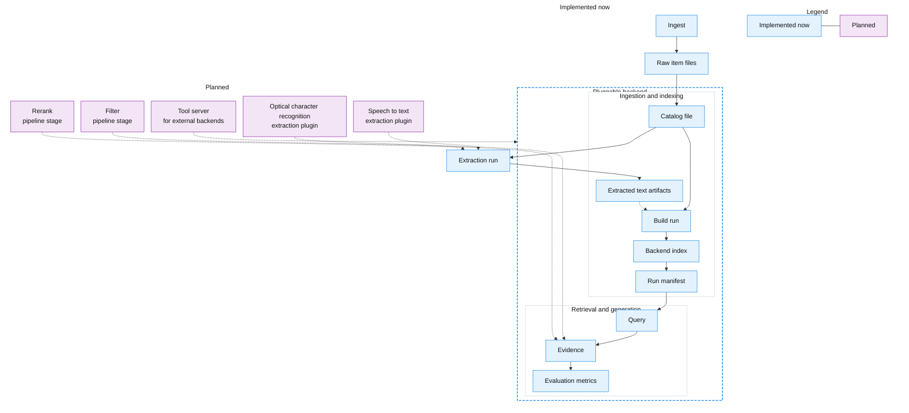

# Demos

This document is a set of runnable examples you can use to see the current system working end to end.

For the ordered plan of what to build next, see `docs/ROADMAP.md`.

## Diagram of the current system and the next layers

Blue boxes are implemented now. Purple boxes are planned next layers that we can build and compare.



## Working examples you can run now

### Install for local development

From the repository root:

```
python3 -m pip install -e ".[dev]"
```

### Create a corpus and ingest a few items

```
rm -rf corpora/demo
python3 -m biblicus init corpora/demo

python3 -m biblicus ingest --corpus corpora/demo --note "Hello from a note" --title "First note" --tags "demo,notes"

printf "A tiny text file\n" > /tmp/biblicus-demo.txt
python3 -m biblicus ingest --corpus corpora/demo /tmp/biblicus-demo.txt

python3 -m biblicus ingest --corpus corpora/demo https://example.com

python3 -m biblicus list --corpus corpora/demo
```

### Show an item

Copy an item identifier from the list output, then run:

```
python3 -m biblicus show --corpus corpora/demo ITEM_ID
```

### Edit raw files and reindex

The catalog is rebuildable. You can edit raw files or sidecar metadata, then refresh the catalog.

```
python3 -m biblicus reindex --corpus corpora/demo
```

### Crawl a website prefix

To turn a website section into corpus items, crawl a root page and restrict the crawl to an allowed prefix.

In one terminal, create a tiny local website and serve it:

```
rm -rf /tmp/biblicus-site
mkdir -p /tmp/biblicus-site/site/subdir
cat > /tmp/biblicus-site/site/index.html <<'HTML'
<html>
  <body>
    <a href="page.html">Page</a>
    <a href="subdir/">Subdir</a>
  </body>
</html>
HTML
cat > /tmp/biblicus-site/site/page.html <<'HTML'
<html><body>hello</body></html>
HTML
cat > /tmp/biblicus-site/site/subdir/index.html <<'HTML'
<html><body>subdir</body></html>
HTML

python3 -m http.server 8000 --directory /tmp/biblicus-site
```

In another terminal:

```
rm -rf corpora/crawl-demo
python3 -m biblicus init corpora/crawl-demo
python3 -m biblicus crawl --corpus corpora/crawl-demo \\
  --root-url http://127.0.0.1:8000/site/index.html \\
  --allowed-prefix http://127.0.0.1:8000/site/ \\
  --max-items 50 \\
  --tag crawled
python3 -m biblicus list --corpus corpora/crawl-demo
```

### Build an extraction run

Text extraction is a separate pipeline stage from retrieval. An extraction run produces derived text artifacts under the corpus.

This extractor reads text items and skips non-text items.

```
python3 -m biblicus extract build --corpus corpora/demo --step pass-through-text
```

The output includes a `run_id` you can reuse when building a retrieval backend.

### Topic modeling integration run

Use the integration script to download AG News, run extraction, and run topic modeling with a single command.
Install optional dependencies first:

```
python3 -m pip install "biblicus[datasets,topic-modeling]"
```

```
python3 scripts/topic_modeling_integration.py --corpus corpora/ag_news_demo --force
```

Run with a larger corpus and a higher topic count:

```
python3 scripts/topic_modeling_integration.py \
  --corpus corpora/ag_news_demo \
  --force \
  --limit 10000 \
  --vectorizer-ngram-min 1 \
  --vectorizer-ngram-max 2 \
  --bertopic-param nr_topics=8 \
  --bertopic-param min_topic_size=2
```

The command prints the analysis run identifier and the output path. Open the `output.json` file to inspect per-topic labels,
keywords, and document examples.

### Select extracted text within a pipeline

When you want an explicit choice among multiple extraction outputs, add a selection extractor step at the end of the pipeline.

```
python3 -m biblicus extract build --corpus corpora/demo \\
  --step pass-through-text \\
  --step metadata-text \\
  --step select-text
```

Copy the `run_id` from the JavaScript Object Notation output. You will use it as `EXTRACTION_RUN_ID` in the next command.

```
python3 -m biblicus build --corpus corpora/demo --backend sqlite-full-text-search \\
  --config extraction_run=pipeline:EXTRACTION_RUN_ID
```

### Portable Document Format extraction and retrieval

This example downloads a small set of public Portable Document Format files, extracts text, builds a local full text index, and runs a query.

```
rm -rf corpora/pdf_samples
python3 scripts/download_pdf_samples.py --corpus corpora/pdf_samples --force

python3 -m biblicus extract build --corpus corpora/pdf_samples --step pdf-text
```

Copy the `run_id` from the JavaScript Object Notation output. You will use it as `PDF_EXTRACTION_RUN_ID` in the next command.

```
python3 -m biblicus build --corpus corpora/pdf_samples --backend sqlite-full-text-search --config extraction_run=pipeline:PDF_EXTRACTION_RUN_ID --config chunk_size=200 --config chunk_overlap=50 --config snippet_characters=120
python3 -m biblicus query --corpus corpora/pdf_samples --query "Dummy PDF file"
```

### MarkItDown extraction demo (Python 3.10+)

MarkItDown requires Python 3.10 or higher. This example uses the `py311` conda environment to run the extractor over the mixed sample corpus.

```
conda run -n py311 python -m pip install -e . "markitdown[all]"
conda run -n py311 python scripts/download_mixed_samples.py --corpus corpora/markitdown_demo_py311 --force
conda run -n py311 python -m biblicus extract build --corpus corpora/markitdown_demo_py311 --step markitdown
```

### Mixed modality integration corpus

This example assembles a tiny mixed corpus with a Markdown note, a Hypertext Markup Language page, an image, a Portable Document Format file with extractable text, and a generated Portable Document Format file with no extractable text.
It also includes a downloaded Office Open Extensible Markup Language document to support catchall extraction experiments.

```
rm -rf corpora/mixed_samples
python3 scripts/download_mixed_samples.py --corpus corpora/mixed_samples --force
python3 -m biblicus list --corpus corpora/mixed_samples
```

### Image samples (for optical character recognition experiments)

This example downloads a tiny image corpus intended for optical character recognition experiments: one image that contains text and one that should not.

```
rm -rf corpora/image_samples
python3 scripts/download_image_samples.py --corpus corpora/image_samples --force
python3 -m biblicus list --corpus corpora/image_samples
```

To perform optical character recognition on the image items, install the optional dependency:

```
python3 -m pip install "biblicus[ocr]"
```

Then build an extraction run:

```
python3 -m biblicus extract build --corpus corpora/image_samples --step ocr-rapidocr
```

### Optional: Unstructured as a last-resort extractor

The `unstructured` extractor is an optional dependency. It is intended as a last-resort extractor for non-text items.

Install the optional dependency:

```
python3 -m pip install "biblicus[unstructured]"
```

Then build an extraction run:

```
python3 -m biblicus extract build --corpus corpora/pdf_samples --step unstructured
```

To see Unstructured handle a non-Portable-Document-Format format, use the mixed corpus demo, which includes a `.docx` sample:

```
rm -rf corpora/mixed_samples
python3 scripts/download_mixed_samples.py --corpus corpora/mixed_samples --force
python3 -m biblicus extract build --corpus corpora/mixed_samples --step unstructured
```

When you want to prefer one extractor over another for the same item types, order the steps and end with `select-text`:

```
python3 -m biblicus extract build --corpus corpora/pdf_samples \\
  --step unstructured \\
  --step pdf-text \\
  --step select-text
```

### Optional: Speech to text for audio items

This example downloads a small set of public speech samples from Wikimedia Commons and uses extraction to derive text artifacts.
It also includes a generated Waveform Audio File Format silence clip for repeatable non-speech cases.

Download the integration corpus:

```
rm -rf corpora/audio_samples
python3 scripts/download_audio_samples.py --corpus corpora/audio_samples --force
python3 -m biblicus list --corpus corpora/audio_samples
```

If you only want a metadata-only baseline, extract `metadata-text`:

```
python3 -m biblicus extract build --corpus corpora/audio_samples --step metadata-text
```

For real speech to text transcription with the OpenAI backend, install the optional dependency and set an API key:

```
python3 -m pip install "biblicus[openai]"
mkdir -p .biblicus
printf "openai:\n  api_key: ...\n" > .biblicus/config.yml
python3 -m biblicus extract build --corpus corpora/audio_samples --step stt-openai
```

### Build and query the minimal backend

The scan backend is a minimal baseline that reads raw items directly.

```
python3 -m biblicus build --corpus corpora/demo --backend scan
python3 -m biblicus query --corpus corpora/demo --query "Hello"
```

### Build and query the practical backend

The sqlite full text search backend builds a local index under the run directory.

```
python3 -m biblicus build --corpus corpora/demo --backend sqlite-full-text-search --config extraction_run=pipeline:EXTRACTION_RUN_ID
python3 -m biblicus query --corpus corpora/demo --query "tiny"
```

### Run the test suite and view coverage

```
python3 scripts/test.py
open reports/htmlcov/index.html
```

To include integration scenarios that download public test data at runtime:

```
python3 scripts/test.py --integration
```

## Documentation map

- Corpus: `docs/CORPUS.md`
- Text extraction: `docs/EXTRACTION.md`
- Backends: `docs/BACKENDS.md`
- Testing: `docs/TESTING.md`
- Roadmap: `docs/ROADMAP.md`

For what to build next, see `docs/ROADMAP.md`.
